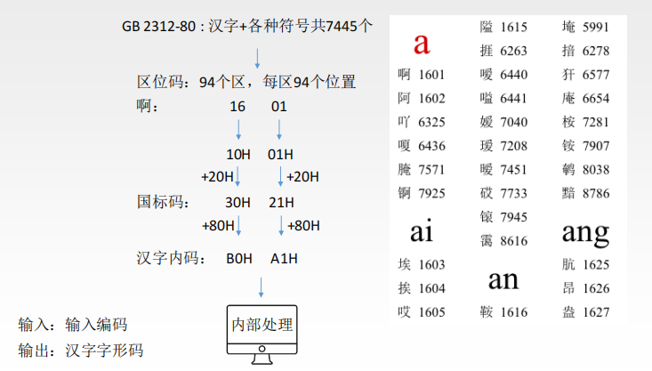

# 概述

- 冯诺依曼结构

  

  - 计算机硬件系统由五大部件组成(存储器、运算器、控制器、输出设备、输入设备)

  - 指令和数据以同等地位存于存储器，可按地址寻访

  - 指令和数据用二进制表示

  - 指令由操作码和地址码组成

  - 存储程序

  - 以运算器为中心

- 现代系统结构

  

  - 主存储器组成

    

    - 存储体

    - MAR：地址寄存器

    - MDR：数据寄存器

  - CPU

    - 寄存器：[CPU中的主要寄存器](https://blog.csdn.net/weibo1230123/article/details/83106141)

      - 指令寄存器（IR）：用来保存当前正在执行的一条指令

        - 当执行一条指令时，首先把该指令从主存读取到数据寄存器中，然后再传送至指令寄存器。

        - 指令包括操作码和地址码两个字段，为了执行指令，必须对操作码进行测试，识别出所要求的操作，指令译码器（Instruction Decoder，ID）就是完成这项工作的。指令译码器对指令寄存器的操作码部分进行译码，以产生指令所要求操作的控制电位，并将其送到微操作控制线路上，在时序部件定时信号的作用下，产生具体的操作控制信号。

        - 指令寄存器中操作码字段的输出就是指令译码器的输入。操作码一经译码，即可向操作控制器发出具体操作的特定信号。

      - 程序计数器（PC）

      - 地址寄存器（AR）

      - 数据寄存器（DR）

      - 累加寄存器（AC）

      - 程序状态字寄存器（PSW）

    - 运算器

    - 控制器

- 性能指标：[计算机组成原理——计算机系统的性能指标](https://blog.csdn.net/qq_43627631/article/details/106674698)

  - 时针周期：处理器中基本操作（如指令执行、数据传输）所需的最小时间单位

    - 基本操作

      - 算术操作：用于进行基本的数值计算，如加法、减法、乘法和除法等。这些操作通常应用于寄存器或内存中的数据。

      - 逻辑操作：用于执行逻辑运算，如与、或、非以及位运算（如按位与、按位或、移位等）。这些操作通常应用于二进制数据，如位操作和布尔运算。

      - 数据传送操作：用于将数据从一个位置传送到另一个位置，如寄存器之间的数据传送、内存与寄存器之间的数据传送等。

      - 控制操作：用于改变计算机程序的执行流程，如条件跳转、无条件跳转、循环等。通过控制操作，可以实现程序的分支和循环控制。

  - 处理器性能

  - 存储器性能

# 运算器

- 算法分类

  - 逻辑运算（[计算机中的逻辑运算](https://blog.csdn.net/weixin_44606517/article/details/102796480)）：与或非、异或、与非、或非

    - 基本逻辑运算

    - 复合逻辑运算

      

      - 异或：相同为0，相异为1

  - 四则运算：加法、减法、乘法、除法

  - 比较运算：大于、小于、等于

  - 浮点数运算：浮点数的加减乘除、开根号、取余

  - 移位运算：左移、右移、循环移位

  - 密码学算法：加密算法（如DES、AES）、哈希算法（如MD5、SHA）

  - 矩阵运算：矩阵乘法、矩阵转置、矩阵求逆

  - 数值计算：三角函数、指数函数、对数函数

- 四则运算 --- 计算机原理

  - 加减法：

    - 一位全加器

    - 串行加法器

    - 并行加法器

    - 并行加法器优化

  - 加/减法运用

    - 加法器（加法）

    - 补码加法器（加减法）

    - 溢出判断

      - 都为正才会上溢

      - 都为负才会下溢

    - 标志位生成

  - 乘法：[乘法运算](https://blog.csdn.net/qq_42192693/article/details/89051707)

    - 原码乘法：

      - 一位：https://www.bilibili.com/video/BV1ps4y1d73V?p=22&vd_source=c80da06dcdadfa275cf6efd6dedf28c0

      - 两位

    - 补码乘法：

      - 一位：

      - 两位：

  - 除法：[除法运算](https://blog.csdn.net/qq_42192693/article/details/89051949?ops_request_misc=&request_id=&biz_id=102&utm_term=计算机除法&utm_medium=distribute.pc_search_result.none-task-blog-2~all~sobaiduweb~default-4-89051949.142^v96^control&spm=1018.2226.3001.4187)

- 组成

  

  - MQ

  - ACC

  - ALU

  - X

  - PSW

# 数据机器表示

- 进制转换（2|8|10|16进制）

  - 归纳

  - 2|8|16进制之间转换：

    - 包含2进制转换：

      - 转为2进制：

      - 转为高进制：

    - 非包含2进制转换：转为2进制

  - 10进制与2|8|16进制转换：

    - 任意进制转为10进制：

    - 10进制转为任意进制：

      - 转为2进制，再转为其他进制

        - 取整数

        - 取小数

      - 拼凑法

- BCD码（0-9用4位表示）

  - 8421码

    - 表示

    - 运算规则

  - 余3码

    - 表示

    - 运算规则

  - 2421码

    - 表示

    - 运算规则

- 数据表示

  - 无符号整数
    - 整数表示：原码

  - 有符号整数

    - 整数表示

      - [原码、反码、补码](https://zhuanlan.zhihu.com/p/118432554)

        - 原码：符号位在前面，1表示+，0表示-

        - 反码：正数值不变，负数值：取反

        - 补码：正数值不变，负数值：取反+1

      - 移码
        - 真值+偏置值

    - 整数运算

      - 按位运算

      - 逻辑运算

      - 位扩展：低位数变高位数，符号位值填充

      - 位截断：高位数变低位数，直接截断

      - 移位

        

        - 算术移位

          - 算法左移：符号位不变，低位补0

          - 算法右移：根据符号位值补充左边

        - 逻辑移位：

          - 逻辑左移：抛弃高位，低位补0

          - 逻辑右移：右移一位，左边补0

  - 定点数

    - 定点数表示：

      - 定点小数

        

        - 整数：m位

        - 小数：n位

      - 原码反码补码

      - 范围

    - 定点数运算

  - 浮点数

    - 浮点数（[浮点数](https://blog.csdn.net/weixin_45863060/article/details/125054244)）

      - 浮点数表示：

      - 浮点数规格化：

        

        - 尾数原码表示：小数最高位为1

        - 尾数补码表示：

          - 正数：小数最高位为1

          - 负数：小数最高位为0

      - 浮点数运算

        - 加减

          - 科学计算法

          - 二进制

      - 强制转换

    - IEEE754

      

      

      - （32位）

        - 阶符：（1）数符号位
          - 数符：0

        - 阶码：（8）采用移码表示，偏移量127
          - 阶码：根据指数值，移码

        - 尾数：（23）采用原码表示
          - 尾数：xxx（值为1.xxx）

      - （64位）

        - 阶符：（1）数符号位
          - 数符：0

        - 阶码：（11）采用移码表示，偏移量127
          - 阶码：根据指数值，移码

        - 尾数：（52）采用原码表示
          - 尾数：xxx（值为1.xxx）

      - 特殊值

- 数据运算

  - 数据类型

    - byte

    - short

      - 最小值（-32768）：1000 0000 0000 0000

      - 次小值（-32767）：1000 0000 0000 0001

      - -1 ：1111 1111 1111 1111

      - 0  ：0000 0000 0000 0000

      - 1  ：0000 0000 0000 0001

      - 最大值（32767）：0111 1111 1111 1111

    - int

    - long

    - float

    - double

    - unsigned（无符号位，正数表示范围扩大一倍）

      - unsigned short

        - 0：00 00

        - 65535(2^16-1)：FF FF

      - unsigned int

        - 0：00 00 00 00

        - 4294967295(2^32-1)：FF FF FF FF

  - 类型转换

    - 整数

      - 转为无符号

        - 扩展：直接补0

        - 截断：直接截断

      - 转为有符号

        - 扩展：符号位

        - 截断：直接截断

    - 浮点数

  - 溢出检测

    - 整数

      - 加法：

        - 正数 + 正数 = 负数：溢出

        - 负数 + 负数 = 正数：溢出

      - 乘法：

    - 浮点数

  - 整数四则运算

    - 加/减法运算：

      - 1、加减法统一，减法变成相加有符号位整数

      - 2、正数不变，负数取反加1（补码）

      - 3、进行加法

      - 4、结果取补码

    - 乘法：[二进制乘法运算](https://blog.csdn.net/weixin_51760209/article/details/124071247?ops_request_misc=%7B%22request%5Fid%22%3A%22169805181116800186543086%22%2C%22scm%22%3A%2220140713.130102334..%22%7D&request_id=169805181116800186543086&biz_id=0&utm_medium=distribute.pc_search_result.none-task-blog-2~all~sobaiduend~default-3-124071247-null-null.142^v96^control&utm_term=乘法运算&spm=1018.2226.3001.4187)

      - 分析

      - 1、被乘数分别与乘数的每一位进行与运算

      - 2、从低位开始，每一位进一空格

      - 3、根据每一列进行加运算，和除以2，余数为该位值，商为进一位值

    - 除法：[除法运算](https://blog.csdn.net/qq_42192693/article/details/89051949?ops_request_misc=&request_id=&biz_id=102&utm_term=计算机除法&utm_medium=distribute.pc_search_result.none-task-blog-2~all~sobaiduweb~default-4-89051949.142^v96^control&spm=1018.2226.3001.4187)

      - 十进制

      - 二进制

        

        - 进行比较

          - 如果比较小，商为0，尾+0

          - 如果比较大，商为1，尾+0

        - 前面相同约掉

  - 浮点数四则运算

- 数据存储和排列方式

  - 大小端

  - 边界对齐

- 字符表示

  - ASCII码

  - 字符串

    - 大端模式：存储单元内先存储高位字节、后存储低位字节的顺序

    - 小端模式：存储单元内先存储低位字节、后存储高位字节的顺序

  - 汉字