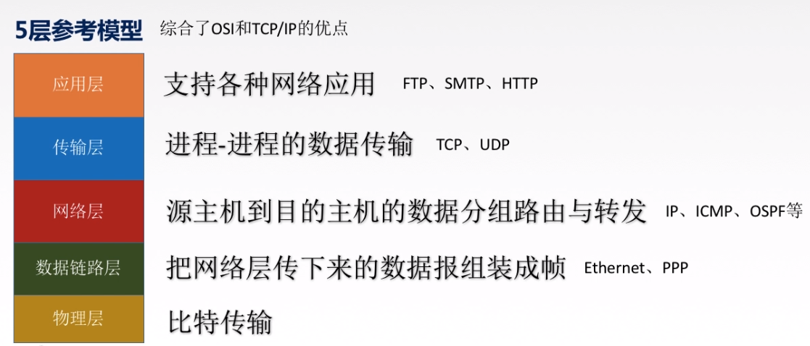

# 概述

- 网络知识

  - 三大网络

    - 分解

    - 融合：把电信网络、有线电视网络、计算机网络融合成一种网络，能够提供语音、数据、视频等通信业务

  - 计算机网络：

    - 定义：
      - 是一个将分散、具有独立功能的计算机系统(ios,android)，通过通信设备与线路(路由器)连接起来，由功能完善的软件实现资源分享和信息传递的系统

    - 特点：互连、自治

    - 组成部分：硬件、软件、协议

    - 功能：

      - 通信子网：信息传递

      - 资源子网：资源共享

    - 分类

      - 范围

        - 广域网（WAN）
          - 覆盖更大的范围，如全国、全球等，其特点是传输速度较慢、覆盖范围广、安全性较低

        - 城域网（MAN）
          - 覆盖较大的范围，如城市、校园等，其特点是传输速度较快、覆盖范围广、安全性较高

        - 局域网（LAN）
          - 通常覆盖较小的范围，如家庭、办公室等，其特点是传输速度快、安全性高、成本低

        - 个人区域网（PAN）

      - 使用者

        - 公用网：三大移动商

        - 专用网：军事、政府

      - 交换技术

        - 电路

        - 分组

        - 报文

      - 拓扑结构

        - 网状

        - 环形

        - 星型

        - 总线型

  - 互联网

    - 发展阶段

      - 1：从单个网络 ARPANET 向互联网发展的过程

      - 2：建成了三级结构的互联网

      - 3：逐渐形成了多层次 ISP 结构的互联网。出现了互联网服务提供者 ISP (Internet Service Provider)

    - 工作方式划分

    - 边缘部分： 由所有连接在互联网上的主机组成。这部分是用户直接使用的，用来进行通信（传送数据、音频或视频）和资源共享

      - 通信方式1（一种中心化的通信方式，需要有一个中心服务器来管理和分配资源）

      - 通信方式2（P2P对等通信方式则是一种去中心化的通信方式，每个节点都可以充当客户端和服务端，可以直接相互通信和共享资源）

        

        

        - 只要两个主机都运行了对等连接软件 (P2P 软件) ，它们就可以进行平等的、对等连接通信。

        - 双方都可以下载对方已经存储在硬盘中的共享文档

    - 核心部分：由大量网络和连接这些网络的路由器组成。这部分是为边缘部分提供服务的（提供连通性和交换）

      

      - 电路交换

        - 电路交换必定是面向连接的。

        - 电路交换分为三个阶段：

          - 建立连接：建立一条专用的物理通路，以保证双方通话时所需的通信资源在通信时不会被其他用户占用

          - 通信：主叫和被叫双方就能互相通电话

          - 释放连接：释放刚才使用的这条专用的物理通路（释放刚才占用的所有通信资源）

        - 电路交换的优点是通话质量好、时延小，但缺点是资源利用率低，当用户数量增多时，必须建立更多的物理连接，网络的扩展性受到限制

      - 报文交换

        - 报文交换的优点是能够动态分配网络资源，适应用户数量的变化，但是由于每个报文都需要独立传输，因此可能会造成传输时延较大、报文丢失等问题

        - 优点：

          - 可靠性高：报文交换传输的是整个报文，每个报文都具有唯一的标识符和校验码，并且在传输过程中不会发生分割和组合，因此具有较高的可靠性，能够保证数据传输的正确性和完整性。

          - 易于管理：报文交换使用简单、直观的传输单位，易于管理和控制。每个报文都具有明确的源地址和目标地址，便于追踪和管理数据流向，避免数据丢失和错乱。

          - 安全性高：报文交换可以使用加密和认证等安全机制，保护数据的安全性和隐私性，防止数据被窃取或篡改。

        - 缺点：

          - 传输效率低：由于报文交换传输的是整个报文，当报文过大时，传输效率会降低，会占用较多的带宽资源，导致传输速度变慢。

          - 阻塞问题：由于报文大小不一，当某个报文较大时可能会占用网络资源较多，从而导致其他报文的传输出现阻塞问题。

          - 网络负载高: 报文交换对网络负载的要求比较高，尤其是在大规模的并发请求下容易出现网络拥堵，导致数据传输缓慢。

          - 灵活性差: 报文交换需要针对每一种数据类型单独进行协议设计，因此在处理不同类型的数据时比较麻烦，并且不够灵活。

      - 分组交换

        - 特点：采用存储转发技术

        - 工作方式：

          - 在发送端，先把较长的报文划分成较短的、固定长度的数据段

          -  每一个数据段前面添加上首部构成分组

            

            - 每一个分组的首部都含有地址（诸如目的地址和源地址）等控制信息。

            - 分组交换网中的结点交换机根据收到的分组首部中的地址信息，把分组转发到下一个结点交换机。

            - 每个分组在互联网中独立地选择传输路径。

            - 用这样的存储转发方式，最后分组就能到达最终目的地

          - 分组交换网以“分组”作为数据传输单元。依次把各分组发送到接收端（假定接收端在左边）

          - 接收端收到分组后剥去首部还原成报文

          - 最后，在接收端把收到的数据恢复成为原来的报文

        - 分组交换的优点是能够动态分配网络资源，适应用户数量的变化，并且能够更好地利用网络资源，但是由于分组独立传输，因此可能会造成分组失序、分组重复等问题

  - 互联网+
    - 定义：互联网 + 各个传统行业

  - 互连网
    - 定义：通过路由器把计算机网络互连起来，构成互连网

  - 万维网
    - 万维网WWW是World Wide Web的简称，也称为Web、3W等。WWW是基于客户机/服务器方式的信息发现技术和超文本技术的综合。WWW服务器通过超文本标记语言(HTML)把信息组织成为图文并茂的超文本，利用链接从一个站点跳到另个站点。这样一来彻底摆脱了以前查询工具只能按特定路径一步步地查找信息的限制

  - 标准化工作

    - 法定标准：制定

    - 事实标准：主流

    - RFC

- 性能指标

  - 速率(b/s)

    -  定义：在单位时间内发送或接收数据的速度

    -  单位：

      - 比特(1000进制)：b/s,Kb/s,Mb/s,Tb/s

      - 字节(1024进制)：B/s,KB/s,MB/s,TB/s

  - 传播速率(m/s)
    - 定义：指在媒介中传输电磁波或电信号时，电磁波或电信号在媒介中传播的速率，传播速率与媒介的物理性质和环境因素有关

  - 带宽(Hz)：

    - 定义：单位时间内网络中传输数据的能力，即是网络设备所支持的最高速度，单位同速率，是理想条件下最高速率

    - 在时间轴上信号的宽度随带宽的增大而变窄

  - 吞吐量(b/s)：
    - 定义：实际能够通过网络传输的数据量，单位时间内通过某个网络的数据总量（量受网络的带宽或网络的额定速率的限制）

  - 时延及其相关

    - 时延：数据从网络一端到另一端所需的时间
      - 分类

    - 时延带宽积（=传播时延x带宽）：链路上有多少比特的数据

    - 往返时延RTT（ 传播时延x2+处理时间(有时可能直接忽略) ）：发送端发送数据开始，到发送端收到来自接收端的确认（接收端收到数据后便立即发送确认），总共经历的时延

  - 利用率：

    - 信道利用率（某信道有百分之几的时间是被利用的(有数据通过)）：有数据通过时间/(有+无)数据通过总时间

    - 网络利用率：所有信道利用率加权求平均值

    - 时延与利用率
      - 关系

- 名词解释

  - 协议

    - 协议定义

      - 计算机网络中的数据交换必须遵守事先约定好的规则。

      - 这些规则明确规定了所交换的数据的格式以及有关的同步问题（同步含有时序的意思）。

      - 网络协议 (network protocol)，简称为协议，是为进行网络中的数据交换而建立的规则、标准或约定。

    - 协议组成要素

      - 语法：数据与控制信息的结构或格式。(数据在传输过程中的规则和格式)

      - 语义：需要发出何种控制信息，完成何种动作以及做出何种响应。(数据在传输过程中的意义和解释）

      - 同步（时序）：事件实现顺序的详细说明（数据在传输过程中的时间和速度控制）

  - 协议与服务

    - 区别：

      - 协议是控制对等实体之间通信的规则，是水平的。

      - 服务是下层通过层间接口向上层提供的功能，是垂直的。

    - 关系：协议的实现保证了能够向上一层提供服务，要实现本层协议还需使用下层提供的服务

  - 协议栈：指计算机网络体系结构采用分层模型后,每层的主要功能由对等层协议的运行来实现,因而每层可用一些主要协议来表征,几个层次画在一起很像一个栈的结构

  - 实体：表示任何可发送或接收信息的硬件或软件进程

  - 对等层：在网络体系结构中,通信双方实现同样功能的层

  - 协议数据单元：对等层实体进行信息交换的数据单位

  - 服务访问点：在同一系统中相邻两层的实体进行交互（即交换信息）的地方

  - 客户是服务的请求方，服务器是服务的提供方

  - 客户-服务器方式所描述的是进程之间服务和被服务的关

- 计算机网络体系结构

  - 计算机网络体系结构的形成

    - SNA

    - OSI/RM

    - TCP/IP

  - 计算机网络体系结构的概念

    - 计算机网络的体系结构 (architecture) 是计算机网络的各层及其协议的集合。

    - 体系结构就是这个计算机网络及其部件所应完成的功能的精确定义。

    - 实现 (implementation) 是遵循这种体系结构的前提下用何种硬件或软件完成这些功能的问题。

    - 体系结构是抽象的，而实现则是具体的，是真正在运行的计算机硬件和软件。

  - 分层模型

    - 为什么分层：网络体系结构采用分层的结构，可以减少协议设计的复杂性，使得各层之间是独立的，增强灵活性，使得网络体系结构上可以分割开，易于实现和维护，同时促进标准化工作。

    - 正确认识分层：

    - 优缺点

    - 总结：

  - OSI参考模型（法定标准）

    - 层次（物联网淑慧试用）

      - 应用层	Application Layer
        - 直接为用户的应用进程（例如电子邮件、文件传输和终端仿真）提供服务。如HTTP、SMTP、FTP、DNS等

      - 表示层	Presentation Layer	
        - 把数据转换为能与接收者的系统格式兼容并适合传输的格式，即让两个系统可以交换信息

      - 会话层	Session Layer	
        - 负责在数据传输中设置和维护计算机网络中两台计算机之间的通信连接

      - 传输层	Transport Layer	
        - 负责端到端通讯，可靠传输，不可靠传输 ，流量控制，复用分用

      - 网络层	Network Layer	
        - 负责选择路由最佳路径，规划IP地址(ipv4和ipv6变化只会影响网络层)，拥塞控制

      - 数据链路层 Data Link Layer
        - 帧的开始和结束，还有透明传输，差错校验(纠错由传输层解决)

      - 物理层	Physical Layer	
        - 定义网络设备接口标准，电气标准(电压)，如何在物理链路上传输的更快

    - 目的：支持异构网络系统的互联互通

    - 数据单元

      - 物理层（Physical Layer）：比特（Bit）

      - 数据链路层（Data Link Layer）：帧（Frame）

      - 网络层（Network Layer）：包（Packet）或分组（Datagram）

      - 传输层（Transport Layer）：段（Segment）

      - 会话层（Session Layer）：会话（Session）

      - 表示层（Presentation Layer）：报文（Message）

      - 应用层（Application Layer）：数据（Data）

    - 过程

    - 流程

  - TCP/IP参考模型（事实标准）
    - 概述

  - 五层参考模型

    - 各层完成主要功能

      - 差错控制：使相应层次对等方的通信更加可靠。

      - 流量控制：发送端的发送速率必须使接收端来得及接收，不要太快。

      - 分段和重装 ：发送端将要发送的数据块划分为更小的单位，在接收端将其还原。

      - 复用和分用：发送端几个高层会话复用一条低层的连接，在接收端再进行分用。

      - 连接建立和释放：交换数据前先建立一条逻辑连接，数据传送结束后释放连接。

    - 各层功能

      - （1）应用层
        - 应用层确定进程之间通信的性质以满足用户的需要。应用层不仅要提供应用进程所需要的信息交换和远地操作，而且还要作为互相作用的应用进程的用户代理，来完成一些为进行语义上有意义的信息交换所必须的功能。

      - (2）运输层 
        - 任务是负责主机中两个进程间的通信。因特网的运输层可使用两种不同的协议。即面向连接的传输控制协议TCP 和无连接的用户数据报协议UDP。面向连接的服务能够提供可靠的交付。无连接服务则不能提供可靠的交付。

      - (3)网络层 
        - 网络层负责为分组选择合适的路由，使源主机运输层所传下来的分组能够交付到目的主机。

      - （4）数据链路层 
        - 数据链路层的任务是将在网络层交下来的数据报组装成帧，在两个相邻结点间的链路上实现帧的无差错传输。

      - （5）物理层 
        - 物理层的任务就是透明地传输比特流。“透明地传送比特流”指实际电路传送后比特流没有发生变化。

    - 协议数据单元PDU（Protocol Data Unit）（对等层次之间传递的数据单位）

      - 物理层的 PDU是数据位（bit）（比特流）

      - 数据链路层的 PDU是数据帧（frame）（帧）

      - 网络层的PDU是数据包（packet）（分组）

      - 传输层的 PDU是数据段（segment）（数据段）

      - 其他更高层次的PDU是数据（data）（数据）

    - 过程

    - 总结

# 物理层

- 物理层基础

  - 作用：

    - 解决如何在连接各种计算机的传输媒体上传输数据比特流，而不是具体传输媒体

    - 尽可能地屏蔽掉不同传输媒体和通信手段的差异

    - 规定了网络的一些电气特性，作用是负责传送0和1的电信号

  - 主要任务：确定与传输媒体的接口的一些特性

  - 特性：

    - 机械特性 ：指明接口所用接线器的形状和尺寸、引线数目和排列、固定和锁定装置等

    - 电气特性：指明在接口电缆的各条线上出现的电压的范围

    - 功能特性：指明某条线上出现的某一电平的电压表示何种意义

    - 过程特性 ：指明对于不同功能的各种可能事件的出现顺序

    - 特性：

- 数据通信

  - 数据通信模型
    - 过程

  - 数据：运送消息的实体

    - 模拟数据：在时间上和幅度取值上都是连续的，其电平随时间连续变化
      - 例如，语音是典型的模拟信号，其他由模拟传感器接收到的信号如温度、压力、流量等也是模拟信号。

    - 数字数据：在时间上离散的，在幅值上是经过量化的，它一般是由0、1的二进制代码组成的数字序列

  - 信号： 数据的电气的或电磁的表现（数据在传输过程的存在形式）

    - 模拟信号 (analogous signal) —— 代表消息的参数的取值是连续的

    - 数字信号 (digital signal) —— 代表消息的参数的取值是离散的

  - 调制：把数字信号转换为模拟信号的过程

  - 解调：把模拟信号转换为数字信号的过程

  - 码元：

    - 定义：

      - 在使用时间域（或简称为时域）的波形表示数字信号时，代表不同离散数值的基本波形

      - 码元就是在网线上传输的一个个信号段。码元的不同进制就是用来表示不同的数值的

    - M进制码元：

      - 用一个固定时长的信号波形（数字脉冲），代表离散数值的基本波形

      - 当有M个离散状态时，称为M进制码元

    - 码元携带的信息量

  - 码元传输速率（单位：波特/s  、Baud/s）
    - 定义：单位时间内数字通信系统传输的码元个数

  - 信息传输速率（平常说的网速）
    - 信息传输速率（b/s）=  码元传输速率 x 码元所带信息量(bit)

  - 系统传输速率

    - 定义：数据在各个硬件和软件组件之间传输的速度

    - 系统传输速率可以通过以下几个方面来评估：

      - 总线传输速率：指通过计算机总线（如PCI、USB、FireWire等）进行数据传输的速率，这个速率决定了外围设备（如打印机、鼠标、键盘等）与计算机之间数据交换的速度。

      - 存储器传输速率：指在计算机内部，CPU与系统内存之间进行数据传输的速率，这个速率决定了计算机的运行速度和性能。

      - 硬盘传输速率：指硬盘在计算机内部进行读写操作时的速率，这个速率决定了文件读取、拷贝和存储的速度。

      - 网络传输速率：指计算机系统通过网络传输数据的速率，包括局域网和广域网的传输速率，这个速率决定了计算机之间数据交换的速度和互联网应用的性能。

  - 带宽
    - 定义：

  - 频带宽度

    - 能使用的范围：最大- 最小

    - 举例：

  - 信源：产生和发送数据的源头

  - 信宿：接收数据的终点

  - 信道：（信号传输媒介）一般用来表示向某一个方向传送信息的媒体   

    - 定义：

    - 两种数据传输方式
      - 方式

    - 三种通讯方式
      - 方式

  - 信道上传送的信号及其调制

    - 基带信号（即基本频带信号）

    - 宽带信号（过载波调制后的信号）

    - 选择信号

    - 基带调制：仅对基带信号的波形进行变换，使它能够与信道特性相适应。变换后的信号仍然是基带信号。把这种过程称为编码 (coding)

    - 带通调制：使用载波 (carrier)进行调制，把基带信号的频率范围搬移到较高的频段，并转换为模拟信号，这样就能够更好地在模拟信道中传输（即仅在一段频率范围内能够通过信道）

  - 编码与调制  数据转为信号

    - 编码：  数据 转为 数字信号

      - 总结

        

        - 不归零制：正电平代表 1，负电平代表 
          - 不能区分两个连续相同信号的区间

        - 归零制：正脉冲代表 1，负脉冲代表 0

        - 曼彻斯特编码：位周期中心的向上跳变代表 0，位周期中心的向下跳变代表 1。但也可反过来定义

        - 差分曼彻斯特编码：在每一位的中心处始终都有跳变。位开始边界有跳变代表 0，而位开始边界没有跳变代表 1

      - 从自同步能力来看，不归零制不能从信号波形本身中提取信号时钟频率（这叫作没有自同步能力），而曼彻斯特编码和差分曼彻斯特编码具有自同步能力

      - 从信号波形中可以看出，曼彻斯特(Manchester) 编码和差分曼彻斯特编码产生的信号频率比不归零制高

    - 调制：  数据 转为 模拟信号

      - 意义：

      - 带通调制：使用载波 (carrier)进行调制，把基带信号的频率范围搬移到较高的频段，并转换为模拟信号，这样就能够更好地在模拟信道中传输（即仅在一段频率范围内能够通过信道） 

      - 调制方法

        - 最基本的二元制调制方法有以下几种：

          

          - 调幅(AM)/幅移键控(ASK) ：载波的振幅随基带数字信号而变化。

          - 调频(FM)/频移键控(FSK) ：载波的频率随基带数字信号而变化。

          - 调相(PM)/相移键控(PSK) ：载波的初始相位随基带数字信号而变化。

  - 极限/最大数据传输速率

    - 限制数据在信道上的传输速率的因素：信道能够通过的频率范围和信噪比

    - 信噪比：

      

      - 意义：

        - 噪声存在于所有的电子设备和通信信道中

        - 噪声是随机产生的，它的瞬时值有时会很大。因此噪声会使接收端对码元的判决产生错误

        - 但噪声的影响是相对的。如果信号相对较强，那么噪声的影响就相对较小

    - 波特率与比特率

      

      - 比特率是数字信号的传输速率：单位时间内所传输的二进制代码的有效位数。单位是比特/秒（bps）

      - 波特率，又称波形速率：线路中每秒传送的波形的个数。单位是波特（baud）

      - 比特率 = 波特率 * log2（N）（N为码元所表示的有效状态数）

      - 举例：有振幅也要乘

    -  奈氏准则（避免码间串扰）

      

      - 细节

      - 题目

    - 香农定理

      

      - 意义

        - 噪声存在于所有的电子设备和通信信道中

        - 噪声是随机产生的，它的瞬时值有时会很大。因此噪声会使接收端对码元的判决产生错误

        - 但噪声的影响是相对的。如果信号相对较强，那么噪声的影响就相对较小

      - 细节

      - 题目：

    - 区别

- 信道复用

  - 概念

  - 频分复用 FDM

    - 特点：

      

      - 将整个带宽分为多份，用户在分配到一定的频带后，在通信过程中自始至终都占用这个频带

      - 频分复用的所有用户在同样的时间占用不同的带宽资源（请注意，这里的“带宽”是频率带宽而不是数据的发送速率）

  - 时分复用 TDM

    - 特点

      

      - 时分复用则是将时间划分为一段段等长的时分复用帧（TDM 帧）

      - 每一个时分复用的用户在每一个 TDM帧中占用固定序号的时隙

      - 每一个用户所占用的时隙是周期性地出现（其周期就是 TDM 帧的长度）

      - TDM 信号也称为等时(isochronous)信号

      - 时分复用的所有用户是在不同的时间占用同样的频带宽度

    - 时分复用可能会造成线路资源的浪费

  - 统计时分复用 STDM

    - 特点

      

      - 帧不是固定分配时隙，而是按需动态地分配时隙。因此统计时分复用可以提高线路的利用率

      - 在每个时隙中需要有用户的地址信息

      - 集中器能正常工作的前提是假定各用户都是间歇地工作

  - 波分复用 WDM
    - 光的频分复用，使用一根光纤来同时传输多个光载波信号

  - 码分复用 CDM（码分多址 CDMA）

    - 特点（同一时间使用同一频率进行通信）

      - 各用户使用经过特殊挑选的不同码型，因此彼此不会造成干扰

      - 这种系统发送的信号有很强的抗干扰能力，其频谱类似于白噪声，不易被敌人发现

    - 码片：每一个比特时间划分为 m 个短的间隔

    - 码片序列

      - 码片序列特点：

        - 每个站分配的码片序列不仅必须各不相同，并且还必须互相正交 (orthogonal)

        - 在实用的系统中是使用伪随机码序列

      - 码片序列工作原理

        - 每个站被指派一个唯一的 m bit 码片序列

          - 如发送比特 1，则发送自己的 m bit 码片序列

          - 如发送比特 0，则发送该码片序列的二进制反码

        - 案例：S 站的 8 bit 码片序列是 00011011

          - 发送比特 1 时，就发送序列 00011011

          - 发送比特 0 时，就发送序列 11100100

          - S 站的码片序列：(–1 –1 –1 +1 +1 –1 +1 +1)

      - 码片序列的正交关系

        - 两个不同站的码片序列正交，就是向量 S 和T的规格化内积 (inner product) 等于 0：

        - 任何一个码片向量和该码片向量自己的规格化内积都是 1

        - 一个码片向量和该码片反码的向量的规格化内积值是 –1

    - CDMA 的工作原理

      

      

      - 特点：

        - 如何区分是不是自己的基站
          - 乘以叠加数据应该是一段一段的

        - 如何获取到数据
          - 叠加后数据与自己码片序列相乘，会有相应的结果

      - 基站给用户分配码片序列

        - 用户请求接入基站。基站会向用户发送一个随机码片序列选择请求。

        - 用户收到选择请求后，会选择一个可用的码片序列，并将其发送回基站。

        - 基站收到用户选择的码片序列后，会将该码片序列与用户的身份信息关联，并向用户发送该码片序列的确认信息。

        - 用户收到确认信息后，会开始使用该码片序列进行通信。

        - 如果在通信过程中需要更改码片序列，用户会向基站发送一个新的选择请求，基站会为用户选择一个新的可用码片序列

      - 发送叠加的信号

        - 基站根据每个用户的码片序列处理发送数据

        - 将每个用户处理后数据叠加并发送

      - 解析发送的叠加的信号

        - 收集数据：用户需要收集基站发送的叠加的信号，可以通过无线电接收器或者其他相关设备进行收集。

        - 识别码片序列：用户需要确定每个信号的码片序列。码片序列是一组数字，它们被用于分离和识别每个信号。

        - 解码信号：用户需要使用码片序列解码每个信号。解码的过程将码片序列与收集的数据进行比较，以确定每个信号的内容和来源。

        - 分离信号：用户需要将每个信号从叠加的信号中分离出来。这可以通过使用识别出的码片序列将每个信号从原始数据中分离出来。

        - 分析信号：用户可以对每个信号进行分析和处理，以确定它们的含义和用途。

    - 举例

- 传输介质

  - 导向型

    - 双绞线 

      - 意义：

        - 最常用的传输媒体

        - 模拟传输和数字传输都可以使用双绞线，其通信距离一般为几到十几公里

        - 导线相互缠绕可降低电磁干扰

      - 类型

        - 无屏蔽双绞线 UTP (Unshielded Twisted Pair)

        - 屏蔽双绞线 STP (Shielded Twisted Pair)（带金属屏蔽层）

    - 同轴电缆

      - 定义

      - 意义

        - 同轴电缆具有很好的抗干扰特性，被广泛用于传输较高速率的数据

        - 同轴电缆的带宽取决于电缆的质量

      - 结构

      - 与双绞线比

    - 光纤

      - 概念

      - 分类（根据入射角）

      - 特点

  - 非导向型

    - 短波通信

    - 微波

      - 频谱范围：300MHz~300GHz

      - 特性：在空间主要是直线传播，难以穿过建筑物

      - 传统微波通信有两种方式：

        - 地面微波中继通信

        - 卫星通信

    - 总结

  - 中继器

    - 中继器

      

      - 5-4-3规则

        - 5是指不能超过5个网段

        - 4是指在这些网段中的物理层网络设备（中继器，集线器）最多不超过4个

        - 3是指这些网段中最多只有三个网段挂有计算机

    - 集线器（多口中继器）

  - 各种传输介质特点

    - 1、双绞线

      - 特点：

        - （1）抗电磁干扰

        - （2）模拟传输和数字传输都可以使用双绞线

    - 2、同轴电缆
      - 特点：具有很好的抗干扰特性

    - 3、光纤

      - 特点：

        - （1）传输损耗小，中继距离长，对远距离传输特别经济；

        - （2）抗雷电和电磁干扰性能好；

        - （3）无串音干扰，保密性好，也不易被窃听或截取数据；

        - （4）体积小，重量轻。

    - 4、微波通信

      - 优点：

        - （1）微波波段频率很高，其频段范围也很宽，因此其通信信道的容量很大；

        - （2）微波传输质量较高；

        - （3）微波中继通信的可靠性较高；

        - （4）微波中继通信与相同容量和长度的电缆载波通信比较，建设投资少，见效快。

      - 微波中继通信存在如下的一些缺点：

        - （1）相邻站之间必须直视，不能有障碍物。

        - （2）微波的传播有时也会受到恶劣气候的影响；

        - （3）与电缆通信系统比较，微波通信的隐蔽性和保密性较差；

        - （4）对大量的中继站的使用和维护要耗费一定的人力和物力。

- 地面网络传输与卫星传输

  - 地面网络传输：

    - 有线：通过主机、交换机、路由器等连接

    - 无线：wifi等小范围网络

  - 卫星网络传输：

    - 广播

    - 卫星电视

# 数据链路层

- 基础

  - 作用

    - 主要负责将网络层提供的数据报分成帧，并在物理介质上传送这些帧

    - 将网络层提供的数据报封装成帧

    - 管理帧的传输和接收，包括错误检测和纠正，并且可以通过重传机制保证数据的可靠传输

    - 提供寻址和流量控制功能

    - 在共享介质（如以太网）中管理访问控制，使用MAC地址识别每个网络节点

    - 进行链路层协议（如PPP、HDLC等）的处理，以实现不同网络节点之间的通信

  - 元素

    - 结点：主机、路由器

    - 链路：网络中两个结点之间的物理通道，链路的传输介质主要有双绞线、光纤、微波。分为有线链路和无线链路

    - 数据链路：网络中两个结点之间的逻辑通道，把实现控制数据传输协议的硬件和软件加到链路上就构成数据链路

    - 帧：链路层的协议数据单元，封装网络层数据报

  - 数据链路层简单模型
    - 主机H1向H2发送数据

  - 数据链路层任务

    - 物理层为我们传输01电信号做出了不少贡献。但是在物理层也提到，物理层自己不知道自己传输的信号有什么意义。

    -  这就是”链接层”的功能，它规定了解读方式：多少个电信号算一组？每个信号位有何意义？

  - 数据链路层主要功能

    - (1) 链路管理

    - (2) 帧定界

    - (3) 流量控制

    - (4) 差错控制

    - (5) 将数据和控制信息区分开

    - (6) 透明传输

    - (7) 寻址

  - 数据链路层三个基本问题

    - (1) 封装成帧

      - 作用：在一段数据的前后分别添加首部和尾部，然后就构成了一个帧。确定帧的界限。首部和尾部的一个重要作用就是进行帧定界。（将网络数据报加头加尾，相当于将数据打包）

      - 实现方法：（控制字符法）（ASCII文件）

        

        - 当数据是由可打印的 ASCII 码组成的文本文件时，帧定界可以使用特殊的帧定界符。

        - 控制字符 SOH (Start Of Header) 放在一帧的最前面，表示帧的首部开始。另一个控制字符 EOT (End OfTransmission) 表示帧的结束。

        - SOH和EOT的十六进制编码分别是01和04。

      - 帧同步：接收方应当能从接收到的二进制比特流中区分出帧的起始和终止

    - (2) 透明传输

      - 问题：（非ASCII文件）

        - 当数据部分是非ASCII码的文本文件时（如二进制代码的计算机程序或图像等），如果数据中的某个字节恰好和SOH或EOT这种控制字符一样，链路层就会错误地“找到帧的边界” 。

        - 缺点：有可能出现数据内某段比特流数据正好与标记字段重复，从而导致误判断的情况

      - 解决问题：（字符填充法）

        - 发送端的数据链路层在数据中出现控制字符“SOH”或“EOT”的前面插入一个转义字符“ESC” (其十六进制编码是 1B)

        - 接收端的数据链路层在将数据送往网络层之前删除插入的转义字符

        - 如果转义字符也出现在数据当中，那么应在转义字符前面插入一个转义字符 ESC。当接收端收到连续的两个转义字符时，就删除其中前面的一个

    - (3) 差错控制

      - 问题：

        - 在传输过程中可能会产生比特差错：1 可能会变成 0 而 0 也可能变成 1。

        - 在一段时间内，传输错误的比特占所传输比特总数的比率称为误码率 BER (Bit Error Rate)。

        - 误码率与信噪比有很大的关系。

        - 为了保证数据传输的可靠性，在计算机网络传输数据时，必须采用各种差错检测措施。

      - 循环冗余检验(CRC)

        - 原理

          

          - 双方约定一个生成多项式

          - 发送方基于发送数据和生成多项式计算出冗余码，将冗余码添加到传输数据后面

            

            - 异或运算：相同为0，不同为1

          - 接收方通过生成多项式计算收到的数据是否产生误码

        - 总结

  - 数据链路层使用的信道

    - 点对点信道：
      - 这种信道使用一对一的点对点通信方式

    - 广播信道：

      - 这种信道使用一对多的广播通信方式，因此过程比较复杂

      - 广播信道上连接的主机很多，因此必须使用专用的共享信道协议来协调这些主机的数据发送

- 点对点协议PPP

  - 应用

  - 帧格式

    

    - 同步标志（Flag）：用于标识帧的开始和结束，其值为01111110（0x7E）

    - 地址（Address）：通常设置为默认值“11111111（0xFF）”，表示广播地址

    - 控制（Control）：通常设置为默认值“00000011（0x03）”，表示未压缩的数据。如果使用了压缩则可以设置不同的值

    - 协议（Protocol）：指示上层协议类型，如IPv4、IPv6、IPX等

    - 数据（Data）：包含上层协议的数据部分

    - 帧检验序列（FCS）：用于检测位错误，采用循环冗余校验（CRC）算法，长度为2个字节

  - 功能

    - 简单 —— 这是首要的要求

    - 封装成帧 —— 必须规定特殊的字符作为帧定界符

    - 透明性 —— 必须保证数据传输的透明性

    - 多种网络层协议 —— 能够在同一条物理链路上同时支持多种网络层协议

    - 多种类型链路 —— 能够在多种类型的链路上运行

    - 差错检测 —— 能够对接收端收到的帧进行检测，并立即丢弃有差错的帧

    - 检测连接状态 —— 能够及时自动检测出链路是否处于正常工作状态

    - 最大传送单元 —— 必须对每一种类型的点对点链路设置最大传送单元 MTU 的标准默认值，促进各种实现之间的互操作性

    - 网络层地址协商 —— 必须提供一种机制使通信的两个网络层实体能够通过协商知道或能够配置彼此的网络层地址

    - 数据压缩协商 —— 必须提供一种方法来协商使用数据压缩算法

  - 组成

    - (1) 一个将 IP 数据报封装到串行链路的方法

    - (2) 链路控制协议 LCP (Link Control Protocol)

    - (3) 网络控制协议 NCP (Network ControlProtocol)

    - 协议

  - PPP 会话的建立

    - 链路协议检测：发送方在物理层和数据链路层完成一系列协议的检测，以确认双方之间的链路是否可用

    - LCP 配置阶段：在链路协议检测通过之后，发送方将发送 LCP（Link Control Protocol）配置请求消息给接收方。如果接收方支持该协议，则会返回 LCP 配置回应消息

    - 认证阶段（可选）：如果需要进行认证，则接收方会发送认证请求消息给发送方。发送方收到请求消息后，会发送认证回应消息给接收方

    - 网络控制协议 (NCP) 配置阶段：在 LCP 配置完成之后，发送方将发送 NCP 配置请求消息给接收方。如果接收方支持该协议，则会返回 NCP 配置回应消息

    - 会话建立完成：当 NCP 配置完成之后，PPP 会话建立成功，可以开始进行数据传输

  - PPP 协议的工作

    

    - 当用户拨号接入 ISP 时，路由器的调制解调器对拨号做出确认，并建立一条物理连接

    - PC 机向路由器发送一系列的 LCP 分组（封装成多个 PPP 帧）

    - 这些分组及其响应选择一些 PPP 参数，并进行网络层配置，NCP 给新接入的 PC 机分配一个临时的 IP 地址，使 PC 机成为因特网上的一个主机

    - 通信完毕时，NCP 释放网络层连接，收回原来分配出去的 IP 地址。接着，LCP 释放数据链路层连接。最后释放的是物理层的连接

    - 可见，PPP 协议已不是纯粹的数据链路层的协议，它还包含了物理层和网络层的内容

  - 解决透明传输问题

    - 字符填充（异步传输）

    - 零比特填充（同步传输）

- 网络适配器（网卡）

  - 作用：将计算机连接到以太网

  - 结构

  - 功能

    - 进行串行/并行转换
      - 计算机通过适配器和局域网进行通信

    - 对数据进行缓存

    - 在计算机的操作系统安装设备驱动程序
      - 在确保网卡硬件正确的情况下，为了使网卡正常工作，还必须要在计算机的操作系统中为网卡安装相应的设备驱动程序。驱动程序负责驱动网卡发送和接收帧。

    - 实现以太网协议

- mac地址（物理地址）

  - 概念

  - 特点（MAC地址是对网络上各接口的唯一标识，而不是对网络上各设备的唯一标识）

    - 一般情况下，普通用户计算机中往往会包含两块网卡：

      - 一块是用于接入有线局域网的以太网卡

      - 另一块是用于接入无线局域网的Wi-Fi网卡

    - 每块网卡都有一个全球唯一的MAC地址

    - 交换机和路由器往往具有更多的网络接口，所以会拥有更多的MAC地址

  - 地址

    - 图解

    - 全球、本地

    - 发送顺序

  - 以太网 V2 的 MAC 帧格式

  - IEEE 802局域网的MAC地址

  - 工作原理

  - 注意

  - 应用

- mac单播、广播、多播

  - 单播MAC地址

  - 广播

  - 多播MAC地址

- 局域网的数据链路层

  - 局域网主要特点：

    - 网络为一个单位所拥有

    - 地理范围和站点数目均有限

  - 局域网主要优点：

    - 具有广播功能，从一个站点可很方便地访问全网

    - 局域网上的主机可共享连接在局域网上的各种硬件和软件资源

    - 便于系统的扩展和逐渐地演变，各设备的位置可灵活调整和改变

    - 提高了系统的可靠性、可用性和残存性

  - 工作原理：

    - 利用电缆和光导纤维将两个节点连接在一起，并通过数据链路进行数据传输

    - 数据链路层将数据分成一个个小的单元，使用传输控制协议（TCP）和路由协议（路由器）来实现数据的传输（在局域网中，数据链路层通常使用 IEEE802.3标准来实现）

    - 数据链路层还负责将数据从一端传送到另一端，即验证和错误处理

    - 在局域网中，数据链路层可以通过运用路由算法来实现自动路由，从而提高数据传输的效率和稳定性

  - 局域网拓扑结构：星形网、总线网、环形网

  - 局域网的数据链路层的两个子层

    - 逻辑链路控制 LLC (Logical Link Control)子层
      - 不管采用何种协议的局域网，对 LLC 子层来说都是透明的

    - 媒体接入控制 MAC (Medium Access Control)子层
      - 与接入到传输媒体有关的内容都放在 MAC子层

- 以太网（一种基于广播通信方式的局域网协议）

  - 定义：一种常见的局域网拓扑结构

  - 作用：将局域网中的网络设备连接在一起，形成一个大的网络环境

  - 特点：

    - 传输效率高，其数据传输率可达10 Mpbs/s

    - 以太网具有灵活的控制和管理以及数据传输效率等优点，适用于需要大量数据传输的场合

  - 以太网的两个标准：

    - DIX Ethernet V2 

    - IEEE 802.3

  - 为了通信的简便，以太网采取了两种重要的措施：

    - 采用较为灵活的无连接的工作方式

    - 以太网发送的数据都使用曼彻斯特编码

  - 以太网采用广播方式发送

  - 以太网的信道利用率

  - 以太网的 MAC 层

    -  MAC 层的硬件地址

    - 48 位的 MAC 地址

  -  MAC 帧的格式

- 媒体共享技术

  - 静态分配

    - 信道

      - 频分复用

      - 时分复用

      - 波分复用

      - 码分复用

    - 特点

      - 预先分配给各用户

      - 不同用户使用情况不同

    - 缺陷

    - 应用

  - 动态分配

    - 动态媒体接入控制（多点接入）

      - 随机接入：站点争用信道，可能出现站点之间的冲突

      - 受控接入：站点被分配占用信道，无冲突

    - 特点

      - 信道是开放的

      - 没有预分配

      - 通过多点接入协议动态分配信道资源，提高信道利用率

- 典型的随机接入协议

  - ALOHA协议：想发就发

  - CSMA协议：先听后发

  - CSMA/CD协议：先听后发、边发边听

- CSMA/CD 协议（避免数据发生碰撞）

  - 含义：载波监听多点接入 / 碰撞检测

    - 多点接入
      - 表示许多计算机以多点接入的方式连接在一根总线上

    - 载波监听

      - 每一个站在发送数据之前先要检测一下总线上是否有其他计算机在发送数据，如果有，则暂时不要发送数据，以免发生碰撞

      - 总线上并没有什么“载波”。因此， “载波监听”就是用电子技术检测总线上有没有其他计算机发送的数据信号

    - 碰撞检测

      - “碰撞检测”就是计算机边发送数据边检测信道上的信号电压大小

      - 检测

        - 当几个站同时在总线上发送数据时，总线上的信号电压摆动值将会增大（互相叠加）

        - 当一个站检测到的信号电压摆动值超过一定的门限值时，就认为总线上至少有两个站同时在发送数据，表明产生了碰撞

      - 检测到碰撞后

        - 在发生碰撞时，总线上传输的信号产生了严重的失真，无法从中恢复出有用的信息来

        - 每一个正在发送数据的站，一旦发现总线上出现了碰撞，就要立即停止发送，免得继续浪费网络资源，然后等待一段随机时间后再次发送

      - 为什么要进行碰撞检测

  - 工作原理

    - (1) 准备发送。但在发送之前，必须先检测信道。

    - (2) 检测信道。若检测到信道忙，则应不停地检测，一直等待信道转为空闲。若检测到信道空闲，并在 96 比特时间内信道保持空闲（保证了帧间最小间隔），就发送这个帧。

  - CSMA/CD 重要特性

    - 使用 CSMA/CD 协议的以太网不能进行全双工通信而只能进行双向交替通信（半双工通信）

    - 每个站在发送数据之后的一小段时间内，存在着遭遇碰撞的可能性

    - 这种发送的不确定性使整个以太网的平均通信量远小于以太网的最高数据率

  - 争用期

  - 二进制指数类型退避算法

  - 争用期的长度

  - 最短有效帧长

  - CSMA/CD协议的要点

  - 帧间最小间隔

- 扩展的以太网

  - 使用光纤扩展（在物理层扩展以太网）

  - 使用集线器扩展（在物理层扩展以太网）

    - 集线器的一些特点

    - 优缺点

    - 作用（使用多个集线器可连成更大的、多级星形结构的以太网）

  - 以太网交换机（在数据链路层扩展以太网）

    - 特点

    - 优点

    - 交换方式

      - 直通 (cut-through) 方式

      - 存储转发方式

    - 自学习功能

      - 最初开机时MAC地址表是空的

      - MAC地址表的建立过程

        

        - 如果表内有目的地址，则直接转发给对应目的地址

        - 如果表内没有目的地址，则发送给除源地址端口外得所有目的地址，获取到目的端口后，存入表中

        - 如果源地址端口也没有在表中，则存入表中

      - 转发/过滤决策

    - 生成树协议
      - 特点：不改变网络的实际拓扑，但在逻辑上则切断某些链路，使得从一台主机到所有其他主机的路径是无环路的树状结构，从而消除了兜圈子现象。

  - 集线器与交换机的比较

- VLAN

  - 格式

# 网络层

- 网络层提供的两种服务

  -  面向连接（网络负责可靠交付）

    - 通信之前先建立虚电路 (Virtual Circuit)，以保证双方通信所需的一切网络资源

    - 如果再使用可靠传输的网络协议，就可使所发送的分组无差错按序到达终点，不丢失、不重复

  - 无连接（网络提供数据报服务）

    - 网络层向上只提供简单灵活的、无连接的、尽最大努力交付的数据报服务

    - 网络在发送分组时不需要先建立连接。每一个分组（即 IP 数据报）独立发送，与其前后的分组无关（不进行编号）

    - 网络层不提供服务质量的承诺。即所传送的分组可能出错、丢失、重复和失序（不按序到达终点），当然也不保证分组传送的时限

    - 由于传输网络不提供端到端的可靠传输服务，这就使网络中的路由器可以做得比较简单，而且价格低廉（与电信网的交换机相比较）。

    - 如果主机（即端系统）中的进程之间的通信需要是可靠的，那么就由网络的主机中的运输层负责可靠交付（包括差错处理、流量控制等） 。

    - 采用这种设计思路的好处是：网络的造价大大降低，运行方式灵活，能够适应多种应用。

    - 互连网能够发展到今日的规模，充分证明了当初采用这种设计思路的正确性

  - 虚电路服务与数据报服务的对比

    - 虚电路服务（面向连接，让网络负责可靠交付 ）

      

      - 虚电路表示这只是一条逻辑上的连接，分组都沿着这条逻辑连接按照存储转发方式传送，而并不是真正建立了一条物理连接

    - 数据报服务（无连接，让主机负责可靠交付 ）

    - 比较

- 网际层的 IP 协议及配套协议

- 网际协议 IP

  - 虚拟互连网络

    - 使用中间设备进行互连

      - 物理层中继系统：转发器 (repeater)

      - 数据链路层中继系统：网桥 或 桥接器 (bridge)

      - 网络层中继系统：路由器 (router)

      - 网桥和路由器的混合物：桥路器 (brouter)。

      - 网络层以上的中继系统：网关 (gateway)。

    - 意义

      - 所谓虚拟互连网络也就是逻辑互连网络，它的意思就是互连起来的各种物理网络的异构性本来是客观存在的，但是我们利用 IP 协议就可以使这些性能各异的网络从用户看起来好像是一个统一的网络

      - 当互联网上的主机进行通信时，就好像在一个网络上通信一样，而看不见互连的各具体的网络异构细节

      - 如果在这种覆盖全球的 IP 网的上层使用 TCP 协议，那么就是现在的互联网 (Internet)

  - 二级IP 地址

    - （32位、4字节）结构：        网络号(net-id)         主机号(host-id)

    - 一般不使用的特殊的 IP 地址

    - 网络地址：网络号+主机号位置全为0

    - 广播地址：网络号+主机号位置全为1

  - 三级IP 地址（划分子网）

    - 在主机号借用若干个位作为子网号 subnet-id

    - 子网掩码

      - 用十进制数表示，如：255.255.255.0

        - 子网掩码长度＝32位 

        - 某位＝1：IP地址中的对应位为网络号和子网号

        - 某位＝0：IP地址中的对应位为主机号

      - 用“/网络位数”表示，如：13.129.6.1/8   即  13.129.6.1 255.0.0.0

    - 网络地址：网络号+子网号+主机号位置全为0

    - 广播地址：网络号+子网号+主机号位置全为0

    - 三级ip地址工作原理

      - 凡是从其他网络发送给本单位某个主机的 IP 数据报，仍然是根据 IP 数据报的目的网络号 net=id，先找到连接在本单位网络上的路由器

      - 然后此路由器在收到 IP 数据报后，再按目的网络号 net-id 和子网号 subnet-id 找到目的子网

      - 最后就将 IP 数据报直接交付目的主机

  - 无分类的两级编址

    - 格式

    - CIDR 地址块

      - 举例1

      - 举例2

  - IP 数据报的格式：首部 + 数据报

    - 格式：每一行4个字节

      

      - 首部（最大60字节）

        - 固定部分（20字节、160位）

          - 版本                  （4位）：IP 协议的版本
            - 目前的 IP 协议版本号为 4 (即 IPv4)

          - 首部长度        （4位）：单位为4字节

            - 一个单位为 4 字节

            - 最大数值是 15 个单位 

            - IP 的首部长度的最大值是 60 字节

          - 区分服务        （8位）：未使用

          - 总长度           （16位）：首部和数据之和的长度（单位为字节）

            - 单位为字节

            - 数据报的最大长度为 65535 字节

            - 总长度必须不超过最大传送单元 MTU

          - 标识                （16位）：一个计数器，用来产生 IP 数据报的标识

          - 标志                （ 3 位）：目前只有前两位有意义（ _  DF MF ）

            - 标志字段的最低位是 MF (More Fragment)

              - MF = 1 表示后面“还有分片”

              - MF = 0 表示最后一个分片

            - 标志字段中间的一位是 DF (Don't Fragment) 
              - 只有当 DF = 0 时才允许分片

          - 片偏移           （13位）：较长的分组在分片后某片在原分组中的相对位置（单位为8字节）
            - 片偏移以 8 个字节为偏移单位

          - 生存时间      （8位）  ：数据报在网络中可通过的路由器数的最大值TTL (Time To Live)

          - 协议                 （8 位）：指出此数据报携带的数据使用何种协议

            - 以便目的主机的 IP 层将数据部分上交给那个处理过程

            - IP 协议支持多种协议，IP 数据报可以封装多种协议 PDU

          - 首部检验和（16位）：只检验数据报的首部，不检验数据部分

            - 不采用 CRC 检验码而采用简单的计算方法

              - 好处：减少路由器的处理时延，转发分组更快

              - 缺点：数据部分出现差错时不能及早发现

            - 采用 16 位二进制反码求和算法

          - 源地址          （32位）：源ip地址

          - 目的地址     （32位）：目的ip地址

        - 可变部分（长度可变，最大40字节）

          - IP 首部的可变部分就是一个选项字段，用来支持排错、测量以及安全等措施，内容很丰富

          - 增加首部的可变部分是为了增加 IP 数据报的功能，但这同时也使得 IP 数据报的首部长度成为可变的，这就增加了每一个路由器处理数据报的开销

          - 实际上这些选项很少被使用

      - 数据部分
        - 存放上层数据内容

    - IP 数据报分片

      - 1.分片：

      - 2.计算：

      - 3.片偏移：

  - ip地址与硬件地址

    - ip地址与硬件地址层次的区别：

      - 硬件地址（或物理地址）是数据链路层和物理层使用的地址

      - IP 地址是网络层和以上各层使用的地址，是一种逻辑地址（称 IP 地址是逻辑地址是因为 IP 地址是用软件实现的）

    - ip地址与硬件地址的变化的区别：

      - 源、目的IP地址始终不变

      - 源、目的MAC地址则在每段链路传输时都会被改变

    - 为什么不直接使用硬件地址进行通信

      - 由于全世界存在着各式各样的网络，它们使用不同的硬件地址。要使这些异构网络能够互相通信就必须进行非常复杂的硬件地址转换工作，因此几乎是不可能的事

      - 连接到互联网的主机只需各自拥有一个唯一的 IP 地址，它们之间的通信就像连接在同一个网络上那样简单方便

- 地址解析协议 ARP  (Address Resolution Protocol)

  - 作用：从网络层使用的 IP 地址，解析出在数据链路层使用的硬件地址

  - ARP请求分组：
    - 包含发送方硬件地址 / 发送方IP 地址 / 目标方硬件地址(未知时填 0) / 目标方IP 地址

  - ARP 响应分组：
    - 包含发送方硬件地址 / 发送方IP地址 / 目标方硬件地址 / 目标方 IP 地址

  - 工作原理

    - 1、当主机 A 欲向本局域网上的某个主机 B 发送 IP数据报时，就先在其 ARP 高速缓存中查看有无主机 B 的 IP 地址：

      - 如有：可查出其对应的硬件地址，再将此硬件地址写入 MAC 帧，然后通过局域网将该 MAC 帧发往此硬件地址

      - 如没有：ARP 进程在本局域网上广播发送一个ARP 请求分组。收到 ARP 响应分组后，将得到的IP 地址到硬件地址的映射写入 ARP 高速缓存

  - 本地广播 ARP 请求：

    - 步骤1

    - 步骤2

  - ARP 高速缓存表(ARP cache)

    - 作用：

      - 所在的局域网上的各主机和路由器的 IP 地址到硬件地址的映射表

      - 解决同一个局域网上的主机或路由器的IP 地址和硬件地址的映射问题

    - 表内容

    - 当主机 A 欲向本局域网上的某个主机 B 发送 IP数据报时，就先在其 ARP 高速缓存中查看有无主机 B 的 IP 地址：

      - 如有：可查出其对应的硬件地址，再将此硬件地址写入 MAC 帧，然后通过局域网将该 MAC 帧发往此硬件地址

      - 如没有：ARP 进程在本局域网上广播发送一个ARP 请求分组。收到 ARP 响应分组后，将得到的IP 地址到硬件地址的映射写入 ARP 高速缓存

    - 存放最近获得的 IP 地址到 MAC 地址的绑定，以减少 ARP 广播的数量

    - 为了减少网络上的通信量，主机 A 在发送其ARP 请求分组时，就将自己的 IP 地址到硬件地址的映射写入 ARP 请求分组

    - 当主机 B 收到 A 的 ARP 请求分组时，就将主机 A 的这一地址映射写入主机 B 自己的 ARP高速缓存中。这对主机 B 以后向 A 发送数据报时就更方便了

  - 使用 ARP 的四种典型情况

    

    - 发送方是主机，要把 IP 数据报发送到本网络上的另一个主机
      - 用 ARP 找到目的主机的硬件地址

    - 发送方是主机，要把 IP 数据报发送到另一个网络上的一个主机
      - 通过 ARP 找到一个位于本局域网上的某个路由器的硬件地址，然后把分组发送给这个路由器，让这个路由器把分组转发给下一个网络。剩下的工作就由下一个网络来做

    - 发送方是路由器，要把 IP 数据报转发到本网络上的一个主机
      - ARP 找到目的主机的硬件地址

    - 发送方是路由器，要把 IP 数据报转发到另一个网络上的一个主机
      - 这时用 ARP 找到本网络上另一个路由器的硬件地址。剩下的工作由这个路由器来完成

- 网际控制报文协议 ICMP  (Internet Control Message Protocol)

  - 作用
    - 更有效地转发IP数据报以及提高IP数据报交付成功的机会

  - 格式：

  - ICMP报文类型

    - 差错报告报文：用来向主机或路由器报告差错情况

      - 种类

        - 终点不可达

        - 源点抑制

        - 时间超过

          

          - 另外，当终点在预先规定的时间内未能收到一个数据报的全部数据报分片时，就把已收到的数据报片都丢弃，也会向源点发送时间超过（超时）报文

        - 参数问题

        - 改变路由（重定向）

      - 不应发送 ICMP 差错报告报文的几种情况

        - 对 ICMP 差错报告报文不再发送 ICMP 差错报告报文。

        - 对第一个分片的数据报片的所有后续数据报片都不发送 ICMP 差错报告报文。

        - 对具有多播地址的数据报都不发送 ICMP 差错报告报文。

        - 对具有特殊地址（如127.0.0.0 或 0.0.0.0）的数据报不发送 ICMP 差错报告报文。

    - 询问报文：用来向主机或路由器询问情况

      - 回送请求和回答报文

        - 由主机或路由器向一个特定的目的主机或路由器发出。

        - 收到此报文的主机或路由器必须给发送该报文的源主机或路由器发送ICMP回送回答报文。

        - 这种询问报文用来测试目的站是否可达以及了解其有关状态。

      - 时间戳请求和回答报文

        - 用来请求某个主机或路由器回答当前的日期和时间。

        - 在ICMP时间戳回答报文中有一个32比特的字段，其中写入的整数代表从1900年1月1日起到当前时刻一共有多少秒。

        - 这种询问报文用来进行时钟同步和测量时间。

  - 应用

    - PING (Packet InterNet Groper) 

      - PING 用来测试两个主机之间的连通性。

      - PING 使用了 ICMP 回送请求与回送回答报文。

      - PING 是应用层直接使用网络层 ICMP 的例子，它没有通过运输层的 TCP 或UDP

    - Traceroute

      - 用来跟踪一个分组从源点到终点的路径。

      - 它利用 IP 数据报中的 TTL 字段和 ICMP 时间超过差错报告报文实现对从源点到终点的路径的跟踪

      - 过程

        - 1

        - 2

        - 3

  - 下面的几种 ICMP 报文不再使用：

    - 信息请求与回答报文

    - 掩码地址请求和回答报文

    - 路由器询问和通告报文

    - 源点抑制报文

- 网际组管理协议 IGMP  (Internet Group Management Protocol)

  - 使用范围

    - IGMP 并非在互联网范围内对所有多播组成员进行管理的协议

    - IGMP 不知道 IP 多播组包含的成员数，也不知道这些成员都分布在哪些网络上

    - IGMP 协议是让连接在本地局域网上的多播路由器知道本局域网上是否有主机（严格讲，是主机上的某个进程）参加或退出了某个多播组

  - 数据报文
    - IGMP 使用 IP 数据报传递其报文（即 IGMP 报文加上 IP 首部构成 IP 数据报），但它也向 IP 提供服务

  - 工作原理

    - 第一阶段：加入多播组

      - 当某个主机加入新的多播组时，该主机应向多播组的多播地址发送IGMP 报文，声明自己要成为该组的成员

      - 本地的多播路由器收到 IGMP 报文后，将组成员关系转发给互联网上的其他多播路由器

    - 第二阶段：探询组成员变化情况

      - 因为组成员关系是动态的，因此本地多播路由器要周期性地探询本地局域网上的主机，以便知道这些主机是否还继续是组的成员

      - 只要对某个组有一个主机响应，那么多播路由器就认为这个组是活跃的

      - 但一个组在经过几次的探询后仍然没有一个主机响应，则不再将该组的成员关系转发给其他的多播路由器

  - IGMP 采用的一些具体措施

    - 在主机和多播路由器之间的所有通信都是使用IP 多播

    - 多播路由器在探询组成员关系时，只需要对所有的组发送一个请求信息的询问报文，而不需要对每一个组发送一个询问报文; 默认的询问速率是每 125 秒发送一次

    - 当同一个网络上连接有几个多播路由器时，它们能够迅速和有效地选择其中的一个来探询主机的成员关系

    - 在 IGMP 的询问报文中有一个数值 N，它指明一个最长响应时间（默认值为 10秒）; 当收到询问时，主机在 0 到 N 之间随机选择发送响应所需经过的时延。对应于最小时延的响应最先发送

    - 同一个组内的每一个主机都要监听响应，只要有本组的其他主机先发送了响应，自己就可以不再发送响应了

- 路由

  - 路由器

    - 作用

      - 连通不同的网络

      - 选择信息传送的线路：选择通畅快捷的近路，能大大提高通信速度，减轻网络系统通信负荷，节约网络系统资源，提高网络系统畅通率，从而让网络系统发挥出更大的效益来

    - 工作原理

      - 将路由器某个输入端口收到的分组，按照分组要去的目的地（即目的网络），把该分组从路由器的某个合适的输出端口转发给下一跳路由器

      - 下一跳路由器也按照这种方法处理分组，直到该分组到达终点为止

    - 结构

      - 一种具有多个输入端口和多个输出端口的专用计算机，其任务是转发分组

      - 路由选择部分

        - 核心构件：路由选择处理机

        - 任务：根据所选定的路由选择协议构造出路由表，同时经常或定期地和相邻路由器交换路由信息而不断地更新和维护路由表

      - 分组转发部分

        - 结构

          - 交换结构 (switching fabric)：又称为交换组织
            - 作用是根据转发表 (forwarding table) 对分组进行处理

          - 一组输入端口

          - 一组输出端口

        - 转发：
          - 路由器根据转发表将用户的IP 数据报从合适的端口转发出去

      - 输入端口处理：

        - 路由器的输入端口里面装有物理层、数据链路层和网络层的处理模块

        - 数据链路层剥去帧首部和尾部后，将分组送到网络层的队列中排队等待处理。这会产生一定的时延

        - 输入端口中的查找和转发功能在路由器的交换功能中是最重要的

        - 图解

      - 输出端口处理：

        - 输出端口里面装有物理层、数据链路层和网络层的处理模块

        - 输出端口从交换结构接收分组，然后把它们发送到路由器外面的线路上

        - 在网络层的处理模块中设有一个缓冲区（队列）。当交换结构传送过来的分组的速率超过输出链路的发送速率时，来不及发送的分组就必须暂时存放在这个队列中

        - 数据链路层处理模块将分组加上链路层的首部和尾部，交给物理层后发送到外部线路

        - 图解

      - 交换结构

        - 交换方法

          - 通过存储器

            

            - 当路由器的某个输入端口收到一个分组时，就用中断方式通知路由选择处理机。然后分组就从输入端口复制到存储器中

            - 路由器处理机从分组首部提取目的地址，查找路由表，再将分组复制到合适的输出端口的缓存中

            - 若存储器的带宽（读或写）为每秒 M 个分组，那么路由器的交换速率（即分组从输入端口传送到输出端口的速率）一定小于 M/2

          - 通过总线

            

            - 数据报从输入端口通过共享的总线直接传送到合适的输出端口，而不需要路由选择处理机的干预。

            - 因为每一个要转发的分组都要通过这一条总线，因此路由器的转发带宽就受总线速率的限制。

            - 现代的技术已经可以将总线的带宽提高到每秒吉比特的速率，因此许多的路由器产品都采用这种通过总线的交换方式

          - 通过纵横交换结构

            

            - 这种交换结构常称为互连网络 (interconnection network)

            - 它有2N 条总线，可以使N 个输入端口和N  个输出端口相连接

            - 当输入端口收到一个分组时，就将它发送到与该输入端口相连的水平总线上

            - 若通向所要转发的输出端口的垂直总线是空闲的，则在这个结点将垂直总线与水平总线接通，然后将该分组转发到这个输出端口

            - 但若该垂直总线已被占用（有另一个分组正在转发到同一个输出端口），则后到达的分组就被阻塞，必须在输入端口排队

  - 路由表

    - 格式

    - 路由表是根据路由选择算法得出的。而转发表是从路由表得出的

  - 特定主机路由

    - 虽然互联网所有的分组转发都是基于目的主机所在的网络，但在大多数情况下都允许有这样的特例，即为特定的目的主机指明一个路由

    -  采用特定主机路由可使网络管理人员能更方便地控制网络和测试网络，同时也可在需要考虑某种安全问题时采用这种特定主机路由

  - 默认路由（0.0.0.0/0）
    - 举例

  - 下一跳路由器

    - IP 数据报的首部中没有地方可以用来指明“下一跳路由器的 IP 地址”

    - 当路由器收到待转发的数据报，不是将下一跳路由器的IP 地址填入 IP 数据报，而是送交下层的网络接口软件

    - 网络接口软件使用 ARP 负责将下一跳路由器的IP 地址转换成硬件地址，并将此硬件地址放在链路层的 MAC 帧的首部，然后根据这个硬件地址找到下一跳路由器

  - 路由选择协议

    - 路由类型

      - 静态路由
        - 作用：简单和开销较小，但不能及时适应网络状态的变化

      - 动态路由
        - 作用：能较好地适应网络状态的变化，但实现起来较为复杂，开销也比较大

    - 互联网采用分层次的路由选择协议
      - 选择原因

    - 自治系统 AS(Autonomous System)

      - 定义：在单一的技术管理下的一组路由器，而这些路由器使用一种 AS 内部的路由选择协议和共同的度量以确定分组在该 AS 内的路由，同时还使用一种 AS 之间的路由选择协议用以确定分组在AS之间的路由

      - 现在对自治系统 AS 的定义是强调下面的事实：尽管一个 AS 使用了多种内部路由选择协议和度量，但重要的是一个 AS 对其他 AS 表现出的是一个单一的和一致的路由选择策略

      - 举例

    - 两大类路由选择协议

      - 内部网关协议 IGP (Interior Gateway Protocol)

        - 作用

          - 在一个自治系统内部使用的路由选择协议

          - 目前这类路由选择协议使用得最多，如 RIP 和OSPF 协议

        - RIP

          - RIP 是一种分布式的、基于距离向量的路由选择协议

          - RIP 协议要求网络中的每一个路由器都要维护从它自己到其他每一个目的网络的距离记录

          - 好消息传播得快，坏消息传播得慢

          - 路径/距离

            - RIP 认为一个好的路由就是它通过的路由器的数目少，即“距离短”

            - RIP 允许一条路径最多只能包含 15 个路由器

            - “距离”的最大值为 16 时即相当于不可达。可见 RIP 只适用于小型互联网

            - RIP 不能在两个网络之间同时使用多条路由。RIP 选择一个具有最少路由器的路由（即最短路由），哪怕还存在另一条高速(低时延)但路由器较多的路由

          - 特点

            - (1) 仅和相邻路由器交换信息。

            - (2) 交换的信息是当前本路由器所知道的全部信息，即自己的路由表。

            - (3) 按固定的时间间隔交换路由信息，例如，每隔 30 秒。当网络拓扑发生变化时，路由器也及时向相邻路由器通告拓扑变化后的路由信息

          - 路由表建立

            - 路由器在刚刚开始工作时，只知道到直接连接的网络的距离（此距离定义为1）。它的路由表是空的

            - 以后，每一个路由器也只和数目非常有限的相邻路由器交换并更新路由信息

            - 经过若干次更新后，所有的路由器最终都会知道到达本自治系统中任何一个网络的最短距离和下一跳路由器的地址

            - RIP 协议的收敛 (convergence) 过程较快。“收敛”就是在自治系统中所有的结点都得到正确的路由选择信息的过程

          - 距离向量算法

            - 路由器收到相邻路由器（其地址为 X）的一个 RIP 报文：

              - (1) 先修改此 RIP 报文中的所有项目：把“下一跳”字段中的地址都改为 X，并把所有的“距离”字段的值加 1。

              - (2) 对修改后的 RIP 报文中的每一个项目，重复以下步骤：

              - (3) 若 3 分钟还没有收到相邻路由器的更新路由表，则把此相邻路由器

              - 记为不可达路由器，即将距离置为 16（表示不可达）。

              - (4) 返回

          - 格式

            

            - 地址族标识符（又称为地址类别）字段用来标志所使用的地址协议

            - 路由标记填入自治系统的号码，这是考虑使RIP有可能收到本自治系统以外的路由选择信息

            - RIP2 报文中的路由部分由若干个路由信息组成。每个路由信息需要用 20 个字节

            - 一个 RIP 报文最多可包括 25 个路由，因而 RIP报文的最大长度是4 +20 * 25 = 504 字节。如超过，必须再用一个 RIP 报文来传送

        - OSPF

          - 特点

            - “开放”表明 OSPF 协议不是受某一家厂商控制，而是公开发表的。

            - “最短路径优先”是因为使用了 Dijkstra 提出的最短路径算法 SPF

          - 表

            - 邻居表:邻居路由器的信息

            - 拓扑表:也叫链路状态数据库（LSDB），同区域中所有路由器的LSDB信息必须保持一致

              - “链路状态”就是说明本路由器都和哪些路由器相邻，以及该链路的“度量”(metric)

              - 所有的路由器最终建立一个链路状态数据库

              - 这个数据库实际上就是全网的拓扑结构图，它在全网范围内是一致的（这称为链路状态数据库的同步）

              - OSPF 的链路状态数据库能较快地进行更新，使各个路由器能及时更新其路由表

              - OSPF 的更新过程收敛得快是其重要优点

            - 路由表:到达目标网络的最佳路径

          - 区域

            - 为了使 OSPF 能够用于规模很大的网络，OSPF 将一个自治系统再划分为若干个更小的范围，叫作区域

            - 每一个区域都有一个 32 位的区域标识符（用点分十进制表示）

            - 区域也不能太大，在一个区域内的路由器最好不超过 200 个

            - 图解

          - 划分区域

            - 划分区域的好处就是将利用洪泛法交换链路状态信息的范围局限于每一个区域而不是整个的自治系统，这就减少了整个网络上的通信量

            - 在一个区域内部的路由器只知道本区域的完整网络拓扑，而不知道其他区域的网络拓扑的情况

            - OSPF 使用层次结构的区域划分。在上层的区域叫作主干区域 (backbone area)

            - 主干区域的标识符规定为0.0.0.0。主干区域的作用是用来连通其他在下层的区域

          - OSPF 直接用 IP 数据报传送

            - OSPF 不用 UDP 而是直接用 IP 数据报传送。

            - OSPF 构成的数据报很短。这样做可减少路由信息的通信量。

            - 数据报很短的另一好处是可以不必将长的数据报分片传送。

            - 但分片传送的数据报只要丢失一个，就无法组装成原来的数据报，而整个数据报就必须重传。

          - OSPF 分组

          - 分组类型

            - 问候 (Hello) 分组

            - 数据库描述 (Database Description) 分组

            - 链路状态请求 (Link State Request) 分组

            - 链路状态更新 (Link State Update) 分组，用洪泛法对全网更新链路状态

            - 链路状态确认 (Link State Acknowledgment)分组

          - 基本操作

      - 外部网关协议 EGP (External Gateway Protocol)

        - 作用

          - 若源站和目的站处在不同的自治系统中，当数据报传到一个自治系统的边界时，就需要使用一种协议将路由选择信息传递到另一个自治系统中。这样的协议就是外部网关协议 EGP

          - 在外部网关协议中目前使用最多的是 BGP-4

        - BGP

          - 特点

            - BGP 协议交换路由信息的结点数量级是自治系统数的量级，这要比这些自治系统中的网络数少很多

            - 每一个自治系统中 BGP 发言人（或边界路由器）的数目是很少的。这样就使得自治系统之间的路由选择不致过分复杂

            - 在BGP 刚刚运行时，BGP 的邻站是交换整个的BGP 路由表；但以后只需要在发生变化时更新有变化的部分；这样做对节省网络带宽和减少路由器的处理开销都有好处

          - BGP 发言人

            - 每一个自治系统的管理员要选择至少一个路由器作为该自治系统的“ BGP 发言人” (BGPspeaker)

            - 一般说来，两个 BGP 发言人都是通过一个共享网络连接在一起的，而 BGP 发言人往往就是BGP 边界路由器，但也可以不是 BGP 边界路由器

          - BGP交换路由信息

            - 一个 BGP 发言人与其他自治系统中的 BGP 发言人要交换路由信息，就要先建立 TCP 连接，然后在此连接上交换 BGP 报文以建立 BGP 会话(session)，利用 BGP 会话交换路由信息

            - 使用 TCP 连接能提供可靠的服务，也简化了路由选择协议

            - 使用 TCP 连接交换路由信息的两个 BGP 发言人，彼此成为对方的邻站(neighbor)或对等站(peer)

          - BGP-4 共使用四种报文

            - (1) 打开 (OPEN) 报文，用来与相邻的另一个BGP发言人建立关系

            - (2) 更新 (UPDATE) 报文，用来发送某一路由的信息，以及列出要撤消的多条路由

            - (3) 保活 (KEEPALIVE) 报文，用来确认打开报文和周期性地证实邻站关系

            - (4) 通知 (NOTIFICATION) 报文，用来发送检测到的差错

          - 格式

    - 自治系统和内部网关协议、外部网关协议

  - 各类型ip地址分组转发

    - 二级ip地址路由器分组转发

      - (1) 从数据报的首部提取目的主机的 IP 地址 D, 得出目的网络地址为N。

      - (2) 若网络 N 与此路由器直接相连，则把数据报直接交付目的主机D；否则是间接交付，执行(3)。

      - (3) 若路由表中有目的地址为 D 的特定主机路由，则把数据报传送给路由表中所指明的下一跳路由器；否则，执行(4)。

      - (4) 若路由表中有到达网络 N 的路由，则把数据报传送给路由表指明的下一跳路由器；否则，执行(5)。

      - (5) 若路由表中有一个默认路由，则把数据报传送给路由表中所指明的默认路由器；否则，执行(6)。

      - (6) 报告转发分组出错。

    - 三级ip地址路由器分组的转发

      - (1) 从收到的分组的首部提取目的 IP 地址 D。

      - (2) 先用各网络的子网掩码和 D 逐位相“与”，看是否和相应的网络地址匹配。若匹配，则将分组直接交付。否则就是间接交付，执行 (3)。

      - (3) 若路由表中有目的地址为 D 的特定主机路由，则将分组传送给指明的下一跳路由器；否则，执行 (4)。

      - (4) 对路由表中的每一行，将子网掩码和 D 逐位相“与”。若结果与该行的目的网络地址匹配，则将分组传送给该行指明的下一跳路由器；否则，执行 (5)。

      - (5) 若路由表中有一个默认路由，则将分组传送给路由表中所指明的默认路由器；否则，执行 (6)。

      - (6) 报告转发分组出错。

    - 无分类ip两级编址工作方式

      - 路由聚合

        - 路由聚合把多个网络前缀都相同的连续的 IP 地址聚合成一个 CIDR 地址块

        - 使用 CIDR 时，路由表中的每个项目由“网络前缀”和“下一跳地址”组成。在查找路由表时可能会得到不止一个匹配结果。

        - 应当从匹配结果中选择具有最长网络前缀的路由：最长前缀匹配 (longest-prefix matching)。

        - 网络前缀越长，其地址块就越小，因而路由就越具体 (more specific) 。

        - 最长前缀匹配又称为最长匹配或最佳匹配

      - 使用二叉线索查找路由表
        - 为了进行更加有效的查找，通常是将无分类编址的路由表存放在一种层次的数据结构中，然后自上而下地按层次进行查找。这里最常用的就是二叉线索 (binary trie)

- IP广播

- IP多播（一对多通信）（一个源点发送到许多个终点）

  - 作用：
    - 多播可大大节约网络资源

  - 过程：

    - 创建多播组并邀请

    - 加入多播组

    - 发送数据给多播组成员

    - 查询成员是否还在多播组

    - 退出多播组

  - 局域网中使用ip多播

  - 多播 IP 地址

    - 多播地址只能用于目的地址，不能用于源地址

    - 多播组的标识符就是 IP 地址中的 D 类地址（多播地址）

  - 多播数据报

    - 多播数据报和一般的 IP 数据报的区别就是它使用 D 类 IP 地址作为目的地址，并且首部中的协议字段值是2，表明使用网际组管理协议 IGMP

    - 多播数据报也是“尽最大努力交付”，不保证一定能够交付多播组内的所有成员

    - 对多播数据报不产生 ICMP 差错报文。因此，若在 PING 命令后面键入多播地址，将永远不会收到响应

  - IP 多播需要两种协议

    - 网际组管理协议 IGMP ：为了使路由器知道多播组成员的信息

    - 多播路由选择协议：连接在局域网上的多播路由器还必须和互联网上的其他多播路由器协同工作，以便把多播数据报用最小代价传送给所有的组成员

  - 多播路由选择协议

    - 多播转发必须动态地适应多播组成员的变化（这时网络拓扑并未发生变化）；请注意，单播路由选择通常是在网络拓扑发生变化时才需要更新路由

    - 多播路由器在转发多播数据报时，不能仅仅根据多播数据报中的目的地址，而是还要考虑这个多播数据报从什么地方来和要到什么地方去

    - 多播数据报可以由没有加入多播组的主机发出，也可以通过没有组成员接入的网络

  -  网际组管理协议 IGMP（详情请看上面）

- IPv6

  - IPv6地址

    - 分类

      

      - 未指明地址：只能为还没有配置到一个标准的 IP 地址的主机当作源地址使用

      - 环回地址：作用和IPv4的环回地址一样

      - 多播地址：

      - 本地链路单播地址：

        - 有些单位的网络使用 TCP/IP 协议，但并没有连接到互联网上

        - 连接在这样的网络上的主机都可以使用这种本地地址进行通信，但不能和互联网上的其他主机通信

      - 全球单播地址：

  - IPv6数据报格式

    

    - 基本首部

      

      - ​                    版本：指明了协议的版本，对 IPv6 该字段总是 6

      - ​          通信量类：为了区分不同的 IPv6数据报的类别或优先级

      - ​               流标号：互联网络上从特定源点到特定终点的一系列数据报

        - “流”所经过的路径上的路由器都保证指明的服务质量

        - 所有属于同一个流的数据报都具有同样的流标号

      - 有效载荷长度：指明 IPv6 数据报除基本首部以外的字节数

      - ​     下一个首部：IPv4 的协议字段或可选字段

      - ​          跳数限制：源站在数据报发出时即设定跳数限制

        - 路由器在转发数据报时将跳数限制字段中的值减 1

        - 当跳数限制的值为零时，就要将此数据报丢弃

    - 有效载荷（净负荷）（）

      - 扩展首部：允许有零个或多个扩展首部

        - 特点

          - IPv6 把原来 IPv4 首部中选项的功能都放在扩展首部中，并将扩展首部留给路径两端的源站和目的站的主机来处理

          - 数据报途中经过的路由器都不处理这些扩展首部（只有一个首部例外，即逐跳选项扩展首部）

        - 六种扩展首部

          - (1) 逐跳选项

          - (2) 路由选择

          - (3) 分片

          - (4) 鉴别

          - (5) 封装安全有效载荷

          - (6) 目的站选项

        - 下一个首部
          - 特点：每一个扩展首部都由若干个字段组成，它们的长度也各不相同；但所有扩展首部的第一个字段都是8位的“下一个首部”字段；此字段的值指出了在该扩展首部后面的字段是什么

      - 数据部分

  - 目的地址

    - 单播 (unicast)：传统的点对点通信。

    - 多播 (multicast)：一点对多点的通信

    - 任播 (anycast)：这是 IPv6 增加的一种类型，任播的目的站是一组计算机，但数据报在交付时只交付其中的一个，通常是距离最近的一个

  - 接口与结点

    - IPv6 将实现 IPv6 的主机和路由器均称为结点

    - 一个结点就可能有多个与链路相连的接口

    - IPv6 地址是分配给结点上面的接口的

      - 一个接口可以有多个单播地址

      - 其中的任何一个地址都可以当作到达该结点的目的地址

      - 即一个结点接口的单播地址可用来唯一地标志该结点

  - 冒号十六进制记法

    - 语法：每个 16 位的值用十六进制值表示，各值之间用冒号分隔

    - 格式：8个数字堆、4个数字、数字是16进制

    - 简化记法：

      - 允许把数字前面的0省略

      - 一连串连续的零可以为一对冒号所取代（在任一地址中只能使用一次零压缩）

  - 从 IPv4 向 IPv6 过渡

    - 使用双协议栈

      

      - 双协议栈(dual stack)是指在完全过渡到 IPv6 之前，使一部分主机（或路由器）装有两个协议栈，一个 IPv4和一个 IPv6

      - 双协议栈的主机（或路由器）记为 IPv6/IPv4，表明它同时具有两种 IP 地址：一个 IPv6 地址和一个 IPv4 地址

      - 双协议栈主机在和 IPv6 主机通信时是采用 IPv6 地址，而和 IPv4 主机通信时就采用 IPv4 地址

      - 根据 DNS 返回的地址类型可以确定使用 IPv4 地址还是IPv6 地址

    - 使用隧道技术

      

      - 在 IPv6 数据报要进入IPv4网络时，把 IPv6 数据报封装成为 IPv4 数据报，整个的 IPv6 数据报变成了 IPv4 数据报的数据部分

      - 当 IPv4 数据报离开 IPv4 网络中的隧道时，再把数据部分（即原来的 IPv6 数据报）交给主机的 IPv6 协议栈

  - IPv6协议（ARP、IGMP合并到ICMPv6）

- 虚拟专用网 VPN 与 网络地址转换 NAT

  - 虚拟专用网 VPN 

    - 本地地址与全球地址

      - 本地地址：仅在机构内部使用的 IP 地址，可以由本机构自行分配，而不需要向互联网的管理机构申请
        - 专用 IP 地址块

      - 全球地址：全球唯一的 IP 地址，必须向互联网的管理机构申请

    - 用隧道技术实现虚拟专用网

      - 1

      - 2

    - 内联网 intranet 和外联网 extranet

      - 由部门 A 和 B 的内部网络所构成的虚拟专用网 VPN又称为内联网，表示部门 A 和 B 都是在同一个机构的内部

      - 一个机构和某些外部机构共同建立的虚拟专用网 VPN又称为外联网

    - 远程接入 VPN

      - 远程接入 VPN (remote access VPN)可以满足外部流动员工访问公司网络的需求

      - 在外地工作的员工拨号接入互联网，而驻留在员工 PC 机中的 VPN 软件可在员工的 PC 机和公司的主机之间建立 VPN 隧道，因而外地员工与公司通信的内容是保密的，员工们感到好像就是使用公司内部的本地网络

  - 网络地址转换 NAT

    - 工作

      - 需要在专用网连接到互联网的路由器上安装NAT 软件：装有 NAT 软件的路由器叫作 NAT路由器，它至少有一个有效的外部全球IP地址

      - 所有使用本地地址的主机在和外界通信时，都要在 NAT 路由器上将其本地地址转换成全球 IP地址，才能和互联网连接

    - 网络地址转换的过程

      - NAT 路由器的工作原理

      - 在内部主机与外部主机通信时，在NAT路由器上发生了两次地址转换：

        - 离开专用网时：替换源地址，将内部地址替换为全球地址

        - 进入专用网时：替换目的地址，将全球地址替换为内部地址

    - NAT类型

      - 静态NAT

      - 动态NAT

      - 重载NAT

    - 网络地址与端口号转换 NAPT

      - 为了更加有效地利用 NAT 路由器上的全球IP地址，现在常用的 NAT 转换表把运输层的端口号也利用上。这样，就可以使多个拥有本地地址的主机，共用一个 NAT 路由器上的全球 IP 地址，因而可以同时和互联网上的不同主机进行通信

      - 使用端口号的 NAT 叫作网络地址与端口号转换NAPT (Network Address and Port Translation)，而不使用端口号的 NAT 就叫作传统的 NAT(traditional NAT)

      - NAPT把专用网内不同的源 IP 地址，都转换为同样的全球 IP 地址。但对源主机所采用的 TCP 端口号（不管相同或不同），则转换为不同的新的端口号。因此，当 NAPT 路由器收到从互联网发来的应答时，就可以从 IP 数据报的数据部分找出运输层的端口号，然后根据不同的目的端口号，从 NAPT 转换表中找到正确的目的主机

      - NAPT 地址转换表举例

- 多协议标记交换 MPLS

  - 概念

    - “多协议”：在 MPLS 的上层可以采用多种协议，例如：IP，IPX；可以使用多种数据链路层协议，例如：PPP，以太网，ATM 等。

    - “标记”：每个分组被打上一个标记，根据该标记对分组进行转发

  - 特点

    - 支持面向连接的服务质量

    - 支持流量工程，平衡网络负载

    - 有效地支持虚拟专用网 VPN

  - MPLS 首部

    - 位置：在把 IP 数据报封装成以太网帧之前，先要插入一个 MPLS 首部（MPLS 首部就处在第二层和第三层之间）

    - 格式（四个字节）

      

      - 标记值（占 20 位）：可以同时容纳高达 1048576 个流：实际上几乎没有哪个MPLS 实例会使用很大数目的流，因为通常需要管理员人工管理和设置每条交换路径。

      - 试验（占 3 位）：目前保留用作试验

      - 栈S（占 1 位）：在有“标记栈”时使用

      - 生存时间TTL（占 8 位）：用来防止 MPLS 分组在 MPLS 域中兜圈子

  - MPLS 域

    - 图示

    - 在 MPLS 域的入口处，给每一个 IP 数据报打上固定长度“标记”，然后对打上标记的 IP 数据报用硬件进行转发

  - 基本结构

    

    - LSR（Label Switched Router）：在MPLS网络中，用于标签的交换，如图中的RTC

    - LER（Label Edge Router）： 在MPLS网络中，用于标签的压入或弹出，如上图中的RTB，RTD

    - LSP（Label Switched Path）：标签交换路径，即到达同一目的地址的报文在MPLS网络中经过的路径

  - 转发等价类 FEC（路由器转发路径一样的ip地址的集合）

    - “转发等价类”就是路由器按照同样方式对待的分组的集合

    - FEC 用于负载平衡

  - 工作原理

    - 传统的 IP 网络缺点：

      - 分组每到达一个路由器后，都必须提取出其目的地址，按目的地址查找路由表，并按照“最长前缀匹配”的原则找到下一跳的 IP 地址（请注意，前缀的长度是不确定的）

      - 当网络很大时，查找含有大量项目的路由表要花费很多的时间

      - 在出现突发性的通信量时，往往还会使缓存溢出，这就会引起分组丢失、传输时延增大和服务质量下降

    - MPLS基本工作过程

      - (1) MPLS 域中的各 LSR 使用专门的标记分配协议 LDP 交换报文，并找出标记交换路径 LSP，各 LSR 根据这些路径构造出分组转发表

      - (2) 分组进入到 MPLS 域时， MPLS 入口结点把分组打上标记，并按照转发表将分组转发给下一个 LSR；给IP数据报打标记的过程叫作分类(classification)

      - (3) 一个标记仅仅在两个标记交换路由器 LSR 之间才有意义。分组每经过一个 LSR，LSR 就要做两件事：一是转发，二是更换新的标记，即把入标记更换成为出标记。这就叫作标记对换 (label swapping)

      - (4) 当分组离开 MPLS 域时，MPLS 出口结点把分组的标记去除。再以后就按照一般分组的转发方法进行转发

# 运输层

- 运输层基础

  - 意义

    - 从运输层的角度看，通信的真正端点并不是主机而是主机中的进程。也就是说，端到端的通信是应用进程之间的通信。

    - 根据应用程序的不同需求，运输层需要有两种不同的运输协议，即面向连接的 TCP 和无连接的 UDP 。

  - 过程
    - 图解

  - 端口

    - 作用：

      - 端口用一个 16 位端口号进行标志

      - 端口号只具有本地意义，即端口号只是为了标志本计算机应用层中的各进程

      - 在互联网中，不同计算机的相同端口号是没有联系的

      - 两个计算机中的进程要互相通信，不仅必须知道对方的 IP地址（为了找到对方的计算机），而且还要知道对方的端口号（为了找到对方计算机中的应用进程）

    -  服务器端使用的端口号

      - 熟知端口：（0~1023）

      - 登记端口号：（1024~49151）为没有熟知端口号的应用程序使用的；使用这个范围的端口号必须在 IANA 登记，以防止重复

    -  客户端使用的端口号（短暂端口号）

      - 数值：49152~65535

      - 留给客户进程选择暂时使用

      - 当服务器进程收到客户进程的报文时，就知道了客户进程所使用的动态端口号

      - 通信结束后，这个端口号可供其他客户进程以后使用

  - 端口与进程

    - 区别

      - 一个端口只能被一个进程占用

      - 一个进程可以同时占用多个端口

    - 查看

      - 进程：直接查看服务
        - PID：进程的标识符

      - 端口号：cmd -> netstat -ano

  - 复用和分用
    - 图解

  - 屏蔽作用
    - 图解

- UDP（无连接）

  - UDP 只在 IP 的数据报服务之上增加了很少一点的功能：

    - 复用和分用的功能

    - 差错检测的功能

  - 特点：

    - (1) UDP 是无连接的：发送数据之前不需要建立连接，因此减少了开销和发送数据之前的时延。

    - (2) UDP 使用尽最大努力交付：即不保证可靠交付，因此主机不需要维持复杂的连接状态表。

    - (3) UDP 是面向报文的：UDP 对应用层交下来的报文，既不合并，也不拆分，而是保留这些报文的边界。UDP 一次交付一个完整的报文。

    - (4) UDP 没有拥塞控制：网络出现的拥塞不会使源主机的发送速率降低。这对某些实时应用是很重要的。很适合多媒体通信的要求。

    - (5) UDP 支持一对一、一对多、多对一和多对多的交互通信。

    - (6) UDP 的首部开销小：只有 8 个字节，比TCP 的 20 个字节的首部要短。

  - 应用：

    - 对传输协议的可靠性要求不高，需要传送的数据不多，使用频率不高：DNS服务、DHCP服务、SNMP服务等

    - 实时应用：IP电话、视频会议、QQ等

  - 数据报格式：

    

    - 首部

      - 伪首部：

        - 在计算检验和时，临时把“伪首部”和 UDP 用户数据报连接在一起。伪首部仅仅是为了计算检验和。

        - 举例：

      - 首部

    - 数据

  - 工作原理

    - 1、应用程序将数据打包成UDP数据包，并指定对应的源端口和目的端口

    - 2、操作系统将UDP数据包封装到IP数据包中，其中目的IP地址是接收方的IP地址，操作系统根据本地路由表决定这个IP数据包的下一跳路由器是谁

    - 3、IP数据包通过接口层面的物理媒介发送到下一跳路由器，然后通过多个路由器依次传递，最终到达接收方的计算机

    - 4、然后，操作系统将数据从UDP数据包中提取出来，并将其交付给接收方应用程序

- TCP（面向连接）

  - 特点

    - 每一条 TCP 连接只能有两个端点 (endpoint)，每一条TCP 连接只能是点对点的（一对一），TCP 不提供广播或多播服务

    - 由于 TCP 要提供可靠的、面向连接的运输服务，因此不可避免地增加了许多的开销，这不仅使协议数据单元的首部增大很多，还要占用许多的处理机资源

    - 面向字节流

      - TCP 中的“流”(stream)指的是流入或流出进程的字节序列

      - “面向字节流”的含义是：虽然应用程序和 TCP 的交互是一次一个数据块，但 TCP 把应用程序交下来的数据看成仅仅是一连串无结构的字节流

      - TCP 不保证接收方应用程序所收到的数据块和发送方应用程序所发出的数据块具有对应大小的关系

      - 但接收方应用程序收到的字节流必须和发送方应用程序发出的字节流完全一样

      - 工作流程

  - 注意

    - TCP 对应用进程一次把多长的报文发送到TCP 的缓存中是不关心的

    - TCP 根据对方给出的窗口值和当前网络拥塞的程度来决定一个报文段应包含多少个字节

    - TCP 可把太长的数据块划分短一些再传送

    - TCP 也可等待积累有足够多的字节后再构成报文段发送出去

  - 套接字

    - 意义：

      - 每一条 TCP 连接有两个端点。

      - TCP 连接的端点不是主机，不是主机的IP 地址，不是应用进程，也不是运输层的协议端口。TCP 连接的端点叫做套接字 (socket) 或插口。

      - 端口号拼接到 (contatenated with) IP 地址即构成了套接字

    - 格式

  - 数据报格式

    

    - 首部

      - 源端口和目的端口字段：

        - 端口是运输层与应用层的服务接口

        - 运输层的复用和分用功能都要通过端口才能实现

      - 序号：发送方发送（seq（Sequence number）） 

        - TCP 连接中传送的数据流中的每一个字节都编上一个序号

        - 初始序号，顺序码，随机产生

      - 确认号：接收方发送（ack（Acknowledge number））
        - 值：接收方发送下一个需要接收的数据的第一个字节的序号（如果不连续，选最小的）

      - 数据偏移：
        - TCP 报文段的数据起始处距离 TCP 报文段的起始处有多远（以 4 字节为计算单位）

      - 保留：
        - 保留为今后使用，但目前应置为 0

      - URG：URG = 1 时，告诉系统此报文段中有紧急数据，应尽快传送(相当于高优先级的数据)

      - ACK：ACK = 1 时确认号字段才有效

      - PSH：PSH = 1 时，接收方就尽快地交付接收应用进程，而不再等到整个缓存都填满了后再向上交付

      - PST：RST = 1 时，表明 TCP 连接中出现严重差错（如由于主机崩溃或其他原因），必须释放连接，然后再重新建立运输连接

      - SYN：SYN = 1 时，表示这是一个连接请求或连接确认报文

      - FIN：FIN = 1 表明此报文段的发送端的数据已发送完毕，并要求释放运输连接

      - 窗口：（swnd）

        - 窗口字段用来控制对方发送的数据量，单位为字节

        - TCP 连接的一端根据设置的缓存空间大小确定自己的接收窗口大小，然后通知对方以确定对方的发送窗口的上限

        - 发送方会通过将拥塞窗口大小与接收窗口大小进行比较，取两者中的最小值来计算实际发送窗口大小

      - 检验和

        - 检验和字段检验的范围包括首部和数据这两部分

        - 在计算检验和时，要在 TCP 报文段的前面加上 12 字节的伪首部

      - 紧急指针
        - 在本报文段中紧急数据共有多少个字节（紧急数据放在本报文段数据的最前面）

      - 选项

        - 最大报文段长度 MSS：缓存所能接收的报文段的数据字段的最大长度是 MSS 个字节

          - MSS：TCP 报文段中的数据字段的最大长度（TCP报文段长度减去TCP首部长度）

          - 若选择较小的 MSS 长度，网络的利用率就降低

          - 若 TCP 报文段非常长，那么在 IP 层传输时就有可能要分解成多个短数据报片

        - 窗口扩大选项（3字节）：

          - 其中有一个字节表示移位值 S

          - 新的窗口值等于 TCP 首部中的窗口位数增大到 (16 + S)，相当于把窗口值向左移动 S 位后获得实际的窗口大小

        - 时间戳选项（10字节）：
          - 最主要的字段时间戳值字段（4 字节）和时间戳回送回答字段（4 字节）

      - 填充
        - 为了使整个首部长度是 4 字节的整数倍

    - 数据部分

  - TCP工作原理

    - 1、连接建立在连接建立阶段，客户端和服务器之间需要进行三次握手来建立连接。首先，客户端发送一个带有SYN标志的数据包到服务端，表示请求建立连接。服务端收到该数据包后，回复一个带有SYN和ACK标志的数据包，表示接受连接请求，并请求确认连接建立。客户端再次回复一个带有ACK标志的数据包，表示确认连接建立。这样，连接建立成功，可以开始进行数据交换。

    - 2、数据传输在数据传输阶段，TCP会将要传输的数据分割成多个小的数据包进行传输，每个数据包都有一个顺序号。发送方会等待确认消息，在收到对应的确认消息后再发送下一个数据包。如果没有收到确认消息或接收方发现丢失了数据包、重复了数据包，或者数据包的顺序不正确，都会要求发送方重新发送数据包。这样保证了数据的可靠性和顺序性。

    - 3、流量控制TCP协议还实现了流量控制机制，以避免发送方发送过多的数据而导致接收方无法处理。发送方会根据接收方返回的窗口大小调整自己发送的数据量。这样，可以保证接收方每次都能处理完全部数据后再请求下一批数据。

    - 4、拥塞控制TCP协议还实现了拥塞控制机制，以避免网络拥塞。如果网络拥塞，数据传输速率就会降低，这时发送方会减慢自己的发送速率，以避免网络拥塞引起的数据包丢失等问题。

    - 5、连接关闭在连接关闭阶段，客户端和服务端会进行四次挥手来正常地关闭连接。首先，发送方发送一个带有FIN标志的数据包，表示已经没有数据要发送了。接收方收到该数据包后，回复一个ACK数据包表示确认。然后，接收方也发送一个带有FIN标志的数据包，表示自己也没有数据要发送了。发送方收到该数据包后，回复一个ACK数据包，表示确认连接关闭。最终，连接成功地关闭。

  - TCP保活计时器
    - 原理

  - 发送缓存和接收缓存

    - 原理图

    - 发送方将发送缓存数据发送给接收方

    - 接收方接收数据后存入接收缓存，并发送确认信息

    - 发送方收到确认信息后，删除掉发送缓存相关的数据

  - TCP连接建立

    - 过程（三次握手）

      - 准备工作：建立传输控制块TCB

      - 第一次握手：客户端向服务器发送SYN数据包，请求建立连接

      - 第二次握手：向客户端发送SYN+ACK数据包，确认请求

      - 第三次握手：向服务器发送ACK数据包，确认连接已经建立

    - 为什么不用二次握手（即删掉第三次呢）
      - 为了防止已失效的TCP连接请求报文段突然又传送到了TCP服务器进程，因而导致错误

  - TCP流量控制

    - 意义：解决因发送方发送数据太快而导致接收方来不及接收，造成接收方的接收缓存溢出的问题

    - 过程（接收方根据自己的接收能力(接收缓存的可用空间大小)控制发送方的发送速率）

      - 1、发送数据

      - 2、确认接收数据，进行窗口大小处理，发送自己的窗口值

      - 3、如果窗口值为0，就会启动持续计时器

  - TCP拥塞控制

    - 概念

      - 拥塞：在某段时间，若对网络中某一资源的需求超过了该资源所能提供的可用部分，网络性能就要变坏

      - 吞吐量与输入负载

      - 意义：防止过多的数据注入到网络中，使网络能够承受现有的网络负荷

    - 慢开始和拥塞避免

      - 知识

      - 过程

        

        - 1、慢开始
          - 算法：发送窗口值等于拥塞窗口值，窗口值从1开始   经过指数级增加，直至到慢开始门限后进行拥塞避免算法

        - 2、拥塞避免
          - 算法：窗口值持续加1，直至出现超时重传后，将慢开始门限门限值设置为窗口值的一半，重新进行慢开始算法

    - 快重传和快恢复

      - 意义：解决网络实际发送拥塞，却被误认为发生时，造成传输效率降低问题

      - 快重传

        - 原理

        - 图解

      - 快恢复

        - 原理：

        - 过程

    - 拥塞控制原理图

  - TCP可靠传输

    - 过程

      - 1、建立连接时,接收方发送自己的窗口值

      - 2、发送方会将自己的窗口内容发送，接收方接收信息并存入接收缓存中，并发送确认信息

        

        - 如果过程中发送方数据部分丢失或者错误，接收方将接收到的部分信息进行处理，然后将最小的未接收序号发送，同时还有窗口值

        - 如果过程中发送方数据全部丢失或者错误，发送方经过一段时间会触发超时重传机制，重新发送数据

        - 如果接收方发送的数据丢失或者错误，接收方在规定时间内没有接收到指定的序列号，则会重新发送确认信息，告诉发送方数据包已经成功接收。

          - 在TCP协议中，如果接收方发送的确认信息丢失或者出现错误，接收方会重新发送确认信息来告诉发送方数据包已经成功接收。这个过程也可以看作是一种超时重传机制。

          - 具体来说，TCP协议的确认信息是被动发送的。一旦接收方正确接收到了数据包，就会立即发送确认信息。如果发送的确认信息丢失或出现错误（例如校验和错误），发送方无法得知数据是否已经成功到达接收方，因此，发送方会重复发送该数据包，直到接收到确认信息为止。这个过程也可以看作是一种超时重传机制，尽管它不是由接收方主动触发的。

          - 需要注意的是，在TCP协议中，确认信息的重传只是在接收方未能及时回复确认信息的情况下才会发生。通常情况下，TCP协议的传输可靠性较高，确认信息不会丢失或者出现错误，因此确认信息的重传是相对比较少见的。

          - 总结：处理方法有两种

            - 接收方重新发送确认信息

            - 发送方触发超时重传机制，接收方被动接收信息，然后发送确认信息

        - 如果发送方已经发送完窗口信息，则等待确认信息后改变窗口大小和滑动窗口后值

        - 如果接收方接收的信息未按序到达，则发送最小的确认号

      - 3、发送方接收信息后，发送缓存删除确认内容，并根据信息获得窗口大小，与拥塞窗口进行比较，取最小值，根据确认号跟发送窗口重新设置自己的窗口大小和发送号

      - 4、发送方根据新的窗口跟发送号进行发送

      - 5、接收信息后，对接收窗口和接收缓存进行处理

    - 补充内容

  - TCP选择确认

    - 之前：TCP接收方只能对按序收到的数据中的最高序号给出确认。当发送方超时重传时，接收方之前已收到的未按序到达的数据也会被重传。

    - 选择确认：设法只传送缺少的数据而不重传已经正确到达、只是未按序到达的数据

    - 注意：  SACK相关文档并没有指明发送方应当怎样响应SACK。因此大多数的TCP实现还是重传所有未被确认的数据块。

    - TCP数据报格式

  - 超时重传时间

    - 时间选择：利用每次测量得到的RTT样本计算加权平均往返时间RTTs，这样可以得到比较平滑的往返时间

    - （未发生超时重传时）计算RTO：

      

      - RTTS

        

        - 计算加权平均往返时间：

          - 第一次样本

          - 以后的每次样本：

      - RTTD

    - RTT测量

      - 解决重传问题：出现重传时，不重新计算RTTs ，进而RTO也不会重新计算

      - 解决长时间重传问题：报文段每重传一次，就把RTO增大一些。典型的做法：将新RTO的值取为旧RTO的2倍

    - （发生超时重传时）新RTO=2*旧RTO

  - TCP连接关闭

    - 过程   

      - 1、客户端发送连接释放（客户端停止发送，服务端继续发送）

      - 2、服务端发送确认报文（客户端停止发送，服务端继续发送）

      - 3、服务端发送连接释放报文段（客户端停止发送，服务端停止发送）

      - 4、客户端发送普通确认报文段（客户端发送确认，服务端等待确认）

      - 5、客户端进入时间等待，服务端关闭，客户端关闭

        

        - 使用时间等待状态原因：

# 应用层

- 应用层

  - 特点

    - 每个应用层协议都是为了解决某一类应用问题，而问题的解决又往往是通过位于不同主机中的多个应用进程之间的通信和协同工作来完成的。应用层的具体内容就是规定应用进程在通信时所遵循的协议。

    - 应用层的许多协议都是基于客户服务器方式。客户(client)和服务器(server)都是指通信中所涉及的两个应用进程。客户服务器方式所描述的是进程之间服务和被服务的关系。客户是服务请求方，服务器是服务提供方

  - 常用协议

    - HTTP（超文本传输协议）

    - FTP（文件传输协议）

    - SMTP（简单邮件传输协议）

    - DNS（域名系统）

    - Telnet（远程终端协议）

    - DHCP（动态主机配备协议）

    - SSH（安全外壳协议）

    - POP3（邮局协议版本3）

    - IMAP（Internet消息访问协议）

    - SNMP（简单网络管理协议）

    - XMPP（可扩展通讯与存在协议，即Jabber）

    - RTP（实时传输协议）

    - SIP（会话初始化协议）

    - RTSP（实时流协议）

    - NNTP（网络新闻传输协议）

    - IRC（互联网中继聊天协议）

    - BitTorrent协议

    - TLS/SSL（安全套接字层/传输层安全协议）

    - OAuth协议

    - OpenID协议

    - VoIP协议（包括SIP、H.323等）

    - XMPP协议

    - P2P协议（如BT、eMule等）

    - NFS协议（网络文件系统）

    - SMB/CIFS协议（服务器消息块/公共Internet文件系统）

    - LDAP（轻量级目录访问协议）

    - NNTPS（加密网络新闻传输协议）

    - IRC服务协议（IRC服务）

    - SSH2协议

    - DHCPv6（IPv6动态主机配置协议）

    - MMS（Microsoft媒体流协议）

    - RTCP（实时传输控制协议）

    - DICOM（医学数字成像和通信）

    - Git协议

    - PPTP（点对点隧道协议）

    - RDP（远程桌面协议）

    - X11协议

    - XMPP协议（基于XML的通信协议）

    - RPC（远程过程调用协议）

    - SNMPv3（简单网络管理协议第3版）

    - DCOM（分布式组件对象模型）

    - SIP-T（会话初始化协议-中转）

    - LDAPs（LDAPS协议，安全的LDAP）

    - LDAPv3（轻量级目录访问协议第3版）

    - H.248（话务归属度控制协议）

    - HTTPs（安全HTTP）

    - BitTorrent Sync协议

    - IKEv2协议（Internet密钥交换第二版）

    - SCGI协议（简单公共网关接口）

    - SSLVPN协议等

  - 数据传输方式（客户/服务器方式、对等方式）

    - 客户/服务器方式

    - 对等方式

- 动态主机配置协议 DHCP

  - 作用：配置用户主机，使用户主机正常访问Web服务器

  - 协议配置的信息

    - IP 地址

    - 子网掩码

    - 默认路由器的 IP 地址

    - 域名服务器的 IP 地址

  - IP地址配置原理

    - 需要 IP 地址的主机在启动时就向 DHCP 服务器广播发送发现报文（DHCPDISCOVER），这时该主机就成为 DHCP 客户

    - 本地网络上所有主机都能收到此广播报文，但只有DHCP 服务器才回答此广播报文

    - DHCP 服务器先在其数据库中查找该计算机的配置信息；若找到，则返回找到的信息；若找不到，则从服务器的 IP 地址池(address pool)中取一个地址分配给该计算机。DHCP 服务器的回答报文叫做提供报文（DHCPOFFER）

  - DHCP 中继代理(relay agent)

    - 意义：并不是每个网络上都有 DHCP 服务器，这样会使 DHCP 服务器的数量太多。现在是每一个网络至少有一个 DHCP 中继代理，它配置了DHCP 服务器的 IP 地址信息

    - 当 DHCP 中继代理收到主机发送的发现报文后，就以单播方式向 DHCP 服务器转发此报文，并等待其回答。收到 DHCP 服务器回答的提供报文后，DHCP 中继代理再将此提供报文发回给主机

  - 租用期 (lease period)

    - DHCP 服务器分配给 DHCP 客户的 IP 地址的临时的，因此 DHCP 客户只能在一段有限的时间内使用这个分配到的 IP 地址。DHCP 协议称这段时间为租用期

    - 租用期的数值应由 DHCP 服务器自己决定

    - DHCP 客户也可在自己发送的报文中（例如，发现报文）提出对租用期的要求

  - 基本工作过程：（图解）

    - 1

    - 2

    - 3

    - 4

    - 5

  - 基本工作过程：（文字）

    - DHCP 服务器被动打开UDP 端口 67，等待客户端发来的报文。

    - DHCP 客户从UDP 端口 68发送 DHCP 发现报文。

    - 凡收到DHCP 发现报文的DHCP 服务器都发出DHCP 提供报文，因此 DHCP 客户可能收到多个DHCP 提供报文。

    - DHCP客户从几个DHCP 服务器中选择其中的一个，并向所选择的DHCP 服务器发送DHCP 请求报文。

    - 被选择的DHCP 服务器发送确认报文DHCPACK，进入已绑定状态，并可开始使用得到的临时IP 地址了。

    - DHCP客户现在要根据服务器提供的租用期T 设置两个计时器 T1和T2 ，它们的超时时间分别是 0.5T 和 0.875T。当超时时间到就要请求更新租用期。

    - 租用期过了一半（T1 时间到），DHCP 发送请求报文DHCPREQUEST 要求更新租用期。

    - DHCP服务器若同意，则发回确认报文DHCPACK。DHCP 客户得到了新的租用期，重新设置计时器。

    - DHCP 服务器若不同意，则发回否认报文DHCPNACK。这时DHCP 客户必须立即停止使用原来的IP 地址，而必须重新申请IP地址（回到步骤2）。

    - DHCP客户可随时提前终止服务器所提供的租用期，这时只需向DHCP 服务器发送释放报文DHCPRELEASE 即可

- 域名系统 DNS

  - 域名服务器：

    - 域名结构（层次树状结构）

    - 知识：

      - 域名服务器程序在专设的结点上运行，运行该程序的机器称为域名服务器

      - 一个服务器所负责管辖的（或有权限的）范围叫做区(zone)

      - 每一个区设置相应的权限域名服务器，用来保存该区中的所有主机的域名到IP地址的映射

    - 提高域名服务器的可靠性：

      -  DNS 域名服务器都把数据复制到几个域名服务 器来保存，其中的一个是主域名服务器，其他 的是辅助域名服务器

      - 当主域名服务器出故障时，辅助域名服务器可 以保证 DNS 的查询工作不会中断

      - 主域名服务器定期把数据复制到辅助域名服务 器中，而更改数据只能在主域名服务器中进行，这样就保证了数据的一致性

    - 根域名服务器

      - 作用：

        - 根域名服务器是最高层次的域名服务器，也是最重要的域名服务器。所有的根域名服务器都知道所有的顶级域名服务器的域名和 IP 地址。

        - 不管是哪一个本地域名服务器，若要对互联网上任何一个域名进行解析，只要自己无法解析，就首先求助于根域名服务器。

      - 根域名服务器域名（13台）

      - 镜像根服务器：复制根服务器内容

    - 顶级域名服务器

      - 顶级域名服务器（即 TLD 服务器）负责管理在该顶级域名服务器注册的所有二级域名

      - 当收到 DNS 查询请求时，就给出相应的回答 （可能是最后的结果，也可能是下一步应当找 的域名服务器的 IP 地址）

      - 顶级域名：

        - 国家顶级域名：

          - .cn 表示中国

          - .us 表示美国

          - .uk 表示英国

        - 最早的顶级域名：

          - .com （公司和企业）

          - .net （网络服务机构

          - .org （非赢利性组织）

          - .edu （美国专用的教育机构）

          - .gov （美国专用的政府部门）

          - .mil （美国专用的军事部门）

          - .int （国际组织）

        - 新增通用顶级域名：

          - .aero （航空运输企业）

          - .biz （公司和企业）

          - .cat （加泰隆人的语言和文化团体）

          - .coop （合作团体）

          - .info （各种情况）

          - .jobs （人力资源管理者）

          - .mobi （移动产品与服务的用户和提供者）

          - .museum （博物馆）

          - .name （个人）

          - .pro （有证书的专业人员）

          - .travel （旅游业）

    - 权限域名服务器

      - 负责一个区的域名服务器

      - 当一个权限域名服务器还不能给出最后的查询 回答时，就会告诉发出查询请求的 DNS 客户， 下一步应当找哪一个权限域名服务器

    - 本地域名服务器

      - 本地域名服务器对域名系统非常重要

      - 当一个主机发出 DNS 查询请求时，这个查询请 求报文就发送给本地域名服务器

      - 每一个互联网服务提供者 ISP，或一个大学，甚 至一个大学里的系，都可以拥有一个本地域名 服务器，这种域名服务器有时也称为默认域名服务器

  - 高速缓存

    - 每个域名服务器都维护一个高速缓存，存放最近用过的名字以及从何处获得名字映射信息的记录

    - 可大大减轻根域名服务器的负荷，使互联网上的 DNS查询请求和回答报文的数量大为减少

    - 为保持高速缓存中的内容正确，域名服务器应为每项内容设置计时器，并处理超过合理时间的项（例如，每个项目只存放两天）

    - 当权限域名服务器回答一个查询请求时，在响应中都指明绑定有效存在的时间值。增加此时间值可减少网络开销，而减少此时间值可提高域名转换的准确性

  - 域名解析：将主机的域名映射成IP地址的过程

    - 步骤（常用）

    - 步骤（少用）

- 万维网 WWW 

  - 万维网特点：

    - 万维网（World Wide Web）是一个全球性的信息系统，是建立在互联网基础之上的一个超文本信息存储、传递的系统。它包括各种类型的文档，例如HTML、CSS、JavaScript和图像等，这些文档通过HTTP协议传输，使得用户可以通过Web浏览器来访问并查看各种网站。在万维网上，我们可以搜索、获取和分享各种信息、资源和服务。

    - 万维网是一个大规模的、联机式的信息储藏所。

    - 万维网用链接的方法能非常方便地从互联网上的一个站点访问另一个站点，从而主动地按需获取丰富的信息。

    - 万维网提供分布式服务

  - 超媒体与超文本：

    - 万维网是分布式超媒体 (hypermedia) 系统，它是超文本 (hypertext) 系统的扩充。

    - 一个超文本由多个信息源链接成。利用一个链接可使用户找到另一个文档。这些文档可以位于世界上任何一个接在互联网上的超文本系统中。超文本是万维网的基础。

    - 超媒体与超文本的区别是文档内容不同。超文本文档仅包含文本信息，而超媒体文档还包含其他表示方式的信息，如图形、图像、声音、动画，甚至活动视频图像。

  - 万维网的工作方式：

    - 万维网以客户-服务器方式工作。

    - 浏览器就是在用户计算机上的万维网客户程序。万维网文档所驻留的计算机则运行服务器程序，因此这个计算机也称为万维网服务器。

    - 客户程序向服务器程序发出请求，服务器程序向客户程序送回客户所要的万维网文档。

    - 在一个客户程序主窗口上显示出的万维网文档称为页面 (page)。

  - 使用Cookie在服务器上记录用户信息
    - 图解

  - 万维网缓存与代理服务器

    - 位置：可位于客户机，也可位于中间系统上，位于中间系统上的Web缓存又称为代理服务器（Proxy Server）

    - 当新请求到达时，若发现这个请求与暂时存放的请求相同，就返回暂存的响应，而不需要按URL的地址再次去因特网访问该资源。

  - 通用网关接口 CGI

    - 作用：用来使万维网服务器把浏览器发来的数据传送给这个应用程序，然后万维网服务器能够解释这个应用程序的输出，并向浏览器返回 HTML 文档

    - CGI (Common Gateway Interface) 是一种标准，它定义了动态文档应如何创建，输入数据应如何提供给应用程序，以及输出结果应如何使用。

      - “通用”：CGI 标准所定义的规则对其他任何语言都是通用的。

      - “网关”：CGI 程序的作用像网关。

      - “接口”：有一些已定义好的变量和调用等可供其他 CGI 程序使用

  - 活动万维网文档

    - 每当浏览器请求一个活动文档时，服务器就返回一段程序副本在浏览器端运行。

    - 活动文档程序可与用户直接交互，并可连续地改变屏幕的显示。

    - 由于活动文档技术不需要服务器的连续更新传送，对网络带宽的要求也不会太高。

    - 活动文档在客户端创建

  - 万维网的信息检索系统

    - 全文检索搜索引擎：

      - 工作原理是通过搜索软件到互联网上的各网站收集信息，找到一个网站后可以从这个网站再链接到另一个网站。然后按照一定的规则建立一个很大的在线数据库供用户查询。

      - 用户在查询时只要输入关键词，就从已经建立的索引数据库上进行查询（并不是实时地在互联网上检索到的信息）。

    - 分类目录搜索：
      - 分类目录搜索引擎并不采集网站的任何信息，而是利用各网站向搜索引擎提交的网站信息时填写的关键词和网站描述等信息，经过人工审核编辑后，如果认为符合网站登录的条件，则输入到分类目录的数据库中，供网上用户查询。

    - 著名的搜索引擎：

  - URL：标志分布在整个互联网上的万维网文档

    - 意义：

      - 使用统一资源定位符 URL (Uniform ResourceLocator) 来标志万维网上的各种文档。

      - 使每一个文档在整个互联网的范围内具有唯一的标识符 URL。

    - 格式：

  - HTTP：实现万维网上各种超链的链接

  - HTML、CSS、JS：使各种万维网文档都能在互联网上的各种计算机上显示出来

  - 浏览器：浏览器最重要的部分是渲染引擎，也就是浏览器内核。负责对网页内容进行解析和显示。

- 超文本协议 HTTP （80） 

  - 请求报文（ASCII码）（客户机发送）

    - 格式

      

      - 请求行

        - 方法

        - URL：http://域名//url地址?参数=参数值&...&...

        - 版本：1.0 、1.1

      - 请求头 key：value

      - 请求体：只有POST、PUT 和 PATCH有

    - 类型

      - GET：请求参数在请求行中，没有请求体

      - POST：请求参数在请求体中，POST请求大小是没有限制的

  - 响应报文（ASCII码）（服务器发送）

    - 格式

      

      - 状态行（响应行）

        - 版本：

        - 状态码 短语

          

          

          - 1xx 状态码（信息性状态码）：表明服务器已接收到请求，并且正在进一步处理。

            - 100 Continue：服务器已成功接收到初始部分请求，客户端可以继续发送其余部分。

            - 101 Switching Protocols：服务器已经理解并接受了客户端的请求，将切换协议。

          - 2xx 状态码（成功状态码）：表明请求已成功被服务器接收、理解和处理。

            - 200 OK：请求成功，服务器成功返回请求的数据。

            - 201 Created：请求成功，并且服务器已创建了新的资源。

            - 204 No Content：请求成功，但响应不包含任何内容。

          - 3xx 状态码（重定向状态码）：表明客户端需要进一步采取操作才能完成请求。

            - 301 Moved Permanently：被请求的资源已永久移动到新位置。

            - 302 Found：被请求的资源临时移动到新位置。

            - 304 Not Modified：客户端可以使用缓存的版本。

          - 4xx 状态码（客户端错误状态码）：表明客户端的请求有误。

            - 400 Bad Request：请求无效，服务器无法理解。

            - 403 Forbidden：服务器拒绝请求。

            - 404 Not Found：请求的资源不存在。

          - 5xx 状态码（服务器错误状态码）：表明服务器在处理请求时发生了错误。

            - 500 Internal Server Error：服务器内部错误。

            - 502 Bad Gateway：作为网关或代理服务器的服务器从上游服务器接收到无效的响应。

      - 首部行（响应头）

      - 实体主体（响应主体）

        - 响应状态为 200 OK 或其他成功状态码的响应报文：当服务器成功处理请求并返回正常响应时，响应主体会包含所请求资源的实际内容。

        - 带有重定向状态码（如 301 Moved Permanently、302 Found）的响应报文：当服务器需要将客户端重定向到其他 URL 时，响应主体可能会包含一个 HTML 页面或者一个带有重定向信息的文本。

        - 带有错误状态码（如 404 Not Found、500 Internal Server Error）的响应报文：当请求的资源不存在或者服务器发生错误时，响应主体可能会包含相关的错误信息，以便客户端能够了解问题所在。

        - 带有部分内容的响应报文：在某些情况下，服务器可能不会一次性返回整个响应主体，而是采用分块传输（chunked）或通过头部字段 Content-Range 指定范围来返回部分内容。

    - 举例

  - HTTP1.0

    - 特点：

    - 工作过程

      

      - (1) 浏览器分析超链指向页面的 URL。

      - (2) 浏览器向 DNS 请求解析 www .tsinghua .edu .cn 的 IP地址。

      - (3) 域名系统 DNS 解析出清华大学服务器的 IP 地址。

      - (4) 浏览器与服务器建立 TCP 连接。

      - (5) 浏览器发出取文件命令：GET /chn/yxsz/index.htm。

      - (6) 服务器给出响应，把文件 index.htm 发给浏览器。

      - (7) TCP 连接释放。

      - (8) 浏览器显示“清华大学院系设置”文件 index.htm 中的所有文本。

  - HTTP1.1

    - 特点

    - 非流水线方式：客户在收到前一个响应后才能发出下一个请求。这比非持续连接的两倍 RTT 的开销节省了建立 TCP 连接所需的一个 RTT 时间。但服务器在发送完一个对象后，其 TCP 连接就处于空闲状态，浪费了服务器资源。

    - 流水线方式：客户在收到 HTTP 的响应报文之前就能够接着发送新的请求报文。一个接一个的请求报文到达服务器后，服务器就可连续发回响应报文。使用流水线方式时，客户访问所有的对象只需花费一个 RTT时间，使 TCP 连接中的空闲时间减少，提高了下载文档效率。

- 超文本安全协议HTTPS（443）

  - 特点：

    - HTTPS 经由 HTTP 进行通信，但是在 HTTP 的基础上引入了一个加密层，使用 SSL/TLS 来加密数据包

    - HTTPS 开发的主要目的，是提供对网站服务器的身份认证，保护交换数据的隐私与完整性

    - HTTPS 默认工作在 TCP 协议443端口

  - 加密

    - 术语

      - 明文：要传输的原始的消息

      - 密文：通过一定的规则将明文变换后的内容

      - 加密：将明文变成密文

      - 解密：将密文变成明文

      - 密钥：在加密和解密的过程中，往往需要一个或多个中间的数据来辅助该过程，这样的数据称为密钥

    - 对称加密

      - 定义：只通过一个密钥，把明文加密成密文，并且也能把密文解密成明文

      - 举例：如使用异或操作，就可以实现一个简单的对称加密。设明文为 1234，密钥为 8888。通过明文和密钥异或操作实现加密 1234 ^ 8888，得到密文为 9834。然后通过密文和密钥异或操作解密 9834 ^ 8888，得到明文 1234

      - 存在问题：

        - 通过对称加密，貌似就可以进行数据的保护了。黑客就算入侵了路由器，也只能得到请求的密文内容

        - 但是上述方案有一个问题，就是密钥如何进行约定？毕竟一个服务器对应着很多的客户端，每个客户端和服务器之间都需要约定一个独自的密钥。

        - 可如果让服务器管理所有的密钥，其实并不简单，因此更好的做法就是客户端连接过来时，就自带一个客户端生成好的密钥。当每个客户端在连接之前，自己先生成一个密钥，通过网络将该信息告诉服务器，服务器将这个密钥保存即可。

        - 也正是因为如此，黑客在获取密文请求的同时，也获取到了密钥，因此只使用对称加密并不能起到数据保护的作用。所以还需要让密钥进行加密，但是使用对称加密的话，是行不通的，故引入了非对称加密

    - 不对称加密

      - 定义：用到两个密钥，一个叫做“公钥”，一个叫做”私钥“。公钥和私钥是配对的，这对密钥由服务器产生

      - 缺点：运算速度非常慢，比对称加密慢很多

      - 工作原理：

        - 1、服务器将公钥及加密算法直接发送给客户端，将私钥保留。

        - 2、客户端得到公钥后，通过公钥将密钥进行加密，再发送给服务器，服务器通过私钥解密获取到密钥。

        - 3、之后再将收到密钥的消息通过密钥加密后发送给客户端，客户端收到后，就使用该密钥通过对称加密的方式与客户端进行数据传输

      - 引入非对称加密后，为什么还要使用对称加密？
        - 由于对称加密的成本（对机器资源的消耗）远远低于非对称加密，而实际上客户端和服务器之间传输的数据量会很大，如果都使用非对称加密，整体的传输速度就会很慢，因此通过非对称加密，让服务器得到密钥后，再使用对称加密进行传输，能够提高传输的效率

      - 引入非对称加密后还存在的问题：

        - 服务器首先生成一对公钥A和私钥A。首先服务器要把公钥A发送给客户端，此时黑客可以当作一个中间人，自己生成一对公钥B和私钥B。他会将服务器的信息阶段，并将自己生成的公钥B发送给客户端。当客户端得到公钥B后，就使用公钥B加密自己生成的密钥A并发送给服务器。此时黑客再次截取，通过私钥B解密公钥B，得到密钥A，并使用公钥A将密钥进行加密返回给服务器。至此服务器和客户端都确定了密钥A，但黑客也神不知鬼不觉的知道了密钥A。故在之后的数据传输中，黑客就可以直接完全的获取客户端和服务器的明文数据。

        - 因此即使引入了非对称机密还是存在两个问题：

          - 客户端如何获取到公钥？

          - 客户端如何确定这个公钥不是黑客伪造的？

      - 引入证书流程

        - 原理：
          - 服务器首先产生一对公钥和私钥，在第三方公证机构申请一个证书时，该证书内就包含了公钥的信息，然后服务器就会将公钥发送给客户端，由于证书的校验很严格，因此黑客就算获取了，也很难伪造一个假的证书。即使伪造了，客户端也可以拿到第三方公证机构去校验，因此客户端就能够拿到服务器发送的公钥，之后再通过公钥加密自己产生的密钥，发送给服务器。由于黑客没有私钥，就算截获了该请求，也不能拿到密钥，因此服务器就能顺利的得到加密的密钥，并使用私钥来解密。最终就能够很好的防止黑客获取或篡改数据。

        - 校验证书方式：

          - 判定证书的有效期是否过期

          - 判定证书的发布机构是否受信任

          - 判定证书是否被篡改（从系统中拿到该证书发布机构的公钥，对签名解密，得到一个 hash 值（称为数据摘要），设为 hash1。然后计算整个证书的 hash 值，设为 hash2。对比 hash1 和 hash2 是否相等，如果相等，则说明证书是没有被篡改过的）

        - 理解数据值摘要和签名：

          - 针对一段数据，可以通过一些特定的算法对这个数据生成一个签名。由于不同的数据生成的签名差别很大，因此就可以使用签名在一定程度上区分不同的数据。常见的生成签名的算法有：MD5 和 SHA

          - 以下以 MD5 为例，介绍其特点

- 文件传送协议 FTP

  - 特点

    - FTP 提供交互式的访问，允许客户指明文件的类型与格式，并允许文件具有存取权限

    - FTP 屏蔽了各计算机系统的细节，因而适合于在异构网络中任意计算机之间传送文件

    - 文件传送协议 FTP 只提供文件传送的一些基本的服务，它使用 TCP 可靠的运输服务

    - FTP 的主要功能是减少或消除在不同操作系统下处理文件的不兼容性

    - FTP 使用客户服务器方式。一个 FTP 服务器进程可同时为多个客户进程提供服务。FTP 的服务器进程由两大部分组成：一个主进程，负责接受新的请求；另外有若干个从属进程，负责处理单个请求。

    - FTP 使用两个 TCP 连接：服务器通过21端口与客户建立控制连接，通过20端口建立数据连接。

  - 复杂性

    - (1) 计算机存储数据的格式不同

    - (2) 文件的目录结构和文件命名的规定不同

    - (3) 对于相同的文件存取功能，操作系统使用的命令不同

    - (4) 访问控制方法不同

  - 工作原理

    - 打开熟知端口（端口号为 21），使客户进程能够连接上。

    - 等待客户进程发出连接请求。

    - 启动从属进程来处理客户进程发来的请求。从属进程对客户进程的请求处理完毕后即终止，但从属进程在运行期间根据需要还可能创建其他一些子进程。

    - 回到等待状态，继续接受其他客户进程发来的请求。主进程与从属进程的处理是并发地进行。

  - 两个连接

    - 控制连接：在整个会话期间一直保持打开，FTP 客户发出的传送请求通过控制连接发送给服务器端的控制进程，但控制连接不用来传送文件

    - 数据连接：服务器端的控制进程在接收到 FTP 客户发送来的文件传输请求后就创建“数据传送进程”和“数据连接”，用来连接客户端和服务器端的数据传送进程。在传送完毕后关闭“数据传送连接”并结束运行。

    - 图解

- 电子邮件 SMTP/POP3/IMAP

  - 电子邮件系统的三个主要组成构件：

    - 协议：

      - 发送邮件的协议：SMTP

      - 读取邮件的协议：POP3 和 IMAP

    - 用户代理：用户与电子邮件系统的接口，又称为电子邮件客户端软件。

    - 邮件服务器：电子邮件系统的基础设施。因特网上所有的因特网服务提供者ISP都有邮件服务器，其功能是发送和接收邮件，同时还要负责维护用户的邮箱。

  - 原理：

    

    - 发件人调用 PC 中的用户代理撰写和编辑要发送的邮件。

    - 发件人的用户代理把邮件用 SMTP 协议发给发送方邮件服务器。

    - SMTP 服务器把邮件临时存放在邮件缓存队列中，等待发送。

    - 发送方邮件服务器的 SMTP 客户与接收方邮件服务器的 SMTP 服务器建立 TCP 连接，然后就把邮件缓存队列中的邮件依次发送出去。

  - 简单邮件传送协议过程

  - 特点：
    - 一个邮件服务器既可以作为客户，也可以作为服务器