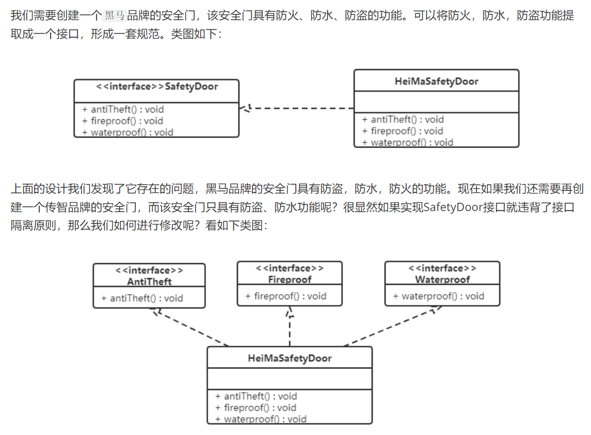

# 面向对象编程

### 定义

面向对象编程，是一种程序设计范式，也是一种编程语言的分类。它以对象作为程序的基本单元，将算法和数据封装其中，程序可以访问和修改对象关联的数据。

### 特性

封装

把客观事物封装成抽象的类，并隐藏实现细节，使得代码模块化。

继承

面向对象编程的另一个重要特性，它提供了一种无需重新编写，使用现有类的所有功能并进行扩展的能力。

多态

指同一操作作用于不同的对象，可以有不同的解释，产生不同的执行结果。

### 理念

接口编程

组合优于继承

### 与面向过程编程比较

1. **核心思想：**
   - 面向过程编程：程序被视为一系列按照特定顺序执行的命令或过程。程序的主要组成部分是函数（或过程），数据和函数是分开的，函数根据输入参数执行操作并返回结果。
   - 面向对象编程：程序被视为一组相互作用的对象，每个对象都包含数据和操作（方法）。程序的主要组成部分是类和对象，数据和操作被封装在对象中，对象之间通过消息传递进行通信。
2. **数据和行为的封装：**
   - 面向过程编程：数据和操作是分开的，函数对数据进行操作。数据被全局访问，可能会导致数据的意外修改或泄漏。
   - 面向对象编程：数据和操作被封装在对象中，对象通过公开的接口（方法）来访问和修改数据，隐藏了内部实现细节，提高了数据的安全性和封装性。
3. **代码重用：**
   - 面向过程编程：代码的重用主要依赖于函数的调用和模块化，需要手动管理函数和数据之间的关系。
   - 面向对象编程：通过继承和组合等机制，可以更灵活地实现代码的重用，可以基于现有类构建新的类，从而减少重复编写代码的工作量。
4. **维护和扩展：**
   - 面向过程编程：在大型项目中，随着功能的增加和需求的变化，程序的维护和扩展变得困难，容易导致代码的混乱和耦合度的增加。
   - 面向对象编程：通过封装、继承和多态等特性，可以更轻松地对程序进行维护和扩展，降低了代码的耦合度，使得程序更易于理解和修改。

总的来说，面向过程编程更加关注数据和函数的操作，适用于简单的、线性的程序设计，而面向对象编程更加注重数据的封装、代码的重用和程序的组织结构，适用于复杂的、大型的软件系统开发。

### 优缺点

#### 优点：

- 一是能和真实的世界交相呼应，符合人的直觉。对象是基于真实世界实体的抽象，比如学生、书籍、车辆等，这些对象都有其属性（如学生的名字、年龄）和行为（如学生的学习、阅读）。这样的设计方式使得我们能够更直观地理解和操作代码，因为它与我们日常生活中的理解方式是一致的。
- 二是代码的可重用性、可扩展性和灵活性很好。这主要得益于OOP的几个主要特性，包括封装、继承和多态。封装可以隐藏对象的内部实现，只暴露出必要的接口，这样可以防止外部的不恰当操作。继承允许我们创建子类来复用和扩展父类的功能，这大大提高了代码的可重用性。多态则允许我们使用同一个接口来操作不同的对象，这提高了代码的灵活性。

#### 缺点：

- 首先，由于代码需要通过对象来抽象，这就增加了一层“代码粘合层”，也就是我们需要创建对象、管理对象的生命周期、处理对象之间的关系等，这使得代码变得更加复杂。对于一些简单的问题，使用面向对象编程可能会有点“杀鸡用牛刀”。
- 其次，面向对象编程中的对象通常都有一些内部状态，而这些状态在并发环境下需要被正确地管理，否则就可能会出现数据不一致、死锁等问题。比如，如果两个线程同时操作同一个对象，而这个对象的状态没有被正确地保护，那么就可能会出现数据不一致的问题。

# UML类图

# 软件设计原则

### 开闭原则

**对扩展开放，对修改关闭**。在程序需要进行拓展的时候，不能去修改原有的代码，实现一个热插拔的效果。简言之，是为了使程序的扩展性好，易于维护和升级。

软件实体（类、模块、函数等）应该对扩展开放，对修改关闭。这意味着当需求变化时，应该通过扩展现有代码而不是修改它来实现变化。

就是使用接口和抽象类，继承和实现，而不是修改

### 里氏代换原则

任何基类可以出现的地方，子类一定可以出现。通俗理解：子类可以扩展父类的功能，但不能改变父类原有的功能。换句话说，子类继承父类时，除添加新的方法完成新增功能外，尽量不要重写父类的方法。

所有的子类都应该能够替换其父类，并且程序不应该产生任何不一致的行为。换句话说，子类应该扩展父类的行为而不是替换它。

如果通过重写父类的方法来完成新的功能，这样写起来虽然简单，但是整个继承体系的可复用性会比较差，特别是运用多态比较频繁时，程序运行出错的概率会非常大。

### 依赖倒转原则

高层模块不应该依赖低层模块，两者都应该依赖其抽象；抽象不应该依赖细节，细节应该依赖抽象。简单的说就是要求对抽象进行编程，不要对实现进行编程，这样就降低了客户与实现模块间的耦合。

面向对象的开发很好的解决了这个问题，一般情况下抽象的变化概率很小，让用户程序依赖于抽象，实现的细节也依赖于抽象。即使实现细节不断变动，只要抽象不变，客户程序就不需要变化。这大大降低了客户程序与实现细节的耦合度。

如：现要组装一台电脑，需要配件cpu，硬盘，内存条。只有这些配置都有了，计算机才能正常的运行。选择cpu有很多选择，如Intel，AMD等，硬盘可以选择希捷，西数等，内存条可以选择金士顿，海盗船等。

### 单一职责原则

对任何类的修改只能有一个原因。换句话说，一个类只应该负责一项职责

SRP要求每个软件模块职责要单一，衡量标准是模块是否只有一个被修改的原因。职责越单一，被修改的原因就越少，模块的内聚性就越高，被复用的可能性就越大，也更容易被理解。

### 接口隔离原则

 不应该强迫客户端依赖于它们不使用的接口。接口应该精简和单一，客户端不应该被迫实现它们不需要的方法。

### 迪米特法则

一个对象应该对其他对象有尽可能少的了解，不应该直接访问其他对象的内部信息。换句话说，对象之间应该保持松耦合的关系。

其含义是：如果两个软件实体无须直接通信，那么就不应当发生直接的相互调用，可以通过第三方转发该调用。其目的是降低类之间的耦合度，提高模块的相对独立性。

迪米特法则中的“朋友”是指：当前对象本身、当前对象的成员对象、当前对象所创建的对象、当前对象的方法参数等，这些对象同当前对象存在关联、聚合或组合关系，可以直接访问这些对象的方法。

### 合成复用原则

首选使用合成/聚合，而不是继承来实现代码的重用。通过组合已有对象的方式来构建新的对象，而不是通过继承已有对象的方式。

通常类的复用分为继承复用和合成复用两种。

继承复用虽然有简单和易实现的优点，但它也存在以下缺点：

1. 继承复用破坏了类的封装性。因为继承会将父类的实现细节暴露给子类，父类对子类是透明的，所以这种复用又称为“白箱”复用。
2. 子类与父类的耦合度高。父类的实现的任何改变都会导致子类的实现发生变化，这不利于类的扩展与维护。
3. 它限制了复用的灵活性。从父类继承而来的实现是静态的，在编译时已经定义，所以在运行时不可能发生变化。

采用组合或聚合复用时，可以将已有对象纳入新对象中，使之成为新对象的一部分，新对象可以调用已有对象的功能，它有以下优点：

1. 它维持了类的封装性。因为成分对象的内部细节是新对象看不见的，所以这种复用又称为“黑箱”复用。
2. 对象间的耦合度低。可以在类的成员位置声明抽象。
3. 复用的灵活性高。这种复用可以在运行时动态进行，新对象可以动态地引用与成分对象类型相同的对象。

# 设计模式

## 创建型模式

用于描述“怎样创建对象”，它的主要特点是“将对象的创建与使用分离”：单例、原型、工厂方法、抽象工厂、建造者

### 单例模式

#### 特点

这种模式涉及到一个单一的类，该类负责创建自己的对象，同时确保只有单个对象被创建。这个类提供了一种访问其唯一的对象的方式，可以直接访问，不需要实例化该类的对象。

#### 结构

* 单例类。只能创建一个实例的类
* 访问类。使用单例类

#### 饿汉式：类加载就会导致该单实例对象被创建	

#### 懒汉式：类加载不会导致该单实例对象被创建，而是首次使用该对象时才会创建

#### 案例

### 工厂模式（简单工厂/工厂方法/抽象工厂）

## 结构型模式

用于描述如何将类或对象按某种布局组成更大的结构：代理、适配器、桥接、装饰、外观、享元、组合

## 行为型模式

用于描述类或对象之间怎样相互协作共同完成单个对象无法单独完成的任务，以及怎样分配职责：模板方法、策略、命令、职责链、状态、观察者、中介者、迭代器、访问者、备忘录、解释器

