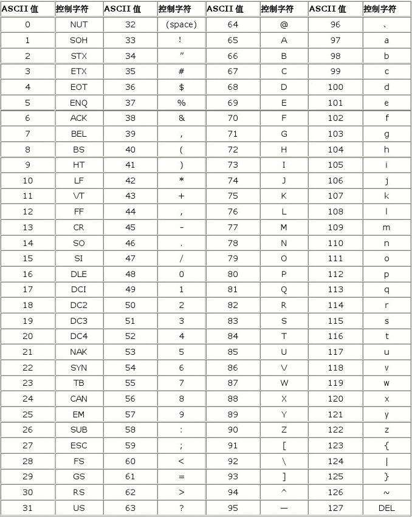
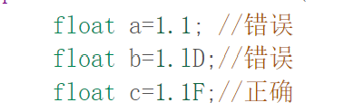
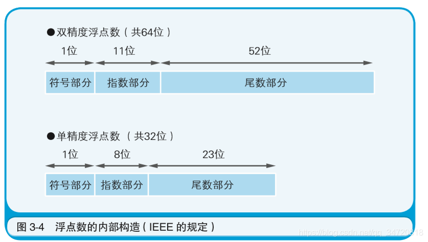

## 基础知识

#### 转义字符

- \n  换行

- \t  制表符

- \r  回车

- \\  输出\

- \'   输出'

- \"  输出"

- 案例

#### 注释

- 单行注释  //                  类内

- 多行注释 /* ... */         类内

- 文档注释/**  ...  */      位于类之间

#### 标识符正确命名

- 数字不能放在开头

- 只有数字，字母，下划线(_) ，美元符号 ($)      可做标识符

- 不能使用关键字，保留字（现在还未使用做关键字，以后可能使用）

#### 包命名规则:

- 必须:

  - 只有数字,字母,下划线,小圆点

  - 不能以数字开头

- 规范(多用小写字母)
  - com.公司名.项目名.业务模块名

#### 标识符规范

[Java 命名规范](https://cloud.tencent.com/developer/article/1896438)

- 包名：
  - 字母都小写

- 类名：
  - 多单词时，单词首字母大写

- 变量名，方法名：
  - 多单词时，第一个单词首字母小写，其余大写

- 常量名：
  - 所有字母大写

#### 输入/输出

输入：

- 基本：

- 字符串：

  - next：空格就结束

  - nextLine：回车才结束

输出：

-   System.out.println();

#### 进制

- 二进制

  - 以 0b   开头

  - 二进制转为其他进制

    - 八进制时：:每三个二进制位表示一个数

    - 十六进制：每四个二进制位表示一个数

    - 十进制：换算成2的次方再和

- 八进制

  - 以 0      开头

  - 八进制转为其他进制

    - 二进制：   每个八进制转为三个二进制；

    - 十六进制：每两个八进制位合成一个位

    - 十进制：换算成8的次方再和

- 十进制

  - 任意非0开头

  - 十进制转为其他进制

    - 二进制：除2，补位时补0

    - 八进制：除8，补位时补0

    - 十六进制：除16，补位时补0

- 十六进制

  - 以 0x    开头

  - 十六进制转为其他进制

    - 二进制：每个十六进制转为四个二进制

    - 八进制：每个十六进制转为两个八进制

    - 十进制：换算成16的次方再和

#### 原码、反码、补码

- 原码：最高进制位表示符号位

- 反码：

  - 正数反码不变

  - 负数反码符号位不变，其余取反（0->1,1->0）

- 补码

  - 正数补码不变

  - 负数补码为反码加一

- 0的补码反码都是0

- 运算时使用补码，表示时使用原码

#### ASCII码

## 数据类型与变量

### 基本数据类型

#### 整形

- 整形1 byte      -128~127

- 整形2 short    

- 整数4 int

- 整形8 long   

  - 声明定义：

    - 使用时数字后面需要"L"或者"l";

    - 没有long时不可用L,否则报错；

#### 浮点

##### 单浮点

4   float 

- 构成：  字符位，小数位，指数位

- 声明定义：

  

  - 后面需要加"f"或者"F"

  - 不能加D;

##### 双浮点

8  double

- 构成：  字符位，小数位，指数位

- 声明定义：

- 存储方式

  - 定点实数存储方式

    - 约定整数位和小数位的存储长度，比如高两位放整数位，低两位存放小数位

    - 优点  方便计算

    - 缺点  存储的数据范围有限

  - 浮点实数存储方式（主流）

    - 用一部分二进制位存放小数点位置，称为“指数域”，其他全部用来存储没有小数点时的数据和符号，称为“数据位”、“符号域”

    - 优点是存储的数据范围更大；缺点是计算比定点实数存储慢些；

    - 80286出现后，有了浮点协处理器，计算实数的效率提升了，浮点实数存储方式得到普及，成为了主流

  - 浮点存储方式

    

    - 原理：浮点数  》转为二进制  》科学计数法(1.xx^n/-1.xx^n)  》保存：符号位、小数位、指数位

  - 精度问题

    - 问题（小数的值只是接近值（小数计算是接近值））

    - 原理：

#### 字符

2  char

- ' 字符 '     里面          就是值

-   数字    转化为      对应的值

-   可以运算和比较（通过ASCII码）

#### 布尔

1  boolean

- 只允许   true  和 false

###   编码

- 整数与字符变化

  - \u....   

  - 0x....

- 中文字符：\u4e00.....\u9fa5

- ASCII码   128

- Unicode  

- utf-8                                     字母1个字节        汉字3个字节

- gdk           (范围很广）  字母1个字节        汉字2个字节

- gd2312     <gbk

- big 5 码  （繁体，台湾，香港）

### 数据类型转换

- 基本数据类型转换

  - 自动类型转换（按精度转换，小转为大）(小的可以赋值给大的）

    - char   >   int    >   long   >   float   >  double

    - byte   >  short   >   int  >  long  >  float  >  double

    - 注意事项：

      

      - char 可以保存整数常量  ，     不能保存变量

      - byte short char 三者只要参与运算，最后值都是int型，尽管是只出现一种

  - 强制类型转换（精度由大变小）  ：造成精度降低或者溢出

    - 只对最近操作数有效               用括号把整个围起来

    - 其他类型不能转为boolean

  - 数组也可以进行转型

- 基本数据类型与String相互转换

  

  - 基本数据类型转为String：String       变量名    =    基本数据类型    +     "";

  - String转为基本数据类型：基本数据类型   变量名   =  基本数据类型.parse数据类型（String变量名）；

### 变量   

- 概念:
  - 可以改变的未知数

- 作用域:含于大括号，存于小括号，有序时从上往下

  - 事项：

    - 同名变量，就近原则；

    - 小范围不能给到大范围，大范围可以给到小范围，注意顺序

- 生存期
  - 变量生存期：只存在于范围空间还未释放

- 注意：
  - 变量必须初始化

### 常量    

- 概念：不可改变的值

## 运算符

- 位运算符（补码运算）

  - <<         算术左移，符号位不变，右边用0补

  - \>>         算术右移，符号位不变，左边用0补

  - <<<       逻辑左移，左边用0补

  - \>>>       逻辑右移，右边用0补

  - a&b     为二进制，对应的值都为1才为1,否则为0

  - a|b       为二进制，对应的值都为1才为1,否则为0

  - ~a         为二进制，对应的值取反

  - a^b       为二进制，对应的值相同取0，相异取1

- 算术运算符

  - +

    - 如果两边是数字，进行加法

    - 如果一边为字符，进行拼接

  - \-

  - *

  - /
    - 如果是整数相除：小数点去掉

  - %

    - 除数不能是小数

    - 本质： a  %  b  =   a  - （int） a  /  b  *  b

    - 10 % -3 =   1    =10-10/3*3

    - 10.5%3 = 1.5  =10.5-10/3*3;

    - 整数%整数a  %  b  =   a  - （int） a  /  b  *  b

    - 整数%小数a  %  b  =   a  - （int） a  /  b  *  b

    - 小数%整数a  %  b  =   a  - （int） a  /  b  *  b

    - 小数%小数a  %  b  =   a  -  a  /  b  *  b

  - ++

    - 前置
      - 在表达式中：先自加，再表达式运算

    - 后置

      - 在表达式中：先表达式运算，再自加

      - 

  - \- -

    - 前置

    - 后置

- 关系运算符

  - <

  - \>

  - ==
    - int、float、double 比较：

  - <=

  - \>=

  - !=

- 逻辑运算符

  - &&     短路与          ：  如果左边错误，就直接停止运行右边

  - ||         短路或          ：  如果左边正确，就直接停止运行右边

  - !          非

  - &        逻辑与          ：  左边错误也不会停止运行右边

  - |         逻辑或           :     左边正确也不会停止运行右边

  - ^        逻辑异或   （相同为假，相异为真）

- 赋值运算符

  - =             

  - +=          a+=b  -> a=a+b

  - -=           a-=b   -> a=a-b

  - *=           a*=b  ->  a=a*b

  - /=

  - %=

  - 特点：

    - 左边必须只是一个变量（左边不能运算）

    - 运算顺序从右往左

    - 复合赋值运算符会进行强制类型转换

- 三元运算符

  - 表达式   ？   结果1     ：  结果2；    true使用结果1，false使用结果2

  - 变量 =  （判断式）？ 结果1 ：结果2

- 运算符优先级

  - 

  - 只有单目跟赋值运算符从右往左

## 控制结构

- 顺序

  - 默认顺序，程序从上往下；

- 条件

  - if

  - if     else if    else

  - if     else

  - switch(值)

    - case    常量：                              满足后，直到遇到break或者执行完后再退出；

    - default:                                           如果没有一个case语句，就执行该语句

    - break;                                             退出switch语句

    - 注意事项

      - 值必须是：byte,short,int,char,enum,String, 枚举  注意不能是浮点型

      - case的常量与值必须同一类型，或者自动转换同一类型；

- 循环

  - for

  - 增强for循环  for(数据类型  变量/对象 ：数据类型数组）

  - while

  - do{...}while();

- break:  

  -  遇到break终止该语句，退出该语句（一个break只跳出一个）

  - 跳转break语句：（类似于c语言goto语句）
    - 如果没有写标明语句，跳转到最近语句

- continue：

  - 遇到continue,本次循环结束，继续执行下次循环

- return：

  - 返回值；