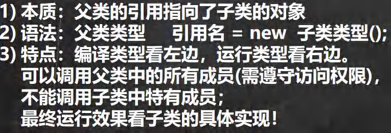

# 封装/继承/多态

## 封装

#### 三大访问权限

- public:任意

- protected:同包和子类
- default:同包

- private:只能类内访问

## 继承

#### 特点:

- 父类中private属性,子类不能访问

- 先调用父类构造器,再构造子类构造器

- 子类不能继承多个父类,只能单继承,但是可以用父类继承祖父来同时继承

- 父类与子类同一名字的属性,优先子类

#### 重写

##### 规范

- 方法名,传参类型一样

- 返回类型一样(不然报错),或者    父类返回类型   是  子类返回类型    的父类

- 子类访问权限大于等于父类(public->protected->private)

##### 与重载区别

## 多态

#### 对象多态:

父类   对象名    =  new    子类();

(父接子)向上

- 同名

  - 同名属性访问父类：   直接访问

  - 同名属性访问子类:      ((子类名)对象名).属性

  - 同名方法访问子类：   直接访问

  - 同名方法访问父类：   （不能访问）只能访问静态     类名.方法

- 非同名:

  - 父类特有:直接访问

  - 子类特有:((子类)对象名).属性

- (子接父)向下

  

  - 同名

    - 属性:

      - 访问子类:直接访问

      - 访问父类:((父类)对象名).属性

    - 方法

      - 访问子类:直接访问

      - 访问父类:静态成员,且((父类)对象名).方法

  - 非同名

    - 访问子类:直接访问

    - 访问父类:((父类)对象名).属性

- 提示:

  - 属性看左边编译类型

  - 非静态方法看运行类型

  - 静态方法看编译类型

- 静态方法
  - 主要看编译时的类

- instanceof方法:
  -    对象   instanceof    类     
    - 如果对象的运行类是右边类或右边的子类

- 动态绑定机制

  - 属性没有动态绑定

  - 方法有动态绑定

  - 运行方法时,属性是看运行类的属性

  - 调用方法与运行类

  - 属性看运行方法所在类

- 多态数组
  - 实现
- 多态参数
  - 

# 高级知识

## 静态

（静态变量）

- 定义：访问修饰符 static  数据类型  变量名；

- 访问：

  - 类名.变量名

  - 对象名.变量名

- 细节：

  - 一个类共用一个数据

  - 不需要初始化

（静态方法）

- 定义：访问修饰符 static  数据类型  方法名

- 细节

  - 当没有静态属性时，跟普通方法没什么区别

  - 方法不能有this,upper等

  - 只能调用静态属性方法，或者是内部属性

- 主方法(main)

  - public:由虚拟机调用，需要用public

  - static:java虚拟机执行main时不需要创建对象

  - String[]  args:该方法接收String类型的数组参数，该数组中保存执行java命令时传递给所运行的类的参数

## 代码块

### 代码块

- 作用：当构造器有重载，且有多个相同语句时，用代码块减少代码重复

- 细节：
  - 每创建一个对象就调用一次普通代码块

- 案例：

### static 代码块 

- 细节

  - 对类进行初始化

  - 类加载时运行（只会运行一次）
    - 类加载：创建对象，创建子类对象，调用静态成员属性，方法

  - 不会随着对象创建而多次运行

  - 静态代码块只能调用静态属性方法，普通代码块可以调用全部属性方法

### 优先级

- 静态代码化，静态属性初始化优先级一样，按定义顺序

- 普通代码块，普通属性初始化优先级一样，按定义顺序

- 静态比普通优先级高

- 静态>父子类>普通>构造器

- 案例

## 重写/重载

- 重写（两同两小一大原则）（子类和父类同名方法）

  - 方法名相同，参数类型相同

  - 子类返回类型小于等于父类方法返回类型， 子类抛出异常小于等于父类方法抛出异常

  - 子类访问权限大于等于父类方法访问权限

- 重载（同类同名方法）

  - 方法名必须相同

  - 参数类型必须不同（参数数目，参数类型，参数顺序）

## final

- 修饰类

  - 作用：不能被继承（没有子类）

- 修饰方法

  - 作用：不能被继承重载（但可以参数重载）

- 修饰属性

  - 作用：该属性初始化后不能被修改

  - 初始化：

    - 普通：可以在定义时，无参方法(有参没有效果)，构造器，代码块中初始化

    - 静态：可以在定义时，无参方法，静态代码块中初始化

# 类类型

## 抽象类

- 类

  - 作用：不用实例化方法

  - 细节：

    - 抽象类不能实例化

    - 抽象类不一定有抽象方法

    - abstract只能修饰类和方法

    - 类继承了抽象类,必须要实现抽象类,除非自己也是抽象类

- 方法

  - 作用：不用实例化，但也不能实例化

  - 细节：
    - 抽象方法不能有static,final,private(即继承类时可以更改)

## 接口

### 细节:

- 可以省略abstract

- 加了default可以具体化方法
  - 案例

- 不能接口实例化对象

- 类可以有多个接口(但是default方法不能同名)

- 所有方法都为public(修饰符默认为public)

- 接口属性都是  static   final  修饰 
  - int a=1;          ==            final static int a=1;

## 内部类

- 定义在外部类局部位置(如方法)

  - 局部内部类

    - 细节:

      - 可以访问外部类属性,方法  (包括private属性,方法)

      - 可以用final修饰类,但不能用修饰符

    - 属性，方法

      - 重名时遵守就近原则

      - 同名属性方法:

        - 内部类属性:直接访问

        - 外部类属性:外部类名.this.属性名;

    - 作用域:

      - 只能在定义他的方法或者该代码块内使用

      - 外部类及其他类不能访问

  - 匿名内部类

    - 特点:
      - 本质是类,内部类,没有名字,还是一个对象

    - 使用场景:
      - 只使用一次类

    - 解释:
      - 类似与某类子类,后面{}加的是子类内容

    - 模板:
      - 1

    - 调用：

      - 重写同名方法，调用匿名内部类（直接访问是匿名内部类）

      - 访问外部类方法需要： 类名.this.成员；

    - 细节:
      - 运行类型改变

- 定义在外部类成员位置

  - 成员内部类

    - 模板

    - 细节：

      - 外部类与内部类重名遵循就近原则

        - 内部类访问外部类： 外部类名.this.属性；

        - 外部不可以访问内部类同名属性；

      - 内部类可以访问外部成员属性

      - 外部类可以访问内部类

      - 其他类可以访问内部类

        - 创建外部类对象

        - 外部类名.内部类名      内部类对象名    =      外部对象名.new   内部类名（）；

    - 

  - 静态内部类

    - 模板

    - 访问：

      - 可以访问外部类静态成员；
        - 外部类名.外部静态属性

      - 外部类可以创建一个对象访问；

      - 外部其他类访问内部类

  - 外部其他类访问静态内部类与外部类区别

    - 由于静态内部类对于外部类只允许静态访问，所以可以用 外部类名.内部类名建立

    - 成员内部类非静态，具体到某个对象，不能用外部类名创建，需具体到对象

## 枚举类

### class

- 定义

- 调用：类名.对象.属性

- 细节

  - 构造器私有化

  - 创建public final static 类  代替枚举常量

### enum

- 定义:

- 调用: 类名.枚举常量(.属性)

- 应用：

- 常用方法

  

  - values

  - valueOf

- 细节

  - 枚举对象要放前面，不然会报错

  - 不需要new，直接枚举名.枚举常量调用

  - 构造器私有化

  - javap反编译

  - 不允许enum类作为父类继承，也不允许继承父类

  - 可以实现接口

## 泛型

- 调用泛型

  - C<A> c1=new C<A>();

  - C<A> c2=new C<>();（可以不用写后面，且经常这么用）

- 创建泛型

  - interface    接口名<T>   

  - class     类名<T>

  - class     类名<T1,T2>

- 细节

  - 只能是引用类型,不能是基本类型（     int      double   等不可以）

  - 可以传入子类对象

  - 泛型类可以继承泛型类

- 限制泛型可用类型                  class  类名<T extends anyClass>

- 类型通配符 ？                            

  - 限制

    - 类名<？ extends   List> a=null

    - a     =  new<ArrayList>();

  - 无限制
    - 类名<?>   b＝a;

  - 注意:
    - 通配符实例化的对象不能加入新信息，只能获取和删除

- 自定义

  - 自定义类

    - 使用泛型数组，不能初始化

    - 静态方法中不能使用该类的泛型(因为此时类还没有对象化，但是静态方法不需要建立对象就可以调用)

    - 没有指定类型，默认为Object

  - 自定义接口

    - 静态成员不能有泛型

    - 继承和实现接口时确定泛型

  - 自定义泛型方法

    - 细节：其泛型的字符不能跟类的泛型冲突

    - 语法

    - 可以不需要引入数据类型