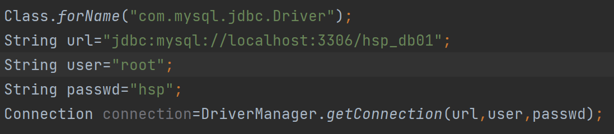
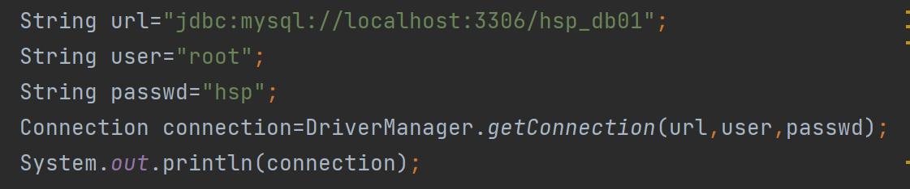
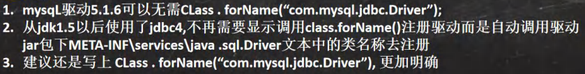
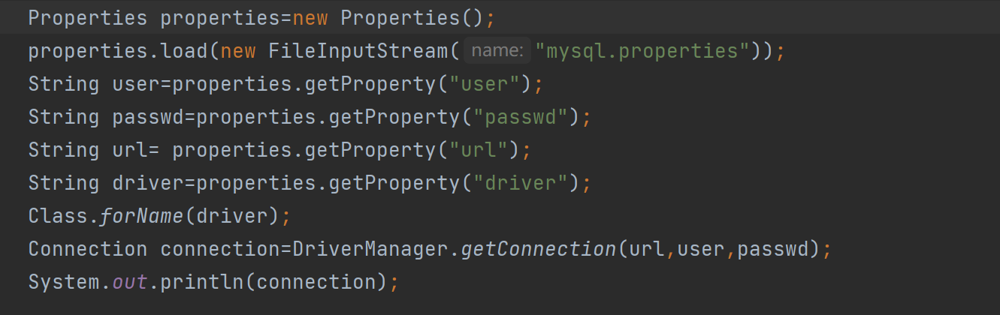

# JDBC基础

- 意义

  - 原理

- 步骤

  - 关键步骤

  - 注册驱动

    - 1设置jar包导入

      - 1

      - 2.unitted+依赖+“+”

      - jar

    - 2将mysql包加入到项目中

      - 放入到项目下

      - 加入到项目库中

  - JAVA连接数据库

    - Driver driver = new Driver(); （new com.mysql.jdbc.Driver().var）

    - String url = "jdbc:mysql://地址:端口/数据库";
      - 地址：[localhost](http://localhost/) 或者 ip地址

    - 将号码跟密码放入到Properties中

      - Properties properties=new Properties();

      - properties.setProperty("user","root");

      - properties.setProperty("password","hsp");

    - Connection connect = driver.connect(url, properties);

  - JAVA发送语句

    - 创建statement语句
      - Statement statement=connect.createStatement();

    - 创建mysql语句
      - String sql="...";

    - 执行mysql
      - statement.executeUpdate(sql);

  - 返回处理结果

    - int a=statement.executeUpdate(sql);

    - System.out.println(a);

  - 关闭

    - statement.close();

    - connect.close();

- 连接方式：

  - 1（创建Driver对象，再根据字符串跟properties创建）

  - 2（使用反射加载Driver类）

  - 3（使用了DriverManager类）

  - 4（推荐）

    

    

    

    - 类自动加载

  - 5  强烈推荐（配置文件）

# 常用类和接口

- DriverManager（数据库驱动）

  - 连接数据库：
    - getConnection(String url,String user,String passwd)

  - 获取驱动程序试图登录到某一个数据库时可以等待的最长时间，以秒为单位
    - setLoginTimeout()

  - 将一条信息打印到当前JDBC日志流中
    - println(String message)

- Connection（连接）

  - createStatement()
    - 创建 Statement对象

  - createStatement(int resultSetType,int resultSetConcurrency)
    - 创建一个Statement对象，该对象将生成具有给定类型、并发性和可保存性的ResultSet对象

  - preparedStatement()
    - 创建预处理对象 preparedStatement

  - isReadOnly()
    - 查看当前Connection 对象的读取模式是否为只读形式

  - setReadOnly()
    - 设置当前Connection 对象的读写模式，默认是非只读模式

  - commit()
    - 使所有上一次提交/回滚后进行的更改成为持久更改，并释放此Connection 对象当前持有的所有数据库锁

  - roolback()
    - 取消在当前事务中进行的所有更改，并释放此Connection 对象当前持有的所有数据库锁

  - close()
    - 立即释放此Connection 对象的数据库和JDBC资源，而不是等待它们被自动释放

- Statement（发送语句）（静态执行）

  - 基本介绍

  - execute(String sql)
    - 执行静态的SELECT语句，该语句可能返回多个结果集执行给定的SQL语句，

  - executeUpdate()
    - 执行前面包含的参数的动态INSERT、UPDATE 或DELETE 语句

  - executeQuery(String sql)
    - 执行指定的SQL语句,该语句返回单个ResultSet对象

  - executeBatch()
    - 将一批命令提交给数据库来执行，如果全部命令执行成功，则返回更新计数组成的数组。数组元素的排序与SQL语句的添加顺序对应

  - clearBatch()
    - 清空此 Statement对象的当前SQL命令列表

  - addBatch(String sql)
    - 将给定的SQL命令添加到此 Statement对象的当前命令列表中。如果驱动程序不支持批量处理，将抛出异常

  - close()
    - 释放 Statement实例占用的数据库和JDBC资源

- PreparedStatement           （动态执行）

  - 基本介绍

  - 预处理

  - 案例：

  - setInt(int index, int k)
    - 将指定位置的参数设置为int值

  - setFloat(int index, float f)
    - 将指定位置的参数设置为float值

  - setLong(int index,long I)
    - 将指定位置的参数设置为long值

  - setDouble(int index,double d)
    - 将指定位置的参数设置为double 值

  - setBoolean(int index, boolean b)
    - 将指定位置的参数设置为boolean 值

  - setDate(int index, date date)
    - 将指定位置的参数设置为对应的date值

  - setString(int index String s)
    - 将指定位置的参数设置为对应的String 值

  - setNull(int index,intsqlType)
    - 将指定位置的参数设置为SQL NULL

  - executeQueryO
    - 在此PreparedStatement 对象中执行 SQL查询，并返回该查询生成的ResultSet对象

  - executeUpdate()
    - 执行前面包含的参数的动态INSERT、UPDATE 或DELETE 语句

  - clearParameters()
    - 清除当前所有参数的值

- Statement和PreparedStatement区别

  - Statement

    - 优点：sql语句执行一次时，减少代码量

    - 缺点：sql注入问题
      - 用户输入的数据被当成sql语句（被黑客用恶意的sql语句注入攻击）

  - PreparedStatement优点

    - 优点：

      - sql语句执行多次时，不用重复执行语句

      - 防止sql注入问题，输入的值都被当成属性

    - 缺点：
      - 执行一次时，代码繁琐

- ResultSet（暂时存放查询结果）

  - 基本介绍
    - 光标开始在第一行前面，next指向下一行，如果没有返回false

  - 获取

    - getInt()
      - 以int形式获取此 ResultSet对象的当前行的指定列值。如果列值是 NULL，则返回值是0

    - getFloat()
      - 以float形式获取此 ResultSet对象的当前行的指定列值。如果列值是 NULL，则返回值是0

    - getDate()
      - 以data 形式获取 ResultSet对象的当前行的指定列值。如果列值是NULL，则返回值是null

    - getBoolean()
      - 以boolean 形式获取 ResultSet对象的当前行的指定列值。如果列值是NULL，则返回null

    - getString()
      - 以String形式获取 ResultSet 对象的当前行的指定列值。如果列值是 NULL，则返回null

    - getObject()
      - 以Object 形式获取 ResultSet对象的当前行的指定列值。如果列值是NULL，则返回null

    - 注意：当参数是整数时，1表示第1列，以此递推

  - 更新

    - updateInt()
      - 用int值更新指定列

    - updateFloat()
      - 用float值更新指定列

    - updateLong()
      - 用指定的long值更新指定列

    - updateString()
      - 用指定的String值更新指定列

    - updateObject()
      - 用Object值更新指定列

    - updateNull()
      - 将指定的列值修改为NULL

    - updateDate()
      - 用指定的date值更新指定列

    - updateDouble()
      - 用指定的double值更新指定列

  - 指针

    - first()
      - 将指针移到当前记录的第一行

    - last()
      - 将指针移到当前记录的最后一行

    - next()
      - 将指针向下移一行

    - beforeFirst()
      - 将指针移到集合的开头（第一行位置）

    - afterLast()
      - 将指针移到集合的尾部（最后一行位置）

    - absolute(int index)
      - 将指针移到ResultSet给定编号的行

    - isFrist()
      - 判断指针是否位于当前ResultSet 集合的第一行。如果是返回true，否则返回false

    - isLast()
      - 判断指针是否位于当前ResultSet 集合的最后一行。如果是返回true，否则返回false

  - 行

    - getrow()
      - 查看当前行的索引号

    - insertRow()
      - 将插入行的内容插入数据库

    - updateRow()
      - 将当前行的内容同步到数据表

    - deleteRow()
      - 删除当前行，但并不同步到数据库中，而是在执行close0方法后同步到数据库

# JDBC应用

- 处理执行后信息

  - 添加、删除、修改（executeUpdate）

  - 查询（executeQuery   ResultSet）

- JDBC工具类

  - 意义：减少频繁的使用连接关闭sql语句

  - 案例

  - 将连接封装

  - sql语句

  - 将关闭封装

- 连接池（连接）

  - 传统连接

    - 弊端：多次连接会耗时较大，且造成数据库崩溃

    - 原因：

  - 连接池

    - 分类

    - C3P0

      - 细节
        - 使用前需要引入jar包

      - 普通方式

        - 创建连接池
          - ComboPooledDataSource comboPooledDataSource = new ComboPooledDataSource();

        - 配置连接池

          - comboPooledDataSource.setDriverClass(driver);

          - comboPooledDataSource.setJdbcUrl(url);

          - comboPooledDataSource.setUser(user);

          - comboPooledDataSource.setPassword(password);

        - 设置连接数

          - 初始化连接数
            - comboPooledDataSource.setInitialPoolSize(10);

          - 最大连接数
            - comboPooledDataSource.setMaxPoolSize(50);

        - 连接数据库
          - Connection connection = comboPooledDataSource.getConnection();

        - 关闭连接
          - connection.close();

        - 关闭连接池
          - comboPooledDataSource.close();

        - 案例

      - 配置文件方式

        - 配置文件

        - 创建连接池（自动配置）
          - ComboPooledDataSource comboPooledDataSource = new ComboPooledDataSource("configName");

        - 创建连接
          - Connection connection = comboPooledDataSource.getConnection();

        - 关闭连接
          - connection.close();

        - 案例

    - Druid（德鲁伊）（强烈推荐）

      - 步骤

        - 添加 jar包

        - 添加配置文件

        - 创建properties

          - Properties properties = new Properties();

          - properties.load(new FileInputStream("druid.properties"));

        - 创建连接池
          - DataSource dataSource = DruidDataSourceFactory.createDataSource(properties);

        - 创建连接
          - Connection connection = dataSource.getConnection();

        - 关闭连接、池
          - connection.close();

        - 案例

      - 工具类

        - 创建DataSource
          - private static DataSource ds;

        - 配置

        - 实现连接

        - 关闭连接

        - 案例

- 事务

  - 步骤

    - 开始事务：                    connection.setAutoCommit(false);

    - 保存事务点：

    - 回退事务：

    - 回退全部事务：          connection.rollback();

    - 提交事务：                    connection.commit();

  - 案例

- 批处理（batch）（大量处理）

  - 意义：

    - 成批处理数据时，使用批量处理效率更高

    - 批量处理与预处理搭配可以减少编译次数，减少运行次数，效率大大提高

  - 使用：

    - addBatch()                  添加批量处理的SQL语句和参数

    - executeBatch()         执行批量处理包

    - clearBatch()               清空批量处理包

    - 案例

  - 原理：
    - addbatch创建一个数组(elementData)，把每个sql语句放入数组中

  - 细节：
    - 成批处理前需要在JDBC连接MySQL的语句中的url后面加：
      - ?rewriteBatchedStatements=true

- Apache_DBUtils（查找）

  - 意义：

    - 问题：

    - 优点：关闭端口后数据仍可调用

  - 传统方法：
    - 自己创建对象，用ArrayList数组进行管理

  - 基本介绍
    - 

  - 步骤

    - 调用jar包

    - 创建对象（属性，无参构造，有参构造，get,set,toString函数)

    - 创建QueryRunner对象
      - QueryRunner queryRunner=new QueryRunner();

    - 创建List

      - List<Name> query = queryRunner.query(connection, sql, new BeanListHandler<>(Name.class)[,....元素]);

        - connection为连接

        - BeanListHandler表示返回List链表，元素为Name对象

        - 后面可以跟预处理元素

    - 案例

  - 方法

    - ArrayHandler
      - 把结果集中的第一行数据转成对象数组。

    - ArrayListHandler
      - 把结果集中的每一行数据都转成一个数组，再存放到List中。

    - BeanHandler
      - 将结果集中的第一行数据封装到一个对应的JavaBean实例中。

    - BeanListHandler
      - 将结果集中的每一行数据都封装到一个对应的JavaBean实例中，存放到List里。

    - ColumnListHandler
      - 将结果集中某一列的数据存放到List中。

    - KeyedHandler（name）
      - 将结果集中的每行数据都封装到Map里，再把这些map再存到一个map里，其key为指定的key

    - MapHandler
      - 将结果集中的第一行数据封装到一个Map里，key是列名，value就是对应的值。

    - MapListHandler
      - 将结果集中的每一行数据都封装到一个Map里，然后再存放到List

- BasicDao（框架）

  - 定义

  - utils（工具类）

  - domain（详细类）
    - 类

  - dao（mysql语句增删改查）

    - basicdao

    -    ......dao

  - test（测试类）