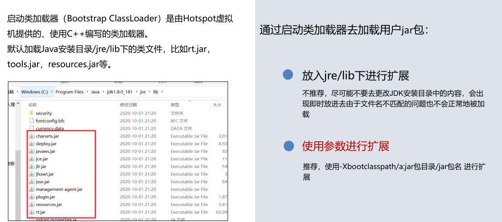

# JVM基础

### 黑马在线笔记

https://lisxpq12rl7.feishu.cn/wiki/F2AFw0doOiW89Fkr8kGcCTyVnLh

### JVM介绍

#### JVM定义

JVM 全称是 Java Virtual Machine，中文译名 Java虚拟机，是一个运行在计算机上的程序，他的职责是运行Java字节码文件

#### JVM的三大核心功能

JVM 包含内存管理、解释执行虚拟机指令、即时编译三大功能

#### JVM类型

##### HotSpot

SUN的JDK版本从1.3.1开始运用HotSpot虚拟机， 2006年底开源，主要使用C++实现，JNI接口部分用C实现。
HotSpot是较新的Java虚拟机，使用JIT(Just in Time)编译器，可以大大提高Java运行的性能。 
Java原先是把源代码编译为字节码在虚拟机执行，这样执行速度较慢。而HotSpot将常用的部分代码编译为本地(原生，native)代码，这样显着提高了性能。 
HotSpot JVM 参数可以分为规则参数(standard options)和非规则参数(non-standard options)。 规则参数相对稳定，在JDK未来的版本里不会有太大的改动。 非规则参数则有因升级JDK而改动的可能。

### Java生态框架

#### JDK发展历程

2000年，JDK 1.3发布，Java HotSpot Virtual Machine正式发布，成为Java的默认虚拟机。
2002年，JDK 1.4发布，古老的Classic虚拟机退出历史舞台。
2003年年底，Java平台的Scala正式发布，同年Groovy也加入了 Java阵营。
2006年，JDK 6发布。同年，Java开源并建立了 OpenJDK。顺理成章，Hotspot虚拟机也成为了 OpenJDK中的默认虚拟机。
2007年，Java平台迎来了新伙伴Clojure。
2008 年，Oracle 收购了 BEA,得到了 JRockit 虚拟机。
2009年，Twitter宣布把后台大部分程序从Ruby迁移到Scala，这是Java平台的又一次大规模应用。
2010年，Oracle收购了Sun，获得Java商标和最具价值的HotSpot虚拟机。此时，Oracle拥有市场占用率最高的两款虚拟机HotSpot和JRockit，并计划在未来对它们进行整合：HotRockit.  JCP组织管理：Java语言
2011年，JDK7发布。在JDK 1.7u4中，正式启用了新的垃圾回收器G1。
2017年，JDK9发布。将G1设置为默认GC，替代CMS (被标记为Deprecated)
同年，IBM的J9开源，形成了现在的Open J9社区
2018年，Android的Java侵权案判决，Google赔偿Oracle计88亿美元
同年，JDK11发布，LTS版本的JDK,发布革命性的ZGC,调整JDK授权许可
2019年，JDK12发布，加入RedHat领导开发的Shenandoah GC

#### Oracle与OpenJDK之间的主要区别

1. Oracle JDK版本将每三年发布一次LTS版本，而OpenJDK版本每三个月发布一次。
2. Oracle JDK将更多地关注稳定性，它重视更多的企业级用户，而OpenJDK经常发布以支持其他性能，这可能会导致不稳定。
3. Oracle JDK支持长期发布的更改，而Open JDK仅支持计划和完成下一个发行版。
4. Oracle JDK根据二进制代码许可协议获得许可，而OpenJDK根据GPL v2许可获得许可。 使用Oracle平台时会产生一些许可影响。如Oracle 宣布的那样，在没有商业许可的情况下，在2019年1月之后发布的Oracle Java SE 8的公开更新将无法用于商业，商业或生产用途。但是，OpenJDK是完全开源的，可以自由使用。
5. Oracle JDK的构建过程基于OpenJDK，因此OpenJDK与Oracle JDK之间没有技术差异。
6. 顶级公司正在使用Oracle JDK，例如Android Studio，Minecraft和IntelliJ IDEA开发工具，其中Open JDK不太受欢迎。
7. Oracle JDK具有Flight Recorder，Java Mission Control和Application Class-Data Sharing功能，Open JDK具有Font Renderer功能，这是OpenJDK与Oracle JDK之间的显着差异。
8. Oracle JDK具有良好的GC选项和更好的渲染器，而OpenJDK具有更少的GC选项，并且由于其包含自己的渲染器的分布，因此具有较慢的图形渲染器选项。
9. 在响应性和JVM性能方面，Oracle JDK与OpenJDK相比提供了更好的性能。
10. 与OpenJDK相比，Oracle JDK的开源社区较少，OpenJDK社区用户的表现优于Oracle JDK发布的功能，以提高性能。
11. 如果使用Oracle JDK会产生许可影响，而OpenJDK没有这样的问题，并且可以以任何方式使用，以满足完全开源和免费使用。
12. Oracle JDK在运行JDK时不会产生任何问题，而OpenJDK在为某些用户运行JDK时会产生一些问题。
13. 根据使用方的使用和许可协议，现有应用程序可以从Oracle JDK迁移到Open JDK，反之亦然。
14. Oracle JDK将从其10.0.X版本将收费，用户必须付费或必须依赖OpenJDK才能使用其免费版本。
15. Oracle JDK不会为即将发布的版本提供长期支持，用户每次都必须通过更新到最新版本获得支持来获取最新版本。
16. Oracle JDK以前的1.0版以前的版本是由Sun开发的，后来被Oracle收购并为其他版本维护，而OpenJDK最初只基于Java SDK或JDK版本7。
17. Oracle JDK发布时大多数功能都是开源的，其中一些功能免于开源，并且根据Sun的许可授权，而OpenJDK发布了所有功能，如开源和免费。
18. Oracle JDK完全由Oracle公司开发，而Open JDK项目由IBM，Apple，SAP AG，Redhat等顶级公司加入和合作。

### JVM组成框架图

最上层：javac编译器将编译好的字节码class文件，通过java 类装载器执行机制，把对象或class文件存放在 jvm划分内存区域。
中间层：称为Runtime Data Area，主要是在Java代码运行时用于存放数据的，从左至右为方法区(永久代、元数据区)、堆(共享,GC回收对象区域)、栈、程序计数器、寄存器、本地方法栈(私有)。
最下层：解释器、JIT(just in time)编译器和 GC（Garbage Collection，垃圾回收器）

### JVM执行流程

# JVM知识体系

## class字节码文件

### 工具

#### javap

javap是JDK自带的反编译工具，可以通过控制台查看字节码文件的内容。适合在服务器上查看字节码文件内
容。
直接输入javap查看所有参数。
输入javap -v 字节码文件名称 查看具体的字节码信息。（如果jar包需要先使用 jar –xvf 命令解压）

#### jclasslib

idea插件

#### 阿里arthas

Arthas 是一款线上监控诊断产品，通过全局视角实时查看应用 load、内存、gc、线程的状态信息，并能在不修改应用代码的情况下，对业务问题进行诊断，大大提升线上问题排查效率

官网：https://arthas.aliyun.com/doc/

dump

dump已加载类的字节码文件到特定目录

jad

反编译已加载类的源码

### 组成

#### 基本信息

##### Magic魔数

文件是无法通过文件扩展名来确定文件类型的，文件扩展名可以随意修改，不影响文件的内容。  

软件使用文件的头几个字节（文件头）去校验文件的类型，如果软件不支持该种类型就会出错。 

Java字节码文件中，将文件头称为magic魔数（CAFEBABE）

##### 主副版本号

主版本号= x-44

主副版本号指的是编译字节码文件的JDK版本号，主版本号用来标识大版本号，副版本号是当主版本号相同时作为区分不同 版本的标识，一般只需要关心主版本号

版本号的作用主要是判断当前字节码的版本和运行时的JDK是否兼容

#### 常量池（名字+字符常量）

常量池是一组常量的集合，包括字面量和符号引用。这些常量包括类名、字段名、方法名、接口名、字符串常量等。字节码中的其他字段引用了常量池中的常量

#### 字段表（变量）

包含了当前类中所有的字段信息，包括字段的访问标志、名称、描述符以及其他相关信息

#### 方法信息（Method Information）

方法信息包含了类中定义的所有方法的信息，包括方法的访问标志、名称、描述符、方法体等。

#### 属性信息(Attribute Information)

属性信息包含了与类、字段或方法相关联的各种属性信息，比如源文件信息、注解信息、代码行号信息等。

## 类加载器

### 分类

1. **启动类加载器（Bootstrap ClassLoader）**：
   - 启动类加载器是最顶层的类加载器，负责加载 Java 的核心类库，包括 `java.lang` 包中的类等。它是由 C++ 编写并由 JVM 自身实现的，通常无法直接在 Java 代码中获取对启动类加载器的引用。
   - 启动类加载器是 JVM 的一部分，不是 Java 类，因此无法在 Java 代码中直接引用。
2. **扩展类加载器（Extension ClassLoader）**：
   - 扩展类加载器负责加载 Java 的扩展库，位于 `$JAVA_HOME/lib/ext` 目录中的类库。它主要加载 Java 标准扩展中的类，以及通过系统属性 `java.ext.dirs` 指定的目录中的类。
   - 在 Java 中，可以通过 `ClassLoader.getSystemClassLoader().getParent()` 来获取对扩展类加载器的引用。
3. **系统类加载器/应用类加载器（System/ Application ClassLoader）**：
   - 系统类加载器负责加载应用程序类路径（classpath）上的类，即应用程序自身的类。它通常是用户自定义的类加载器的父加载器。
   - 在 Java 中，可以通过 `ClassLoader.getSystemClassLoader()` 来获取对系统类加载器的引用。
4. **用户自定义类加载器（User-Defined ClassLoader）**：
   - 用户自定义类加载器是由开发人员根据需要自行编写的类加载器，通过继承 `ClassLoader` 类来实现。它可以加载指定位置的类文件，实现特定的加载策略，如从数据库、网络等动态获取类文件。
   - 用户自定义类加载器可以用于实现一些特殊的类加载需求，如热部署、插件化等。

#### 启动类加载器

#### 扩展类加载器

#### 应用程序类加载器

### 双亲委派机制

双亲委派机制指的是：当一个类加载器接收到加载类的任务时，会自底向上查找是否加载过，

再由顶向下进行加载。

#### 作用

1.保证类加载的安全性。通过双亲委派机制避免恶意代码替换JDK中的核心类库，比如java.lang.String，确保核心类库的完整性和安全性。

2.避免重复加载。双亲委派机制可以避免同一个类被多次加载。

## 运行时数据区

1. 程序计数器（Program Counter）：
   - 每个线程都有自己的程序计数器，用于指示当前线程执行的字节码指令地址。
   - 在多线程环境下，程序计数器为了线程切换后能够恢复到正确的执行位置而存在。
2. 虚拟机栈（VM Stack）：
   - 每个线程都有自己的虚拟机栈，用于存储方法的局部变量、操作数栈、动态链接、方法出口等。
   - 每个方法在执行时会创建一个栈帧（Stack Frame）存放在虚拟机栈中，方法执行结束时栈帧被弹出。
3. 本地方法栈（Native Method Stack）：
   - 与虚拟机栈类似，用于执行本地方法（Native Method）的栈区域。
4. 方法区（Method Area）：
   - 存储类的结构信息，例如类的元数据（Metadata）、静态变量、常量、方法字节码等。
   - 方法区是所有线程共享的内存区域。
5. 堆（Heap）：
   - 存储对象实例以及数组。
   - 在堆中分配的对象实例由垃圾回收器负责管理。
   - 堆是Java内存管理的核心区域。

### jdk6、jdk7、jdk8区别

### 方法区

#### 内容

##### 类的元信息，保存了所有类的基本信息

##### 运行时常量池，保存了字节码文件中的常量池内容

##### 字符串常量池，保存了字符串常量

### 字符串常量池

## 垃圾回收机制

# JVM原理

## jvm启动与退出

#### 虚拟机的启动

Java虚拟机的启动是通过引导类加载器(bootstrap class loader)创建一个初始类(initial class)来完成的，这个类是由虚拟机的具体实现指定的。

#### 虚拟机的退出

有如下的几种情况：
某线程调用Runtime类或System类的exit方法，或 Runtime类的halt方法，并且Java安全管理器也允许这次exit或halt操作。
程序正常执行结束
程序在执行过程中遇到了异常或错误而异常终止
由于操作系统出现错误而导致Java虚拟机进程终止

## 类的生命周期

### 1、加载

1、加载(Loading)阶段第一步是类加载器根据类的全限定名通过不同的渠道以二进制流的方式获取字节码信息。程序员可以使用Java代码拓展的不同的渠道。

2、类加载器在加载完类之后，Java虚拟机会将字节码中的信息保存到方法区中。

3、类加载器在加载完类之后，Java虚拟机会将字节码中的信息保存到内存的方法区中。
生成一个InstanceKlass对象，保存类的所有信息，里边还包含实现特定功能比如多态的信息。

 4、同时，Java虚拟机还会在堆中生成一份与方法区中数据类似的java.lang.Class对象。
作用是在Java代码中去获取类的信息以及存储静态字段的数据（JDK8及之后）。

5、对于开发者来说，只需要访问堆中的Class对象而不需要访问方法区中所有信息。这样Java虚拟机就能很好地控制开发者访问数据的范围。

### 2、连接

#### （1）验证：

验证的主要目的是检测Java字节码文件是否遵守了《Java虚拟机规范》中的约束。这个阶段一般不需要程序员参与。

主要包含如下四部分，具体详见《Java虚拟机规范》：

1.文件格式验证，比如文件是否以0xCAFEBABE开头，主次版本号是否满足当前Java虚拟机版本要求。

2.元信息验证，例如类必须有父类（super不能为空）。

3.验证程序执行指令的语义，比如方法内的指令执行到一半强行跳转到其他方法中去。

4.符号引用验证，例如是否访问了其他类中private的方法等。

#### （2）准备：

准备阶段为静态变量（static）分配内存并设置初始值

准备阶段只会给静态变量赋初始值，而每一种基本数据类型和引用数据类型都有其初始值

final修饰的基本数据类型的静态变量，准备阶段直接会将代码中的值进行赋值

#### （3）解析：

解析阶段主要是将常量池中的符号引用替换为直接引用。
直接引用不在使用编号，而是使用内存中地址进行访问具体的数据。

### 3、初始化

初始化阶段会执行静态代码块中的代码，并为静态变量赋值。
初始化阶段会执行字节码文件中clinit部分的字节码指令。

clinit指令在特定情况下不会出现，比如：如下几种情况是不会进行初始化指令执行的。
1.无静态代码块且无静态变量赋值语句。
2.有静态变量的声明，但是没有赋值语句。
3.静态变量的定义使用final关键字，这类变量会在准备阶段直接进行初始化。

直接访问父类的静态变量，不会触发子类的初始化。
子类的初始化clinit调用之前，会先调用父类的clinit初始化方法。

### 小总结

### 4、使用

### 5、卸载

# JVM概括

## 内存

### 栈内存（jvm内）

#### 	虚拟机栈

​		局部变量

​		局部类

#### 	本地方法栈

​		c++方法

### 堆内存（jvm内）

#### 	堆

​		对象及其属性

​		静态属性

#### 	字符串常量池(jdk7.8.9)

​		字符串常量

​		jdk6之前位于永久代，jdk789位于堆内存，jdk10之后位于元空间

### 直接内存（操作系统内存）（元空间）

#### 	方法区

​		类元信息

​		运行时常量池

​			常量（如 `int`、`byte`、`short`、`long`、`char`、`float`、`double`）

