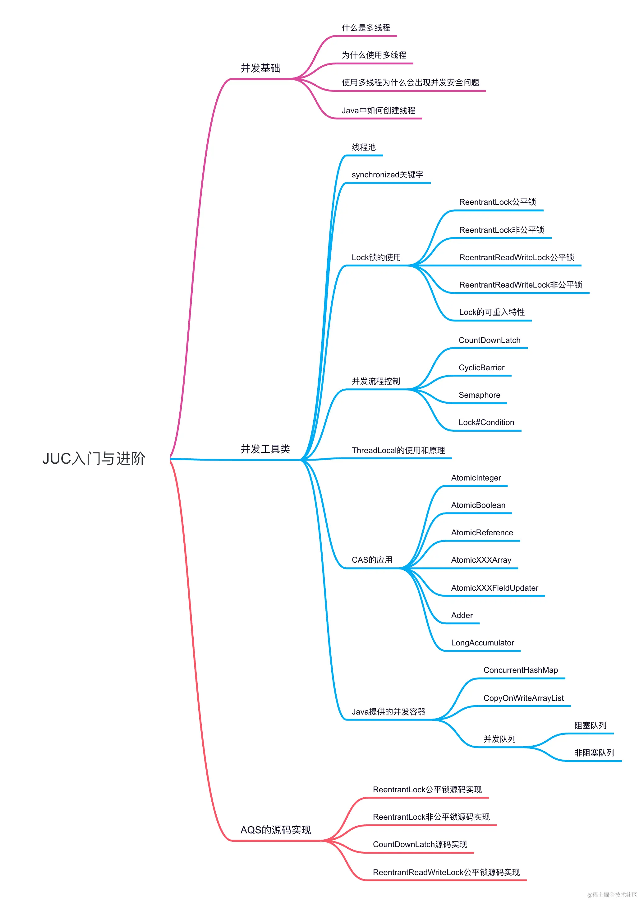
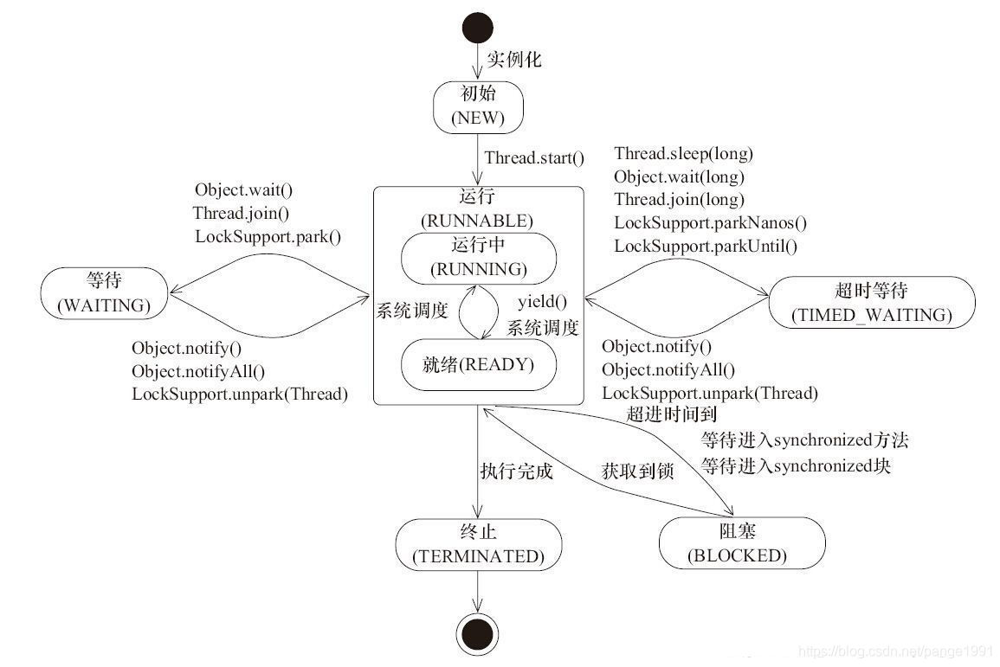
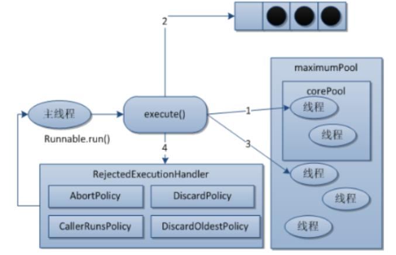
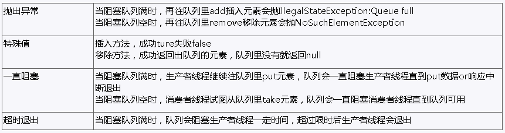

## 多线程

### 理论

#### （1）线程状态



- 初始(NEW)：新创建了一个线程对象，但还没有调用start()方法

- 运行(RUNNABLE)：Java线程中将就绪（ready）和运行中（running）两种状态笼统的称为“运行”

  - 线程对象创建后，其他线程(比如main线程）调用了该对象的start()方法。该状态的线程位于可运行线程池中，等待被线程调度选中，获取CPU的使用权，此时处于就绪状态（ready）

  - 就绪状态的线程在获得CPU时间片后变为运行中状态（running）

- 阻塞(BLOCKED)：表示线程阻塞于锁

- 等待(WAITING)：进入该状态的线程需要等待其他线程做出一些特定动作（通知或中断）

- 超时等待(TIMED_WAITING)：该状态不同于WAITING，它可以在指定的时间后自行返回

- 终止(TERMINATED)：表示该线程已经执行完毕

#### （2）runnable 和 callable 区别

Runnable 接口run方法没有返回值

Callable接口call方法有返回值，是个泛型，和Future、FutureTask配合可以用来获取异步执行的结果

Callable接口的call()方法允许抛出异常；而Runnable接口的run()方法的异常只能在内部消化，不能继续上抛

### 语法

#### 线程创建方式

##### **继承Thread类**：

这种方式需要创建一个类，继承自Thread类，并重写其run()方法来定义线程的执行逻辑。然后可以创建该类的实例并调用start()方法启动线程。

```
class MyThread extends Thread {
    public void run() {
        // 线程执行的逻辑
    }
}

MyThread thread = new MyThread();
thread.start();
```

##### **实现Runnable接口**：

这种方式需要创建一个类，实现Runnable接口，并实现其run()方法来定义线程的执行逻辑。然后可以创建该类的实例并将其作为参数传递给Thread类的构造函数，最后调用start()方法启动线程。

```
class MyRunnable implements Runnable {
    public void run() {
        // 线程执行的逻辑
    }
}

Thread thread = new Thread(new MyRunnable());
thread.start();
```

##### **实现Callable接口**：

与Runnable接口类似，但Callable接口的call()方法可以返回结果或抛出异常。可以通过FutureTask类包装Callable对象，然后传递给Thread类进行启动。

```
class MyCallable implements Callable<Integer> {
    public Integer call() {
        // 线程执行的逻辑
        return result;
    }
}

FutureTask<Integer> futureTask = new FutureTask<>(new MyCallable());
Thread thread = new Thread(futureTask);
thread.start();
```

##### **线程池创建**：

使用线程池可以管理和复用线程，避免频繁创建和销毁线程带来的性能开销。可以通过Executors工厂类来创建不同类型的线程池，如FixedThreadPool、CachedThreadPool、ScheduledThreadPool等。

```
ExecutorService executor = Executors.newFixedThreadPool(5);
executor.execute(new MyRunnable());
executor.shutdown();
```

#### Thread类

##### Thread类属性

- ApartmentState：	获取或设置该线程的单元状态

- CurrentContext：	获取线程正在其中执行的当前上下文

- CurrentThread：	获取当前正在运行的线程

- IsAlive：	获取一个值，该值指示当前线程的执行状态

- ManagedThreadId：	获取当前托管线程的唯一标识符

- Name：	获取或设置线程的名称

- Priority：	获取或设置一个值，该值指示x线程的调度优先级

  - 最低优先级1

  - 默认优先级是5

  - 最高优先级10

- ThreadState：	获取一个值，该值包含当前线程的状态

##### Thread类方法

**start()**：启动线程，使其进入可执行状态，当CPU调度到该线程时，会执行其run()方法。

```
Thread thread = new Thread(new MyRunnable());
thread.start();
```

**run()**：定义线程的执行逻辑，需要在自定义的Thread类中重写该方法。

```
class MyThread extends Thread {
    public void run() {
        // 线程执行的逻辑
    }
}
```

**join()**：等待该线程终止。在当前线程中调用另一个线程的join()方法，会使当前线程阻塞，直到另一个线程执行完毕。

```
Thread thread = new Thread(new MyRunnable());
thread.start();
thread.join(); // 等待thread线程执行完毕
```

**sleep(long millis)和sleep(long millis, int nanos)**：使当前线程暂停执行指定的时间。注意，sleep()方法不会释放对象锁。

```
Thread.sleep(1000); // 暂停1秒钟
```

**interrupt()**：中断该线程。通常与线程的中断机制一起使用，通过设置线程的中断状态来请求线程停止执行。

```
thread.interrupt(); // 中断线程
```

**isInterrupted()和interrupted()**：用于检查线程的中断状态。isInterrupted()检查指定线程的中断状态，而interrupted()检查当前线程的中断状态，并清除中断状态。

```
if (Thread.currentThread().isInterrupted()) {
    // 线程已被中断
}
```

**yield()**：暂停当前正在执行的线程，并允许其他线程执行。该方法会提示线程调度器当前线程愿意让出CPU资源，但不保证线程调度器一定会满足这一愿望。

```
Thread.yield(); // 暂停当前线程，让出CPU资源
```

#### Object类

**wait()方法**：使当前线程进入等待状态，直到其他线程调用notify()或notifyAll()方法唤醒它。wait()方法通常与synchronized关键字一起使用，在同步块中调用。

```
synchronized(obj) {
    obj.wait(); // 当前线程等待
}
```

**wait(long timeout)**和**wait(long timeout, int nanos)**方法：与wait()方法类似，但是可以指定等待的时间，超过指定时间后会自动唤醒线程。

```
synchronized(obj) {
    obj.wait(1000); // 等待1秒钟，超时后自动唤醒
}
```

**notify()方法**：唤醒在该对象上等待的单个线程。如果多个线程在对象上等待，那么只会唤醒其中一个线程，具体唤醒哪个线程是不确定的。

```
synchronized(obj) {
    obj.notify(); // 唤醒等待的线程
}
```

**notifyAll()方法**：唤醒在该对象上等待的所有线程。这样所有等待的线程都有机会继续执行，但是只有一个线程能够获取对象的锁。

```
synchronized(obj) {
    obj.notifyAll(); // 唤醒所有等待的线程
}
```

**stop()**：终止线程（已过时）、这种方式存在很大的缺点：容易丢失数据、因为这种方式是直接将线程杀死了，线程没有保存的数据将会丢失。不建议使用

## Callable

### 理论

#### （1）callable原理分析

##### Future 接口

当 call（）方法完成时，结果必须存储在主线程已知的对象中，以便主线程可以知道该线程返回的结果。为此，可以使用 Future 对象。
将 Future 视为保存结果的对象–它可能暂时不保存结果，但将来会保存（一旦Callable 返回）。Future 基本上是主线程可以跟踪进度以及其他线程的结果的一种方式。要实现此接口，必须重写 5 种方法，这里列出了重要的方法,如下:
• public boolean cancel（boolean mayInterrupt）：用于停止任务。如果尚未启动，它将停止任务。如果已启动，则仅在mayInterrupt 为 true时才会中断任务。
• public Object get（）抛出 InterruptedException，ExecutionException：用于获取任务的结果。如果任务完成，它将立即返回结果，否则将等待任务完成，然后返回结果。

• public boolean isDone（）：如果任务完成，则返回 true，否则返回 false可以看到 Callable 和 Future 做两件事-Callable 与 Runnable 类似，因为它封装了要在另一个线程上运行的任务，而 Future 用于存储从另一个线程获得的结果。实际上，future 也可以与 Runnable 一起使用。要创建线程，需要 Runnable。为了获得结果，需要 future。

##### FutureTask

Java 库具有具体的 FutureTask 类型，该类型实现 Runnable 和 Future，并方便地将两种功能组合在一起。 可以通过为其构造函数提供 Callable 来创建FutureTask。然后，将 FutureTask 对象提供给 Thread 的构造函数以创建Thread 对象。因此，间接地使用 Callable 创建线程。

#### （2）callable应用场景

• 在主线程中需要执行比较耗时的操作时，但又不想阻塞主线程时，可以把这些作业交给 Future 对象在后台完成, 当主线程将来需要时，就可以通过 Future对象获得后台作业的计算结果或者执行状态
• 一般 FutureTask 多用于耗时的计算，主线程可以在完成自己的任务后，再去获取结果
• 仅在计算完成时才能检索结果；如果计算尚未完成，则阻塞 get 方法。一旦计算完成，就不能再重新开始或取消计算。get 方法而获取结果只有在计算完成时获取，否则会一直阻塞直到任务转入完成状态，然后会返回结果或者抛出异常。
• 只计算一次

#### （3）核心原理:

在主线程中需要执行比较耗时的操作时，但又不想阻塞主线程时，可以把这些作业交给 Future 对象在后台完成
• 当主线程将来需要时，就可以通过 Future 对象获得后台作业的计算结果或者执行状态
• 一般 FutureTask 多用于耗时的计算，主线程可以在完成自己的任务后，再去获取结果。
• 仅在计算完成时才能检索结果；如果计算尚未完成，则阻塞 get 方法
• 一旦计算完成，就不能再重新开始或取消计算
• get 方法而获取结果只有在计算完成时获取，否则会一直阻塞直到任务转入完成状态，然后会返回结果或者抛出异常
• get 只计算一次,因此 get 方法放到最后

### 语法

与Runnable接口类似，但Callable接口的call()方法可以返回结果或抛出异常。可以通过FutureTask类包装Callable对象，然后传递给Thread类进行启动。

```
class MyCallable implements Callable<Integer> {
    public Integer call() {
        // 线程执行的逻辑
        return result;
    }
}

FutureTask<Integer> futureTask = new FutureTask<>(new MyCallable());
Thread thread = new Thread(futureTask);
thread.start();
```


## 线程池

### 理论

#### （1）线程池

一种线程使用模式。线程过多会带来调度开销，进而影响缓存局部性和整体性能。而线程池维护着多个线程，等待着监督管理者分配可并发执行的任务。这避免了在处理短时间任务时创建与销毁线程的代价。线程池不仅能够保证内核的充分利用，还能防止过分调度。

#### （2）线程池的优势

 线程池做的工作只要是控制运行的线程数量，处理过程中将任务放入队列，然后在线程创建后启动这些任务，如果线程数量超过了最大数量，超出数量的线程排队等候，等其他线程执行完毕，再从队列中取出任务来执行。

#### （3）线程池的特点

• 降低资源消耗: 通过重复利用已创建的线程降低线程创建和销毁造成的销耗。
• 提高响应速度: 当任务到达时，任务可以不需要等待线程创建就能立即执行。
• 提高线程的可管理性: 线程是稀缺资源，如果无限制的创建，不仅会销耗系统资源，还会降低系统的稳定性，使用线程池可以进行统一的分配，调优和监控。

#### （4）线程池底层工作原理(重要)



1. 在创建了线程池后，线程池中的线程数为零

2. 当调用 execute()方法添加一个请求任务时，线程池会做出如下判断： 

  2.1 如果正在运行的线程数量小于 corePoolSize，那么马上创建线程运行这个任务；
  2.2 如果正在运行的线程数量大于或等于 corePoolSize，那么将这个任务放入
  队列； 

  2.3 如果这个时候队列满了且正在运行的线程数量还小于maximumPoolSize，那么还是要创建非核心线程立刻运行这个任务； 

  2.4 如果队列满了且正在运行的线程数量大于或等于 maximumPoolSize，那么线程池会启动饱和拒绝策略来执行。

3. 当一个线程完成任务时，它会从队列中取下一个任务来执行

4. 当一个线程无事可做超过一定的时间（keepAliveTime）时，线程会判断：
  4.1 如果当前运行的线程数大于 corePoolSize，那么这个线程就被停掉。 

  4.2所以线程池的所有任务完成后，它最终会收缩到 corePoolSize 的大小。

#### （5）创建线程池推荐 ThreadPoolExecutor而不是 Executors

项目中创建多线程时，使用常见的三种线程池创建方式，单一、可变、定长都有一定问题，原因是 FixedThreadPool 和 SingleThreadExecutor 底层都是用LinkedBlockingQueue 实现的，这个队列最大长度为 Integer.MAX_VALUE，容易导致 OOM。所以实际生产一般自己通过 ThreadPoolExecutor 的 7 个参数，自定义线程池

### 线程池相关类

Java 中的线程池是通过 Executor 框架实现的，该框架中用到了 Executor，Executors，ExecutorService，ThreadPoolExecutor 这几个类


#### Executor

一个执行提交的任务的对象的简单接口。它提供了一种将任务提交与执行策略分离的方式，使得可以方便地实现不同的任务调度和执行策略。

**void execute(Runnable command)**：用于执行传入的任务。具体任务的执行方式可以由 `Executor` 的实现类来决定，例如同步执行、异步执行、并行执行等。

#### Executors

用于创建各种类型的线程池。它提供了一系列静态工厂方法，用于创建不同配置的线程池，从而简化了线程池的创建和管理过程。

1. **`newCachedThreadPool()`：** 创建一个可缓存的线程池，线程数量根据需求动态调整。如果线程池的线程数量超过了任务需求，多余的线程将会被回收，如果需要，线程池将会创建新的线程。
2. **`newFixedThreadPool(int nThreads)`：** 创建一个固定大小的线程池，线程数量固定，不会随着任务的增加而增加。当所有线程都处于活动状态时，新任务将会在队列中等待。
3. **`newSingleThreadExecutor()`：** 创建一个单线程的线程池，该线程池只有一个工作线程，保证所有任务按顺序执行。
4. **`newScheduledThreadPool(int corePoolSize)`：** 创建一个固定大小的线程池，可以执行定时任务或者周期性任务。

#### ExecutorService

扩展了 `Executor` 接口，提供了更丰富的任务提交、执行和管理功能。相比于 `Executor` 接口，`ExecutorService` 接口更适合于需要管理任务执行状态、获取任务执行结果等场景。

1. **`submit(Runnable task)`：** 提交一个 Runnable 任务给线程池执行，并返回一个表示该任务执行情况的 Future 对象。
2. **`submit(Callable<T> task)`：** 提交一个 Callable 任务给线程池执行，并返回一个表示该任务执行情况的 Future 对象，可以通过该对象获取任务执行的结果。
3. **`invokeAll(Collection<? extends Callable<T>> tasks)`：** 执行给定的任务集合，并返回一个包含 Future 对象的列表，每个 Future 对象表示相应任务的执行情况。
4. **`invokeAny(Collection<? extends Callable<T>> tasks)`：** 执行给定的任务集合，返回其中某一个任务的执行结果，无法保证返回的是哪个任务的结果。
5. **`shutdown()`：** 立即关闭线程池，并拒绝接受新任务，但会等待已提交的任务执行完毕。
6. **`shutdownNow()`：** 尝试立即关闭线程池，取消所有正在执行的任务，并且不再处理等待中的任务。
7. **`isShutdown()`：** 判断线程池是否已经关闭。
8. **`isTerminated()`：** 判断所有任务是否已经执行完毕，或者线程池是否已经被关闭。

#### ThreadPoolExecutor

提供了一个灵活而强大的线程池管理机制，可以用来管理和复用线程，从而有效地处理并发任务。

通过合理地配置这些参数，可以根据实际情况创建出满足需求的线程池。`ThreadPoolExecutor` 提供了非常灵活和强大的线程池管理机制，适用于各种多线程场景下的任务调度和执行。

##### 参数：

1. **corePoolSize（核心线程数）：** 线程池中始终保持的活动线程数，即使它们处于空闲状态。如果提交的任务数多于核心线程数，线程池会根据情况创建新的线程来处理任务，直到达到最大线程数。
2. **maximumPoolSize（最大线程数）：** 线程池允许的最大线程数，包括核心线程数和额外创建的线程数。当队列满了且当前线程数小于最大线程数时，线程池会创建新的线程来处理任务，直到达到最大线程数。
3. **keepAliveTime（线程空闲时间）：** 当线程池中的线程数量超过核心线程数时，多余的空闲线程在被终止之前等待新任务的最长时间。超过这个时间后，空闲线程将被终止直到线程池中的线程数等于核心线程数。
4. **unit（时间单位）：** 空闲时间的时间单位。
5. **workQueue（工作队列）：** 用于保存等待执行的任务的阻塞队列。当线程池中的线程数达到核心线程数时，新提交的任务会被放入工作队列中等待执行。
6. **threadFactory（线程工厂）：** 用于创建新线程的工厂。
7. **handler（拒绝策略）：** 当线程池和工作队列都满了，无法继续处理新任务时，如何处理新任务的策略。

### 创建线程池方式（ThreadPoolExecutor对象）

##### 参数

• corePoolSize 线程池的核心线程数
• maximumPoolSize 能容纳的最大线程数
• keepAliveTime 空闲线程存活时间
• unit 存活的时间单位
• workQueue 存放提交但未执行任务的队列
• threadFactory 创建线程的工厂类
• handler 等待队列满后的拒绝策略

##### **原理**

线程池中，有三个重要的参数，决定影响了拒绝策略：corePoolSize - 核心线程数，也即最小的线程数、workQueue - 阻塞队列 、maximumPoolSize -最大线程数。
当提交任务数大于 corePoolSize 的时候，会优先将任务放到 workQueue 阻塞队列中。当阻塞队列饱和后，会扩充线程池中线程数，直到达到maximumPoolSize 最大线程数配置。此时，再多余的任务，则会触发线程池的拒绝策略了。
总结起来，也就是一句话，当提交的任务数大于（workQueue.size() +maximumPoolSize ），就会触发线程池的拒绝策略。

##### **拒绝策略**(重点)

**CallerRunsPolicy**: 当触发拒绝策略，只要线程池没有关闭的话，则使用调用线程直接运行任务。一般并发比较小，性能要求不高，不允许失败。但是，由于调用者自己运行任务，如果任务提交速度过快，可能导致程序阻塞，性能效率上必然的损失较大
**AbortPolicy**: 丢弃任务，并抛出拒绝执行 RejectedExecutionException 异常信息。线程池默认的拒绝策略。必须处理好抛出的异常，否则会打断当前的执行流程，影响后续的任务执行。
**DiscardPolicy**: 直接丢弃，其他啥都没有
**DiscardOldestPolicy**: 当触发拒绝策略，只要线程池没有关闭的话，丢弃阻塞队列 workQueue 中最老的一个任务，并将新任务加入

##### 使用

```
//自定义线程池创建
public class ThreadPoolDemo2 {
    public static void main(String[] args) {
        ExecutorService threadPool = new ThreadPoolExecutor(
                2,
                5,
                2L,
                TimeUnit.SECONDS,
                new ArrayBlockingQueue<>(3),
                Executors.defaultThreadFactory(),
                new ThreadPoolExecutor.AbortPolicy()
        );
        //10个顾客请求
        try {
            for (int i = 1; i <=10; i++) {
                //执行
                threadPool.execute(()->{
                    System.out.println(Thread.currentThread().getName()+" 办理业务");
                });
            }
        }catch (Exception e) {
            e.printStackTrace();
        }finally {
            //关闭
            threadPool.shutdown();
        }
    }
}
```

### 创建线程池方式（Executors静态方法）

#### newCachedThreadPool(常用)

**作用**：创建一个可缓存线程池，如果线程池长度超过处理需要，可灵活回收空闲线程，若无可回收，则新建线程.
**特点**:
• 线程池中数量没有固定，可达到最大值（Interger. MAX_VALUE）
• 线程池中的线程可进行缓存重复利用和回收（回收默认时间为 1 分钟）
• 当线程池中，没有可用线程，会重新创建一个线程

##### 场景: 

适用于创建一个可无限扩大的线程池，服务器负载压力较轻，执行时间较短，任务多的场景

##### 使用：

```
ExecutorService threadPool1 = Executors.newCachedThreadPool(5); 

public static ExecutorService newCachedThreadPool(){
/**
* corePoolSize 线程池的核心线程数
* maximumPoolSize 能容纳的最大线程数
* keepAliveTime 空闲线程存活时间
* unit 存活的时间单位
* workQueue 存放提交但未执行任务的队列
* threadFactory 创建线程的工厂类:可以省略
* handler 等待队列满后的拒绝策略:可以省略
*/
return new ThreadPoolExecutor(0,
Integer.MAX_VALUE,
60L,
TimeUnit.SECONDS,
new SynchronousQueue<>(),
Executors.defaultThreadFactory(),
new ThreadPoolExecutor.AbortPolicy());
}
```


#### newFixedThreadPool(常用)

##### 作用：

创建一个可重用固定线程数的线程池，以共享的无界队列方式来运行这些线程。在任意点，在大多数线程会处于处理任务的活动状态。如果在所有线程处于活动状态时提交附加任务，则在有可用线程之前，附加任务将在队列中等待。如果在关闭前的执行期间由于失败而导致任何线程终止，那么一个新线程将代替它执行后续的任务（如果需要）。在某个线程被显式地关闭之前，池中的线程将一直存在。

##### 特征：

• 线程池中的线程处于一定的量，可以很好的控制线程的并发量
• 线程可以重复被使用，在显示关闭之前，都将一直存在
• 超出一定量的线程被提交时候需在队列中等待

##### 场景: 

适用于可以预测线程数量的业务中，或者服务器负载较重，对线程数有严格限制的场景

##### 使用：

```
ExecutorService threadPool1 = Executors.newFixedThreadPool(5); //5个窗口

public static ExecutorService newFixedThreadPool(){
/**
* corePoolSize 线程池的核心线程数
* maximumPoolSize 能容纳的最大线程数
* keepAliveTime 空闲线程存活时间
* unit 存活的时间单位
* workQueue 存放提交但未执行任务的队列
* threadFactory 创建线程的工厂类:可以省略
* handler 等待队列满后的拒绝策略:可以省略
*/
return new ThreadPoolExecutor(10,
10,
0L,
TimeUnit.SECONDS,
new LinkedBlockingQueue<>(),
Executors.defaultThreadFactory(),
new ThreadPoolExecutor.AbortPolicy());
}
```

#### newSingleThreadExecutor(常用)

##### 作用：

创建一个使用单个 worker 线程的 Executor，以无界队列方式来运行该线程。（注意，如果因为在关闭前的执行期间出现失败而终止了此单个线程，那么如果需要，一个新线程将代替它执行后续的任务）。可保证顺序地执行各个任务，并且在任意给定的时间不会有多个线程是活动的。与其他等效的newFixedThreadPool 不同，可保证无需重新配置此方法所返回的执行程序即可使用其他的线程。
特征： 线程池中最多执行 1 个线程，之后提交的线程活动将会排在队列中以此执行

##### 场景: 

适用于需要保证顺序执行各个任务，并且在任意时间点，不会同时有多个线程的场景

##### 使用：

```
public static ExecutorService newSingleThreadExecutor(){
/**
* corePoolSize 线程池的核心线程数
* maximumPoolSize 能容纳的最大线程数
* keepAliveTime 空闲线程存活时间
* unit 存活的时间单位
* workQueue 存放提交但未执行任务的队列
* threadFactory 创建线程的工厂类:可以省略
* handler 等待队列满后的拒绝策略:可以省略
*/
return new ThreadPoolExecutor(1,
1,
0L,
TimeUnit.SECONDS,
new LinkedBlockingQueue<>(),
Executors.defaultThreadFactory(),
new ThreadPoolExecutor.AbortPolicy());
}
```

#### newScheduleThreadPool(了解)

作用: 线程池支持定时以及周期性执行任务，创建一个 corePoolSize 为传入参数，最大线程数为整形的最大数的线程池
特征:
（1）线程池中具有指定数量的线程，即便是空线程也将保留 

（2）可定时或者延迟执行线程活动

场景: 适用于需要多个后台线程执行周期任务的场景

##### 创建方式:

```
public static ScheduledExecutorService newScheduledThreadPool(int
corePoolSize,
ThreadFactory threadFactory) {
return new ScheduledThreadPoolExecutor(corePoolSize,
threadFactory);
}
```

#### newWorkStealingPool（了解）

jdk1.8 提供的线程池，底层使用的是 ForkJoinPool 实现，创建一个拥有多个任务队列的线程池，可以减少连接数，创建当前可用 cpu 核数的线程来并行执行任务

场景: 适用于大耗时，可并行执行的场景

创建方式:

```
public static ExecutorService newWorkStealingPool(int parallelism) {
/**

* parallelism：并行级别，通常默认为 JVM 可用的处理器个数
* factory：用于创建 ForkJoinPool 中使用的线程。
* handler：用于处理工作线程未处理的异常，默认为 null
* asyncMode：用于控制 WorkQueue 的工作模式:队列---反队列
  */
  return new ForkJoinPool(parallelism,
  ForkJoinPool.defaultForkJoinWorkerThreadFactory,
  null,
  true);
  }
```

## synchronized 

### 理论

#### （1）继承

虽然可以使用 synchronized 来定义方法，但 synchronized 并不属于方法定义的一部分，因此，synchronized 关键字不能被继承。如果在父类中的某个方法使用了 synchronized 关键字，而在子类中覆盖了这个方法，在子类中的这个方法默认情况下并不是同步的，而必须显式地在子类的这个方法中加上synchronized 关键字才可以。当然，还可以在子类方法中调用父类中相应的方法，这样虽然子类中的方法不是同步的，但子类调用了父类的同步方法，因此，子类的方法也就相当于同步了。

#### （2）线程阻塞

如果一个代码块被 synchronized 修饰了，当一个线程获取了对应的锁，并执行该代码块时，其他线程便只能一直等待，等待获取锁的线程释放锁，而这里获取锁的线程释放锁只会有两种情况：
1）获取锁的线程执行完了该代码块，然后线程释放对锁的占有；
2）线程执行发生异常，此时 JVM 会让线程自动释放锁。
那么如果这个获取锁的线程由于要等待 IO 或者其他原因（比如调用 sleep方法）被阻塞了，但是又没有释放锁，其他线程便只能干巴巴地等待，试想一下，这多么影响程序执行效率。因此就需要有一种机制可以不让等待的线程一直无期限地等待下去（比如只等待一定的时间或者能够响应中断），通过 Lock 就可以办到。

#### （3）线程虚假唤醒

不使用while循环，而是使用if语句导致虚假唤醒

#### （4）锁的问题

一个对象里面如果有多个 synchronized 方法，某一个时刻内，只要一个线程去调用其中的一个 synchronized 方法了，其它的线程都只能等待，换句话说，某一个时刻内，只能有唯一一个线程去访问这些synchronized 方法锁的是当前对象 this，被锁定后，其它的线程都不能进入到当前对象的其它的synchronized 方法加个普通方法后发现和同步锁无关换成两个对象后，不是同一把锁了，情况立刻变化。
synchronized 实现同步的基础：Java 中的每一个对象都可以作为锁。
具体表现为以下 3 种形式：
	对于普通同步方法，锁是当前实例对象。
	对于静态同步方法，锁是当前类的 Class 对象。
	对于同步方法块，锁是 Synchonized 括号里配置的对象
当一个线程试图访问同步代码块时，它首先必须得到锁，退出或抛出异常时必须释放锁。也就是说如果一个实例对象的非静态同步方法获取锁后，该实例对象的其他非静态同步方法必须等待获取锁的方法释放锁后才能获取锁，可是别的实例对象的非静态同步方法因为跟该实例对象的非静态同步方法用的是不同的锁，所以毋须等待该实例对象已获取锁的非静态同步方法释放锁就可以获取他们自己的锁。所有的静态同步方法用的也是同一把锁——类对象本身，这两把锁是两个不同的对象，所以静态同步方法与非静态同步方法之间是不会有竞态条件的。但是一旦一个静态同步方法获取锁后，其他的静态同步方法都必须等待该方法释放锁后才能获取锁，而不管是同一个实例对象的静态同步方法之间，还是不同的实例对象的静态同步方法之间，只要它们同一个类的实例对象！

#### （5）死锁


### 语法

#### 修饰方法

**实例方法**：当synchronized修饰一个实例方法时，它将锁定该方法所属对象的实例，确保同一时刻只有一个线程可以执行该方法。

```
public synchronized void method() {
    // 方法体
}
```

**静态方法**：当synchronized修饰一个静态方法时，它将锁定该方法所属的类的Class对象，确保同一时刻只有一个线程可以执行该静态方法。

```
public static synchronized void staticMethod() {
    // 方法体
}
```

#### 修饰代码块

**对象**：synchronized还可以用来修饰代码块，锁定指定的对象，确保同一时刻只有一个线程可以访问代码块中的代码（this、对象属性）

```
Object obj = new Object();
synchronized (obj) {
    // 代码块
}
```

**类字面常量**：在静态方法或静态代码块中，可以使用类字面常量来锁定整个类，即类的Class对象。

```
//类对象
public static void staticMethod() {
    synchronized (MyClass.class) {
        // 同步的代码块
    }
}

//静态属性
public class MyClass {
    private static Object lock = new Object();
    private static int count;
    public static void method() {
        synchronized (lock) {
            // 同步的代码块
        }
    }
}
```

### 应用


## Lock

### 理论

#### 1、定义

Lock 锁实现提供了比使用同步方法和语句可以获得的更广泛的锁操作。它们允许更灵活的结构，可能具有非常不同的属性，并且可能支持多个关联的条件对象。Lock 提供了比 synchronized 更多的功能。

#### 2、Lock 与的 Synchronized 区别

• Lock 不是 Java 语言内置的，synchronized 是 Java 语言的关键字，因此是内置特性。Lock 是一个类，通过这个类可以实现同步访问；
• Lock 和 synchronized 有一点非常大的不同，采用 synchronized 不需要用户去手动释放锁，当 synchronized 方法或者 synchronized 代码块执行完之后，系统会自动让线程释放对锁的占用；而 Lock 则必须要用户去手动释放锁，如果没有主动释放锁，就有可能导致出现死锁现象。

#### 3、lock() 与 unlock()

lock()方法是平常使用得最多的一个方法，就是用来获取锁。如果锁已被其他线程获取，则进行等待。
采用 Lock，必须主动去释放锁，并且在发生异常时，不会自动释放锁。因此一般来说，使用 Lock 必须在 try{}catch{}块中进行，并且将释放锁的操作放在finally 块中进行，以保证锁一定被被释放，防止死锁的发生。通常使用 Lock来进行同步的话，是以下面这种形式去使用的：

```
Lock lock = ...;
lock.lock();
try{
//处理任务
}catch(Exception ex){
}finally{
lock.unlock(); //释放锁
}
```

#### 4、newCondition

关键字 synchronized 与 wait()/notify()这两个方法一起使用可以实现等待/通知模式， Lock 锁的 newContition()方法返回 Condition 对象，Condition 类也可以实现等待/通知模式。用 notify()通知时，JVM 会随机唤醒某个等待的线程， 使用 Condition 类可以进行选择性通知， Condition 比较常用的两个方法：
• await()会使当前线程等待,同时会释放锁,当其他线程调用 signal()时,线程会重新获得锁并继续执行。
• signal()用于唤醒一个等待的线程。
注意：在调用 Condition 的 await()/signal()方法前，也需要线程持有相关的 Lock 锁，调用 await()后线程会释放这个锁，在 singal()调用后会从当前Condition 对象的等待队列中，唤醒 一个线程，唤醒的线程尝试获得锁， 一旦获得锁成功就继续执行。

#### 5、Condition与Lock比较

虽然 `Lock` 接口提供了基本的互斥访问控制，但是它并没有提供线程间的等待和通知机制，这在某些情况下是不够的。`Condition` 接口的存在弥补了这一缺陷，它可以与 `Lock` 对象配合使用，提供了更灵活、更强大的线程间通信机制。

以下是使用 `Condition` 接口的一些优势和用途：

1. **精确的等待和通知机制**：`Condition` 接口提供了 `await()`、`signal()` 和 `signalAll()` 方法，可以实现精确的线程等待和通知。相比较于 `Object` 类的 `wait()`、`notify()` 和 `notifyAll()` 方法，`Condition` 接口更加灵活，可以更精确地控制线程的等待和唤醒。
2. **支持多个等待队列**：每个 `Condition` 对象都可以管理一个独立的等待队列，这意味着你可以在不同的条件下等待不同的线程。这种多个等待队列的支持使得线程间的通信更加灵活，可以更好地满足复杂的线程通信需求。
3. **避免虚假唤醒**：使用 `Condition` 接口可以避免虚假唤醒的问题。虚假唤醒指的是在没有调用 `signal()` 或 `signalAll()` 方法的情况下，等待中的线程被唤醒。`Condition` 接口提供的 `await()` 方法会在等待之前检查条件，如果条件不满足，则线程会真正地等待，而不会发生虚假唤醒。
4. **可组合性**：`Lock` 接口和 `Condition` 接口的组合使用提供了更高级的同步控制机制。你可以使用 `Lock` 接口来实现互斥访问控制，同时使用 `Condition` 接口来实现线程间的等待和通知，从而更灵活地控制多个线程的行为。

综上所述，虽然 `Lock` 接口提供了基本的互斥访问控制，但是 `Condition` 接口的存在使得线程间的通信更加灵活、精确，并且可以避免一些常见的并发编程问题，因此它们通常会一起使用。

#### 6、Lock 和 synchronized 有以下几点不同：

1. Lock 是一个接口，而 synchronized 是 Java 中的关键字，synchronized 是内置的语言实现；
2. synchronized 在发生异常时，会自动释放线程占有的锁，因此不会导致死锁现象发生；而 Lock 在发生异常时，如果没有主动通过 unLock()去释放锁，则很可能造成死锁现象，因此使用 Lock 时需要在 finally 块中释放锁；
3. Lock 可以让等待锁的线程响应中断，而 synchronized 却不行，使用synchronized 时，等待的线程会一直等待下去，不能够响应中断；
4. 通过 Lock 可以知道有没有成功获取锁，而 synchronized 却无法办到。
5. Lock 可以提高多个线程进行读操作的效率。在性能上来说，如果竞争资源不激烈，两者的性能是差不多的，而当竞争资源非常激烈时（即有大量线程同时竞争），此时 Lock 的性能要远远优于synchronized。

#### 7、公平锁与非公平锁

**公平锁（效率低、线程平等）：** 公平锁是指当多个线程请求锁时，按照请求的顺序来获取锁。即先来先得，线程按照请求锁的顺序排队等待。在公平锁中，所有的线程都有公平竞争获取锁的机会，不会出现饥饿现象。但是由于需要维护一个有序的等待队列，可能会导致性能下降。

**非公平锁（效率高、线程饿死）：** 非公平锁是指当多个线程请求锁时，不考虑线程请求的顺序，直接尝试获取锁。如果获取不到，才会进行排队等待。非公平锁可能会导致某些线程长时间无法获取到锁，产生饥饿现象，但是由于不需要维护有序的等待队列，可能会比公平锁有更高的吞吐量和更低的延迟。

```
private Lock fairLock = new ReentrantLock(true); // 使用公平锁 
private Lock nonfairLock = new ReentrantLock(false); // 使用非公平锁
```

#### 8、可重入锁/递归锁

同一个线程在持有锁的情况下，可以重复地对同一个锁进行加锁，而不会造成死锁。可重入锁是通过记录当前锁的持有者和持有次数来实现的。（只要某个线程拥有锁之后，再次调用该方法依然可以调用，即是无限递归锁方法）

显式：ReentrantLock

隐士：synchronized

1. **避免死锁：** 可重入锁允许同一个线程多次获取同一个锁，因此可以避免因为锁的持有者在等待自己释放锁而导致的死锁问题。
2. **更灵活的锁获取和释放操作：** 可重入锁提供了灵活的锁获取和释放方法，可以在不同的代码块中多次获取和释放锁，而不受限于同步方法或同步代码块的范围。
3. **高性能：** 与内置锁（synchronized）相比，可重入锁通常具有更好的性能，尤其是在高并发的情况下。

### 语法

#### Lock类

它提供了比传统的`synchronized`关键字更加灵活和强大的锁机制。与`synchronized`块或方法相比，`Lock`接口提供了更多的操作和功能，例如可中断锁、定时锁、尝试非阻塞地获取锁等。

`Lock`接口的常见实现类是`ReentrantLock`，它是一个可重入的锁，意味着同一个线程可以多次获取同一个锁而不会出现死锁。除了`ReentrantLock`，还有一些其他的实现类，例如`ReadWriteLock.ReadLock`和`ReadWriteLock.WriteLock`，用于实现读写锁。

使用`Lock`接口可以更加灵活地控制线程之间的同步，但也需要开发者手动管理锁的获取和释放，以及处理可能的异常情况。因此，在选择使用`Lock`接口时需要谨慎考虑，并根据具体情况进行权衡。

```
public interface Lock {
void lock();
void lockInterruptibly() throws InterruptedException;
boolean tryLock();
boolean tryLock(long time, TimeUnit unit) throws InterruptedException;
void unlock();
Condition newCondition();
}
```

**lock()**：获取锁。如果锁已经被其他线程获取，当前线程会被阻塞，直到获取到锁为止。如果线程在等待锁的过程中被中断，它会继续等待，直到获取到锁或者抛出`InterruptedException`。

**tryLock()**：尝试获取锁，如果锁是可用的，则立即返回`true`，否则立即返回`false`，不会等待。这个方法不会导致线程阻塞。

**tryLock(long time, TimeUnit unit)**：尝试在指定的时间内获取锁。如果在指定的时间内获取到了锁，则返回`true`，否则返回`false`。如果线程在等待锁的过程中被中断，它会继续等待，直到获取到锁或者抛出`InterruptedException`。

**lockInterruptibly()**：获取锁，但允许被中断。如果锁已经被其他线程获取，当前线程会被阻塞，直到获取到锁或者被其他线程中断。

**unlock()**：释放锁。必须在`lock()`之后、成功获取到锁之后调用，用于释放锁资源。

**newCondition()** 用于创建一个与该锁相关联的 `Condition` 对象，这个 `Condition` 对象可以用于线程间的等待和通知。


#### Condition类

Java并发编程中用于等待和通知的机制之一，它通常与锁（如`ReentrantLock`）一起使用。`Condition`接口提供了类似于`Object`的`wait()`和`notify()`方法的功能，但更加灵活和强大。

1. **await()**：使当前线程等待，并释放与之关联的锁。当另一个线程调用了相应锁的`signal()`或`signalAll()`方法时，该线程才会被唤醒并重新获取锁。通常在一个循环中使用`await()`方法，以防止虚假唤醒。
2. **awaitUninterruptibly()**：与`await()`类似，但不会响应中断。即使当前线程被中断，也会继续等待。
3. **signal()**：唤醒一个等待的线程。如果有多个线程在等待，那么只有一个会被唤醒。被唤醒的线程会尝试重新获取与之关联的锁，一旦成功获取锁，它就可以从`await()`方法中返回。
4. **signalAll()**：唤醒所有等待的线程。调用`signalAll()`后，所有等待的线程都会尝试重新获取与之关联的锁。

```
1、获取锁：首先，你需要使用 Lock 对象的 lock() 方法获取锁。
2、创建 Condition 对象：然后，通过调用 Lock 对象的 newCondition() 方法来创建一个与该锁相关联的 Condition 对象。
3、使用 Condition 对象进行线程间的等待和通知：
	等待（await）：调用 Condition 对象的 await() 方法来让当前线程等待某个条件的发生。调用该方法会释放锁，并将当前线程置于等待状态，直到其他线程调用了 Condition 对象的 signal() 或 signalAll() 方法。
	通知（signal）：当某个条件满足时，你可以调用 Condition 对象的 signal() 方法来唤醒一个等待的线程，或者调用 signalAll() 方法来唤醒所有等待的线程。
4、释放锁：在使用完 Condition 对象后，记得调用 Lock 对象的 unlock() 方法释放锁。

public class ConditionExample {
    private final Lock lock = new ReentrantLock();
    private final Condition condition = lock.newCondition();
    private boolean isConditionMet = false;

    public void waitForCondition() throws InterruptedException {
        lock.lock();
        try {
            // 如果条件未满足，则等待
            while (!isConditionMet) {
                condition.await(); // 线程等待，同时释放锁
            }
            // 条件满足后执行的代码
            System.out.println("Condition is met, continue...");
        } finally {
            lock.unlock();
        }
    }

    public void fulfillCondition() {
        lock.lock();
        try {
            // 设置条件为满足
            isConditionMet = true;
            // 唤醒等待的线程
            condition.signal();
        } finally {
            lock.unlock();
        }
    }

    public static void main(String[] args) {
        ConditionExample example = new ConditionExample();

        // 创建一个线程等待条件
        Thread waitingThread = new Thread(() -> {
            try {
                example.waitForCondition();
            } catch (InterruptedException e) {
                e.printStackTrace();
            }
        });

        // 创建一个线程来满足条件
        Thread fulfillingThread = new Thread(example::fulfillCondition);

        // 启动两个线程
        waitingThread.start();
        fulfillingThread.start();
    }
}
```

#### ReentrantLock

**构造方法：**

- `ReentrantLock()`: 创建一个新的 ReentrantLock 实例。

**获取锁方法：**

- `lock()`: 获取锁，如果锁已经被其他线程获取，则当前线程会被阻塞，直到获取到锁。
- `lockInterruptibly() throws InterruptedException`: 获取锁，如果锁已经被其他线程获取，则当前线程会被阻塞，直到获取到锁或者被中断。
- `tryLock()`: 尝试获取锁，如果锁是可用的，则立即返回 true，否则立即返回 false，不会被阻塞。
- `tryLock(long timeout, TimeUnit unit) throws InterruptedException`: 在指定的时间内尝试获取锁，如果锁是可用的，则立即返回 true，否则等待指定的时间，如果在等待的时间内获取到了锁，则返回 true，否则返回 false。

**释放锁方法：**

- `unlock()`: 释放锁。

**其他方法：**

- `boolean isLocked()`: 查询锁是否被任意线程持有。
- `boolean isHeldByCurrentThread()`: 查询锁是否被当前线程持有。
- `int getHoldCount()`: 查询当前线程持有该锁的次数。


### 应用

##### 线程间通信（按条件执行）

```
//第一步 创建资源类，定义属性和操作方法
class Share {
    //初始值
    private int number = 0;
    //+1的方法
    public synchronized void incr() throws InterruptedException {
        //第二步 判断 干活 通知
        while(number != 0) { //判断number值是否是0，如果不是0，等待
            this.wait(); //在哪里睡，就在哪里醒
        }
        //如果number值是0，就+1操作
        number++;
        System.out.println(Thread.currentThread().getName()+" :: "+number);
        //通知其他线程
        this.notifyAll();
    }

    //-1的方法
    public synchronized void decr() throws InterruptedException {
        //判断
        while(number != 1) {
            this.wait();
        }
        //干活
        number--;
        System.out.println(Thread.currentThread().getName()+" :: "+number);
        //通知其他线程
        this.notifyAll();
    }
}

public class ThreadDemo1 {
    //第三步 创建多个线程，调用资源类的操作方法
    public static void main(String[] args) {
        Share share = new Share();
        //创建线程
        new Thread(()->{
            for (int i = 1; i <=10; i++) {
                try {
                    share.incr(); //+1
                } catch (InterruptedException e) {
                    e.printStackTrace();
                }
            }
        },"AA").start();

        new Thread(()->{
            for (int i = 1; i <=10; i++) {
                try {
                    share.decr(); //-1
                } catch (InterruptedException e) {
                    e.printStackTrace();
                }
            }
        },"BB").start();

        new Thread(()->{
            for (int i = 1; i <=10; i++) {
                try {
                    share.incr(); //+1
                } catch (InterruptedException e) {
                    e.printStackTrace();
                }
            }
        },"CC").start();

        new Thread(()->{
            for (int i = 1; i <=10; i++) {
                try {
                    share.decr(); //-1
                } catch (InterruptedException e) {
                    e.printStackTrace();
                }
            }
        },"DD").start();
    }
}
```

##### 线程间定制通信（按一定顺序）

```
import java.util.ArrayList;
import java.util.List;
import java.util.UUID;
import java.util.concurrent.locks.Condition;
import java.util.concurrent.locks.Lock;
import java.util.concurrent.locks.ReentrantLock;

//第一步 创建资源类
class ShareResource {
    //定义标志位
    private int flag = 1;  // 1 AA     2 BB     3 CC

    //创建Lock锁
    private Lock lock = new ReentrantLock();

    //创建三个condition
    private Condition c1 = lock.newCondition();
    private Condition c2 = lock.newCondition();
    private Condition c3 = lock.newCondition();

    //打印5次，参数第几轮
    public void print5(int loop) throws InterruptedException {
        //上锁
        lock.lock();
        try {
            //判断
            while(flag != 1) {
                //等待
                c1.await();
            }
            //干活
            for (int i = 1; i <=5; i++) {
                System.out.println(Thread.currentThread().getName()+" :: "+i+" ：轮数："+loop);
            }
            //通知
            flag = 2; //修改标志位 2
            c2.signal(); //通知BB线程
        }finally {
            //释放锁
            lock.unlock();
        }
    }

    //打印10次，参数第几轮
    public void print10(int loop) throws InterruptedException {
        lock.lock();
        try {
            while(flag != 2) {
                c2.await();
            }
            for (int i = 1; i <=10; i++) {
                System.out.println(Thread.currentThread().getName()+" :: "+i+" ：轮数："+loop);
            }
            //修改标志位
            flag = 3;
            //通知CC线程
            c3.signal();
        }finally {
            lock.unlock();
        }
    }

    //打印15次，参数第几轮
    public void print15(int loop) throws InterruptedException {
        lock.lock();
        try {
            while(flag != 3) {
                c3.await();
            }
            for (int i = 1; i <=15; i++) {
                System.out.println(Thread.currentThread().getName()+" :: "+i+" ：轮数："+loop);
            }
            //修改标志位
            flag = 1;
            //通知AA线程
            c1.signal();
        }finally {
            lock.unlock();
        }
    }
}

public class ThreadDemo3 {
    public static void main(String[] args) {
        ShareResource shareResource = new ShareResource();
        new Thread(()->{
            for (int i = 1; i <=10; i++) {
                try {
                    shareResource.print5(i);
                } catch (InterruptedException e) {
                    e.printStackTrace();
                }
            }
        },"AA").start();

        new Thread(()->{
            for (int i = 1; i <=10; i++) {
                try {
                    shareResource.print10(i);
                } catch (InterruptedException e) {
                    e.printStackTrace();
                }
            }
        },"BB").start();

        new Thread(()->{
            for (int i = 1; i <=10; i++) {
                try {
                    shareResource.print15(i);
                } catch (InterruptedException e) {
                    e.printStackTrace();
                }
            }
        },"CC").start();
    }
}
```

## 读写锁

### 理论

#### （1）应用场景

对共享资源有读和写的操作，且写操作没有读操作那么频繁。在没有写操作的时候，多个线程同时读一个资源没有任何问题，所以
应该允许多个线程同时读取共享资源；但是如果一个线程想去写这些共享资源，就不应该允许其他线程对该资源进行读和写的操作了。

针对这种场景，JAVA 的并发包提供了读写锁 ReentrantReadWriteLock，它表示两个锁，一个是读操作相关的锁，称为共享锁；一个是写相关的锁，称为排他锁

##### 线程进入读锁的前提条件：

• 没有其他线程的写锁
• 没有写请求, 或者有写请求，但调用线程和持有锁的线程是同一个(可重入锁)。

##### 线程进入写锁的前提条件：

• 没有其他线程的读锁
• 没有其他线程的写锁

##### 读写锁三个重要的特性：

（1）公平选择性：支持非公平（默认）和公平的锁获取方式，吞吐量还是非公平优于公平。
（2）重进入：读锁和写锁都支持线程重进入。
（3）锁降级：遵循获取写锁、获取读锁再释放写锁的次序，写锁能够降级成为读锁。

#### （2）锁降级

在线程持有读锁的情况下，该线程不能取得写锁(因为获取写锁的时候，如果发现当前的读锁被占用，就马上获取失败，不管读锁是不是被当前线程持有)。
在线程持有写锁的情况下，该线程可以继续获取读锁（获取读锁时如果发现写锁被占用，只有写锁没有被当前线程占用的情况才会获取失败）。
原因: 当线程获取读锁的时候，可能有其他线程同时也在持有读锁，因此不能把获取读锁的线程“升级”为写锁；而对于获得写锁的线程，它一定独占了读写锁，因此可以继续让它获取读锁，当它同时获取了写锁和读锁后，还可以先释放写锁继续持有读锁，这样一个写锁就“降级”为了读锁。

```
//可重入读写锁对象
ReentrantReadWriteLock rwLock = new ReentrantReadWriteLock();
ReentrantReadWriteLock.ReadLock readLock = rwLock.readLock();//读锁
ReentrantReadWriteLock.WriteLock writeLock = rwLock.writeLock();//写锁

//1 获取写锁
writeLock.lock();
System.out.println("writing");

//锁降级
//2 获取读锁
readLock.lock();
System.out.println("read");

//3 释放写锁
writeLock.unlock();

//4 释放读锁
readLock.unlock();
```

### 语法

#### ReadWriteLock

**Read Lock（读锁）：** 用于支持多个线程同时读取共享资源，不互斥。

- `Lock readLock()`: 返回一个读锁实例。

**Write Lock（写锁）：** 用于独占地写入共享资源，当一个线程持有写锁时，其他线程无法获取读锁或写锁。

- `Lock writeLock()`: 返回一个写锁实例。

#### ReentrantReadWriteLock

##### 特点：

1. **可重入性：** 与 `ReentrantLock` 类似，读写锁也是可重入的，允许同一个线程在持有锁的情况下多次获取该锁。
2. **读写分离：** 读写锁在设计上允许多个线程同时获取读锁，而在写锁被持有时不允许其他线程获取读锁或写锁，从而实现了读写分离，提高了并发性能。
3. **公平性选择：** `ReentrantReadWriteLock` 支持公平和非公平的锁获取方式。公平锁会按照请求的顺序分配锁，而非公平锁则允许插队获取锁，可以提高整体吞吐量。

##### 方法：

- `readLock()`: 返回一个读锁实例，用于读取共享资源。
- `writeLock()`: 返回一个写锁实例，用于写入共享资源。
- `isFair()`: 判断锁是否是公平锁。
- `getQueueLength()`: 返回正在等待获取写锁的线程数。
- `getReadHoldCount()`: 返回当前线程持有读锁的个数。
- `getReadLockCount()`: 返回当前读锁的数量。
- `getWriteHoldCount()`: 返回当前线程持有写锁的个数。
- `isWriteLocked()`: 判断写锁是否被某个线程持有。

### 应用

```
//资源类
class MyCache {
    //创建map集合
    private volatile Map<String,Object> map = new HashMap<>();

    //创建读写锁对象
    private ReadWriteLock rwLock = new ReentrantReadWriteLock();

    //放数据
    public void put(String key,Object value) {
        //添加写锁
        rwLock.writeLock().lock();

        try {
            System.out.println(Thread.currentThread().getName()+" 正在写操作"+key);
            //暂停一会
            TimeUnit.MICROSECONDS.sleep(300);
            //放数据
            map.put(key,value);
            System.out.println(Thread.currentThread().getName()+" 写完了"+key);
        } catch (InterruptedException e) {
            e.printStackTrace();
        } finally {
            //释放写锁
            rwLock.writeLock().unlock();
        }
    }

    //取数据
    public Object get(String key) {
        //添加读锁
        rwLock.readLock().lock();
        Object result = null;
        try {
            System.out.println(Thread.currentThread().getName()+" 正在读取操作"+key);
            //暂停一会
            TimeUnit.MICROSECONDS.sleep(300);
            result = map.get(key);
            System.out.println(Thread.currentThread().getName()+" 取完了"+key);
        } catch (InterruptedException e) {
            e.printStackTrace();
        } finally {
            //释放读锁
            rwLock.readLock().unlock();
        }
        return result;
    }
}

public class ReadWriteLockDemo {
    public static void main(String[] args) throws InterruptedException {
        MyCache myCache = new MyCache();
        //创建线程放数据
        for (int i = 1; i <=5; i++) {
            final int num = i;
            new Thread(()->{
                myCache.put(num+"",num+"");
            },String.valueOf(i)).start();
        }

        TimeUnit.MICROSECONDS.sleep(300);

        //创建线程取数据
        for (int i = 1; i <=5; i++) {
            final int num = i;
            new Thread(()->{
                myCache.get(num+"");
            },String.valueOf(i)).start();
        }
    }
}

```

结果分析：读可以有多个线程，写只有一个线程

读写没有优先级，但是当进行读操作时，如果此时又有读操作与写操作同时进来，此时会优先进行读操作；当进行写操作时，如果此时又有读操作与写操作同时进来，此时会优先进行写操作

写完又写

读可以同时读，所以此时只有读完才能写

## volatile

`volatile`是Java中的一个关键字，用于声明变量是"易变"的。当一个变量被声明为`volatile`时，表示这个变量可能被多个线程同时访问并修改，而且这些线程之间不会进行同步操作（比如加锁），因此`volatile`变量在多线程环境下能够保证可见性和一致性。

#### 特性：

1. **可见性（Visibility）：** 当一个线程修改了`volatile`变量的值，这个新值会立即被其他线程所看到，即保证了变量的可见性。
2. **有序性（Ordering）：** `volatile`变量的写操作会在其他线程的读操作之前发生，即保证了变量的有序性。

#### 场景：

- 在多线程环境下，一个变量被多个线程共享，并且这些线程可能会修改这个变量的值。
- 当变量的修改对其他线程的行为产生影响时，需要确保修改的可见性。

#### 注意

`volatile`并不能保证原子性。如果多个线程同时对一个`volatile`变量进行写操作，虽然每次写操作都能立即被其他线程看到，但是可能会出现覆盖的情况，从而导致数据的不一致性。如果需要保证原子性操作，需要使用`synchronized`关键字或者`java.util.concurrent.atomic`包中提供的原子类。volatile`关键字在多线程编程中用于保证变量的可见性和有序性，但并不能保证原子性。

## 集合线程安全

### 理论

#### （1）“动态数组”机制

o 它内部有个“volatile 数组”(array)来保持数据。在“添加/修改/删除”数据时，都会新建一个数组，并将更新后的数据拷贝到新建的数组中，最后再将该数组赋值给“volatile 数组”, 这就是它叫做 CopyOnWriteArrayList 的原因
o 由于它在“添加/修改/删除”数据时，都会新建数组，所以涉及到修改数据的操作，CopyOnWriteArrayList 效率很低；但是单单只是进行遍历查找的话，效率比较高。

#### （2）“线程安全”机制

o 通过 volatile 和互斥锁来实现的。
o 通过“volatile 数组”来保存数据的。一个线程读取 volatile 数组时，总能看到其它线程对该 volatile 变量最后的写入；就这样，通过 volatile 提供了“读取到的数据总是最新的”这个机制的保证。
o 通过互斥锁来保护数据。在“添加/修改/删除”数据时，会先“获取互斥锁”，再修改完毕之后，先将数据更新到“volatile 数组”中，然后再“释放互斥锁”，就达到了保护数据的目的。

### 语法

#### Vector

Vector 是矢量队列，它是 JDK1.0 版本添加的类。继承于 AbstractList，实现了 List, RandomAccess, Cloneable 这些接口。 Vector 继承了 AbstractList，实现了 List；所以，它是一个队列，支持相关的添加、删除、修改、遍历等功能。 Vector 实现了 RandmoAccess 接口，即提供了随机访问功能。RandmoAccess 是 java 中用来被 List 实现，为 List 提供快速访问功能的。在Vector 中，我们即可以通过元素的序号快速获取元素对象；这就是快速随机访问。 Vector 实现了 Cloneable 接口，即实现 clone()函数。它能被克隆。

```
List<String> list = new Vector<>();
```

#### Collections

Collections 提供了方法 synchronizedList 保证 list 是同步线程安全的

```
List list = Collections.synchronizedList(new ArrayList<>());
```

#### CopyOnWriteArrayList

它相当于线程安全的 ArrayList。和 ArrayList 一样，它是个可变数组；但是和ArrayList 不同的时，它具有以下特性：
1. 它最适合于具有以下特征的应用程序：List 大小通常保持很小，只读操作远多于可变操作，需要在遍历期间防止线程间的冲突。
2. 它是线程安全的。
3. 因为通常需要复制整个基础数组，所以可变操作（add()、set() 和 remove()等等）的开销很大。
4. 迭代器支持 hasNext(), next()等不可变操作，但不支持可变 remove()等操作。
5. 使用迭代器进行遍历的速度很快，并且不会与其他线程发生冲突。在构造迭代器时，迭代器依赖于不变的数组快照。
1. 独占锁效率低：采用读写分离思想解决。
2. 写线程获取到锁，其他写线程阻塞。

复制思想：当我们往一个容器添加元素的时候，不直接往当前容器添加，而是先将当前容器进行 Copy，复制出一个新的容器，然后新的容器里添加元素，添加完元素之后，再将原容器的引用指向新的容器。这时候会抛出来一个新的问题，也就是数据不一致的问题。如果写线程还没来得及写回内存，其他的线程就会读到了脏数据。

```
List<String> list = new CopyOnWriteArrayList<>();
```

## 阻塞队列

### BlockingQueue

#### 特点

BlockingQueue 很好的解决了多线程中，如何高效安全“传输”数据的问题。通过这些高效并且线程安全的队列类，为我们快速搭建高质量的多线程程序带来极大的便利。本文详细介绍了 BlockingQueue 家庭中的所有成员，包括他们各自的功能以及常见使用场景。
阻塞队列，顾名思义，首先它是一个队列, 通过一个共享的队列，可以使得数据由队列的一端输入，从另外一端输出；

#### 原理


当队列是空的，从队列中获取元素的操作将会被阻塞
当队列是满的，从队列中添加元素的操作将会被阻塞
试图从空的队列中获取元素的线程将会被阻塞，直到其他线程往空的队列插入新的元素
试图向已满的队列中添加新元素的线程将会被阻塞，直到其他线程从队列中移除一个或多个元素或者完全清空，使队列变得空闲起来并后续新增

在多线程领域：所谓阻塞，在某些情况下会挂起线程（即阻塞），一旦条件满足，被挂起的线程又会自动被唤起

#### 为什么需要 BlockingQueue

好处是我们不需要关心什么时候需要阻塞线程，什么时候需要唤醒线程，因为这一切BlockingQueue 都给你一手包办了
在 concurrent 包发布以前，在多线程环境下，我们每个程序员都必须去自己控制这些细节，尤其还要兼顾效率和线程安全，而这会给我们的程序带来不小的复杂度。多线程环境中，通过队列可以很容易实现数据共享，比如经典的“生产者”和“消费者”模型中，通过队列可以很便利地实现两者之间的数据共享。假设我们有若干生产者线程，另外又有若干个消费者线程。如果生产者线程需要把准备好的数据共享给消费者线程，利用队列的方式来传递数据，就可以很方便地解决他们之间的数据共享问题。但如果生产者和消费者在某个时间段内，万一发生数据处理速度不匹配的情况呢？理想情况下，如果生产者产出数据的速度大于消费者消费的速度，并且当生产出来的数据累积到一定程度的时候，那么生产者必须暂停等待一下（阻塞生产者线程），以便等待消费者线程把累积的数据处理完毕，反之亦然。
• 当队列中没有数据的情况下，消费者端的所有线程都会被自动阻塞（挂起），直到有数据放入队列
• 当队列中填满数据的情况下，生产者端的所有线程都会被自动阻塞（挂起），直到队列中有空的位置，线程被自动唤醒

#### BlockingQueue 核心方法




##### 放入数据

• offer(anObject):表示如果可能的话,将 anObject 加到 BlockingQueue 里,即如果 BlockingQueue 可以容纳,则返回 true,否则返回 false.（本方法不阻塞当前执行方法的线程）
• offer(E o, long timeout, TimeUnit unit)：可以设定等待的时间，如果在指定的时间内，还不能往队列中加入 BlockingQueue，则返回失败
• put(anObject):把 anObject 加到 BlockingQueue 里,如果 BlockQueue 没有空间,则调用此方法的线程被阻断直到 BlockingQueue 里面有空间再继续.

##### 获取数据

• poll(time): 取走 BlockingQueue 里排在首位的对象,若不能立即取出,则可以等time 参数规定的时间,取不到时返回 null
• poll(long timeout, TimeUnit unit)：从 BlockingQueue 取出一个队首的对象，如果在指定时间内，队列一旦有数据可取，则立即返回队列中的数据。否则知道时间超时还没有数据可取，返回失败。
• take(): 取走 BlockingQueue 里排在首位的对象,若 BlockingQueue 为空,阻断进入等待状态直到 BlockingQueue 有新的数据被加入;
• drainTo(): 一次性从 BlockingQueue 获取所有可用的数据对象（还可以指定获取数据的个数），通过该方法，可以提升获取数据效率；不需要多次分批加锁或释放锁。

### ArrayBlockingQueue(常用)

**由数组结构组成的有界阻塞队列**

基于数组的阻塞队列实现，在 ArrayBlockingQueue 内部，维护了一个定长数组，以便缓存队列中的数据对象，这是一个常用的阻塞队列，除了一个定长数组外，ArrayBlockingQueue 内部还保存着两个整形变量，分别标识着队列的头部和尾部在数组中的位置。
ArrayBlockingQueue 在生产者放入数据和消费者获取数据，都是共用同一个锁对象，由此也意味着两者无法真正并行运行，这点尤其不同于LinkedBlockingQueue；按照实现原理来分析，ArrayBlockingQueue 完全可以采用分离锁，从而实现生产者和消费者操作的完全并行运行。Doug Lea 之所以没这样去做，也许是因为 ArrayBlockingQueue 的数据写入和获取操作已经足够轻巧，以至于引入独立的锁机制，除了给代码带来额外的复杂性外，其在性能上完全占不到任何便宜。 ArrayBlockingQueue 和LinkedBlockingQueue 间还有一个明显的不同之处在于，前者在插入或删除元素时不会产生或销毁任何额外的对象实例，而后者则会生成一个额外的Node 对象。这在长时间内需要高效并发地处理大批量数据的系统中，其对于GC 的影响还是存在一定的区别。而在创建 ArrayBlockingQueue 时，我们还可以控制对象的内部锁是否采用公平锁，默认采用非公平锁。

### LinkedBlockingQueue(常用)

**由链表结构组成的有界（但大小默认值为integer.MAX_VALUE）阻塞队列**

基于链表的阻塞队列，同 ArrayListBlockingQueue 类似，其内部也维持着一个数据缓冲队列（该队列由一个链表构成），当生产者往队列中放入一个数据时，队列会从生产者手中获取数据，并缓存在队列内部，而生产者立即返回；只有当队列缓冲区达到最大值缓存容量时（LinkedBlockingQueue 可以通过构造函数指定该值），才会阻塞生产者队列，直到消费者从队列中消费掉一份数据，生产者线程会被唤醒，反之对于消费者这端的处理也基于同样的原理。而 LinkedBlockingQueue 之所以能够高效的处理并发数据，还因为其对于生产者端和消费者端分别采用了独立的锁来控制数据同步，这也意味着在高并发的情况下生产者和消费者可以并行地操作队列中的数据，以此来提高整个队列的并发性能。
ArrayBlockingQueue 和 LinkedBlockingQueue 是两个最普通也是最常用的阻塞队列，一般情况下，在处理多线程间的生产者消费者问题，使用这两个类足以。

### DelayQueue

**使用优先级队列实现的延迟无界阻塞队列**

DelayQueue 中的元素只有当其指定的延迟时间到了，才能够从队列中获取到该元素。DelayQueue 是一个没有大小限制的队列，因此往队列中插入数据的操作（生产者）永远不会被阻塞，而只有获取数据的操作（消费者）才会被阻塞。

### PriorityBlockingQueue

**支持优先级排序的无界阻塞队列**

基于优先级的阻塞队列（优先级的判断通过构造函数传入的 Compator 对象来决定），但需要注意的是 PriorityBlockingQueue 并不会阻塞数据生产者，而只会在没有可消费的数据时，阻塞数据的消费者。因此使用的时候要特别注意，生产者生产数据的速度绝对不能快于消费者消费数据的速度，否则时间一长，会最终耗尽所有的可用堆内存空间。在实现 PriorityBlockingQueue 时，内部控制线程同步的锁采用的是公平锁。

### SynchronousQueue

**不存储元素的阻塞队列，也即单个元素的队列**

一种无缓冲的等待队列，类似于无中介的直接交易，有点像原始社会中的生产者和消费者，生产者拿着产品去集市销售给产品的最终消费者，而消费者必须亲自去集市找到所要商品的直接生产者，如果一方没有找到合适的目标，那么对不起，大家都在集市等待。相对于有缓冲的 BlockingQueue 来说，少了一个中间经销商的环节（缓冲区），如果有经销商，生产者直接把产品批发给经销商，而无需在意经销商最终会将这些产品卖给那些消费者，由于经销商可以库存一部分商品，因此相对于直接交易模式，总体来说采用中间经销商的模式会吞吐量高一些（可以批量买卖）；但另一方面，又因为经销商的引入，使得产品从生产者到消费者中间增加了额外的交易环节，单个产品的及时响应性能可能会降低。
声明一个 SynchronousQueue 有两种不同的方式，它们之间有着不太一样的行为。

##### 公平模式和非公平模式的区别:

• 公平模式：SynchronousQueue 会采用公平锁，并配合一个 FIFO 队列来阻塞多余的生产者和消费者，从而体系整体的公平策略；
• 非公平模式（SynchronousQueue 默认）：SynchronousQueue 采用非公平锁，同时配合一个 LIFO 队列来管理多余的生产者和消费者，而后一种模式，如果生产者和消费者的处理速度有差距，则很容易出现饥渴的情况，即可能有某些生产者或者是消费者的数据永远都得不到处理。

### LinkedTransferQueue

**由链表组成的无界阻塞队列**

LinkedTransferQueue 是一个由链表结构组成的无界阻塞 TransferQueue 队列。相对于其他阻塞队列，LinkedTransferQueue 多了 tryTransfer 和transfer 方法。
LinkedTransferQueue 采用一种预占模式。意思就是消费者线程取元素时，如果队列不为空，则直接取走数据，若队列为空，那就生成一个节点（节点元素为 null）入队，然后消费者线程被等待在这个节点上，后面生产者线程入队时发现有一个元素为 null 的节点，生产者线程就不入队了，直接就将元素填充到该节点，并唤醒该节点等待的线程，被唤醒的消费者线程取走元素，从调用的方法返回。

### LinkedBlockingDeque

 **由链表组成的双向阻塞队列**

LinkedBlockingDeque 是一个由链表结构组成的双向阻塞队列，即可以从队列的两端插入和移除元素。
对于一些指定的操作，在插入或者获取队列元素时如果队列状态不允许该操作可能会阻塞住该线程直到队列状态变更为允许操作，这里的阻塞一般有两种情况
• 插入元素时: 如果当前队列已满将会进入阻塞状态，一直等到队列有空的位置时再讲该元素插入，该操作可以通过设置超时参数，超时后返回 false 表示操作失败，也可以不设置超时参数一直阻塞，中断后抛出 InterruptedException 异常
• 读取元素时: 如果当前队列为空会阻塞住直到队列不为空然后返回元素，同样可以通过设置超时参数

### 归纳

1. 在多线程领域：所谓阻塞，在某些情况下会挂起线程（即阻塞），一旦条件满足，被挂起的线程又会自动被唤起
2. 为什么需要 BlockingQueue? 在 concurrent 包发布以前，在多线程环境下，我们每个程序员都必须去自己控制这些细节，尤其还要兼顾效率和线程安全，而这会给我们的程序带来不小的复杂度。使用后我们不需要关心什么时候需要阻塞线程，什么时候需要唤醒线程，因为这一切 BlockingQueue 都给你一手包办了

### 案例

## JUC辅助类

### 理论

### 语法

#### CountDownLatch: 减少计数

CountDownLatch 类可以设置一个计数器，然后通过 countDown 方法来进行减 1 的操作，使用 await 方法等待计数器不大于 0，然后继续执行 await 方法之后的语句。
• 其它线程调用 countDown 方法会将计数器减 1(调用 countDown 方法的线程不会阻塞)
• 当计数器的值变为 0 时，因 await 方法阻塞的线程会被唤醒，继续执行

**构造方法：**

- `CountDownLatch(int count)`: 创建一个 CountDownLatch 实例，指定需要等待的线程数量，即需要调用 `countDown()` 方法的次数。

**等待方法：**

- `await() throws InterruptedException`: 让当前线程等待，直到计数器减为零，或者等待过程中被中断。如果计数器已经为零，则此方法立即返回。

**减少计数器方法：**

- `countDown()`: 使计数器减 1。当计数器减为零时，所有因调用 `await()` 方法而在等待的线程都会被释放，可以继续执行。

```
//场景: 6 个同学陆续离开教室后值班同学才可以关门。
//1：设置初始值
//2：消耗初始值
//3：主线程等待值为0

public class CountDownLatchDemo {
    //6个同学陆续离开教室之后，班长锁门
    public static void main(String[] args) throws InterruptedException {

        //创建CountDownLatch对象，设置初始值
        CountDownLatch countDownLatch = new CountDownLatch(6);

        //6个同学陆续离开教室之后
        for (int i = 1; i <=6; i++) {
            new Thread(()->{
                System.out.println(Thread.currentThread().getName()+" 号同学离开了教室");

                //计数  -1
                countDownLatch.countDown();

            },String.valueOf(i)).start();
        }

        //等待
        countDownLatch.await();

        System.out.println(Thread.currentThread().getName()+" 班长锁门走人了");
    }
}
```

#### CyclicBarrier: 循环栅栏

允许一组线程互相等待，直到到达某个公共屏障点，然后同时继续执行

CyclicBarrier 看英文单词可以看出大概就是循环阻塞的意思，在使用中CyclicBarrier 的构造方法第一个参数是目标障碍数，每次执行 CyclicBarrier 一次障碍数会加一，如果达到了目标障碍数，才会执行 cyclicBarrier.await()之后的语句。可以将 CyclicBarrier 理解为加 1 操作

**构造方法：**

- `CyclicBarrier(int parties)`: 创建一个 CyclicBarrier 实例，指定需要等待的线程数量。
- `CyclicBarrier(int parties, Runnable barrierAction)`: 创建一个 CyclicBarrier 实例，同时指定所有线程到达屏障点后执行的动作。

**等待方法：**

- `await() throws InterruptedException, BrokenBarrierException`: 让当前线程等待，直到所有线程都到达屏障点。如果当前线程不是最后一个到达的线程，则会被阻塞，直到所有线程到达；如果当前线程是最后一个到达的线程，则会唤醒所有等待的线程，并继续执行。

- `int await(long timeout, TimeUnit unit) throws InterruptedException, BrokenBarrierException, TimeoutException`: 让当前线程等待一段指定的时间，直到所有线程到达屏障点，或者超时。如果超时，会抛出 TimeoutException 异常。

```
//集齐7颗龙珠就可以召唤神龙
public class CyclicBarrierDemo {

    //创建固定值
    private static final int NUMBER = 7;

    public static void main(String[] args) {
        //创建CyclicBarrier
        CyclicBarrier cyclicBarrier =
                new CyclicBarrier(NUMBER,()->{
                    System.out.println("*****集齐7颗龙珠就可以召唤神龙");
                });

        //集齐七颗龙珠过程
        for (int i = 1; i <=7; i++) {
            new Thread(()->{
                try {
                    System.out.println(Thread.currentThread().getName()+" 星龙被收集到了");
                    //等待
                    cyclicBarrier.await();
                } catch (Exception e) {
                    e.printStackTrace();
                }
            },String.valueOf(i)).start();
        }
    }
}
```

#### Semaphore: 信号灯

Semaphore 的构造方法中传入的第一个参数是最大信号量（可以看成最大线程池），每个信号量初始化为一个最多只能分发一个许可证。使用 acquire 方法获得许可证，release 方法释放许可

用于控制同时访问特定资源的线程数量。Semaphore 维护了一组许可证（permits），线程在访问资源之前必须先获得许可证，每次许可证的获取都会将许可证数量减少，释放许可证则会增加数量。

**构造方法：**

- `Semaphore(int permits)`: 创建一个 Semaphore 实例，指定初始的许可证数量。

**获取许可证方法：**

- `acquire() throws InterruptedException`: 获取一个许可证，如果没有许可证可用，则当前线程会被阻塞，直到有许可证可用或者被中断。
- `acquire(int permits) throws InterruptedException`: 获取指定数量的许可证，如果当前可用的许可证数量小于请求的数量，则当前线程会被阻塞，直到有足够的许可证可用或者被中断。
- `tryAcquire()`: 尝试获取一个许可证，如果有可用的许可证，则立即返回 true；否则返回 false。
- `tryAcquire(int permits)`: 尝试获取指定数量的许可证，如果有足够的可用许可证，则立即返回 true；否则返回 false。

**释放许可证方法：**

- `release()`: 释放一个许可证，将许可证数量加一。如果有等待的线程在等待许可证，则其中一个会被唤醒并获取许可证。
- `release(int permits)`: 释放指定数量的许可证，将许可证数量加上指定数量。

**其他方法：**

- `int availablePermits()`: 获取当前可用的许可证数量。
- `boolean hasQueuedThreads()`: 判断是否有线程在等待获取许可证。

```
//6辆汽车，停3个车位
public class SemaphoreDemo {
    public static void main(String[] args) {
        //创建Semaphore，设置许可数量
        Semaphore semaphore = new Semaphore(3);

        //模拟6辆汽车
        for (int i = 1; i <=6; i++) {
            new Thread(()->{
                try {
                    //抢占
                    semaphore.acquire();

                    System.out.println(Thread.currentThread().getName()+" 抢到了车位");

                    //设置随机停车时间
                    TimeUnit.SECONDS.sleep(new Random().nextInt(5));

                    System.out.println(Thread.currentThread().getName()+" ------离开了车位");
                } catch (InterruptedException e) {
                    e.printStackTrace();
                } finally {
                    //释放
                    semaphore.release();
                }
            },String.valueOf(i)).start();
        }
    }
}
```

## 拆分任务-Fork/Join

### 理论

#### （1）介绍

Fork/Join 它可以将一个大的任务拆分成多个子任务进行并行处理，最后将子任务结果合并成最后的计算结果，并进行输出。Fork/Join 框架要完成两件事情：
Fork：把一个复杂任务进行分拆，大事化小
Join：把分拆任务的结果进行合并

1. 任务分割：首先 Fork/Join 框架需要把大的任务分割成足够小的子任务，如果子任务比较大的话还要对子任务进行继续分割
2. 执行任务并合并结果：分割的子任务分别放到双端队列里，然后几个启动线程分别从双端队列里获取任务执行。子任务执行完的结果都放在另外一个队列里，启动一个线程从队列里取数据，然后合并这些数据。

**ForkJoinTask**:我们要使用 Fork/Join 框架，首先需要创建一个 ForkJoin 任务。该类提供了在任务中执行 fork 和 join 的机制。通常情况下我们不需要直接集成 ForkJoinTask 类，只需要继承它的子类，Fork/Join 框架提供了两个子类：
	a.RecursiveAction：用于没有返回结果的任务
	b.RecursiveTask:用于有返回结果的任务
**ForkJoinPool**:ForkJoinTask 需要通过 ForkJoinPool 来执行
**RecursiveTask**: 继承后可以实现递归(自己调自己)调用的任务

#### （2）Fork/Join 框架的实现原理

ForkJoinPool 由 ForkJoinTask 数组和 ForkJoinWorkerThread 数组组成，ForkJoinTask 数组负责将存放以及将程序提交给 ForkJoinPool，而ForkJoinWorkerThread 负责执行这些任务。


#### （3）fork()与join方法()

##### Fork 方法的实现原理：

 当我们调用 ForkJoinTask 的 fork 方法时，程序会把任务放在 ForkJoinWorkerThread 的 pushTask 的 workQueue 中，异步地执行这个任务，然后立即返回结果

```
public final ForkJoinTask<V> fork() {
Thread t;
if ((t = Thread.currentThread()) instanceof ForkJoinWorkerThread)
((ForkJoinWorkerThread)t).workQueue.push(this);
else
ForkJoinPool.common.externalPush(this);
return this;
}
```

pushTask 方法把当前任务存放在 ForkJoinTask 数组队列里。然后再调用ForkJoinPool 的 signalWork()方法唤醒或创建一个工作线程来执行任务。

```
final void push(ForkJoinTask<?> task) {
ForkJoinTask<?>[] a; ForkJoinPool p;
int b = base, s = top, n;
if ((a = array) != null) { // ignore if queue removed
int m = a.length - 1; // fenced write for task visibility
U.putOrderedObject(a, ((m & s) << ASHIFT) + ABASE, task);
U.putOrderedInt(this, QTOP, s + 1);
if ((n = s - b) <= 1) {
if ((p = pool) != null)
p.signalWork(p.workQueues, this);//执行
}
else if (n >= m)
growArray();
}
}
```

##### join 方法

Join 方法的主要作用是阻塞当前线程并等待获取结果。让我们一起看看ForkJoinTask 的 join 方法的实现

```
public final V join() {
int s;
if ((s = doJoin() & DONE_MASK) != NORMAL)
reportException(s);
return getRawResult();
}
```

它首先调用 doJoin 方法，通过 doJoin()方法得到当前任务的状态来判断返回什么结果，任务状态有 4 种：已完成（NORMAL）、被取消（CANCELLED）、信号（SIGNAL）和出现异常（EXCEPTIONAL）
• 如果任务状态是已完成，则直接返回任务结果。
• 如果任务状态是被取消，则直接抛出 CancellationException
• 如果任务状态是抛出异常，则直接抛出对应的异常
分析一下 doJoin 方法的实现

```
private int doJoin() {
int s; Thread t; ForkJoinWorkerThread wt; ForkJoinPool.WorkQueue
w;
return (s = status) < 0 ? s :
((t = Thread.currentThread()) instanceof ForkJoinWorkerThread) ?
(w = (wt = (ForkJoinWorkerThread)t).workQueue).
tryUnpush(this) && (s = doExec()) < 0 ? s :
wt.pool.awaitJoin(w, this, 0L) :
externalAwaitDone();
}
final int doExec() {
int s; boolean completed;
if ((s = status) >= 0) {
try {
completed = exec();
} catch (Throwable rex) {
return setExceptionalCompletion(rex);
}
if (completed)
s = setCompletion(NORMAL);
}
return s;
}
```

在 doJoin()方法流程如下:

1. 首先通过查看任务的状态，看任务是否已经执行完成，如果执行完成，则直接返回任务状态；
2. 如果没有执行完，则从任务数组里取出任务并执行。
3. 如果任务顺利执行完成，则设置任务状态为 NORMAL，如果出现异常，则记录异常，并将任务状态设置为 EXCEPTIONAL。

#### （4）Fork/Join 框架的异常处理

ForkJoinTask 在执行的时候可能会抛出异常，但是我们没办法在主线程里直接捕获异常，所以 ForkJoinTask 提供了isCompletedAbnormally()方法来检查任务是否已经抛出异常或已经被取消了，并且可以通过 ForkJoinTask 的getException 方法获取异常。

getException 方法返回 Throwable 对象，如果任务被取消了则返回CancellationException。如果任务没有完成或者没有抛出异常则返回 null。

### 应用

```
class MyTask extends RecursiveTask<Integer> {

    //拆分差值不能超过10，计算10以内运算
    private static final Integer VALUE = 10;
    private int begin ;//拆分开始值
    private int end;//拆分结束值
    private int result ; //返回结果

    //创建有参数构造
    public MyTask(int begin,int end) {
        this.begin = begin;
        this.end = end;
    }

    //拆分和合并过程
    @Override
    protected Integer compute() {
        //判断相加两个数值是否大于10
        if((end-begin)<=VALUE) {
            //相加操作
            for (int i = begin; i <=end; i++) {
                result = result+i;
            }
        } else {//进一步拆分
            //获取中间值
            int middle = (begin+end)/2;
            //拆分左边
            MyTask task01 = new MyTask(begin,middle);
            //拆分右边
            MyTask task02 = new MyTask(middle+1,end);
            //调用方法拆分
            task01.fork();
            task02.fork();
            //合并结果
            result = task01.join()+task02.join();
        }
        return result;
    }
}

public class ForkJoinDemo {
    public static void main(String[] args) throws ExecutionException, InterruptedException {
        //创建MyTask对象
        MyTask myTask = new MyTask(0,100);
        //创建分支合并池对象
        ForkJoinPool forkJoinPool = new ForkJoinPool();
        //创建合并池对象任务
        ForkJoinTask<Integer> forkJoinTask = forkJoinPool.submit(myTask);
        //获取最终合并之后结果
        Integer result = forkJoinTask.get();
        System.out.println(result);
        //关闭池对象
        forkJoinPool.shutdown();
    }
}
```


## 异步回调-CompletableFuture

### 理论 

#### CompletableFuture 简介

CompletableFuture 在 Java 里面被用于异步编程，异步通常意味着非阻塞，可以使得我们的任务单独运行在与主线程分离的其他线程中，并且通过回调可以在主线程中得到异步任务的执行状态，是否完成，和是否异常等信息。CompletableFuture 实现了 Future, CompletionStage 接口，实现了 Future接口就可以兼容现在有线程池框架，而 CompletionStage 接口才是异步编程的接口抽象，里面定义多种异步方法，通过这两者集合，从而打造出了强大的CompletableFuture 类。

#### Future 与 CompletableFuture

Futrue 在 Java 里面，通常用来表示一个异步任务的引用，比如我们将任务提交到线程池里面，然后我们会得到一个 Futrue，在 Future 里面有 isDone 方法来 判断任务是否处理结束，还有 get 方法可以一直阻塞直到任务结束然后获取结果，但整体来说这种方式，还是同步的，因为需要客户端不断阻塞等待或者不断轮询才能知道任务是否完成。

#### Future 的主要缺点如下：

（1）不支持手动完成
我提交了一个任务，但是执行太慢了，我通过其他路径已经获取到了任务结果，现在没法把这个任务结果通知到正在执行的线程，所以必须主动取消或者一直等待它执行完成
（2）不支持进一步的非阻塞调用
通过 Future 的 get 方法会一直阻塞到任务完成，但是想在获取任务之后执行额外的任务，因为 Future 不支持回调函数，所以无法实现这个功能
（3）不支持链式调用
对于 Future 的执行结果，我们想继续传到下一个 Future 处理使用，从而形成一个链式的 pipline 调用，这在 Future 中是没法实现的。
（4）不支持多个 Future 合并
比如我们有 10 个 Future 并行执行，我们想在所有的 Future 运行完毕之后，执行某些函数，是没法通过 Future 实现的。
（5）不支持异常处理
Future 的 API 没有任何的异常处理的 api，所以在异步运行时，如果出了问题是不好定位的。

### 语法

Java 8 引入的一个类，用于支持异步编程和构建异步操作的结果。它提供了一种简洁的方式来处理异步任务，并且能够方便地进行任务之间的组合、串行执行、并行执行以及异常处理。

1. **创建 CompletableFuture：**
   - `static CompletableFuture<Void> runAsync(Runnable runnable)`：异步执行一个没有返回值的任务。
   - `static <U> CompletableFuture<U> supplyAsync(Supplier<U> supplier)`：异步执行一个有返回值的任务。
2. **处理异步结果：**
   - `CompletableFuture<T> thenApply(Function<? super T,? extends U> fn)`：当上一个任务完成时，对其结果执行给定的函数。
   - `CompletableFuture<Void> thenAccept(Consumer<? super T> action)`：当上一个任务完成时，对其结果执行给定的操作，但不返回任何结果。
   - `CompletableFuture<Void> thenRun(Runnable action)`：当上一个任务完成时，执行给定的操作，但不接收上一个任务的结果。
   - `CompletableFuture<U> thenCompose(Function<? super T,? extends CompletionStage<U>> fn)`：当上一个任务完成时，对其结果执行给定的函数，返回一个新的 `CompletableFuture`。
3. **组合多个 CompletableFuture：**
   - `CompletableFuture<U> thenCombine(CompletionStage<? extends V> other, BiFunction<? super T,? super U,? extends V> fn)`：当当前任务和另一个任务都完成时，对它们的结果执行给定的函数。
   - `CompletableFuture<Void> thenAcceptBoth(CompletionStage<? extends U> other, BiConsumer<? super T,? super U> action)`：当当前任务和另一个任务都完成时，对它们的结果执行给定的操作，但不返回任何结果。
   - `CompletableFuture<Void> runAfterBoth(CompletionStage<?> other, Runnable action)`：当当前任务和另一个任务都完成时，执行给定的操作，但不接收任何结果。
   - `CompletableFuture<Void> acceptEither(CompletionStage<? extends T> other, Consumer<? super T> action)`：当任意一个任务完成时，对其结果执行给定的操作，但不返回任何结果。
   - `CompletableFuture<Void> runAfterEither(CompletionStage<?> other, Runnable action)`：当任意一个任务完成时，执行给定的操作，但不接收任何结果。
4. **异常处理：**
   - `CompletableFuture<T> exceptionally(Function<Throwable,? extends T> fn)`：当异常发生时，执行给定的函数。
   - `CompletableFuture<T> handle(BiFunction<? super T,Throwable,? extends T> fn)`：当任务完成时，对其结果执行给定的函数，或者在出现异常时执行另一个函数。
5. **等待所有任务完成：**
   - `static CompletableFuture<Void> allOf(CompletableFuture<?>... cfs)`：等待所有 `CompletableFuture` 都完成后返回一个新的 `CompletableFuture`。
6. **等待任意任务完成：**
   - `static CompletableFuture<Object> anyOf(CompletableFuture<?>... cfs)`：等待任意一个 `CompletableFuture` 完成后返回一个新的 `CompletableFuture`。
7. **取消任务：**
   - `boolean cancel(boolean mayInterruptIfRunning)`：尝试取消任务的执行。

### 应用

```
//同步调用
CompletableFuture<Void> completableFuture1 = CompletableFuture.runAsync(()->{
    System.out.println(Thread.currentThread().getName()+" : CompletableFuture1");
});
completableFuture1.get();

//mq消息队列
//异步调用
CompletableFuture<Integer> completableFuture2 = CompletableFuture.supplyAsync(()->{
    System.out.println(Thread.currentThread().getName()+" : CompletableFuture2");
    //模拟异常
    int i = 10/0;
    return 1024;
});
completableFuture2.whenComplete((t,u)->{
    System.out.println("------t="+t);
    System.out.println("------u="+u);
}).get();
```

## ThreadLocal

### 基础

#### ThreadLocal是什么

ThreadLocal提供线程局部变量。这些变量与正常的变量不同，因为每一个线程在访问ThreadLocal实例的时候（通过其get或set方法）都有自己的、独立初始化的变量副本。ThreadLocal实例通常是类中的私有静态字段，使用它的目的是希望将状态（例如，用户ID或事物ID）与线程关联起来。

#### ThreadLocal作用

实现每一个线程都有自己专属的本地变量副本（自己用自己的变量不用麻烦别人，不和其他人共享，人人有份，人各一份）。主要解决了让每个线程绑定自己的值，通过使用get()和set()方法，获取默认值或将其改为当前线程所存的副本的值从而避免了线程安全问题。

### 应用

#### 应用场景

1. **线程安全的数据传递：** 在多线程环境中，如果某个对象需要在多个方法之间传递，并且每个方法都是在不同的线程中执行的，可以使用 `ThreadLocal` 存储这个对象，确保每个线程都可以独立访问自己的对象副本，而不会影响其他线程。
2. **线程上下文信息：** 在某些情况下，需要在整个线程执行过程中共享一些上下文信息，但又不希望通过方法参数来传递。可以使用 `ThreadLocal` 存储这些上下文信息，每个线程都可以通过 `ThreadLocal` 获取自己的上下文信息。
3. **线程相关的数据库连接、会话信息等：** 在 Web 应用程序中，每个请求通常都会有一个对应的线程，可以使用 `ThreadLocal` 存储数据库连接、会话信息等，确保每个请求都可以独立访问自己的资源，而不会影响其他请求。
4. **简化线程安全问题：** 在某些情况下，可能会需要共享一些对象，但这些对象本身不是线程安全的。可以使用 `ThreadLocal` 在每个线程中保存一份对象的副本，从而避免线程安全问题。
5. **实现线程范围的单例模式：** 可以使用 `ThreadLocal` 实现线程范围的单例模式，确保每个线程都只能获取到自己的单例对象，而不会影响其他线程。

#### 注意事项

- 确保及时清理：在使用完 `ThreadLocal` 后，需要及时调用 `remove()` 方法清理线程局部变量，防止内存泄漏。
- 避免滥用：过度使用 `ThreadLocal` 可能会导致代码难以理解和维护，应该根据实际需求慎重使用。
- 考虑并发性：虽然 `ThreadLocal` 可以解决线程安全问题，但在某些情况下可能会引入新的并发性问题，例如内存泄漏、数据一致性等，需要仔细考虑并发性。

### 原理