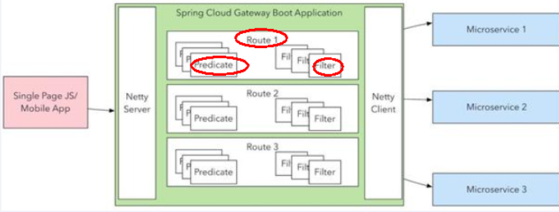

## 基础

官网：[Spring Cloud Gateway](https://spring.io/projects/spring-cloud-gateway)

github：https://github.com/spring-cloud/spring-cloud-gateway

### 介绍

Gateway是在Spring生态系统之上构建的API网关服务，基于Spring6，Spring Boot 3和Project Reactor等技术。它旨在为微服务架构提供一种简单有效的统一的 API 路由管理方式，并为它们提供跨领域的关注点，例如：安全性、监控/度量和恢复能力。

Cloud全家桶中有个很重要的组件就是网关，在1.x版本中都是采用的Zuul网关；

但在2.x版本中，zuul的升级一直跳票，SpringCloud最后自己研发了一个网关SpringCloud Gateway替代Zuul，

那就是SpringCloud Gateway一句话：gateway是原zuul1.x版的替代

### 作用


Spring Cloud Gateway组件的核心是一系列的过滤器，通过这些过滤器可以将客户端发送的请求转发(路由)到对应的微服务。 

Spring Cloud Gateway是加在整个微服务最前沿的防火墙和代理器，隐藏微服务结点IP端口信息，从而加强安全保护。

Spring Cloud Gateway本身也是一个微服务，需要注册进服务注册中心。

## 原理

### 三大核心

**Route**(路由)

路由是构建网关的基本模块,它由ID,目标URI,一系列的断言和过滤器组成,如果断言为true则匹配该路由

**Predicate**(断言)

参考的是Java8的java.util.function.Predicate

开发人员可以匹配HTTP请求中的所有内容(例如请求头或请求参数),如果请求与断言相匹配则进行路由

**Filter**(过滤)

指的是Spring框架中GatewayFilter的实例,使用过滤器,可以在请求被路由前或者之后对请求进行修改。



web前端请求，通过一些匹配条件，定位到真正的服务节点。并在这个转发过程的前后，进行一些精细化控制。

predicate就是我们的匹配条件；

filter，就可以理解为一个无所不能的拦截器。有了这两个元素，再加上目标uri，就可以实现一个具体的路由了

### 工作流程


客户端向 Spring Cloud Gateway 发出请求。然后在 Gateway Handler Mapping 中找到与请求相匹配的路由，将其发送到 Gateway Web Handler。Handler 再通过指定的过滤器链来将请求发送到我们实际的服务执行业务逻辑，然后返回。

过滤器之间用虚线分开是因为过滤器可能会在发送代理请求之前(Pre)或之后(Post)执行业务逻辑。

在“pre”类型的过滤器可以做参数校验、权限校验、流量监控、日志输出、协议转换等;

在“post”类型的过滤器中可以做响应内容、响应头的修改，日志的输出，流量监控等有着非常重要的作用。

## 应用

### 场景

应用于对外暴露的服务，需要找到内部服务时，需要先经过gateway,然后再访问内部服务

### 流程

外部服务访问网关

网关访问内部服务

### 基础步骤

1、创建提供者服务

2、创建feign接口

3、消费者调用接口

4、创建gateway项目

5、添加依赖

```
<dependencies>
    <!--gateway-->
    <dependency>
        <groupId>org.springframework.cloud</groupId>
        <artifactId>spring-cloud-starter-gateway</artifactId>
    </dependency>
    
    <!--服务注册发现consul discovery,网关也要注册进服务注册中心统一管控-->
    <dependency>
        <groupId>org.springframework.cloud</groupId>
        <artifactId>spring-cloud-starter-consul-discovery</artifactId>
        <exclusions>
            <exclusion>
                <groupId>commons-logging</groupId>
                <artifactId>commons-logging</artifactId>
            </exclusion>
        </exclusions>
    </dependency>

    <!-- 指标监控健康检查的actuator,网关是响应式编程删除掉spring-boot-starter-web dependency-->
    <dependency>
        <groupId>org.springframework.boot</groupId>
        <artifactId>spring-boot-starter-actuator</artifactId>
    </dependency>
    
    <!--lombok-->
    <dependency>
        <groupId>org.projectlombok</groupId>
        <artifactId>lombok</artifactId>
        <version>1.18.28</version>
        <scope>provided</scope>
    </dependency>
</dependencies>
```

6、全局配置

```
server:
  port: 9527

spring:
  application:
    name: cloud-gateway #以微服务注册进consul或nacos服务列表内
  cloud:
    consul: #配置consul地址
      host: localhost
      port: 8500
      discovery:
        prefer-ip-address: true
        service-name: ${spring.application.name}
    gateway:
      routes:
        - id: pay_routh1 #pay_routh1                #路由的ID(类似mysql主键ID)，没有固定规则但要求唯一，建议配合服务名
          #uri: http://localhost:8001                #匹配后提供服务的路由地址
          uri: lb://cloud-payment-service                #匹配后提供服务的路由地址
          predicates:
            - Path=/pay/gateway/get/**              # 断言，路径相匹配的进行路由
            - After=2023-12-30T23:02:39.079979400+08:00[Asia/Shanghai]
            #- Cookie=username,zzyy
            # - Header=X-Request-Id, \d+ # 请求头要有X-Request-Id属性并且值为整数的正则表达式
            #- Host=**.atguigu.com
            #- Query=username, \d+  # 要有参数名username并且值还要是整数才能路由
            #- RemoteAddr=192.168.124.1/24 # 外部访问我的IP限制，最大跨度不超过32，目前是1~24它们是 CIDR 表示法。
            #- My=gold
#            - name: My
#              args:
#                userType: diamond

        - id: pay_routh2 #pay_routh2                #路由的ID(类似mysql主键ID)，没有固定规则但要求唯一，建议配合服务名
          #uri: http://localhost:8001                #匹配后提供服务的路由地址
          uri: lb://cloud-payment-service
          predicates:
            - Path=/pay/gateway/info/**              # 断言，路径相匹配的进行路由

        - id: pay_routh3 #pay_routh3
          uri: lb://cloud-payment-service                #匹配后提供服务的路由地址
          predicates:
            - Path=/pay/gateway/filter/**              # 断言，路径相匹配的进行路由，默认正确地址
            #- Path=/gateway/filter/**              # 断言，为配合PrefixPath测试过滤，暂时注释掉/pay
            #- Path=/XYZ/abc/{segment}           # 断言，为配合SetPath测试，{segment}的内容最后被SetPath取代
          filters:
            - My=atguigu
            #- RedirectTo=302, http://www.atguigu.com/ # 访问http://localhost:9527/pay/gateway/filter跳转到http://www.atguigu.com/
            #- SetPath=/pay/gateway/{segment}  # {segment}表示占位符，你写abc也行但要上下一致
            #- PrefixPath=/pay # http://localhost:9527/pay/gateway/filter  被分拆为: PrefixPath + Path
            - AddRequestHeader=X-Request-atguigu1,atguiguValue1  # 请求头kv，若一头含有多参则重写一行设置
            #- AddRequestHeader=X-Request-atguigu2,atguiguValue2
            #- RemoveRequestHeader=sec-fetch-site      # 删除请求头sec-fetch-site
            #- SetRequestHeader=sec-fetch-mode, Blue-updatebyzzyy # 将请求头sec-fetch-mode对应的值修改为Blue-updatebyzzyy
            #- AddRequestParameter=customerId,9527001 # 新增请求参数Parameter：k ，v
            #- RemoveRequestParameter=customerName   # 删除url请求参数customerName，你传递过来也是null
            #- AddResponseHeader=X-Response-atguigu, BlueResponse # 新增请求参数X-Response-atguigu并设值为BlueResponse
            #- SetResponseHeader=Date,2099-11-11 # 设置回应头Date值为2099-11-11
            #- RemoveResponseHeader=Content-Type # 将默认自带Content-Type回应属性删除
```

7、断言

8、过滤

### 参数配置

#### 配置语法：

##### 简短

##### 

##### 全称

##### 

### 断言

#### 谓词配置：[路由谓词工厂 ：： Spring Cloud Gateway](https://docs.spring.io/spring-cloud-gateway/reference/spring-cloud-gateway/request-predicates-factories.html)

```
gateway:
  routes:
    - id: pay_routh1 #pay_routh1                #路由的ID(类似mysql主键ID)，没有固定规则但要求唯一，建议配合服务名
      #uri: http://localhost:8001                #匹配后提供服务的路由地址
      uri: lb://cloud-payment-service                #匹配后提供服务的路由地址
      predicates:
        - Path=/pay/gateway/get/**              # 断言，路径相匹配的进行路由
        - After=2023-12-30T23:02:39.079979400+08:00[Asia/Shanghai]
        - Cookie=username,zzyy
        - Header=X-Request-Id, \d+ # 请求头要有X-Request-Id属性并且值为整数的正则表达式
        - Host=**.atguigu.com
        - Query=username, \d+  # 要有参数名username并且值还要是整数才能路由
        - RemoteAddr=192.168.124.1/24 # 外部访问我的IP限制，最大跨度不超过32，目前是1~24它们是 CIDR 表示法。
        - My=gold
        - name: My
          args:
            userType: diamond
```

##### Path

服务路径

##### Before、Between、After

规定时间访问

##### Cookie

请求带cookie

##### Header

请求头（正则表达式）

##### Host

域名

##### Query

需要路径参数

##### RemoteAddr

IP限制

#### 自定义断言

##### 步骤

1.新建类名XXX需要以RoutePredicateFactory结尾并继承AbstractRoutePredicateFactory类

2.重写apply方法

3.新建apply方法所需要的静态内部类MyRoutePredicateFactory.Config（这个Config类就是我们的路由断言规则）

4.空参构造方法,内部调用super

5.重写apply方法第二版

6.修改配置文件

```
@Component
public class MyRoutePredicateFactory extends AbstractRoutePredicateFactory<MyRoutePredicateFactory.Config>
{

    public MyRoutePredicateFactory()
    {
        super(Config.class);
    }

    //这个Config类就是我们的路由断言规则，重要
    @Validated
    public static class Config
    {
        @Setter@Getter@NotEmpty
        private String userType; //钻/金/银和yml配置的会员等级
    }

    @Override
    public List<String> shortcutFieldOrder() {
        return Collections.singletonList("userType");
    }

    @Override
    public Predicate<ServerWebExchange> apply(Config config)
    {
        return new Predicate<ServerWebExchange>()
        {
            @Override
            public boolean test(ServerWebExchange serverWebExchange)
            {
                //检查request的参数里面，userType是否为指定的值，符合配置就通过
                //http://localhost:9527/pay/gateway/get/1?userType=diamond
                String userType = serverWebExchange.getRequest().getQueryParams().getFirst("userType");
                if (userType == null) {
                    return false;
                }
                //如果说参数存在，就和config的数据进行比较
                if(userType.equalsIgnoreCase(config.getUserType())){
                    return true;
                }
                return false;
            }
        };
    }
}
```

```
gateway:
  routes:
    - id: pay_routh1 #pay_routh1                #路由的ID(类似mysql主键ID)，没有固定规则但要求唯一，建议配合服务名
      #uri: http://localhost:8001                #匹配后提供服务的路由地址
      uri: lb://cloud-payment-service                #匹配后提供服务的路由地址
      predicates:
        - Path=/pay/gateway/get/**              # 断言，路径相匹配的进行路由
        - name: My
          args:
            userType: diamond
```

### 过滤

#### 介绍

主要用于请求调用前后的数据修改

#### 应用

请求鉴权

异常处理 

#### 单一内置过滤器

##### 步骤

1、提供者创建接口

```
@GetMapping(value = "/pay/gateway/filter")
public ResultData<String> getGatewayFilter(HttpServletRequest request)
{
    String result = "";
    Enumeration<String> headers = request.getHeaderNames();
    while(headers.hasMoreElements())
    {
        String headName = headers.nextElement();
        String headValue = request.getHeader(headName);
        System.out.println("请求头名: " + headName +"\t\t\t"+"请求头值: " + headValue);

        if(headName.equalsIgnoreCase("X-Request-atguigu1")
                || headName.equalsIgnoreCase("X-Request-atguigu2")) {
            result = result+headName + "\t " + headValue +" ";
        }
    }
    System.out.println("=============================================");
    String customerId = request.getParameter("customerId");
    System.out.println("request Parameter customerId: "+customerId);

    String customerName = request.getParameter("customerName");
    System.out.println("request Parameter customerName: "+customerName);
    System.out.println("=============================================");

    return ResultData.success("getGatewayFilter 过滤器 test： "+result+" \t "+ DateUtil.now());
}
```

2、**gateway创建路由过滤规则**

```
 gateway:
      routes:
        - id: pay_routh3 #pay_routh3
          uri: lb://cloud-payment-service                #匹配后提供服务的路由地址
          predicates:
            - Path=/pay/gateway/filter/**              # 断言，路径相匹配的进行路由，默认正确地址
            #- Path=/gateway/filter/**              # 断言，为配合PrefixPath测试过滤，暂时注释掉/pay
            #- Path=/XYZ/abc/{segment}           # 断言，为配合SetPath测试，{segment}的内容最后被SetPath取代
          filters:
#            - My=atguigu
            #- RedirectTo=302, http://www.atguigu.com/ # 访问http://localhost:9527/pay/gateway/filter跳转到http://www.atguigu.com/
            #- SetPath=/pay/gateway/{segment}  # {segment}表示占位符，你写abc也行但要上下一致
            #- PrefixPath=/pay # http://localhost:9527/pay/gateway/filter  被分拆为: PrefixPath + Path
            - AddRequestHeader=X-Request-atguigu1,atguiguValue1  # 请求头kv，若一头含有多参则重写一行设置
            #- AddRequestHeader=X-Request-atguigu2,atguiguValue2
            #- RemoveRequestHeader=sec-fetch-site      # 删除请求头sec-fetch-site
            #- SetRequestHeader=sec-fetch-mode, Blue-updatebyzzyy # 将请求头sec-fetch-mode对应的值修改为Blue-updatebyzzyy
            #- AddRequestParameter=customerId,9527001 # 新增请求参数Parameter：k ，v
            #- RemoveRequestParameter=customerName   # 删除url请求参数customerName，你传递过来也是null
            #- AddResponseHeader=X-Response-atguigu, BlueResponse # 新增请求参数X-Response-atguigu并设值为BlueResponse
            #- SetResponseHeader=Date,2099-11-11 # 设置回应头Date值为2099-11-11
            #- RemoveResponseHeader=Content-Type # 将默认自带Content-Type回应属性删除
```

3、测试：localhost:9527/pay/gateway/filter

4、结果


#### 自定义全局过滤器

##### 步骤

1、GlobalFilter接口

```
@Component
@Slf4j
public class MyGlobalFilter implements GlobalFilter, Ordered
{
    public static final String BEGIN_VISIT_TIME = "begin_visit_time";//开始调用方法的时间

    @Override
    public Mono<Void> filter(ServerWebExchange exchange, GatewayFilterChain chain)
    {
        //1 先记录下访问接口的开始时间
        exchange.getAttributes().put(BEGIN_VISIT_TIME,System.currentTimeMillis());
        //2 返回统计的各个结果给后台
        return chain.filter(exchange).then(Mono.fromRunnable(() -> {
            Long beginVisitTime = exchange.getAttribute(BEGIN_VISIT_TIME);
            if(beginVisitTime != null)
            {
                log.info("访问接口主机："+exchange.getRequest().getURI().getHost());
                log.info("访问接口端口："+exchange.getRequest().getURI().getPort());
                log.info("访问接口URL："+exchange.getRequest().getURI().getPath());
                log.info("访问接口URL后面参数："+exchange.getRequest().getURI().getRawQuery());
                log.info("访问接口时长："+(System.currentTimeMillis() - beginVisitTime) + "毫秒");
                log.info("============分割线==========================");
                System.out.println();
            }
        }));
    }

    /**
     * 数字越小，优先级越高
     * @return
     */
    @Override
    public int getOrder()
    {
        return 0;
    }
}
```

2、配置类（只需要配置路径就行）

```
gateway:
  routes:
    - id: pay_routh3 #pay_routh3
      uri: lb://cloud-payment-service                #匹配后提供服务的路由地址
      predicates:
        - Path=/pay/gateway/filter/**              # 断言，路径相匹配的进行路由，默认正确地址
```

#### 自定义条件过滤器

##### 步骤

1、创建AbstractGatewayFilterFactory继承类

```
@Component
public class MyGatewayFilterFactory extends AbstractGatewayFilterFactory<MyGatewayFilterFactory.Config>
{
    public MyGatewayFilterFactory()
    {
        super(Config.class);
    }


    @Override
    public GatewayFilter apply(Config config)
    {
        return new GatewayFilter()
        {
            @Override
            public Mono<Void> filter(ServerWebExchange exchange, GatewayFilterChain chain)
            {
                ServerHttpRequest request = exchange.getRequest();
                System.out.println("进入了自定义网关过滤器MyGatewayFilterFactory，status："+config.getStatus());
                if(request.getQueryParams().containsKey("atguigu")){
                    return chain.filter(exchange);
                }else{
                    exchange.getResponse().setStatusCode(HttpStatus.BAD_REQUEST);
                    return exchange.getResponse().setComplete();
                }
            }
        };
    }

    @Override
    public List<String> shortcutFieldOrder() {
        return Arrays.asList("status");
    }

    public static class Config
    {
        @Getter@Setter
        private String status;//设定一个状态值/标志位，它等于多少，匹配和才可以访问
    }
}
```

2、自定义配置

```
 - id: pay_routh3 #pay_routh3
          uri: lb://cloud-payment-service                #匹配后提供服务的路由地址
          predicates:
            - Path=/pay/gateway/filter/**              # 断言，路径相匹配的进行路由，默认正确地址
            #- Path=/gateway/filter/**              # 断言，为配合PrefixPath测试过滤，暂时注释掉/pay
            #- Path=/XYZ/abc/{segment}           # 断言，为配合SetPath测试，{segment}的内容最后被SetPath取代
          filters:
            - My=atguigu
            - AddRequestHeader=X-Request-atguigu1,atguiguValue1  # 请求头kv，若一头含有多参则重写一行设置
           
```

