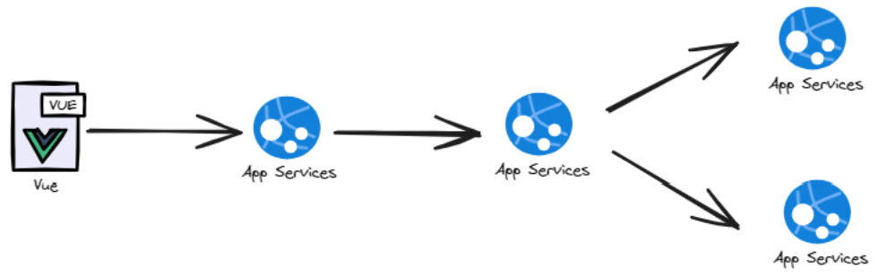
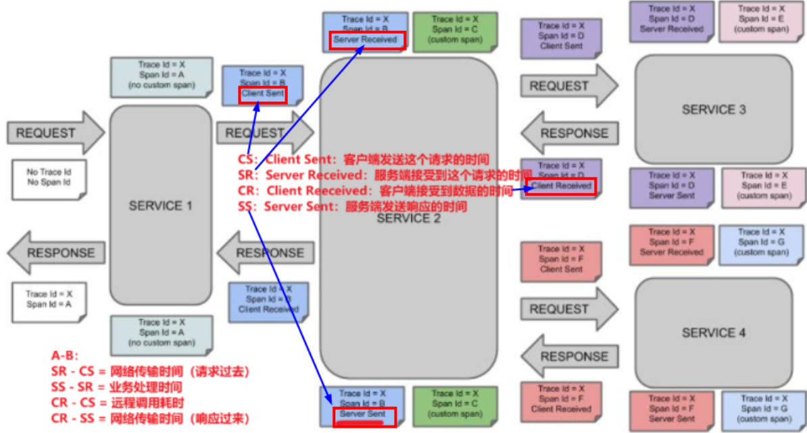
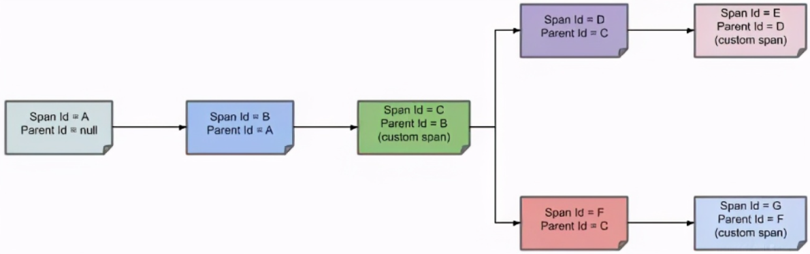

## 基础

### 介绍

 在微服务框架中，一个由客户端发起的请求在后端系统中会经过多个不同的的服务节点调用来协同产生最后的请求结果，每一个前段请求都会形成一条复杂的分布式服务调用链路，链路中的任何一环出现高延时或错误都会引起整个请求最后的失败。

 在分布式与微服务场景下，我们需要解决如下问题：

在大规模分布式与微服务集群下，如何**实时观测系统的整体调用链路情况**。

在大规模分布式与微服务集群下，如何**快速发现并定位到问题**。

在大规模分布式与微服务集群下，如何**尽可能精确的判断故障对系统的影响范围与影响程度**。

在大规模分布式与微服务集群下，如何**尽可能精确的梳理出服务之间的依赖关系，并判断出服务之间的依赖关系是否合理**。

在大规模分布式与微服务集群下，如何**尽可能精确的分析整个系统调用链路的性能与瓶颈点**。

在大规模分布式与微服务集群下，如何**尽可能精确的分析系统的存储瓶颈与容量规划**。

上述问题就是我们的落地议题答案：

分布式链路追踪技术要解决的问题，**分布式链路追踪**（Distributed Tracing），就是将一次分布式请求还原成调用链路，进行日志记录，性能监控并将一次分布式请求的调用情况集中展示。比如各个服务节点上的耗时、请求具体到达哪台机器上、每个服务节点的请求状态等等。

### Sleuth(维护模式)

官网：[Spring Cloud Sleuth](https://spring.io/projects/spring-cloud-sleuth)

github：[GitHub - spring-cloud/spring-cloud-sleuth: Distributed tracing for spring cloud](https://github.com/spring-cloud/spring-cloud-sleuth)

#### 介绍

只适用springboot3.x以上

### micrometer(新技术)

官网：https://micrometer.io/

github：https://github.com/micrometer-metrics/micrometer

### ZipKin(图形化展现)

官网：https://zipkin.io/

github：https://github.com/openzipkin/zipkin

#### 基础步骤

1、安装运行

下载地址：[Quickstart · OpenZipkin](https://zipkin.io/pages/quickstart.html)

运行：

（1）保存到相应文件夹，cmd

（2）运行jar包

2、访问地址：http://127.0.0.1:9411/zipkin/

## 原理

### 分布式链路追踪原理

假定三个微服务调用的链路如下图所示：Service 1 调用 Service 2，Service 2 调用 Service 3 和 Service 4。



那么一条链路追踪会在每个服务调用的时候加上Trace ID 和 Span ID

链路通过TraceId唯一标识，

Span标识发起的请求信息，各span通过parent id 关联起来 (Span:表示调用链路来源，通俗的理解span就是一次请求信息)



一条链路通过Trace Id唯一标识，Span标识发起的请求信息，各span通过parent id 关联起来



| 步骤 | 操作                                                         |
| ---- | ------------------------------------------------------------ |
| 1    | 第一个节点：Span ID = A，Parent ID = null，Service 1 接收到请求。 |
| 2    | 第二个节点：Span ID = B，Parent ID= A，Service 1 发送请求到 Service 2 返回响应给Service 1 的过程。 |
| 3    | 第三个节点：Span ID = C，Parent ID= B，Service 2 的 中间解决过程。 |
| 4    | 第四个节点：Span ID = D，Parent ID= C，Service 2 发送请求到 Service 3 返回响应给Service 2 的过程。 |
| 5    | 第五个节点：Span ID = E，Parent ID= D，Service 3 的中间解决过程。 |
| 6    | 第六个节点：Span ID = F，Parent ID= C，Service 3 发送请求到 Service 4 返回响应给 Service 3 的过程。 |
| 7    | 第七个节点：Span ID = G，Parent ID= F，Service 4 的中间解决过程。 |
| 8    | 通过 Parent ID 就可找到父节点，整个链路即可以进行跟踪追溯了。 |

## 使用(zipkin/micrometer)

### 1、父工程

```
<properties>
    <micrometer-tracing.version>1.2.0</micrometer-tracing.version>
    <micrometer-observation.version>1.12.0</micrometer-observation.version>
    <feign-micrometer.version>12.5</feign-micrometer.version>
    <zipkin-reporter-brave.version>2.17.0</zipkin-reporter-brave.version>
</properties>
```

```
      <!--micrometer-tracing-bom导入链路追踪版本中心  1-->
        <dependency>
            <groupId>io.micrometer</groupId>
            <artifactId>micrometer-tracing-bom</artifactId>
            <version>${micrometer-tracing.version}</version>
            <type>pom</type>
            <scope>import</scope>
        </dependency>
        <!--micrometer-tracing指标追踪  2-->
        <dependency>
            <groupId>io.micrometer</groupId>
            <artifactId>micrometer-tracing</artifactId>
            <version>${micrometer-tracing.version}</version>
        </dependency>
        <!--micrometer-tracing-bridge-brave适配zipkin的桥接包 3-->
        <dependency>
            <groupId>io.micrometer</groupId>
            <artifactId>micrometer-tracing-bridge-brave</artifactId>
            <version>${micrometer-tracing.version}</version>
        </dependency>
        <!--micrometer-observation 4-->
        <dependency>
            <groupId>io.micrometer</groupId>
            <artifactId>micrometer-observation</artifactId>
            <version>${micrometer-observation.version}</version>
        </dependency>
        <!--feign-micrometer 5-->
        <dependency>
            <groupId>io.github.openfeign</groupId>
            <artifactId>feign-micrometer</artifactId>
            <version>${feign-micrometer.version}</version>
        </dependency>
        <!--zipkin-reporter-brave 6-->
        <dependency>
            <groupId>io.zipkin.reporter2</groupId>
            <artifactId>zipkin-reporter-brave</artifactId>
            <version>${zipkin-reporter-brave.version}</version>
        </dependency>
    </dependencies>
</dependencyManagement>
```

### 2、服务配置

#### （1）添加依赖

```
<!--micrometer-tracing指标追踪  1-->
<dependency>
    <groupId>io.micrometer</groupId>
    <artifactId>micrometer-tracing</artifactId>
</dependency>
<!--micrometer-tracing-bridge-brave适配zipkin的桥接包 2-->
<dependency>
    <groupId>io.micrometer</groupId>
    <artifactId>micrometer-tracing-bridge-brave</artifactId>
</dependency>
<!--micrometer-observation 3-->
<dependency>
    <groupId>io.micrometer</groupId>
    <artifactId>micrometer-observation</artifactId>
</dependency>
<!--feign-micrometer 4-->
<dependency>
    <groupId>io.github.openfeign</groupId>
    <artifactId>feign-micrometer</artifactId>
</dependency>
<!--zipkin-reporter-brave 5-->
<dependency>
    <groupId>io.zipkin.reporter2</groupId>
    <artifactId>zipkin-reporter-brave</artifactId>
</dependency>
```

#### （2）全局配置

```
# ========================zipkin===================
management:
  zipkin:
    tracing:
      endpoint: http://localhost:9411/api/v2/spans
  tracing:
    sampling:
      probability: 1.0 #采样率默认为0.1(0.1就是10次只能有一次被记录下来)，值越大收集越及时。
```