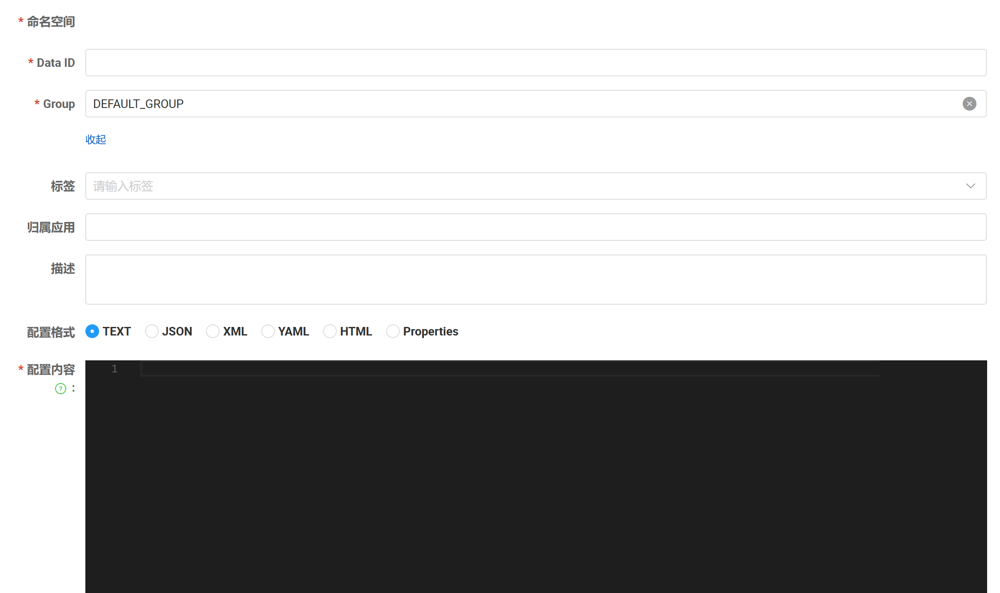
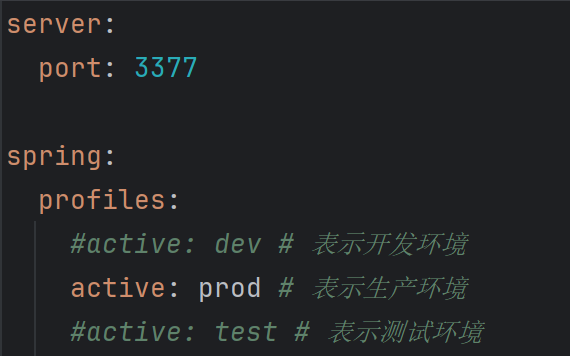
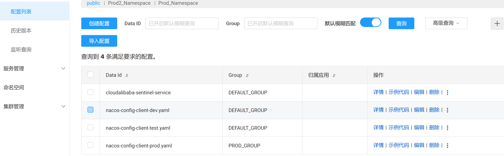
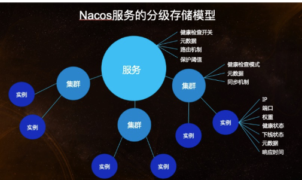

## 简介

官网：https://nacos.io/zh-cn/docs/quick-start.html

github：https://github.com/alibaba/nacos

## 应用

### 安装运行

1、下载：https://github.com/alibaba/nacos/releases

2、运行：bin目录 

​	cmd：startup.cmd -m standalone

3、访问：http://localhost:8848/nacos

4、关闭：shutdown.cmd

### 创建服务提供者及消费者

1、添加pom依赖

```
<!--nacos-discovery-->
<dependency>
    <groupId>com.alibaba.cloud</groupId>
    <artifactId>spring-cloud-starter-alibaba-nacos-discovery</artifactId>
</dependency>
```

2、全局配置

```
server:
  port: 9001

spring:
  application:
    name: nacos-payment-provider
  cloud:
    nacos:
      discovery:
        server-addr: localhost:8848 #配置Nacos地址
```

3、main开启服务发现

```
@SpringBootApplication
@EnableDiscoveryClient
public class Main9001
{
    public static void main(String[] args)
    {
        SpringApplication.run(Main9001.class,args);
    }
}
```

### 负载均衡

##### 方法1：loadbalancer（RestTemplate）

1、提供者创建接口

2、配置类

```
@Configuration
public class RestTemplateConfig
{
    @Bean
    @LoadBalanced //赋予RestTemplate负载均衡的能力
    public RestTemplate restTemplate()
    {
        return new RestTemplate();
    }
}
```

3、调用

```
@Resource
private RestTemplate restTemplate;

@Value("${service-url.nacos-user-service}")
private String serverURL;

@GetMapping(value = "/consumer/pay/nacos/{id}")
public String paymentInfo(@PathVariable("id") Integer id)
{
    String result = restTemplate.getForObject(serverURL + "/pay/nacos/" + id, String.class);
    return result+"\t"+"    我是OrderNacosController83调用者。。。。。。";
}
```

##### 方法2：feign

1、提供者创建接口

2、feign创建方法

3、依赖注入feign

### 配置中心

#### 基础



##### 服务名称对应的nacos配置规则（Data ID）

1、项目



2、nacos



3、所以nacos配置文件为：服务名-生产环境.yaml

##### 基础步骤

1、添加依赖

```
<dependencies>
    <!--bootstrap-->
    <dependency>
        <groupId>org.springframework.cloud</groupId>
        <artifactId>spring-cloud-starter-bootstrap</artifactId>
    </dependency>
    <!--nacos-config-->
    <dependency>
        <groupId>com.alibaba.cloud</groupId>
        <artifactId>spring-cloud-starter-alibaba-nacos-config</artifactId>
    </dependency>
    <!--nacos-discovery-->
    <dependency>
        <groupId>com.alibaba.cloud</groupId>
        <artifactId>spring-cloud-starter-alibaba-nacos-discovery</artifactId>
    </dependency>
    <!--web + actuator-->
    <dependency>
        <groupId>org.springframework.boot</groupId>
        <artifactId>spring-boot-starter-web</artifactId>
    </dependency>
    <dependency>
        <groupId>org.springframework.boot</groupId>
        <artifactId>spring-boot-starter-actuator</artifactId>
    </dependency>
    <!--lombok-->
    <dependency>
        <groupId>org.projectlombok</groupId>
        <artifactId>lombok</artifactId>
        <optional>true</optional>
    </dependency>
</dependencies>
```

2、配置

application.yaml

```
server:
  port: 3377

spring:
  profiles:
    #active: dev # 表示开发环境
    active: prod # 表示生产环境
    #active: test # 表示测试环境
```

bootstrap.yaml

```
spring:
  application:
    name: nacos-config-client
  cloud:
    nacos:
      discovery:
        server-addr: localhost:8848 #Nacos服务注册中心地址
      config:
        server-addr: localhost:8848 #Nacos作为配置中心地址
        file-extension: yaml #指定yaml格式的配置
```

3、代码

```
@RestController
@RefreshScope //在控制器类加入@RefreshScope注解使当前类下的配置支持Nacos的动态刷新功能。
public class NacosConfigClientController
{
    @Value("${config.info}")
    private String configInfo;

    @GetMapping("/config/info")
    public String getConfigInfo() {
        return configInfo;
    }
}
```

#### 命名空间

默认情况：

Namespace=public

Group=DEFAULT_GROUP

Nacos默认的命名空间是public，Namespace主要用来实现隔离。比方说我们现在有三个环境：开发、测试、生产环境，我们就可以创建三个Namespace，不同的Namespace之间是隔离的。Group默认是DEFAULT_GROUP，Group可以把不同的微服务划分到同一个分组里面去

一个Service可以包含一个或者多个Cluster（集群），Nacos默认Cluster是DEFAULT，Cluster是对指定微服务的一个虚拟划分



##### 服务配置命名空间

```
spring:
  application:
    name: nacos-config-client
  cloud:
    nacos:
      discovery:
        server-addr: localhost:8848 #Nacos服务注册中心地址
      config:
        server-addr: localhost:8848 #Nacos作为配置中心地址
        file-extension: yaml #指定yaml格式的配置
        group: PROD_GROUP
        namespace: Prod_Namespace
```