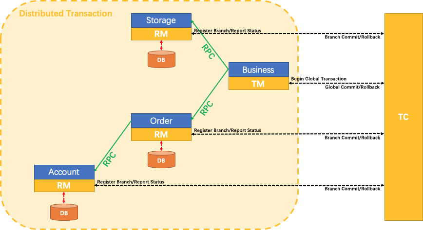

# 基础

### 分布式事务

一次业务操作需要跨多个数据源或需要跨多个系统进行远程调用，就会产生分布式事务问题，但是关系型数据库提供的能力是基于单机事务的，一旦遇到分布式事务场景，就需要通过更多其他技术手段来解决问题。

### Seata

官网：[Apache Seata](https://seata.apache.org/zh-cn/)

github：https://github.com/apache/incubator-seata


# 应用/原理

## Seata应用

#### 安装/启动

1、地址：[Releases · apache/incubator-seata (github.com)](https://github.com/apache/incubator-seata/releases/)

2、启动：bin目录下cmd：seata-server.bat

3、访问：localhost:7091

#### 数据库配置

建库建表

```
CREATE DATABASE seata;
USE seata;
-- -------------------------------- The script used when storeMode is 'db' --------------------------------

-- the table to store GlobalSession data

CREATE TABLE IF NOT EXISTS `global_table`

(

    `xid`                       VARCHAR(128) NOT NULL,

    `transaction_id`            BIGINT,

    `status`                    TINYINT      NOT NULL,

    `application_id`            VARCHAR(32),

    `transaction_service_group` VARCHAR(32),

    `transaction_name`          VARCHAR(128),

    `timeout`                   INT,

    `begin_time`                BIGINT,

    `application_data`          VARCHAR(2000),

    `gmt_create`                DATETIME,

    `gmt_modified`              DATETIME,

    PRIMARY KEY (`xid`),

    KEY `idx_status_gmt_modified` (`status` , `gmt_modified`),

    KEY `idx_transaction_id` (`transaction_id`)

    ) ENGINE = InnoDB

    DEFAULT CHARSET = utf8mb4;


-- the table to store BranchSession data

CREATE TABLE IF NOT EXISTS `branch_table`

(

    `branch_id`         BIGINT       NOT NULL,

    `xid`               VARCHAR(128) NOT NULL,

    `transaction_id`    BIGINT,

    `resource_group_id` VARCHAR(32),

    `resource_id`       VARCHAR(256),

    `branch_type`       VARCHAR(8),

    `status`            TINYINT,

    `client_id`         VARCHAR(64),

    `application_data`  VARCHAR(2000),

    `gmt_create`        DATETIME(6),

    `gmt_modified`      DATETIME(6),

    PRIMARY KEY (`branch_id`),

    KEY `idx_xid` (`xid`)

    ) ENGINE = InnoDB

    DEFAULT CHARSET = utf8mb4;


-- the table to store lock data

CREATE TABLE IF NOT EXISTS `lock_table`

(

    `row_key`        VARCHAR(128) NOT NULL,

    `xid`            VARCHAR(128),

    `transaction_id` BIGINT,

    `branch_id`      BIGINT       NOT NULL,

    `resource_id`    VARCHAR(256),

    `table_name`     VARCHAR(32),

    `pk`             VARCHAR(36),

    `status`         TINYINT      NOT NULL DEFAULT '0' COMMENT '0:locked ,1:rollbacking',

    `gmt_create`     DATETIME,

    `gmt_modified`   DATETIME,

    PRIMARY KEY (`row_key`),

    KEY `idx_status` (`status`),

    KEY `idx_branch_id` (`branch_id`),

    KEY `idx_xid` (`xid`)

    ) ENGINE = InnoDB

    DEFAULT CHARSET = utf8mb4;


CREATE TABLE IF NOT EXISTS `distributed_lock`

(

    `lock_key`       CHAR(20) NOT NULL,

    `lock_value`     VARCHAR(20) NOT NULL,

    `expire`         BIGINT,

    primary key (`lock_key`)

    ) ENGINE = InnoDB

    DEFAULT CHARSET = utf8mb4;


INSERT INTO `distributed_lock` (lock_key, lock_value, expire) VALUES ('AsyncCommitting', ' ', 0);

INSERT INTO `distributed_lock` (lock_key, lock_value, expire) VALUES ('RetryCommitting', ' ', 0);

INSERT INTO `distributed_lock` (lock_key, lock_value, expire) VALUES ('RetryRollbacking', ' ', 0);

INSERT INTO `distributed_lock` (lock_key, lock_value, expire) VALUES ('TxTimeoutCheck', ' ', 0);
```

#### 配置文件

##### application.yml

##### application.example.yml

## AT模式

### 工作流程（1+3）

#### XID  

是全局事务的唯一标识,它可以在服务的调用链路中传递,绑定到服务的事务上下文中

#### TC (Transaction Coordinator) 事务协调器

就是Seata,负责维护全局事务和分支事务的状态,驱动全局事务提交或回滚。

#### TM (Transaction Manager) 事务管理器

标注全局@GlobalTransactional启动入口动作的微服务模块(比如订单模块),它是事务的发起者,负责定义全局事务的范围,并根据TC维护的全局事务和分支事务状态,做出开始事务、提交事务、回滚事务的决议

#### RM (Resource Manager) 资源管理器

就是mysql数据库本身,可以是多个RM,负责管理分支事务上的资源,向TC注册分支事务,汇报分支事务状态,驱动分支事务的提交或回滚



1. TM 向 TC 申请开启一个全局事务，全局事务创建成功并生成一个全局唯一的 XID；
2. XID 在微服务调用链路的上下文中传播；
3. RM 向 TC 注册分支事务，将其纳入 XID 对应全局事务的管辖；
4. TM 向 TC 发起针对 XID 的全局提交或回滚决议；
5. TC 调度 XID 下管辖的全部分支事务完成提交或回滚请求。

### 基本使用

1、创建服务提供者

（0）要有udo.log表

（1）添加依赖

（2）配置

```
server:
  port: 2002

spring:
  application:
    name: seata-storage-service
  cloud:
    nacos:
      discovery:
        server-addr: localhost:8848         #Nacos服务注册中心地址
  # ==========applicationName + druid-mysql8 driver===================
  datasource:
    type: com.alibaba.druid.pool.DruidDataSource
    driver-class-name: com.mysql.cj.jdbc.Driver
    url: jdbc:mysql://localhost:3306/seata_storage?characterEncoding=utf8&useSSL=false&serverTimezone=GMT%2B8&rewriteBatchedStatements=true&allowPublicKeyRetrieval=true
    username: root
    password: 123456
# ========================mybatis===================
mybatis:
  mapper-locations: classpath:mapper/*.xml
  type-aliases-package: com.atguigu.cloud.entities
  configuration:
    map-underscore-to-camel-case: true
# ========================seata===================
seata:
  registry:
    type: nacos
    nacos:
      server-addr: 127.0.0.1:8848
      namespace: ""
      group: SEATA_GROUP
      application: seata-server
  tx-service-group: default_tx_group # 事务组，由它获得TC服务的集群名称
  service:
    vgroup-mapping:
      default_tx_group: default # 事务组与TC服务集群的映射关系
  data-source-proxy-mode: AT

logging:
  level:
    io:
      seata: info
```

（3）创建对应业务

2、创建feign接口方法

```
@FeignClient(value = "seata-account-service")
public interface AccountFeignApi
{
    //扣减账户余额
    @PostMapping("/account/decrease")
    ResultData decrease(@RequestParam("userId") Long userId, @RequestParam("money") Long money);
}
```

```
@FeignClient(value = "seata-storage-service")
public interface StorageFeignApi
{
    /**
     * 扣减库存
     */
    @PostMapping(value = "/storage/decrease")
    ResultData decrease(@RequestParam("productId") Long productId, @RequestParam("count") Integer count);
}
```

3、服务调用者

（0）要有udo.log表

（1）添加依赖

```
<!-- nacos -->
<dependency>
    <groupId>com.alibaba.cloud</groupId>
    <artifactId>spring-cloud-starter-alibaba-nacos-discovery</artifactId>
</dependency>
<!--alibaba-seata-->
<dependency>
    <groupId>com.alibaba.cloud</groupId>
    <artifactId>spring-cloud-starter-alibaba-seata</artifactId>
</dependency>
<!--openfeign-->
<dependency>
    <groupId>org.springframework.cloud</groupId>
    <artifactId>spring-cloud-starter-openfeign</artifactId>
</dependency>
<!--loadbalancer-->
<dependency>
    <groupId>org.springframework.cloud</groupId>
    <artifactId>spring-cloud-starter-loadbalancer</artifactId>
</dependency>
<!--cloud-api-commons-->
<dependency>
    <groupId>com.atguigu.cloud</groupId>
    <artifactId>cloud-api-commons</artifactId>
    <version>1.0-SNAPSHOT</version>
</dependency>
```

（2）**全局配置**

```
server:
  port: 2001

spring:
  application:
    name: seata-order-service
  cloud:
    nacos:
      discovery:
        server-addr: localhost:8848         #Nacos服务注册中心地址
  # ==========applicationName + druid-mysql8 driver===================
  datasource:
    type: com.alibaba.druid.pool.DruidDataSource
    driver-class-name: com.mysql.cj.jdbc.Driver
    url: jdbc:mysql://192.168.126.131:3306/seata_order?characterEncoding=utf8&useSSL=false&serverTimezone=GMT%2B8&rewriteBatchedStatements=true&allowPublicKeyRetrieval=true
    username: win
    password: 123456
# ========================mybatis===================
mybatis:
  mapper-locations: classpath:mapper/*.xml
  type-aliases-package: com.atguigu.cloud.entities
  configuration:
    map-underscore-to-camel-case: true

# ========================seata===================
seata:
  registry:
    type: nacos
    nacos:
      server-addr: 127.0.0.1:8848
      namespace: ""
      group: SEATA_GROUP
      application: seata-server
  tx-service-group: default_tx_group # 事务组，由它获得TC服务的集群名称
  service:
    vgroup-mapping: # 点击源码分析
      default_tx_group: default # 事务组与TC服务集群的映射关系
  data-source-proxy-mode: AT

logging:
  level:
    io:
      seata: info
```

（3）创建接口

```
@RestController
public class OrderController {

    @Resource
    private OrderService orderService;

    /**
     * 创建订单
     */
    @GetMapping("/order/create")
    public ResultData create(Order order)
    {
        orderService.create(order);
        return ResultData.success(order);
    }
}
```

（4）**服务业务类**

```
@Service
@Slf4j
public class OrderServiceImpl implements OrderService
{
    @Resource
    private OrderMapper orderMapper;
    @Resource//订单微服务通过OpenFeign去调用库存微服务
    private StorageFeignApi storageFeignApi;
    @Resource//订单微服务通过OpenFeign去调用账户微服务
    private AccountFeignApi accountFeignApi;

    @Override
    @GlobalTransactional(name = "zzyy-create-order",rollbackFor = Exception.class) //AT
    public void create(Order order)
    {
        //xid全局事务id的检查，重要
        String xid = RootContext.getXID();
        //1 新建订单
        log.info("---------------开始新建订单: "+"\t"+"xid: "+xid);
        //订单新建时默认初始订单状态是零
        order.setStatus(0);
        int result = orderMapper.insertSelective(order);
        // 插入订单成功后获得插入mysql的实体对象
        Order orderFromDB = null;

        if(result > 0)
        {
            // 从mysql里面查出刚插入的记录
            orderFromDB = orderMapper.selectOne(order);
            log.info("-----> 新建订单成功,orderFromDB info: "+orderFromDB);
            System.out.println();
            //2 扣减库存
            log.info("-------> 订单微服务开始调用Storage库存，做扣减count");
            storageFeignApi.decrease(orderFromDB.getProductId(),orderFromDB.getCount());
            log.info("-------> 订单微服务结束调用Storage库存，做扣减完成");
            System.out.println();

            //3 扣减账户余额
            log.info("-------> 订单微服务开始调用Account账号，做扣减money");
            accountFeignApi.decrease(orderFromDB.getUserId(),orderFromDB.getMoney());
            log.info("-------> 订单微服务结束调用Account账号，做扣减完成");
            System.out.println();

            //4 修改订单状态
            //将订单状态从零修改为1，表示已经完成
            log.info("-------> 修改订单状态");
            orderFromDB.setStatus(1);

            Example whereCondition = new Example(Order.class);
            Example.Criteria criteria = whereCondition.createCriteria();
            criteria.andEqualTo("userId",orderFromDB.getUserId());
            criteria.andEqualTo("status",0);

            int updateResult = orderMapper.updateByExampleSelective(orderFromDB, whereCondition);
            log.info("-------> 修改订单状态完成"+"\t"+updateResult);
            log.info("-------> orderFromDB info: "+orderFromDB);
        }
        System.out.println();
        log.info("---------------结束新建订单: "+"\t"+"xid: "+xid);
    }
}
```