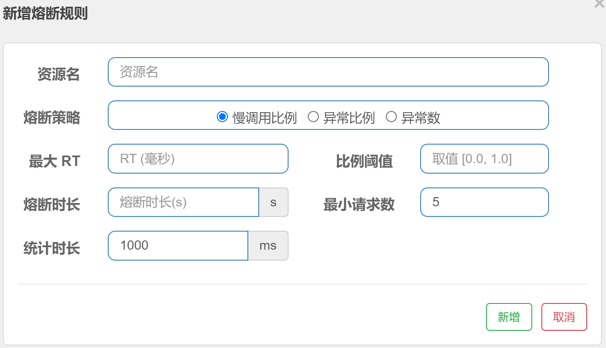

## 简介

官网：https://sentinelguard.io/zh-cn/

github：https://github.com/alibaba/Sentinel

### Sentinel的特征

丰富的应用场景：Sentinel 承接了阿里巴巴近 10 年的双十一大促流量的核心场景，例如秒杀（即突发流量控制在系统容量可以承受的范围）、消息削峰填谷、集群流量控制、实时熔断下游不可用应用等。

完备的实时监控：Sentinel 同时提供实时的监控功能。您可以在控制台中看到接入应用的单台机器秒级数据，甚至 500 台以下规模的集群的汇总运行情况。

广泛的开源生态：Sentinel 提供开箱即用的与其它开源框架/库的整合模块，例如与 Spring Cloud、Apache Dubbo、gRPC、Quarkus 的整合。您只需要引入相应的依赖并进行简单的配置即可快速地接入 Sentinel。同时 Sentinel 提供 Java/Go/C++ 等多语言的原生实现。

完善的 SPI 扩展机制：Sentinel 提供简单易用、完善的 SPI 扩展接口。您可以通过实现扩展接口来快速地定制逻辑。例如定制规则管理、适配动态数据源等。

### Sentinel解决的问题

##### 服务雪崩

多个微服务之间调用的时候，假设微服务A调用微服务B和微服务C，微服务B和微服务C又调用其它的微服务，这就是所谓的“扇出”。如果扇出的链路上某个微服务的调用响应时间过长或者不可用，对微服务A的调用就会占用越来越多的系统资源，进而引起系统崩溃，所谓的“雪崩效应”。对于高流量的应用来说，单一的后端依赖可能会导致所有服务器上的所有资源都在几秒钟内饱和。比失败更糟糕的是，这些应用程序还可能导致服务之间的延迟增加，备份队列，线程和其他系统资源紧张，导致整个系统发生更多的级联故障。这些都表示需要对故障和延迟进行隔离和管理，以便单个依赖关系的失败，不能取消整个应用程序或系统。

所以，通常当你发现一个模块下的某个实例失败后，这时候这个模块依然还会接收流量，然后这个有问题的模块还调用了其他的模块，这样就会发生级联故障，或者叫雪崩。复杂分布式体系结构中的应用程序有数十个依赖关系，每个依赖关系在某些时候将不可避免地失败。

**服务降级**

服务降级，说白了就是一种服务托底方案，如果服务无法完成正常的调用流程，就使用默认的托底方案来返回数据。

例如，在商品详情页一般都会展示商品的介绍信息，一旦商品详情页系统出现故障无法调用时，会直接获取缓存中的商品介绍信息返回给前端页面。

##### 服务熔断

在分布式与微服务系统中，如果下游服务因为访问压力过大导致响应很慢或者一直调用失败时，上游服务为了保证系统的整体可用性，会暂时断开与下游服务的调用连接。这种方式就是熔断。类比保险丝达到最大服务访问后，直接拒绝访问，拉闸限电，然后调用服务降级的方法并返回友好提示。

服务熔断一般情况下会有三种状态：闭合、开启和半熔断;

闭合状态(保险丝闭合通电OK)：服务一切正常，没有故障时，上游服务调用下游服务时，不会有任何限制。

开启状态(保险丝断开通电Error)：上游服务不再调用下游服务的接口，会直接返回上游服务中预定的方法。

半熔断状态：处于开启状态时，上游服务会根据一定的规则，尝试恢复对下游服务的调用。此时，上游服务会以有限的流量来调用下游服务，同时，会监控调用的成功率。如果成功率达到预期，则进入关闭状态。如果未达到预期，会重新进入开启状态。

##### 服务限流

服务限流就是限制进入系统的流量，以防止进入系统的流量过大而压垮系统。其主要的作用就是保护服务节点或者集群后面的数据节点，防止瞬时流量过大使服务和数据崩溃（如前端缓存大量实效），造成不可用；还可用于平滑请求，类似秒杀高并发等操作，严禁一窝蜂的过来拥挤，大家排队，一秒钟N个，有序进行。

限流算法有两种，一种就是简单的请求总量计数，一种就是时间窗口限流（一般为1s），如令牌桶算法和漏牌桶算法就是时间窗口的限流算法。

##### 服务隔离

有点类似于系统的垂直拆分，就按照一定的规则将系统划分成多个服务模块，并且每个服务模块之间是互相独立的，不会存在强依赖的关系。如果某个拆分后的服务发生故障后，能够将故障产生的影响限制在某个具体的服务内，不会向其他服务扩散，自然也就不会对整体服务产生致命的影响。

互联网行业常用的服务隔离方式有：线程池隔离和信号量隔离。

##### 服务超时

整个系统采用分布式和微服务架构后，系统被拆分成一个个小服务，就会存在服务与服务之间互相调用的现象，从而形成一个个调用链。

形成调用链关系的两个服务中，主动调用其他服务接口的服务处于调用链的上游，提供接口供其他服务调用的服务处于调用链的下游。服务超时就是在上游服务调用下游服务时，设置一个最大响应时间，如果超过这个最大响应时间下游服务还未返回结果，则断开上游服务与下游服务之间的请求连接，释放资源。

###  Sentinel核心部分

客户端

控制台

## 应用

### 安装运行sentinel

1、下载：https://github.com/alibaba/Sentinel/releases

2、解压jar到目录

3、目录cmd：java -jar sentinel-dashboard-1.8.6.jar

4、访问：localhost:8080

5、账号密码：sentinel/sentinel

### 将服务注册到sentinel

1、依赖

```
<!--SpringCloud ailibaba sentinel-datasource-nacos -->
<dependency>
    <groupId>com.alibaba.csp</groupId>
    <artifactId>sentinel-datasource-nacos</artifactId>
</dependency>
<!--SpringCloud alibaba sentinel -->
<dependency>
    <groupId>com.alibaba.cloud</groupId>
    <artifactId>spring-cloud-starter-alibaba-sentinel</artifactId>
</dependency>
<!--nacos-discovery-->
<dependency>
    <groupId>com.alibaba.cloud</groupId>
    <artifactId>spring-cloud-starter-alibaba-nacos-discovery</artifactId>
</dependency>
```

2、配置

```
server:
  port: 8401

spring:
  application:
    name: cloudalibaba-sentinel-service
  cloud:
    nacos:
      discovery:
        server-addr: localhost:8848         #Nacos服务注册中心地址
    sentinel:
      transport:
        dashboard: localhost:8080 #配置Sentinel dashboard控制台服务地址
        port: 8719 #默认8719端口，假如被占用会自动从8719开始依次+1扫描,直至找到未被占用的端口
      web-context-unify: false # controller层的方法对service层调用不认为是同一个根链路
      datasource:
        ds1:
          nacos:
            server-addr: localhost:8848
            dataId: ${spring.application.name}
            groupId: DEFAULT_GROUP
            data-type: json
            rule-type: flow # com.alibaba.cloud.sentinel.datasource.RuleType
```

3、服务发现

```
@EnableDiscoveryClient
@SpringBootApplication
public class Main8401
{
    public static void main(String[] args)
    {
        SpringApplication.run(Main8401.class,args);
    }
}
```

### 流控规则

sentinel能够对流量进行控制，主要是监控应用的QPS流量或者并发线程数等指标，如果达到指定的阈值时，就会被流量进行控制，以避免服务被瞬时的高并发流量击垮，保证服务的高可靠性。参数见最下方：


|           |                                                              |
| :-------- | ------------------------------------------------------------ |
| 1资源名   | 资源的唯一名称，默认就是请求的接口路径，可以自行修改，但是要保证唯一。 |
| 2针对来源 | 具体针对某个微服务进行限流，默认值为default，表示不区分来源，全部限流。 |
| 3阈值类型 | QPS（每秒查询次数）表示通过QPS进行限流，并发线程数表示通过并发线程数限流。 |
| 4单机阈值 | 与阈值类型组合使用。如果阈值类型选择的是QPS，表示当调用接口的QPS达到阈值时，进行限流操作。如果阈值类型选择的是并发线程数，则表示当调用接口的并发线程数达到阈值时，进行限流操作。 |
| 5是否集群 | 选中则表示集群环境，不选中则表示非集群环境。                 |

####  流控模式

##### 直接：单次访问超过则禁止访问

##### 关联：因其他接口崩溃而崩溃

##### 链路：统计从指定链路访问到本资源的请求,触发阈值时,对指定链路限流

案例：

1、创建资源

```
@Service
public class FlowLimitService
{
    @SentinelResource(value = "common")
    public void common()
    {
        System.out.println("------FlowLimitService come in");
    }
}
```

2、调用

```
@Resource
private FlowLimitService flowLimitService;
@GetMapping("/testC")
public String testC()
{
    flowLimitService.common();
    return "------testC";
}

@GetMapping("/testD")
public String testD()
{
    flowLimitService.common();
    return "------testD";
}
```

3、配置

```
cloud:
  nacos:
    discovery:
      server-addr: localhost:8848         #Nacos服务注册中心地址
  sentinel:
    transport:
      dashboard: localhost:8080 #配置Sentinel dashboard控制台服务地址
      port: 8719 #默认8719端口，假如被占用会自动从8719开始依次+1扫描,直至找到未被占用的端口
    web-context-unify: false # controller层的方法对service层调用不认为是同一个根链路
```

4、nacos配置

#### 流控效果

##### 1.快速失败：达到阈值后，新的请求会被立即拒绝并抛出FlowException异常。是默认的处理方式。

##### 2.warm up：预热模式，对超出阈值的请求同样是拒绝并抛出异常。但这种模式阈值会动态变化，从一个较小值逐渐增加到最大阈值。

warm up也叫预热模式，是应对服务冷启动的一种方案。请求阈值初始值是 threshold / coldFactor，
持续指定时长后，逐渐提高到threshold值。而coldFactor的默认值是3.
例如，我设置QPS的threshold为10，预热时间为5秒，那么初始阈值就是 10 / 3 ，也就是3，然后在5秒后逐渐增长到10.


##### 3.排队等待：让所有的请求按照先后次序排队执行，两个请求的间隔不能小于指定时长

排队等待则是让所有请求进入一个队列中，然后按照阈值允许的时间间隔依次执行。后来的请求必须等待前面执行完成，如果请求预期的等待时间超出最大时长，则会被拒绝


### 熔断规则

Sentinel 熔断降级会在调用链路中某个资源出现不稳定状态时（例如调用超时或异常比例升高），对这个资源的调用进行限制，让请求快速失败，避免影响到其它的资源而导致级联错误。当资源被降级后，在接下来的降级时间窗口之内，对该资源的调用都自动熔断（默认行为是抛出 DegradeException）。（详情见官网）

#### 慢调用比例

慢调用比例 (`SLOW_REQUEST_RATIO`)：选择以慢调用比例作为阈值，需要设置允许的慢调用 RT（即最大的响应时间），请求的响应时间大于该值则统计为慢调用。当单位统计时长（`statIntervalMs`）内请求数目大于设置的最小请求数目，并且慢调用的比例大于阈值，则接下来的熔断时长内请求会自动被熔断。经过熔断时长后熔断器会进入探测恢复状态（HALF-OPEN 状态），若接下来的一个请求响应时间小于设置的慢调用 RT 则结束熔断，若大于设置的慢调用 RT 则会再次被熔断。



调用：一个请求发送到服务器，服务器给与响应，一个响应就是一个调用

慢调用：处理业务逻辑的实际时间>设置的最大RT时间，这个调用叫做慢调用

慢调用比例：在所有调用中，慢调用占有实际的比例＝慢调用次数➗总调用次数

最大RT：即最大的响应时间，指系统对请求作出响应的业务处理时间

比例阈值：自己设定的 ， 比例阈值＝慢调用次数➗调用次数

熔断时长：禁止服务时间

最小请求数：设置的调用最小请求数，上图比如1秒钟打进来10个线程（大于我们配置的5个了）调用被触发

统计时长：时间的判断依据

##### 工作流程

进入熔断状态判断依据：在统计时长内，实际请求数目＞设定的最小请求数  且   实际慢调用比例＞比例阈值 ，进入熔断状态。

1熔断状态(保险丝跳闸断电，不可访问)：在接下来的熔断时长内请求会自动被熔断

2探测恢复状态(探路先锋)：熔断时长结束后进入探测恢复状态

3结束熔断(保险丝闭合恢复，可以访问)：在探测恢复状态，如果接下来的一个请求响应时间小于设置的慢调用 RT，则结束熔断，否则继续熔断。

#### 异常比例

异常比例 (`ERROR_RATIO`)：当单位统计时长（`statIntervalMs`）内请求数目大于设置的最小请求数目，并且异常的比例大于阈值，则接下来的熔断时长内请求会自动被熔断。经过熔断时长后熔断器会进入探测恢复状态（HALF-OPEN 状态），若接下来的一个请求成功完成（没有错误）则结束熔断，否则会再次被熔断。异常比率的阈值范围是 `[0.0, 1.0]`，代表 0% - 100%。


##### 工作流程


#### 异常数

异常数 (`ERROR_COUNT`)：当单位统计时长内的异常数目超过阈值之后会自动进行熔断。经过熔断时长后熔断器会进入探测恢复状态（HALF-OPEN 状态），若接下来的一个请求成功完成（没有错误）则结束熔断，否则会再次被熔断。

### @SentinelResource

用于指定防护资源，对配置的资源进行流量控制、熔断降级等

#### 注解的方法

```
@Target({ElementType.METHOD, ElementType.TYPE})
@Retention(RetentionPolicy.RUNTIME)
@Inherited
public @interface SentinelResource {

    //资源名称
    String value() default "";

    //entry类型，标记流量的方向，取值IN/OUT，默认是OUT
    EntryType entryType() default EntryType.OUT;
    //资源分类
    int resourceType() default 0;

    //处理BlockException的函数名称,函数要求：
    //1. 必须是 public
    //2.返回类型 参数与原方法一致
    //3. 默认需和原方法在同一个类中。若希望使用其他类的函数，可配置blockHandlerClass ，并指定blockHandlerClass里面的方法。
    String blockHandler() default "";

    //存放blockHandler的类,对应的处理函数必须static修饰。
    Class<?>[] blockHandlerClass() default {};

    //用于在抛出异常的时候提供fallback处理逻辑。 fallback函数可以针对所
    //有类型的异常（除了 exceptionsToIgnore 里面排除掉的异常类型）进行处理。函数要求：
    //1. 返回类型与原方法一致
    //2. 参数类型需要和原方法相匹配
    //3. 默认需和原方法在同一个类中。若希望使用其他类的函数，可配置fallbackClass ，并指定fallbackClass里面的方法。
    String fallback() default "";

    //存放fallback的类。对应的处理函数必须static修饰。
    String defaultFallback() default "";

    //用于通用的 fallback 逻辑。默认fallback函数可以针对所有类型的异常进
    //行处理。若同时配置了 fallback 和 defaultFallback，以fallback为准。函数要求：
    //1. 返回类型与原方法一致
    //2. 方法参数列表为空，或者有一个 Throwable 类型的参数。
    //3. 默认需要和原方法在同一个类中。若希望使用其他类的函数，可配置fallbackClass ，并指定 fallbackClass 里面的方法。
    Class<?>[] fallbackClass() default {};


    //需要trace的异常
    Class<? extends Throwable>[] exceptionsToTrace() default {Throwable.class};

    //指定排除忽略掉哪些异常。排除的异常不会计入异常统计，也不会进入fallback逻辑，而是原样抛出。
    Class<? extends Throwable>[] exceptionsToIgnore() default {};
}
```

#### 用法1：按资源名称限流+自定义限流返回

1、创建接口

```
@GetMapping("/rateLimit/byResource")
@SentinelResource(value = "byResourceSentinelResource",blockHandler = "handlerBlockHandler")
public String byResource()
{
    return "按照资源名称SentinelResource限流测试OK，O(∩_∩)O";
}
public String handlerBlockHandler(BlockException blockException)
{
    return "服务不可用触发了@SentinelResource启动，/(ㄒoㄒ)/~~";
}
```

2、创建规则


3、测试结果

单次点击，不会发生报错

快速点击，发生报错

#### 用法2：按资源名称限流+自定义限流+服务降级

1、创建接口

```
@GetMapping("/rateLimit/doAction/{p1}")
@SentinelResource(value = "doActionSentinelResource",
        blockHandler = "doActionBlockHandler", fallback = "doActionFallback")
public String doAction(@PathVariable("p1") Integer p1) {
    if (p1 == 0){
        throw new RuntimeException("p1等于零直接异常");
    }
    return "doAction";
}

public String doActionBlockHandler(@PathVariable("p1") Integer p1,BlockException e){
    log.error("sentinel配置自定义限流了:{}", e);
    return "sentinel配置自定义限流了";
}

public String doActionFallback(@PathVariable("p1") Integer p1,Throwable e){
    log.error("程序逻辑异常了:{}", e);
    return "程序逻辑异常了"+"\t"+e.getMessage();
}
```

2、规则配置

3、测试结果

### 热点规则

热点即经常访问的数据


1、接口

```
@GetMapping("/testHotKey")
@SentinelResource(value = "testHotKey",blockHandler = "dealHandler_testHotKey")
public String testHotKey(@RequestParam(value = "p1",required = false) String p1,
                         @RequestParam(value = "p2",required = false) String p2){
    return "------testHotKey";
}
public String dealHandler_testHotKey(String p1,String p2,BlockException exception)
{
    return "-----dealHandler_testHotKey";
}
```

2、无参数例外项


对参数1进行限流

3、有参数例外项


对于值为1的参数特殊限制

### 授权规则

在某些场景下，需要根据调用接口的来源判断是否允许执行本次请求。此时就可以使用Sentinel提供的授权规则来实现，Sentinel的授权规则能够根据请求的来源判断是否允许本次请求通过。

在Sentinel的授权规则中，提供了 白名单与黑名单 两种授权类型。白放行、黑禁止

#### 步骤

1、创建接口

```
@GetMapping(value = "/empower")
public String requestSentinel4()
{
    log.info("测试Sentinel授权规则empower");
    return "Sentinel授权规则";
}
```

2、创建RequestOriginParser实现类

```
@Component
public class MyRequestOriginParser implements RequestOriginParser
{
    @Override
    public String parseOrigin(HttpServletRequest request)
    {
        return request.getParameter("serverName");
    }
}
```

3、规则（值 ）

4、结果


### 规则持久化

##### 步骤

1、添加依赖（服务提供者）

```
<!--SpringCloud ailibaba sentinel-datasource-nacos -->
<dependency>
    <groupId>com.alibaba.csp</groupId>
    <artifactId>sentinel-datasource-nacos</artifactId>
</dependency>
```

2、配置

```
spring:
 cloud:
  sentintel:
    datasource:
      ds1:
        nacos:
          server-addr: localhost:8848
          dataId: ${spring.application.name}
          groupId: DEFAULT_GROUP
          data-type: json
          rule-type: flow # com.alibaba.cloud.sentinel.datasource.RuleType
```


3、nacos配置


4、效果


### 整合openFeign


### 整合gateway

1、添加pom

```
<dependencies>
    <dependency>
        <groupId>org.springframework.cloud</groupId>
        <artifactId>spring-cloud-starter-gateway</artifactId>
    </dependency>
    <dependency>
        <groupId>com.alibaba.csp</groupId>
        <artifactId>sentinel-transport-simple-http</artifactId>
        <version>1.8.6</version>
    </dependency>
    <dependency>
        <groupId>com.alibaba.csp</groupId>
        <artifactId>sentinel-spring-cloud-gateway-adapter</artifactId>
        <version>1.8.6</version>
    </dependency>
    <dependency>
        <groupId>javax.annotation</groupId>
        <artifactId>javax.annotation-api</artifactId>
        <version>1.3.2</version>
        <scope>compile</scope>
    </dependency>
</dependencies>
```

2、全局配置

```
server:
  port: 9528

spring:
  application:
    name: cloudalibaba-sentinel-gateway     # sentinel+gataway整合Case
  cloud:
    nacos:
      discovery:
        server-addr: localhost:8848
    gateway:
      routes:
        - id: pay_routh1 #pay_routh1                #路由的ID(类似mysql主键ID)，没有固定规则但要求唯一，建议配合服务名
          uri: http://localhost:9001                #匹配后提供服务的路由地址
          predicates:
            - Path=/pay/**                      # 断言，路径相匹配的进行路由
```

3、main

```
@SpringBootApplication
@EnableDiscoveryClient
public class Main9528
{
    public static void main(String[] args)
    {
        SpringApplication.run(Main9528.class,args);
    }
}
```

4、配置类

```
@Configuration
public class GatewayConfiguration
{
    private final List<ViewResolver> viewResolvers;
    private final ServerCodecConfigurer serverCodecConfigurer;

    public GatewayConfiguration(ObjectProvider<List<ViewResolver>> viewResolversProvider,
                                ServerCodecConfigurer serverCodecConfigurer) {
        this.viewResolvers = viewResolversProvider.getIfAvailable(Collections::emptyList);
        this.serverCodecConfigurer = serverCodecConfigurer;
    }

    @Bean
    @Order(Ordered.HIGHEST_PRECEDENCE)
    public SentinelGatewayBlockExceptionHandler sentinelGatewayBlockExceptionHandler() {
        // Register the block exception handler for Spring Cloud Gateway.
        return new SentinelGatewayBlockExceptionHandler(viewResolvers, serverCodecConfigurer);
    }

    @Bean
    @Order(-1)
    public GlobalFilter sentinelGatewayFilter() {
        return new SentinelGatewayFilter();
    }

    @PostConstruct
    public void doInit()
    {
        //自己动手，丰衣足食
        //initGatewayRules();
        initBlockHandler();
    }

    //处理+自定义返回的例外信息内容，类似我们的调用触发了流控规则保护
    private void initBlockHandler()
    {
        Set<GatewayFlowRule> rules = new HashSet<>();
        rules.add(new GatewayFlowRule("pay_routh1").setCount(2).setIntervalSec(1));

        GatewayRuleManager.loadRules(rules);

        BlockRequestHandler handler = new BlockRequestHandler()
        {
            @Override
            public Mono<ServerResponse> handleRequest(ServerWebExchange exchange, Throwable t)
            {
                Map<String,String> map = new HashMap<>();

                map.put("errorCode", HttpStatus.TOO_MANY_REQUESTS.getReasonPhrase());
                map.put("errorMessage", "请求太过频繁，系统忙不过来，触发限流(sentinel+gataway整合Case)");

                return ServerResponse.status(HttpStatus.TOO_MANY_REQUESTS)
                        .contentType(MediaType.APPLICATION_JSON)
                        .body(BodyInserters.fromValue(map));
            }
        };

        GatewayCallbackManager.setBlockHandler(handler);
    }
}
```

5、
