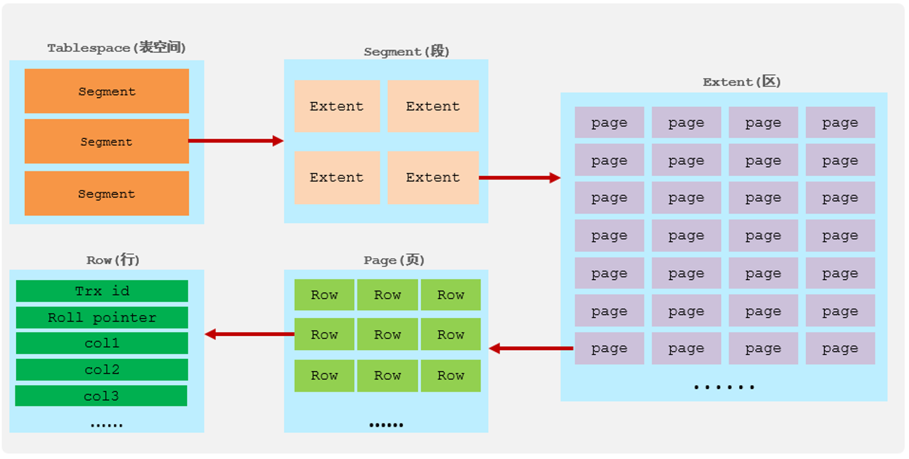
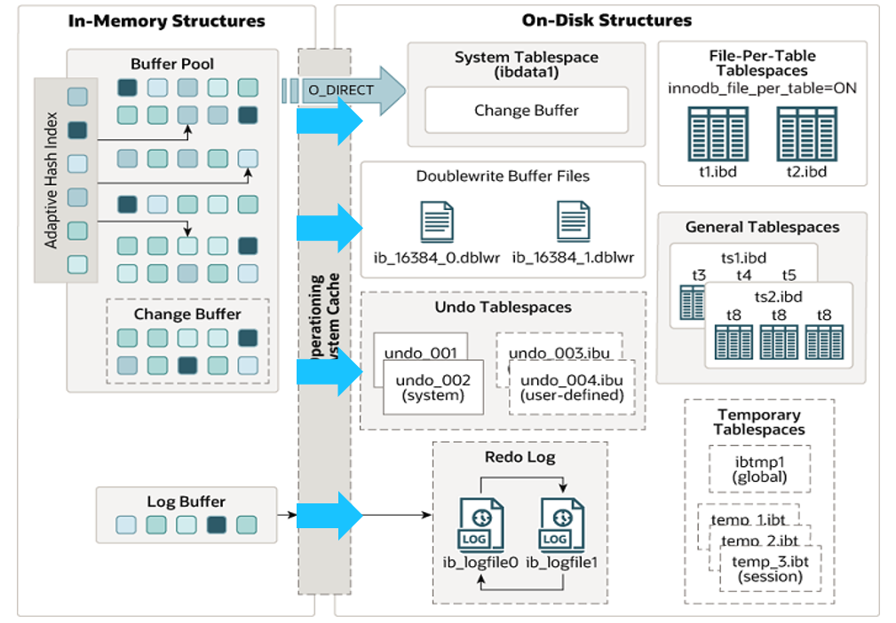
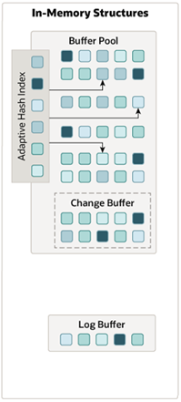
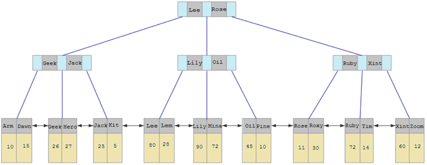
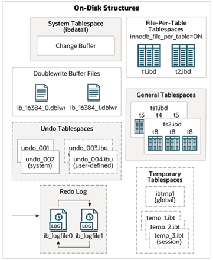
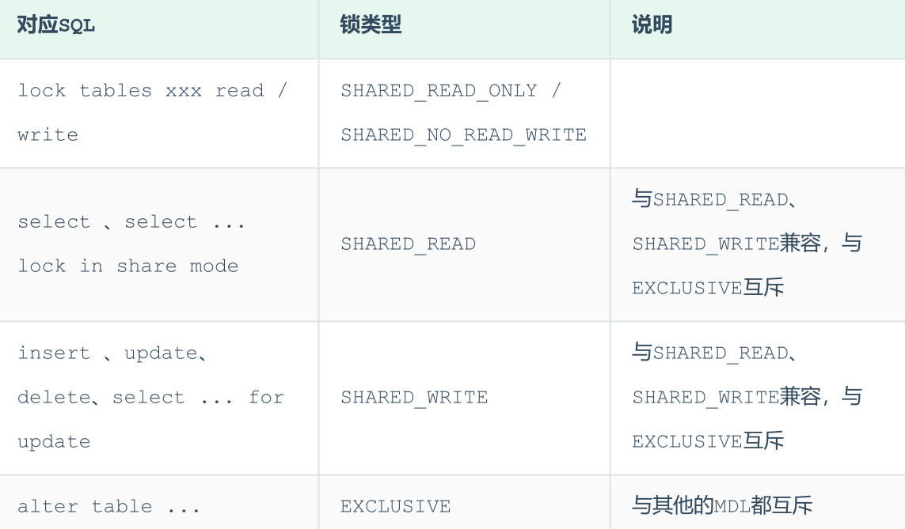
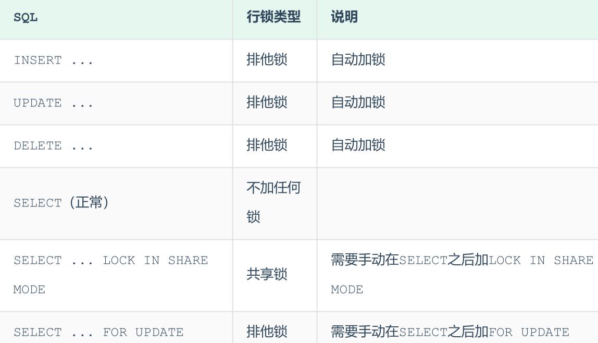
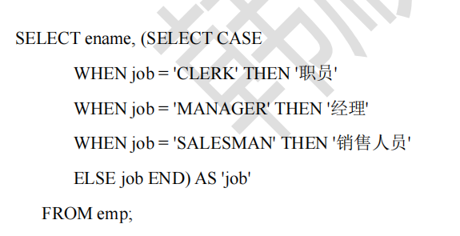
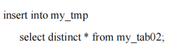

# 理论

## 架构

### MySQL架构


1). 连接层
最上层是一些客户端和链接服务，包含本地sock 通信和大多数基于客户端/服务端工具实现的类似于TCP/IP的通信。主要完成一些类似于连接处理、授权认证、及相关的安全方案。在该层上引入了线程池的概念，为通过认证安全接入的客户端提供线程。同样在该层上可以实现基于SSL的安全链接。服务器也会为安全接入的每个客户端验证它所具有的操作权限。
2). 服务层
第二层架构主要完成大多数的核心服务功能，如SQL接口，并完成缓存的查询，SQL的分析和优化，部分内置函数的执行。所有跨存储引擎的功能也在这一层实现，如 过程、函数等。在该层，服务器会解析查询并创建相应的内部解析树，并对其完成相应的优化如确定表的查询的顺序，是否利用索引等，最后生成相应的执行操作。如果是select语句，服务器还会查询内部的缓存，如果缓存空间足够大，这样在解决大量读操作的环境中能够很好的提升系统的性能。

Server 层包括：连接器、查询缓存、分析器、优化器、执行器等，涵盖了 MySQL 的大多数核心服务功能，以及所有的内置函数（如：日期、时间、数学和加密函数等），所有跨存储引擎的功能都在这一层实现，比如：存储过程、触发器、视图等等。

3). 引擎层
存储引擎层， 存储引擎真正的负责了MySQL中数据的存储和提取，服务器通过API和存储引擎进行通信。不同的存储引擎具有不同的功能，这样我们可以根据自己的需要，来选取合适的存储引擎。数据库中的索引是在存储引擎层实现的。

存储引擎层负责：数据的存储和提取。其架构是插件式的，支持 InnoDB、MyISAM 等多个存储引擎。从 MySQL5.5.5 版本开始默认的是InnoDB，但是在建表时可以通过 engine = MyISAM 来指定存储引擎，不同存储引擎的表数据存取方式不同，支持的功能也不同。

4). 存储层
数据存储层， 主要是将数据(如: redolog、undolog、数据、索引、二进制日志、错误日志、查询日志、慢查询日志等)存储在文件系统之上，并完成与存储引擎的交互。和其他数据库相比，MySQL有点与众不同，它的架构可以在多种不同场景中应用并发挥良好作用。主要
体现在存储引擎上，插件式的存储引擎架构，将查询处理和其他的系统任务以及数据的存储提取分离。这种架构可以根据业务的需求和实际需要选择合适的存储引擎。

### Mysql定义

- 1.所谓安装Mysql数据库，就是在主机安装一个数据库管理系统（DBMS），这个管理程序可以管理多个数据库。DBMS（database manage system）

- 2.一个数据库中可以创建多个表，以保存数据（信息）。

- 3.数据库管理系统（DBMS）、数据库和表的关系如图所示∶

- 

### 物理文件

- 日志文件

  - 错误日志（Error Log）
    - 记录了mysql运行过程中较为严重的警告和错误信息以及Mysql每次启动和关闭的详细信息，利用 MySQL 的 FLUSH LOGS 命令来告诉 MySQL 备份旧日志文件并生成新的日志文件。 备份文件名以“.old”结尾。

  - 二进制日志：Binary Log & Binary Log Index

    - 打开了记录的功能之后，MySQL 会将所有修改数据 库数据的 query 以二进制形式记录到日志文件中。当然，日志中并不仅限于 query 语句简单，还包括每一条 query 所执行的时间，所消耗的资源，以及相关的事务信息，所以 binlog 是事务安全的。

    - binlog 还有其他一些附加选项参数：

      - ​        “--max_binlog_size”设置 binlog 的最大存储上限，当日志达到该上限时，MySQL 会 重新创建一个日志开始继续记录。不过偶尔也有超出该设置的 binlog 产生，一般都是因为 在即将达到上限时，产生了一个较大的事务，为了保证事务安全，MySQL 不会将同一个事务 分开记录到两个 binlog 中。

      - ​        “--binlog-do-db=db_name”参数明确告诉 MySQL，需要对某个（db_name）数据库记 录 binlog，如果有了“--binlog-do-db=db_name ” 参数的显式指定，MySQL 会忽略针对其他 数据库执行的 query，而仅仅记录针对指定数据库执行的 query。

      - ​        “--binlog-ignore-db=db_name ”与 “--binlog-do-db=db_name ” 完全相反，它显式指 定忽略某个（db_name）数据库的 binlog 记录，当指定了这个参数之后，MySQL 会记录指定 数据库以外所有的数据库的 binlog。

      - ​        “--binlog-ignore-db=db_name”与“--binlog-do-db=db_name”两个参数有一个共同 的概念需要大家理解清楚，参数中的 db_name 不是指 query 语句更新的数据所在的数据库， 而是执行 query 的时候当前所处的数据库。不论更新哪个数据库的数据，MySQL 仅仅比较当 前连接所处的数据库（通过 use db_name 切换后所在的数据库）与参数设置的数据库名，而 不会分析 query 语句所更新数据所在的数据库。

  - 更新日志：update log
    - 更新日志是 MySQL 在较老的版本上使用的，类似binlog,但以简单文本格式记录内容

  - ​    查询日志：query log
    - 查询日志记录 MySQL 中所有的 query，开启后对性能影响比较大，一般只用于跟踪某些特殊的sql性能问题才会短暂打开

  - ​    慢查询日志：slow query log
    - 慢查询日志中记录的是执行时间较长的 query，慢查询日志采用的是简单的文本格式，其中记录了语句执行的时刻，执行所消耗的时间、执行用户、连接主机等，MySQL 还提 供了专门用来分析满查询日志的工具程序 mysqlslowdump

- 数据文件

  - 默认情况下，在mysql的data目录下会有以数据库名字命名的文件夹，用来存放该数据库中各种表数据文件，不同的 MySQL 存储引擎有各自不同 的数据文件，存放位置也有区别。多数存储引擎的数据文件都存放在和 MyISAM 数据文件位 置相同的目录下，但是每个数据文件的扩展名却各不一样。如 MyISAM 用“.MYD”作为扩展 名，Innodb 用“.ibd ” ，Archive 用“.arc ” ，CSV 用“.csv ” ，等等

  - ​    .frm文件：存储与表相关的元数据（meta）信息，包括表结构的定义信息等

  - ​    .MYD文件：是 MyISAM 存储引擎专用，存放 MyISAM 表的数据。每一个 MyISAM 表都会 有一个 “.MYD ” 文件与之对应

  - ​    .MYI文件：专属于 MyISAM 存储引擎，主要存放MyISAM表的索引相关信息

  - ​    .ibd文件和ibdata文件：存放Innodb数据的文件，Innodb的数据存储方式能够通过配置来决定是使用共享表空间存放存储数据，还是独享表空间存放存储数据。

    - ​        独享表空间存储方式使用.ibd文件，每个表一个".ibd"文件

    - ​        共享存储表空间则使用ibdata文件来存放，所有表共同使用一个（或多个，可自行配置）ibdata文件

-  Replication文件

  - ​    master.info:存在于Slave端的数据目录，存放了该Slave的Master端的相关信息，包括Master的主机地址，连接用户，连接端口，当前日志位置，已经读取到的日志位置等

  - ​    relay log 和 relay log index

    - ​        sql-relay-bin.xxxxxn 文件用于存放 Slave 端的 I/O 线程从 Master 端所读取到 的 Binary Log 信息，然后由 Slave 端的 SQL 线程从该 relay log 中读取并解析相应的 日志信息，转化成 Master 所执行的 SQL 语句，然后在 Slave 端应用。

    - ​        mysql-relay-bin.index 文件的功能类似于 mysql-bin.index ，同样是记录日志的存 放位置的绝对路径，只不过他所记录的不是 Binary Log，而是 Relay Log。

  - ​    relay-log.info 文件:类似于master.info,他存放通过Slave的I/O线程写入到本地的relay log的相关信息，供 Slave 端的 SQL 线程以及某些管理操作随时能够获取当前复制的相关信息

- 系统配置文件文件

  - ​     system config file（my.cnf）:包含多重参数选项组（group）,每一种参数组都通过中括号给定了固定的组名，常见的有

    - ​        [mysqld]：包括了mysqld 服务启动时候的初始化参数

    - ​        [client]：包含客户端工具程序可以读取的参数

### 文件类型

- .frm   ：表结构文件

- .ibd   ：表数据和索引文件

- .opt   ：存储默认字符集和字符校验规则

- .sql    ：数据库操作指令文件

### sql语句动词

- SELECT：用于从表中查询数据。

- INSERT：用于向表中插入新数据。

- UPDATE：用于更新表中已有的数据。

- DELETE：用于删除表中的数据。


- CREATE：用于创建新的数据库、表或视图。

- ALTER：用于修改数据库、表或视图的结构。

- DROP：用于删除数据库、表或视图。


- GRANT：用于授予用户或用户组对数据库、表或视图的访问权限。

- REVOKE：用于撤销用户或用户组对数据库、表或视图的访问权限。

### 语句分类

- DDL∶数据定义语句【create表，库..】

- DML∶数据操作语句【增加insert，修改update，删除delete】

- DQL∶数据查询语句【select】

- DCL∶数据控制语句【管理数据库∶比如用户权限 grant revoke】

### MySQL的语句执行过程

https://blog.csdn.net/pcwl1206/article/details/86137408

## 存储引擎

### 介绍

- InnoDB是MySQL的默认存储引擎，从5.5版本开始，它成为事务型数据库的首选引擎。InnoDB支持ACID事务，这意味着它可以保证数据库操作的一致性和完整性。此外，它采用行级锁定，使得多个事务可以同时对表中不同的行进行读写操作，从而提高了并发性能和并发处理能力。InnoDB还支持外键约束，可以定义表之间的关系并维护数据的完整性。其通过将数据和索引存储在同一个表空间中，实现了数据的一致性。当数据库崩溃后，可以通过日志文件进行恢复，保证数据的持久性和一致性。因此，InnoDB适用于需要事务支持且并发读写频率较高的场景。

- MyISAM是MySQL 5.5.5版本之前的默认存储引擎。它不支持事务，并且使用表级锁定机制。这意味着当对一个表进行写操作时，会锁定整个表，从而降低了并发性能。MyISAM支持全文索引，但不支持外键约束。它的读写操作在某些情况下会互相堵塞，例如写入时会阻塞读取，读取时也会阻塞写入。MyISAM引擎会将表存储在两个文件中，数据文件.MYD和索引文件.MYI。由于其访问速度较快，且占用资源相对较少，MyISAM适用于对事务完整性没有要求，且主要是读操作或表比较小、可以容忍修复操作的场景。

- Memory存储引擎将所有数据存放在主内存中，使用缓存技术来提升数据的查询效率。这使得MEMORY引擎具有极高的插入、更新和查询效率。然而，由于数据全部存储在内存中，当系统发生故障时，可能会导致数据丢失或损坏。因此，MEMORY引擎的安全性并不完全可靠。它适用于存储临时数据，如会话数据、缓存数据或频繁计算的中间结果。由于其在内存中操作，所以非常适合分布式应用。但需要注意的是，MEMORY引擎只支持等值比较，不支持范围查询和排序操作。

### 应用

1. InnoDB：
   - **应用场景**：适用于需要高可靠性和高性能的应用场景，如电子商务网站、金融系统等。
   - **特点**：InnoDB是MySQL的默认存储引擎，它提供了事务支持、行级锁定和外键约束。由于这些特性，InnoDB特别适合于需要事务安全性和并发控制的应用。此外，它还具有崩溃恢复能力，能更可靠地保护数据。
2. MyISAM：
   - **应用场景**：适用于只读或大量读操作的应用场景，如Web网站、日志系统等。
   - **特点**：MyISAM具有较高的查询性能，特别是对于读取操作。它不支持事务和外键，但提供了全文索引支持。MyISAM表通常占用的存储空间较小，适合于存储静态数据。
3. MEMORY：
   - **应用场景**：适用于需要快速访问且数据大小有限制的应用场景，如缓存、临时表等。
   - **特点**：MEMORY引擎将数据和索引存储在内存中，因此具有极高的访问速度。但由于数据存储在内存中，一旦MySQL服务器重启或崩溃，数据将丢失。因此，它不适合存储重要或需要持久化的数据。

## InnoDB引擎

### 逻辑存储结构



1). 表空间
表空间是InnoDB存储引擎逻辑结构的最高层， 如果用户启用了参数 innodb_file_per_table(在8.0版本中默认开启) ，则每张表都会有一个表空间（xxx.ibd），一个mysql实例可以对应多个表空间，用于存储记录、索引等数据。
2). 段
段，分为数据段（Leaf node segment）、索引段（Non-leaf node segment）、回滚段（Rollback segment），InnoDB是索引组织表，数据段就是B+树的叶子节点， 索引段即为B+树的非叶子节点。段用来管理多个Extent（区）。
3). 区
区，表空间的单元结构，每个区的大小为1M。 默认情况下， InnoDB存储引擎页大小为16K， 即一个区中一共有64个连续的页。
4). 页
页，是InnoDB 存储引擎磁盘管理的最小单元，每个页的大小默认为 16KB。为了保证页的连续性，InnoDB 存储引擎每次从磁盘申请 4-5 个区。
5). 行
行，InnoDB 存储引擎数据是按行进行存放的。

在行中，默认有两个隐藏字段：

Trx_id：每次对某条记录进行改动时，都会把对应的事务id赋值给trx_id隐藏列。
Roll_pointer：每次对某条引记录进行改动时，都会把旧的版本写入到undo日志中，然后这个隐藏列就相当于一个指针，可以通过它来找到该记录修改前的信息。

### 结构



### 内存结构



#### 1). Buffer Pool

InnoDB存储引擎基于磁盘文件存储，访问物理硬盘和在内存中进行访问，速度相差很大，为了尽可能弥补这两者之间的I/O效率的差值，就需要把经常使用的数据加载到缓冲池中，避免每次访问都进行磁盘I/O。
在InnoDB的缓冲池中不仅缓存了索引页和数据页，还包含了undo页、插入缓存、自适应哈希索引以及InnoDB的锁信息等等。
缓冲池 Buffer Pool，是主内存中的一个区域，里面可以缓存磁盘上经常操作的真实数据，在执行增删改查操作时，先操作缓冲池中的数据（若缓冲池没有数据，则从磁盘加载并缓存），然后再以一定频率刷新到磁盘，从而减少磁盘IO，加快处理速度。
缓冲池以Page页为单位，底层采用链表数据结构管理Page。根据状态，将Page分为三种类型：
• free page：空闲page，未被使用。
• clean page：被使用page，数据没有被修改过。
• dirty page：脏页，被使用page，数据被修改过，数据与磁盘的数据产生了不一致。
在专用服务器上，通常将多达80％的物理内存分配给缓冲池 。参数设置： show variables like 'innodb_buffer_pool_size';

#### 2). Change Buffer

Change Buffer，更改缓冲区（针对于非唯一二级索引页），在执行DML语句时，如果这些数据Page没有在Buffer Pool中，不会直接操作磁盘，而会将数据变更存在更改缓冲区 Change Buffer中，在未来数据被读取时，再将数据合并恢复到Buffer Pool中，再将合并后的数据刷新到磁盘中。
Change Buffer的意义是什么呢?
先来看一幅图，这个是二级索引的结构图：



与聚集索引不同，二级索引通常是非唯一的，并且以相对随机的顺序插入二级索引。同样，删除和更新
可能会影响索引树中不相邻的二级索引页，如果每一次都操作磁盘，会造成大量的磁盘IO。有了
ChangeBuffer之后，我们可以在缓冲池中进行合并处理，减少磁盘IO。

#### 3). Adaptive Hash Index

自适应hash索引，用于优化对Buffer Pool数据的查询。MySQL的innoDB引擎中虽然没有直接支持hash索引，但是给我们提供了一个功能就是这个自适应hash索引。因为前面我们讲到过，hash索引在进行等值匹配时，一般性能是要高于B+树的，因为hash索引一般只需要一次IO即可，而B+树，可能需要几次匹配，所以hash索引的效率要高，但是hash索引又不适合做范围查询、模糊匹配等。
InnoDB存储引擎会监控对表上各索引页的查询，如果观察到在特定的条件下hash索引可以提升速度，则建立hash索引，称之为自适应hash索引。
自适应哈希索引，无需人工干预，是系统根据情况自动完成。
参数： adaptive_hash_index

#### 4). Log Buffer

Log Buffer：日志缓冲区，用来保存要写入到磁盘中的log日志数据（redo log 、undo log），默认大小为 16MB，日志缓冲区的日志会定期刷新到磁盘中。如果需要更新、插入或删除许多行的事务，增加日志缓冲区的大小可以节省磁盘 I/O。
参数:
innodb_log_buffer_size：缓冲区大小
innodb_flush_log_at_trx_commit：日志刷新到磁盘时机，取值主要包含以下三个：
1: 日志在每次事务提交时写入并刷新到磁盘，默认值。
0: 每秒将日志写入并刷新到磁盘一次。
2: 日志在每次事务提交后写入，并每秒刷新到磁盘一次。

### 磁盘结构



##### 1). System Tablespace

系统表空间

是更改缓冲区的存储区域。如果表是在系统表空间而不是每个表文件或通用表空间中创建的，它也可能包含表和索引数据。(在MySQL5.x版本中还包含InnoDB数据字典、undolog等)

### 后台线程


## 索引

### 数据结构

- 二叉树

- 平衡二叉树

- 平衡二叉搜索树

- 红黑树：https://blog.csdn.net/cy973071263/article/details/122543826

- B树

- B+树

### 建立索引的原则：

1. 在最频繁使用的、用以缩小查询范围的字段上建立索引；
2. 在频繁使用的、需要排序的字段上建立索引。

1). 针对于数据量较大，且查询比较频繁的表建立索引。
2). 针对于常作为查询条件（where）、排序（order by）、分（group by）操作的字段建立索引。
3). 尽量选择区分度高的列作为索引，尽量建立唯一索引，区分度越高使用索引的效率越高。
4). 如果是字符串类型的字段，字段的长度较长，可以针对于字段的点，建立前缀索引。
5). 尽量使用联合索引，减少单列索引，查询时，联合索引很多时候可覆盖索引，节省存储空间，避免回表，提高查询效率。
6). 要控制索引的数量，索引并不是多多益善，索引越多，维护索引结构的代价也就越大，会影响增删改的效率。
7). 如果索引列不能存储NULL值，请在创建表时使用NOT NULL约束它。当优化器知道每列是否包含NULL值时，它可以更好地确定哪个索引最有效地用于查询。

### 不适合建立索引的情况：

1. 对于查询中很少涉及的列或者重复值比较多的列，不宜建立索引；
2. 对于一些特殊的数据类型，不宜建立索引，比如：文本字段（text）等。
3. 创建索引和维护索引需要耗费时间，这个时间随着数据量的增加而增加；索引需要占用物理空间，不光是表需要占用数据空间，每个索引也需要占用物理空间；当对表进行增、删、改、的时候索引也要动态维护，这样就降低了数据的维护速度。

### 索引类型

#### 聚簇索引与非聚簇索引

1. **聚簇索引（Clustered Index）**：
   - 聚簇索引是一种特殊的索引，它定义了数据在磁盘上的物理存储顺序，因此表中的数据行实际上按照聚簇索引的顺序进行存储。
   - 在聚簇索引中，索引的叶子节点包含了实际的数据行，因此在使用聚簇索引进行查询时，数据库可以直接通过索引定位到具体的数据行，而不需要再进行一次额外的查找。
   - 每个表只能有一个聚簇索引，通常是主键或唯一约束上创建的索引。
2. **非聚簇索引（Non-Clustered Index）**：
   - 非聚簇索引不会改变数据在磁盘上的物理存储顺序，而是在另外的数据结构中维护索引与数据行之间的映射关系。
   - 在非聚簇索引中，索引的叶子节点并不包含实际的数据行，而是存储着指向对应数据行的指针（或者叫做行标识符）。
   - 一个表可以有多个非聚簇索引，它们可以加速基于不同列的查询、排序和连接操作。

聚簇索引的优势在于能够直接定位到数据行，因此适合于范围查询和顺序访问，但是在插入和更新时可能需要移动数据，影响性能。而非聚簇索引则可以加速特定列的查询，但是查询过程需要进行两次查找（首先通过索引找到数据行的位置，然后再根据指针找到具体的数据行），因此在一些情况下查询性能可能略逊于聚簇索引。

#### 哈希索引

哈希索引能以 O(1) 时间进行查找，但是失去了有序性。无法用于排序与分组、只支持精确查找，无法用于部分查找和范围查找。

InnoDB 存储引擎有一个特殊的功能叫“自适应哈希索引”，当某个索引值被使用的非常频繁时，会在 B+ 树索引之上再创建一个哈希索引，这样就让 B+Tree 索引具有哈希索引的一些优点，比如：快速的哈希查找。

#### 覆盖索引

覆盖索引（Covering Index）是MySQL中的一种优化手段，它可以提高查询性能。当一个查询只需要访问索引中的信息，而无需回表到数据行中获取其他数据时，我们称这个索引为覆盖索引。换句话说，如果一个索引包含了查询所需的所有数据，MySQL就可以仅通过查询索引来满足请求，而无需再回表查询数据。

##### 优势：

1. **减少I/O操作**：因为查询只需要访问索引，所以减少了从磁盘读取数据行的次数。
2. **提高查询速度**：索引通常比数据行小，且是排序的，所以访问速度更快。
3. **减少CPU和内存的使用**：因为查询无需将数据行加载到内存中，所以减少了CPU和内存的使用。

##### 如何创建和使用覆盖索引：

1. **分析查询**：首先，你需要分析你的查询，确定哪些列是查询中需要的。
2. **创建索引**：然后，创建一个包含这些列的索引。确保索引中的列顺序与查询中的列顺序相匹配，以优化性能。
3. **优化查询**：确保查询语句能够利用覆盖索引。有时，调整查询的写法或结构可以使其更好地利用索引。

##### 示例：

假设你有一个名为`users`的表，其中包含`id`、`name`和`email`三个列。你经常需要查询用户的名字和电子邮件，但不需要`id`。

你可以创建一个覆盖索引如下：

```sql
CREATE INDEX idx_name_email ON users(name, email);
```

然后，你可以使用以下查询来利用这个覆盖索引：

```sql
SELECT name, email FROM users WHERE name = 'John Doe';
```

在这个例子中，查询只需要访问`idx_name_email`索引来获取`name`和`email`的值，而无需回表到`users`表中。

##### 注意事项：

- 虽然覆盖索引可以提高性能，但它们也会占用额外的磁盘空间。因此，在创建覆盖索引之前，你应该权衡其好处和成本。
- 不是所有的查询都能利用覆盖索引。确保你的查询确实只需要索引中的信息。
- 在某些情况下，即使存在覆盖索引，MySQL优化器也可能选择不使用它，而是选择全表扫描或其他执行计划。这取决于数据的分布、统计信息以及查询的复杂性等因素。你可以使用`EXPLAIN`语句来查看MySQL是如何执行你的查询的。

#### 联合索引

https://blog.csdn.net/weixin_43935927/article/details/109361168

##### 最左前缀原则

（Leftmost Prefix Rule）是数据库联合索引（复合索引）的一个重要概念。它指的是在查询中使用联合索引时，查询条件必须包含索引的最左侧列，才能确保索引被有效利用。换句话说，如果联合索引包含了多个列，那么查询条件中必须至少包含这些列中的最左侧列，索引才能正常工作。

例如，假设有一个联合索引是基于列(A, B, C)创建的。根据最左前缀原则：

- 查询条件只包含列A时，索引可以被使用。
- 查询条件包含列A和B时，索引也可以被使用。
- 查询条件包含列A、B和C时，索引同样可以被使用。

但是，如果查询条件中不包含列A，而只包含列B或列C，或者包含列B和列C但不包含列A，那么联合索引可能不会被使用，或者不会被完全利用。这是因为索引是按照最左侧的列构建的，如果查询条件没有包含最左侧的列，那么数据库系统就无法有效地利用索引来加速查询。

最左前缀原则的目的是确保数据库系统能够高效地利用联合索引来减少需要扫描的数据行数，从而提高查询性能。因此，在设计联合索引和编写查询时，需要仔细考虑查询条件和数据访问模式，以确保能够充分利用联合索引的优势。

需要注意的是，最左前缀原则并不意味着查询条件中必须包含联合索引的所有列。只要查询条件包含了最左侧的列，并且这些列的顺序与索引中的顺序一致（或者查询优化器能够重新排序以匹配索引），那么就可以利用联合索引来加速查询。但是，如果查询条件跳过了联合索引中的某些列，那么这些被跳过的列上的索引将不会被使用。

#### 前缀索引

当字段类型为字符串（varchar，text，longtext等）时，有时候需要索引很长的字符串，这会让索引变得很大，查询时，浪费大量的磁盘IO， 影响查询效率。此时可以只将字符串的一部分前缀，建立索引，这样可以大大节约索引空间，从而提高索引效率。

### 索引失效

函数

计算

模糊查询


1. **字符串函数**：对索引列使用字符串函数，如`UPPER()`, `LOWER()`, `TRIM()`, `SUBSTRING()`, `CONCAT()`等。例如，`WHERE UPPER(name) = 'JOHN'`这样的查询会使索引失效。
2. **数值函数**：对数值型索引列使用数学函数或表达式，如`ABS()`, `CEIL()`, `FLOOR()`, `ROUND()`等。
3. **日期和时间函数**：对日期或时间类型的索引列使用函数，如`YEAR()`, `MONTH()`, `DAY()`, `NOW()`, `DATE_ADD()`, `DATEDIFF()`等。例如，`WHERE YEAR(created_at) = 2023`这样的查询可能不会使用`created_at`列上的索引。
4. **类型转换函数**：当查询条件中的数据类型与索引列的数据类型不匹配时，MySQL可能会进行隐式类型转换，这通常会导致索引失效。例如，如果索引列是整数类型，但查询中使用了字符串来表示该值，则可能导致索引失效。
5. **LIKE操作符的模糊查询**：当使用`LIKE`操作符进行模糊查询，并且通配符`%`位于模式的开头时，MySQL无法利用索引。例如，`WHERE name LIKE '%John'`这样的查询不会使用`name`列上的索引。
6. **计算或表达式**：在查询条件中对索引列进行计算或使用表达式，也会导致索引失效。
7. **不等于操作符**：在某些情况下，使用不等于操作符（`!=`或`<>`）进行过滤也可能导致索引失效，因为MySQL可能无法有效地利用索引来排除不匹配的行。
8. **OR条件**：当查询条件中包含多个OR连接的条件时，如果这些条件涉及的列不是同一个索引的一部分，那么索引可能不会被使用。

## SQL优化

### 性能分析

https://blog.csdn.net/weixin_52690231/article/details/123475161

#### 慢查询日志

日志信息：默认记录执行时间超过十秒的sql语句

##### 使用日志：

1、编辑配置文件（/etc/my.cnf）

2、配置信息

```
#开启
slow_query_log=1

#时间为2s
long_query_time=2
```

##### 查看日志：

var/lib/mysql/localhost-slow.log

#### profile

##### 配置：

##### 使用：show profiles

#### explain

https://zhuanlan.zhihu.com/p/71616887

### 定位慢查询

- 慢查询表现

  - 聚合查询

  - 多表查询

  - 表数据量过大查询

  - 深度分页查询

- 慢查询分析与优化
  - https://blog.csdn.net/love7489/article/details/137365345

### 插入优化

如果一次性需要插入大批量数据(比如: 几百万的记录)，使用insert语句插入性能较低，此时可以使用MySQL数据库提供的load指令进行插入。

```
-- 客户端连接服务端时，加上参数 -–local-infile
mysql –-local-infile -u root -p
-- 设置全局参数local_infile为1，开启从本地加载文件导入数据的开关
set global local_infile = 1;
-- 执行load指令将准备好的数据，加载到表结构中
load data local infile '/root/sql1.log' into table tb_user fields terminated by ',' lines terminated by '\n' ;
```

### 主键优化

主键顺序插入

##### 主键设计原则

满足业务需求的情况下，尽量降低主键的长度。
插入数据时，尽量选择顺序插入，选择使用AUTO_INCREMENT自增主键。
尽量不要使用UUID做主键或者是其他自然主键，如身份证号。
业务操作时，避免对主键的修改。

### order by优化

MySQL的排序，有两种方式：
Using filesort : 通过表的索引或全表扫描，读取满足条件的数据行，然后在排序缓冲区sortbuffer中完成排序操作，所有不是通过索引直接返回排序结果的排序都叫 FileSort 排序。
Using index : 通过有序索引顺序扫描直接返回有序数据，这种情况即为 using index，不需要额外排序，操作效率高。
对于以上的两种排序方式，Using index的性能高，而Using filesort的性能低，我们在优化排序操作时，尽量要优化为 Using index。

### 优化原则

**减少请求的数据量**

1. 只返回必要的列：最好不要使用 SELECT * 语句。
2. 只返回必要的行：使用 LIMIT 语句来限制返回的数据。
3. 缓存重复查询的数据：使用缓存可以避免在数据库中进行查询，特别在要查询的数据经常被重复查询时，缓存带来的查询性能提升将会是非常明显的。

**减少服务器端扫描的行数**

1. 最有效的方式是使用索引来覆盖查询。

## 事务

#### ACID

- 原子性（Atomicity）：
  - 事务被视为一个最小的工作单元，不可分割。事务中的操作要么全部完成，要么全部不做。如果事务中的某个操作失败，那么整个事务都会回滚到事务开始之前的状态，就像这个事务从来没有执行过一样。原子性确保了事务的完整性，防止了系统处于不一致或部分完成的状态。

- 一致性（Consistency）：
  - 事务必须使数据库从一个一致性状态变换到另一个一致性状态。也就是说，一个事务执行之前和执行之后，数据库都必须处于一致性状态。这意味着数据的完整性约束没有被破坏，比如外键约束、唯一性约束等。

- 隔离性（Isolation）：
  - 隔离性是指多个事务并发执行时，一个事务的执行不应影响其他事务。事务看到的数据应当是一致性的，就好像并发事务是串行执行的一样。这通常是通过锁机制或其他并发控制机制来实现的，以确保每个事务在独立的空间内执行，不会相互干扰。

- 持久性（Durability）：
  - 一旦事务提交，则其结果就是永久性的，即使系统崩溃也不会丢失。这通常是通过将事务的日志写入磁盘或其他持久化存储介质来保障的，以确保在系统故障后能够恢复数据到一致的状态。

#### 隔离级别

##### 隔离问题

**丢失更新**：最后提交事务的执行结果覆盖了前面提交事务的执行结果，从而导致前面事务的更新被丢失

它发生在两个或更多的事务同时更新同一条数据记录时，后一个事务的更新覆盖了前一个事务的更新，从而导致前一个事务的更新“丢失”。

1. **第一类丢失更新（回滚丢失）**：当事务1在撤销（回滚）时，它可能会覆盖掉事务2已经提交的更新。
2. **第二类丢失更新（覆盖丢失）**：事务2在更新数据时可能会覆盖掉事务1已经提交的更新，从而导致事务1的更新操作丢失。

**脏读**：一个事务读取了另一个尚未提交的事务的修改。如果那个事务回滚，那么当前事务读取到的数据就是“脏”的。

**不可重复读**：在一个事务内，多次读取同一数据返回不同的结果，因为另一个事务在此期间修改了该数据并提交了修改。（同一列数据不同）

**幻读**：在一个事务内执行相同的查询，但由于另一个并发事务的插入或删除操作，返回了不同的行数。（列数发生变化）


##### 隔离级别

**READ UNCOMMITTED（读未提交）**

- 最低的事务隔离级别。
- 一个事务可以读取另一个尚未提交的事务的修改。
- 读未提交：表示一个事务未提交，另一个事务就有影响·
- **问题**：可能导致脏读（dirty read）、不可重复读（non-repeatable read）和幻读（phantom read）。

**READ COMMITTED（读已提交）**

- 一个事务只能读取已经提交的事务的修改。
- 表示一个事务已提交，对另一个事务重复查询的结果有影响
- **问题**：可能导致不可重复读和幻读。

**REPEATABLE READ（可重复读）**

- 这是MySQL的默认隔离级别（在InnoDB存储引擎中）。
- 在同一事务内，多次读取同一数据会返回相同的结果。
- 表示一个事务提交，对另一个事务查询无影响
- **问题**：可能导致幻读。

**SERIALIZABLE（串行化）**

- 最高的隔离级别。
- 加锁后，只有当事务提交后，另一个事务才可以操作该表。
- 通过对事务进行排序，强制事务串行执行，从而解决了脏读、不可重复读和幻读的问题。
- **问题**：性能开销最大，因为它实质上禁止了并发执行。

#### 事务原理

原子性、一致性、持久化，实际上是由InnoDB中的两份日志来保证的，一份是redo log日志，一份是undo log日志。 而持久性是通过数据库的锁，加上MVCC来保证的。


### MVCC

#### 隐藏字段


#### undo log


#### readview


## 锁

锁是计算机协调多个进程或线程并发访问某一资源的机制。在数据库中，除传统的计算资源（CPU、RAM、I/O）的争用以外，数据也是一种供许多用户共享的资源。如何保证数据并发访问的一致性、有效性是所有数据库必须解决的一个问题，锁冲突也是影响数据库并发访问性能的一个重要因素。从这个角度来说，锁对数据库而言显得尤其重要，也更加复杂。
MySQL中的锁，按照锁的粒度分，分为以下三类：
	全局锁：锁定数据库中的所有表。
	表级锁：每次操作锁住整张表。
	行级锁：每次操作锁住对应的行数据。

### 全局锁

全局锁就是对整个数据库实例加锁，加锁后整个实例就处于只读状态，后续的DML的写语句，DDL语句，已经更新操作的事务提交语句都将被阻塞。
其典型的使用场景是做全库的逻辑备份，对所有的表进行锁定，从而获取一致性视图，保证数据的完整性。

#### 语法

```
1). 加全局锁
flush tables with read lock ;
2). 数据备份
mysqldump -uroot –p1234 itcast > itcast.sql
3). 释放锁
unlock tables ;
```

#### 特点

数据库中加全局锁，是一个比较重的操作，存在以下问题：
如果在主库上备份，那么在备份期间都不能执行更新，业务基本上就得停摆。
如果在从库上备份，那么在备份期间从库不能执行主库同步过来的二进制日志（binlog），会导致主从延迟。
在InnoDB引擎中，我们可以在备份时加上参数 --single-transaction 参数来完成不加锁的一致性数据备份。

### 表级锁

#### 介绍：

表级锁，每次操作锁住整张表。锁定粒度大，发生锁冲突的概率最高，并发度最低。应用在MyISAM、InnoDB、BDB等存储引擎中。有三大类

##### 表锁

表共享读锁（read lock）
表独占写锁（write lock）

语法：
加锁：lock tables 表名... read/write。
释放锁：unlock tables / 客户端断开连接 。

##### 元数据锁

meta data lock , 元数据锁，简写MDL。
MDL加锁过程是系统自动控制，无需显式使用，在访问一张表的时候会自动加上。MDL锁主要作用是维护表元数据的数据一致性，在表上有活动事务的时候，不可以对元数据进行写入操作。为了避免DML与DDL冲突，保证读写的正确性。
这里的元数据，可以简单理解为就是一张表的表结构。 也就是说，某一张表涉及到未提交的事务时，是不能够修改这张表的表结构的。
在MySQL5.5中引入了MDL，当对一张表进行增删改查的时候，加MDL读锁(共享)；当对表结构进行变更操作的时候，加MDL写锁(排他)。
常见的SQL操作时，所添加的元数据锁：



#### 意向锁

为了避免DML在执行时，加的行锁与表锁的冲突，在InnoDB中引入了意向锁，使得表锁不用检查每行数据是否加锁，使用意向锁来减少表锁的检查。


原理：

客户端一，在执行DML操作时，会对涉及的行加行锁，同时也会对该表加上意向锁。

而其他客户端，在对这张表加表锁的时候，会根据该表上所加的意向锁来判定是否可以成功加表锁，而不用逐行判断行锁情况了。

分类
意向共享锁(IS): 由语句select ... lock in share mode添加 。 与 表锁共享锁(read)兼容，与表锁排他锁(write)互斥。
意向排他锁(IX): 由insert、update、delete、select...for update添加 。与表锁共享锁(read)及排他锁(write)都互斥，意向锁之间不会互斥。

### 行级锁

行级锁，每次操作锁住对应的行数据。锁定粒度最小，发生锁冲突的概率最低，并发度最高。应用在InnoDB存储引擎中。
InnoDB的数据是基于索引组织的，行锁是通过对索引上的索引项加锁来实现的，而不是对记录加的锁。对于行级锁，主要分为以下三类：

#### 行锁（Record Lock）：

锁定单个行记录的锁，防止其他事务对此行进行update和delete。在RC、RR隔离级别下都支持。



#### 间隙锁（Gap Lock）：

锁定索引记录间隙（不含该记录），确保索引记录间隙不变，防止其他事务在这个间隙进行insert，产生幻读。在RR隔离级别下都支持。

#### 临键锁（Next-Key Lock）：

行锁和间隙锁组合，同时锁住数据，并锁住数据前面的间隙Gap。在RR隔离级别下支持。

# 语法

## 库、表、列

### 字符集

- 意义：

  - 字符集规定了字符在数据库中的存储格式，比如占多少空间，支持哪些字符等等

- 规则：

  - 如果系统开发面向国外业务，需要处理不同国家、不同语言，则应该选择utf-8或者utf8mb4

  -  如果只需要支持中文，没有国外业务，则为了性能考虑，可以采用GBK

- 类型：

- 操作

  - 查看字符集

    - 查看MYSQL数据库服务器和数据库字符集

    - 查看库的字符集

    - 查看表的字符集

    - 查看表中所有列的字符集

  - 设置字符集

    - 创建库的时候指定字符集：

    - 创建表的时候指定字符集：

    - 修改字符集

### 校对规则

- 意义：用于比较特定字符集中的字符的一组规则

- 查看校对规则
  - SHOW CHARACTER SET

### 存储引擎

#### 概念：

- 数据库管理系统（DBMS）使用数据引擎进行创建、查询、更新和删除数据。

- 不同的存储引擎提供不同的存储机制、索引技巧、锁定水平等功能，使用不同的存储引擎，还可以获得特定的功能。

- 现在许多不同的数据库管理系统都支持多种不同的数据引擎。

- 因为在关系数据库中数据的存储是以表的形式存储的，所以存储引擎也可以称为表类型(Table Type，即存储和操作此表的类型)。

#### 类别：

##### MyISAM

- MyISAM基于ISAM存储引擎，并对其进行扩展。它是在Web、数据仓储和其他应用环境下最常使用的存储引擎之一。MyISAM拥有较高的插入、查询速度，但不支持事务和外键。

- MyISAM主要特性有：

  - 1、大文件（达到63位文件长度）在支持大文件的文件系统和操作系统上被支持

  - 2、当把删除和更新及插入操作混合使用的时候，动态尺寸的行产生更少碎片。这要通过合并相邻被删除的块，以及若下一个块被删除，就扩展到下一块自动完成

  - 3、每个MyISAM表最大索引数是64，这可以通过重新编译来改变。每个索引最大的列数是16

  - 4、最大的键长度是1000字节，这也可以通过编译来改变，对于键长度超过250字节的情况，一个超过1024字节的键将被用上

  - 5、BLOB和TEXT列可以被索引，支持FULLTEXT类型的索引，而InnoDB不支持这种类型的索引

  - 6、NULL被允许在索引的列中，这个值占每个键的0~1个字节

  - 7、所有数字键值以高字节优先被存储以允许一个更高的索引压缩

  - 8、每个MyISAM类型的表都有一个AUTO_INCREMENT的内部列，当INSERT和UPDATE操作的时候该列被更新，同时AUTO_INCREMENT列将被刷新。所以说，MyISAM类型表的AUTO_INCREMENT列更新比InnoDB类型的AUTO_INCREMENT更快

  - 9、可以把数据文件和索引文件放在不同目录

  - 10、每个字符列可以有不同的字符集

  - 11、有VARCHAR的表可以固定或动态记录长度

  - 12、VARCHAR和CHAR列可以多达64KB

- 存储格式：

  - 1、静态表（默认）：字段都是非变长的（每个记录都是固定长度的）。存储非常迅速、容易缓存，出现故障容易恢复；占用空间通常比动态表多。

  - 2、动态表：占用的空间相对较少，但是频繁的更新删除记录会产生碎片，需要定期执行optimize table或myisamchk -r命令来改善性能，而且出现故障的时候恢复比较困难。

  - 3、压缩表：使用myisampack工具创建，占用非常小的磁盘空间。因为每个记录是被单独压缩的，所以只有非常小的访问开支。

  - 静态表的数据在存储的时候会按照列的宽度定义补足空格，在返回数据给应用之前去掉这些空格。如果需要保存的内容后面本来就有空格，在返回结果的时候也会被去掉。（其实是数据类型char的行为，动态表中若有这个数据类型也同样会有这个问题）

  - 使用MyISAM引擎创建数据库，将产生3个文件。文件的名字以表名字开始，扩展名之处文件类型：frm文件存储表定义、数据文件的扩展名为.MYD（MYData）、索引文件的扩展名时.MYI（MYIndex）。

- 场景：如果表主要是用于插入新记录和读出记录，那么选择MyISAM能实现处理高效率。

##### InnoDB

- InnoDB是目前MYSQL的默认事务型引擎，是目前最重要、使用最广泛的存储引擎。支持事务安全表（ACID），支持行锁定和外键。

- InnoDB主要特性有：

  - 1、InnoDB给MySQL提供了具有提交、回滚和崩溃恢复能力的事物安全（ACID兼容）存储引擎。InnoDB锁定在行级并且也在SELECT语句中提供一个类似Oracle的非锁定读。这些功能增加了多用户部署和性能。在SQL查询中，可以自由地将InnoDB类型的表和其他MySQL的表类型混合起来，甚至在同一个查询中也可以混合

  - 2、InnoDB是为处理巨大数据量的最大性能设计。它的CPU效率可能是任何其他基于磁盘的关系型数据库引擎锁不能匹敌的

  - 3、InnoDB存储引擎完全与MySQL服务器整合，InnoDB存储引擎为在主内存中缓存数据和索引而维持它自己的缓冲池。InnoDB将它的表和索引在一个逻辑表空间中，表空间可以包含数个文件（或原始磁盘文件）。这与MyISAM表不同，比如在MyISAM表中每个表被存放在分离的文件中。InnoDB表可以是任何尺寸，即使在文件尺寸被限制为2GB的操作系统上

  - 4、InnoDB支持外键完整性约束，存储表中的数据时，每张表的存储都按主键顺序存放，如果没有显示在表定义时指定主键，InnoDB会为每一行生成一个6字节的ROWID，并以此作为主键

  - 5、InnoDB被用在众多需要高性能的大型数据库站点上

  - 6、InnoDB不创建目录，使用InnoDB时，MySQL将在MySQL数据目录下创建一个名为ibdata1的10MB大小的自动扩展数据文件，以及两个名为ib_logfile0和ib_logfile1的5MB大小的日志文件。

- 场景：由于其支持事务处理，支持外键，支持崩溃修复能力和并发控制。如果需要对事务的完整性要求比较高（比如银行），要求实现并发控制（比如售票），那选择InnoDB有很大的优势。如果需要频繁的更新、删除操作的数据库，也可以选择InnoDB，因为支持事务的提交（commit）和回滚（rollback）。

##### MEMORY

- MEMORY存储引擎将表中的数据存储到内存中，未查询和引用其他表数据提供快速访问。

- MEMORY主要特性有：

  - 1、MEMORY表的每个表可以有多达32个索引，每个索引16列，以及500字节的最大键长度

  - 2、MEMORY存储引擎执行HASH和BTREE缩影

  - 3、可以在一个MEMORY表中有非唯一键值

  - 4、MEMORY表使用一个固定的记录长度格式

  - 5、MEMORY不支持BLOB或TEXT列

  - 6、MEMORY支持AUTO_INCREMENT列和对可包含NULL值的列的索引

  - 7、MEMORY表在所由客户端之间共享（就像其他任何非TEMPORARY表）

  - 8、MEMORY表内存被存储在内存中，内存是MEMORY表和服务器在查询处理时的空闲中，创建的内部表共享

  - 9、当不再需要MEMORY表的内容时，要释放被MEMORY表使用的内存，应该执行DELETE FROM或TRUNCATE TABLE，或者删除整个表（使用DROP TABLE）

- MEMORY存储引擎默认使用哈希（HASH）索引，其速度比使用B-+Tree型要快，但也可以使用B树型索引。由于这种存储引擎所存储的数据保存在内存中，所以其保存的数据具有不稳定性，比如如果mysqld进程发生异常、重启或计算机关机等等都会造成这些数据的消失，所以这种存储引擎中的表的生命周期很短，一般只使用一次。现在mongodb、redis等NOSQL数据库愈发流行，MEMORY存储引擎的使用场景越来越少。

- 场景：如果需要该数据库中一个用于查询的临时表。

##### MERGE存储引擎

- MERGE存储引擎是一组MyISAM表的组合，这些MyISAM表结构必须完全相同，尽管其使用不如其它引擎突出，但是在某些情况下非常有用。说白了，Merge表就是几个相同MyISAM表的聚合器；Merge表中并没有数据，对Merge类型的表可以进行查询、更新、删除操作，这些操作实际上是对内部的MyISAM表进行操作。

- 场景：对于服务器日志这种信息，一般常用的存储策略是将数据分成很多表，每个名称与特定的时间端相关。例如：可以用12个相同的表来存储服务器日志数据，每个表用对应各个月份的名字来命名。当有必要基于所有12个日志表的数据来生成报表，这意味着需要编写并更新多表查询，以反映这些表中的信息。与其编写这些可能出现错误的查询，不如将这些表合并起来使用一条查询，之后再删除Merge表，而不影响原来的数据，删除Merge表只是删除Merge表的定义，对内部的表没有任何影响

ARCHIVE

- Archive是归档的意思，在归档之后很多的高级功能就不再支持了，仅仅支持最基本的插入和查询两种功能。在MySQL 5.5版以前，Archive是不支持索引，但是在MySQL 5.5以后的版本中就开始支持索引了。Archive拥有很好的压缩机制，它使用zlib压缩库，在记录被请求时会实时压缩，所以它经常被用来当做仓库使用。

- 场景：由于高压缩和快速插入的特点Archive非常适合作为日志表的存储引擎，但是前提是不经常对该表进行查询操作。

MRG_MYISAM

CSV

- 使用该引擎的MySQL数据库表会在MySQL安装目录data文件夹中的和该表所在数据库名相同的目录中生成一个.CSV文件（所以，它可以将CSV类型的文件当做表进行处理），这种文件是一种普通文本文件，每个数据行占用一个文本行。该种类型的存储引擎不支持索引，即使用该种类型的表没有主键列；另外也不允许表中的字段为null。csv的编码转换需要格外注意。

- 场景：这种引擎支持从数据库中拷入/拷出CSV文件。如果从电子表格软件输出一个CSV文件，将其存放在MySQL服务器的数据目录中，服务器就能够马上读取相关的CSV文件。同样，如果写数据库到一个CSV表，外部程序也可以立刻读取它。在实现某种类型的日志记录时，CSV表作为一种数据交换格式，特别有用。

BLACKHOLE存储引擎（黑洞引擎）

- 该存储引擎支持事务，而且支持mvcc的行级锁，写入这种引擎表中的任何数据都会消失，主要用于做日志记录或同步归档的中继存储，这个存储引擎除非有特别目的，否则不适合使用。

- 场景：如果配置一主多从的话，多个从服务器会在主服务器上分别开启自己相对应的线程，执行binlogdump命令而且多个此类进程并不是共享的。为了避免因多个从服务器同时请求同样的事件而导致主机资源耗尽，可以单独建立一个伪的从服务器或者叫分发服务器。

PERFORMANCE_SCHEMA存储引擎

- 该引擎主要用于收集数据库服务器性能参数。这种引擎提供以下功能：提供进程等待的详细信息，包括锁、互斥变量、文件信息；保存历史的事件汇总信息，为提供MySQL服务器性能做出详细的判断；对于新增和删除监控事件点都非常容易，并可以随意改变mysql服务器的监控周期，例如（CYCLE、MICROSECOND）。 MySQL用户是不能创建存储引擎为PERFORMANCE_SCHEMA的表。

- 场景： DBA能够较明细得了解性能降低可能是由于哪些瓶颈。

Federated存储引擎

- 该存储引擎可以不同的Mysql服务器联合起来，逻辑上组成一个完整的数据库。这种存储引擎非常适合数据库分布式应用。

- Federated存储引擎可以使你在本地数据库中访问远程数据库中的数据，针对federated存储引擎表的查询会被发送到远程数据库的表上执行，本地是不存储任何数据的。

- 缺点：

  - 1.对本地虚拟表的结构修改，并不会修改远程表的结构

  - 2.truncate 命令，会清除远程表数据

  - 3. drop命令只会删除虚拟表，并不会删除远程表

    

  - 4.不支持 alter table 命令

  - 5. select count(*), select * from limit M, N 等语句执行效率非常低，数据量较大时存在很严重的问题，但是按主键或索引列查询，则很快，

    - 如以下查询就非常慢（假设 id 为主索引）
      - select id from db.tablea where id >100 limit 10 ;

    - 而以下查询就很快：
      - select id from db.tablea where id >100 and id<150

  - 6. 如果虚拟虚拟表中字段未建立索引，而实体表中为此字段建立了索引，此种情况下，性能也相当差。但是当给虚拟表建立索引后，性能恢复正常。

    

  - 7. 类似 where name like "str%" limit 1 的查询，即使在 name 列上创建了索引，也会导致查询过慢，是因为federated引擎会将所有满足条件的记录读取到本地，再进行 limit 处理。

    

- 场景： dblink。

##### 总结

##### 

#### 操作：

- 查看存储引擎

- 查看默认存储引擎

- 修改默认存储引擎

- 修改存储引擎：

### 数据类型

#### 整型（xxxint）

- 总结

- 属性

  - M: 宽度(在0填充的时候才有意义，否则不需要指定)
    - 在 int(M) 中，M 的值跟 int(M) 所占多少存储空间并无任何关系。 int(3)、int(4)、int(8) 在磁盘上都是占用 4 bytes 的存储空间。

  - unsigned: 无符号类型(非负)

  - zerofill: 0填充,(如果某列是zerofill，那么默认就是无符号)，如果指定了zerofill只是表示不够M位时，用0在左边填充，如果超过M位，只要不超过数据存储范围即可

#### 位类型(bit)

- 意义：BIT数据类型可用来保存位字段值。BIT(M)类型允许存储M位值。M范围为1~64，默认为1。

- BIT其实就是存入二进制的值，类似010110。如果存入一个BIT类型的值，位数少于M值，则左补0。如果存入一个BIT类型的值，位数多于M值，MySQL的操作取决于此时有效的SQL模式：如果模式未设置，MySQL将值裁剪到范围的相应端点，并保存裁减好的值。如果模式设置为traditional(“严格模式”)，超出范围的值将被拒绝并提示错误，并且根据SQL标准插入会失败。

- 对于位字段，直接使用SELECT命令将不会看到结果，可以用bin()或hex()函数进行读取。

#### 浮点型（float和double）

- FLOAT(M,D)
  - (M,D)表示该值一共显示M位，其中D表示小数点后几位，M和D又称为精度和标度

- DOUBLE(M,D)
  - (M,D)表示该值一共显示M位，其中D表示小数点后几位，M和D又称为精度和标度

- 细节

  - 如果存储时，整数部分超出了范围（如上面的例子中，添加数值为1000.01），MySql就会报错，不允许存这样的值。如果存储时，小数点部分若超出范围，就分以下情况：若四舍五入后，整数部分没有超出范围，则只警告，但能成功操作并四舍五入删除多余的小数位后保存，例如在FLOAT(5,2)列内插入999.009，近似结果是999.01。若四舍五入后，整数部分超出范围，则MySql报错，并拒绝处理。如999.995和-999.995都会报错。

  - 小数类型，也可以加unsigned，但是不会改变数据范围，例如：float(3,2) unsigned仍然只能表示0-9.99的范围。

#### 定点数（decimal）

- 意义：
  - DECIMAL在MySQL内部以字符串形式存放，比浮点数更精确。定点类型占M+2个字节

- DECIMAL(M,D)

  - M是最大位数（精度）：范围是1到65，可不指定，默认值是10。

  - D是小数点右边的位数（小数位）：范围是0到30，并且不能大于M（超出范围会报错），可不指定，默认值是0

#### 日期时间类型（date,time,datetime,year）

- 总结

- 应用

  - 时间的值需要用单引号

  - 时间可以进行比较（单纯数字大的值越大）

#### 字符串（char,varchar,xxxtext）

- char([0~255])

  - 固定大小数字：编码，qq号，身份证用char

  - 一旦确定，该元素的字符占用就是固定的，也就是字节固定了

- varchar(0~65535)

  - 如果表的编码是 utf8 varchar(size) size = (65535-3) / 3 = 21844

  -  如果表的编码是 gbk varchar(size) size = (65535-3) / 2 = 32766

  - 文章用varchar

  - varchar预留3个字节记录存放长度

- text

  - 注意Text不能有默认值

  - TEXT                     0-2^16字节（不能有默认值大小）

  - MEDIUMTEXT 0-2^24 

  -  LONGTEXT      0~2^32

- char,varchar,text区别

  - char是一种固定长度的类型，varchar则是一种可变长度的类型，它们的区别是：

  - char如果不指定(M)则表示长度默认是1个字符。varchar必须指定(M)。

  - char(M)类型的数据列里，每个值都占用M个字符，如果某个长度小于M，MySQL就会在它的右边用空格字符补足（在检索操作中那些填补出来的空格字符将被去掉；如果存入时右边本身就带空格，检索时也会被去掉）；在varchar(M)类型的数据列里，每个值只占用刚好够用的字符再加上一个到两个用来记录其长度的字节（即总长度为L字符+1/2字字节）。[I1]

  - 由于某种原因char 固定长度，所以在处理速度上要比varchar快速很多，但相对费存储空间，所以对存储不大，但在速度上有要求的可以使用char类型，反之可以用varchar类型来实例。

  - text文本类型，可以存比较大的文本段，搜索速度稍慢，因此如果不是特别大的内容，建议使用char，varchar来代替。还有text类型不用加默认值，加了也没用。

- 哪些情况使用char更好

  - 一，存储很短的信息，比如门牌号码101，201……这样很短的信息应该用char，因为varchar还要占个byte用于存储信息长度，本来打算节约存储的现在得不偿失。

  - 二，固定长度的。比如使用uuid作为主键，那用char应该更合适。因为他固定长度，varchar动态根据长度的特性就消失了，而且还要占个长度信息。

  - 三，十分频繁改变的column。因为varchar每次存储都要有额外的计算，得到长度等工作，如果一个非常频繁改变的，那就要有很多的精力用于计算，而这些对于char来说是不需要的。

- 细节：

  - MyISAM和MEMORY存储引擎中无论使用char还是varchar其实都是作为char类型处理的。

  - 除此之外，建议使用varchar类型。特别是InnoDB存储引擎。

#### 二进制数据（xxxBlob、xxbinary）

- BINARY和VARBINARY类型类似于CHAR和VARCHAR类型，但是不同的是，它们存储的不是字符字符串，而是二进制串。所以它们没有字符集，并且排序和比较基于列值字节的数值值。当保存BINARY(M)值时，在它们右边填充0x00(零字节)值以达到指定长度。取值时不删除尾部的字节。比较时所有字节很重要（因为空格和0x00是不同的，0x00<空格），包括ORDER BY和DISTINCT操作。比如插入'a '会变成'a \0'。

- BLOB是一个二进制大对象，可以容纳可变数量的数据。有4种BLOB类型：TINYBLOB、BLOB、MEDIUMBLOB和LONGBLOB。它们只是可容纳值的最大长度不同。分别与四种TEXT类型：TINYTEXT、TEXT、MEDIUMTEXT和LONGTEXT对应有相同的最大长度和存储需求。在TEXT或BLOB列的存储或检索过程中，不存在大小写转换。BLOB和TEXT列不能有默认值。BLOB或TEXT对象的最大大小由其类型确定，但在客户端和服务器之间实际可以传递的最大值由可用内存数量和通信缓存区大小确定。你可以通过更改max_allowed_packet变量的值更改消息缓存区的大小，但必须同时修改服务器和客户端程序。

#### 枚举（enum）

- MySql中的ENUM是一个字符串对象，其值来自表创建时在列规定中显式枚举的一列值：

- 可以插入空字符串""和NULL（如果运行NULL的话）。

- 如果你将一个非法值插入ENUM(也就是说，允许的值列之外的字符串)，如果是严格模式，将不能插入，如果是非严格模式，将选用第一个元素代替，并警告。

- ENUM最多可以有65,535个成员，需要2个字节存储。

- 当创建表时，ENUM成员值的尾部空格将自动被删除。

- 值的索引规则如下：

  - 来自列规定的允许的值列中的值从1开始编号。

  - 空字符串错误值的索引值是0。

  - NULL值的索引是NULL。

####  集合（set）

- SET和ENUM类型非常类似，也是一个字符串对象，里面包含0~64个成员。

- SET和ENUM存储上有所不同，SET是根据成员的个数决定存储的字节数。

- SET和ENUM最主要的区别在于SET类型一次可以选择多个成员，而ENUM则只能选择一个。

#### NULL

- （1）所有的类型的值都可以是null，包括int、float等数据类型

- （2）空字符串””，不等于null，0也不等于null，false也不等于null

- （3）任何运算符,判断符碰到NULL,都得NULL

- （4）NULL的判断只能用is null,is not null

- （5）NULL 影响查询速度,一般避免使值为NULL

#### 总结：

### 系统指令

- SHOW STATUS︰列出 Server 的状态信息。

- SHOW VARIABLES︰列出 MySQL 系統参数值

- SHOW PROCESSLIST︰查看当前mysql查询进程

- SHOW GRANTS FOR user︰列出用户的授权命令

### 数据库指令

- 创建数据库

  - CREATE DATABASE [IF NOT EXIST] 数据库名字 [CHARACTER SET 基字符集]  [COLLATE 校对规则]  (红色必写项，其他可选项）

    - [IF NOT EXIST] 

    - [CHARACTER SET 基字符集] 

    - [COLLATE 校对规则]

- 删除数据库
  - DROP DATABASE[IF EXIST] 数据库名字;

- 查看数据库

  - 显示所有数据库

    - 指令：SHOW DATABASES

    - 图例：

  - 显示数据库创建信息

    - 代码：SHOW CREATE DATABASE 数据库名称

    - 图例

  - 显示当前数据库中的表
    - 语法：SHOW TABLES;

- 修改数据库名

  - 方法1：先导出数据，再导入数据

  - 方法2：通过修改表名称，间接实现修改数据库名称

- 表添加到某个数据库：add table tb_name

### 表指令

- 创建表：create table

  - 语法：

  - 案例：

  - 应用
    - 创建无符号数据：属性名 数据类型 UNSIGNED

- 删除表：drop table

  - 删除没有被关联的表

    - 语法：drop  table 表名;

    - 案例：

  - 删除被其他表关联的主表

    - 意义：

    - 步骤：

      - 1、解除关联

      - 2、删表

- 查看表：show

  - 查看表结构

    - 语法：

      - DESCRIBE tbl_name [col_name]

      - SHOW COLUMNS FROM tbl_name [FROM db_name]

      - SHOW FIELDS FROM tbl_name [FROM db_name]

    - 案例：

  - 查看表结构（详细版本）

    - 语法：

      - SHOW FULL COLUMNS FROM tbl_name [FROM db_name]

      - SHOW FULL FIELDS FROM tbl_name [FROM db_name]

  - 查看创建表结构的语句

    - 语法：

    - 案例

  - 查看表的索引信息：
    - SHOW INDEX FROM tbl_name [FROM db_name]

- 修改表：alter table

  - 修改表名：

    - 语法1：RENAME TABLE 原来表名 TO 新的表名
      - 案例1：

    - 语法2：

      

      - 案例2：

  - 修改表字符集：
    - 语法∶ alter table表名 character set 字符集；

  - 修改表存储引擎

    - 语法：

    - 案例：

  - 添加列：

    - 一个

      - 语法：ALTER TABLE 表名 ADD 属性名 数据类型 [...];

      - 案例1：

      - 案例2：

    - 多个

      - 语法：ALTER TABLE 表名 ADD （属性名 数据类型 ,  属性名 数据类型 ...)

      - 案例：

  - 删除列：

    - ALTER TABLE 表名 DROP 属性名 

    - ALTER TABLE 表名 DROP (属性名,..) 

  - 修改列名：

    - 语法：

    - 案例：

  - 修改列数据类型：

    - 修改一个数据类型：ALTER TABLE 表名 MODIFY 属性名 新数据类型
      - 案例：

    - 修改多个数据类型：ALTER TABLE 表名 MODIFY (属性名 新数据类型,...)

  - 修改列的相对位置

    - 语法：首位用 first +列名   ，其他位置用 after + 列名

    - 案例1：

    - 案例2：

- 复制表：like
  - CREATE TABLE tb_2 Like tb_1;

### 列指令

#### 约束

##### 主键约束（primary key）

- 意义：唯一标识表中的一条记录

- 细节：值唯一且不为空，主键可以有多列

- 单字段主键

  - 法1：在定义时指定

  - 法2：在定义完后指定

- 多字段主键
  - 语法：PRIMARY KEY(...,...,...)

##### 外键约束（foreign key(id) references）

- 意义：

  - MySQL 外键约束（FOREIGN KEY）用来在两个表的数据之间建立链接，它可以是一列或者多列。一个表可以有一个或多个外键。

  - 外键对应的是参照完整性，一个表的外键可以为空值，若不为空值，则每一个外键的值必须等于另一个表中主键的某个值。

  - 外键是表的一个字段，不是本表的主键，但对应另一个表的主键。定义外键后，不允许删除另一个表中具有关联关系的行。

  - 外键的主要作用是保持数据的一致性、完整性。例如，部门表 tb_dept 的主键是 id，在员工表 tb_emp5 中有一个键 deptId 与这个 id 关联。

- 主从表：

  - 主表（父表）：对于两个具有关联关系的表而言，相关联字段中主键所在的表就是主表。

  - 从表（子表）：对于两个具有关联关系的表而言，相关联字段中外键所在的表就是从表。

- 选取规则：

  - 父表必须已经存在于数据库中，或者是当前正在创建的表。如果是后一种情况，则父表与子表是同一个表，这样的表称为自参照表，这种结构称为自参照完整性。

  - 必须为父表定义主键。

  - 主键不能包含空值，但允许在外键中出现空值。也就是说，只要外键的每个非空值出现在指定的主键中，这个外键的内容就是正确的。

  - 在父表的表名后面指定列名或列名的组合。这个列或列的组合必须是父表的主键或候选键。

  - 外键中列的数目必须和父表的主键中列的数目相同。

  - 外键中列的数据类型必须和父表主键中对应列的数据类型相同。

- 在创建表时添加外键约束：

  - 语法：

    - 外键名为定义的外键约束的名称，一个表中不能有相同名称的外键；

    - 字段名表示子表需要添加外健约束的字段列；

    - 主表名即被子表外键所依赖的表的名称；

    - 主键列表示主表中定义的主键列或者列组合。

  - 案例：

- 在修改表时添加外键约束：

  - 语法：

  - 案例：

- 删除外键约束

  - 语法

  - 案例

##### 非空约束（not null）

- 意义：指定某列数据不能为空

- 语法：

- 案例：

##### 唯一性约束（unique）

- 意义：该列值唯一，只能允许一个值为空

- 语法1：

- 案例1：

- 语法2：

- 案例2：

##### 默认约束（default）

- 意义：添加新数据，该列没有添加值时，将添加该列的默认数据到里面

- 语法：

- 案例：

#### 列（主键）自动增加

- 意义：

- 语法：

- 设置开始值（默认开始值1）

- 案例：

- 计算列（某列值通过其他列值计算而来）

  - 意义：某列值通过其他列值计算而来

  - 语法：

  - 案例：

### 加密和系统函数

- 框架

- USER() 查询用户
  - SELECT USER() FROM DUAL; 
    - 可以查看登录到 mysql 的有哪些用户，以及登录的 IP

- DATABASE() 查询当前使用数据库名称
  - SELECT DATABASE(); 

-  MD5/PASSWORD(str)

### 流程控制函数

- IF(e1,e2,e3)
  - 如果e1=true，则返回e2,否则返回e3

- IFNULL(e1,e2)
  - 如果e1不为空，返回e1,否则返回e2

- 多重分支(WHEN....THEM....ELSE

  

  - when符合，返回then

## 行/数据操作

#### 添加 insert into

- 为所有列添加一行

  - 语法：

  - 案例：

- 为所有列添加多行

  - 语法：

  - 案例：

- 为某些列添加一行

  - 语法：

  - 细节：未添加列使用默认值

  - 案例：

- 为某些列添加多行

  - 语法：

  - 细节：未添加列使用默认值

  - 案例：

- 将查询结果添加到某行

  - 语法：（column_list1跟column_list2必须数据类型相同）

  - 案例：

#### 修改 update

- 语法：将满足条件的某些行修改为某些值

- 案例：

#### 删除 delete from

- 删除符合条件：

  

  - 举例：

#### 查询 select

- 基本语法：
  - 语法：

- 基本应用：

  - 取别名  AS

    - 表：
      - 语法

    - 字段：
      - 语法

#### 运算符和函数：

- 函数

  - 数据库函数

    - 统计：count()

      - 语法：

        - count(*) 返回满足条件的记录的行数

        - count(列): 统计满足条件的某列有多少个，但是会排除 为 null 的情况

      - 案例：

    - 返回指定列值的和：SUM()

    - 返回指定列值的平均值：AVG()

    - 返回指定列的最大值：MAX()
      - 查询最大值的其他列数据：（直接在旁边写）
        - 会直接显示最大num对应的time_slot_id

    - 返回指定列的最小值：MIN()

  - 数学

    - 总结

      

    - 绝对值：ABS(X)
      - 案例：

    - 圆周率：pi()
      - 案例：默认6位小数

    - 平方根：SQRT(X)
      - 案例：

    - 求余数：MOD(X)
      - 案例：

    - 取整：CEIL(X)、FLOOR(X)、ROUND(x)、ROUND(x,y)、TRUNCATE(x,y)

      - CEIL：返回不小于X的最小整数

      - FLOOR：返回不大于X的最大整数

      - ROUND(x)：返回最接近于参数x的整数，四舍五入

      - ROUND(x,y)：

        

        - 案例

      - TRUNCATE(x,y)

        

        - 案例

    - 随机数：RAND() 和 RAND(x)

      - 返回值：[0,1]

      - 参数x：任一整数，同一个整数返回的值一样

    - 符号函数：SIGN(X)
      - 案例

    - 幂运算：POW(x,y)、POWER(x,y)、EXP(x)

      - POW(x,y)、POWER(x,y)

      - EXP(x)

    - 对数运算：LOG(x)、LOG10(x)

      - LOG(x)

      - LOG10(x)

- 运算符

  - 运算符优先级

  - 比较运算符

    

    - <=>    

  - 逻辑运算符

    

    - NOT  !

    - AND  &&

    - OR     ||

    - XOR

  - 位运算符

#### 单表查询（FROM ...）

- 基本查询

  - 查询表中指定字段的数据：select 字段名 from 表名;

  - 对表中数据进行去重查询：select distinct 字段名 from 表名;

  - 查询表中全部数据：select * from 表名;

  - 根据条件查询表中指定字段的数据：select 字段名 from 表名 where 查询条件;

- 自连接

  - 意义：将一张表起两个别名使用

  - 语法：

  - 案例

#### 多表查询（FROM ...）

- 无连接
  - 各个表的每一行数据都与另外一个表匹配：即总行数=表1行数 X 表2行数 X ... 

- 内连接

  - 意义：多个表有相同的列数据，可以根据列数据值进行连接

  - 普通方法

    - 语法：select 列名1,... from 表1,表2,... where 表1.列名=表2.列名;

    - 案例

  - INNER JOIN ... ON ...

    - 语法：

    - 案例：

- 外连接

  - 意义：多表连接时,需要显示某表列的所有值,且需要对应的匹配值,如果没有匹配值给空值

  - 左连接  LEFT JOIN

    - 作用：左表的列显示所有可能，右表的列只能对应才有值，不对应则空值

    - 语法：

    - 案例：

  - 右连接  RIGHT JOIN

    - 作用：右表的列显示所有可能，左表的列只能对应才有值，不对应则空值

    - 语法：

    - 案例：

#### 条件查询（WHERE<...>）

- 空判断：is null ，is not null
  - 举例:

- 比较运算符：>, <, >=, <=, =, !=, <>
  - 举例

- 逻辑运算符：and, or, not
  - 举例

- 模糊查询：like， rlike

  - like

    - 通配符  %  _

      - % （匹配任意字符）

      -  _（匹配一个字符）

    - 匹配部分一样内容

  - rlike
    - 匹配正则表达式

- 范围查询：in，not in，between…and，not between…and

  - in(a,b,...,x)
    - 匹配括号内容，只要符合一个就行（非连续匹配）

  - not in(a,b,...,)
    - 匹配除了括号内容匹配（非连续匹配）

  - between ... and ...
    - 匹配范围内内容，包括端点

  - not between…and...
    - 匹配范围外内容，包括端点

- 正则表达式查询：regexp '...'

  - 匹配表

  - 案例：

#### 处理结果（语句最后）

- 去重：distinct
  - 语法：select distinct 字段名 from 表名;

- 排序：order by

  - 单列排序

    - 升序：asc

    - 降序：desc

    - 自定义：filed(s1,s2,s3,...)

  - 多列排序

    - 意义：根据多个值的顺序进行排序

    - 自定义排序顺序

- 分组：group by  字段 having  表达式

  - 意义：根据字段分好组，即根据字段显示行，根据过滤显示每行的信息

  - 语法：（按照某些字段进行分组）

  - 创建分组
    - 案例：

  - 过滤分组
    - 案例：

  - 多字段分组

    - 意义：

    - 案例：

  - 显示每个分组信息：GROUP_CONCAT
    - 案例：

  - 统计记录数量：WITH ROOLUP
    - 案例：

- 限制返回行数：limit

  - 语法：

  - 案例：

#### 子查询（查询语句嵌套）

- ANY()、SOME()（满足一个就可以）

  - 意义：

  - 语法：把 ANY() 当作一个值使用

  - 案例：

- ALL() （满足所有内容）

  - 意义：

  - 语法：把 ANY() 当作一个值使用

  - 案例：

- EXISTS() （返回查询值就可以）

  - 意义：

  - 语法：

  - 案例：

- IN

  - 意义：

    - IN括号内容查询结果只能是一个列数据，并将其结果返回给外层

    - 如果外层属性满足里面一个，则被选择

  - 案例：

- <   >   <=   >=   =   !=  
  - 语法：嵌套查询语句当作一个值

- 把查询结果当作表继续

- 合并查询结果（UNION）

  - 意义：将多个查询语句组合成一个结果

  - 注意：结果的表的列数据一样，列数据类型一样

  - 语法：

    

    - UNION：合并、删除重复语句

    - UNION ALL：合并、不删除重复语句

  - 案例

- 应用
  - 添加与查询语句连用

## 高级语法

### 表的导入和导出

##### 导出

- 方式

  - select...into outfile

    - 语法

    - 举例

- 导出文件类型

  - sql：mysqldump -u username -p database_name > file.sql

  - txt：SELECT * INTO OUTFILE 'file.txt' FROM table_name;

  - xml：SELECT * FROM table_name FOR XML PATH, ROOT('root') INTO OUTFILE 'file.xml';

  - html：SELECT * INTO OUTFILE 'file.csv' FIELDS TERMINATED BY ',' OPTIONALLY ENCLOSED BY '"' LINES TERMINATED BY '\n' FROM table_name;

##### 导入

- 方式
  - LOAD

- 导入文件类型

  - 导入sql文件

    - 方法1：

      - 1、登录数据库系统

      - 2、输入:  source  文件路径

    - 方法2：mysql -u username -p database_name < file.sql

  - 导入txt文件
    - 方法：LOAD DATA LOCAL INFILE 'file.txt' INTO TABLE table_name;

  - 导入xml文件
    - 方法：LOAD XML LOCAL INFILE 'file.xml' INTO TABLE table_name ROWS IDENTIFIED BY '<row>';

  - 导入html文件

    - 步骤：HTML 文件无法直接导入到 MySQL 中，需要先将 HTML 文件转换成 CSV 格式，再导入到 MySQL 数据库中。可以使用 Excel 或 Google Sheets 等工具打开 HTML 文件，然后将其另存为 CSV 格式，最后使用 LOAD DATA LOCAL INFILE 命令导入 CSV 文件

    -  CSV 文件导入到 MySQL 数据库

### 临时表

- 意义：将查询的结果定义成一个临时的表格

#### 创建临时表：（只在一个查询语句中使用）


- 案例：

#### with语句：（在多个查询语句中使用）

MySQL的WITH语句是一种临时结果集，可以在查询中引用。它通常用于简化复杂的查询，将查询分解为可管理的部分。WITH语句的基本语法如下：

```
WITH temporary_name AS (
  -- 子查询
)
SELECT ...
FROM temporary_name
WHERE ...; 
```

例如，假设我们有一个名为`orders`的表，其中包含订单信息，以及一个名为`customers`的表，其中包含客户信息。我们想要查询每个客户的总订单金额。我们可以使用WITH语句将查询分解为两个部分：首先计算每个客户的订单总额，然后从这些结果中选择所需的信息。

```
WITH customer_order_totals AS (
  SELECT customer_id, SUM(amount) as total_amount
  FROM orders
  GROUP BY customer_id
)
SELECT c.name, co.total_amount
FROM customers c
JOIN customer_order_totals co ON c.id = co.customer_id;
```

### 索引

- 意义：

  - 优点：提高数据库性能，不需要加内存，改程序

  - 缺点：

    - 频繁删改，或者数据不多时，不需要索引

    - 索引占用磁盘

- 原理：

  - 没索引时：按照顺序一个一个遍历

  - 有索引时：二叉树遍历，左边为比父小，右边比父大（b+树)

- 索引类型：

  - 普通索引：index
    - 允许列中插入重复值和空值

  - 唯一索引：unique
    - 值唯一，只允许一个空值

  - 主键索引：primary key
    - 值唯一，不允许空值

  - 全文索引：fulltext

  - 空间索引：SPATIAL

- 操作：

  - 创建

    - 创建表时 

      - 语法

      - 案例（普通索引）

      - 案例（唯一索引）

      - 案例（全文索引）

    - 已存在表时  alter table  表名 add  索引类型  索引名(列名)

      - 语法

      - 案例

    - 已存在表时  create 索引类型 索引名 ON 表名(列名)

      - 语法

      - 案例1

      - 案例2

  - 删除

    - 语法：alter table 表名 drop index 索引名

    - 语法：drop  index  索引名  on  表名

  - 查询：

    - show create table 表名 \G

    - show indexes from 表名

### 视图

- 概念

  - 定义：

  - 作用：

  - 细节：

- 语法

  - 创建视图：creat view 视图名  as  select语句

    - 格式

    - 单表

    - 多表

  - 修改视图结构：create or replace 、alter 

    - create or replace

      - 语法（与创建视图语法一样，多了or replace ）

      - 举例：CREATE OR REPLACE VIEW book_view AS SELECT bookNO FROM book;

    - alter

      - 语法：alter view view_name as select 语句

      - 举例：

  - 更新视图数据：update、insert、delete（语法与基本表一样）

    - 作用：对视图更新，基本表也会改变，实际上就是更改基本表

    - 添加：insert into view_name values();

    - 修改：update view_name set 属性=修改的属性值 where 语句；
      - 举例：UPDATE book_view SET bookName='政治经济学1' WHERE bookName='政治经济学'

    - 删除：delete from 

  - 删除视图： drop view 视图名;
    - 语法：

  - 查看视图内容：select * from 视图名；
    - 举例：SELECT * FROM book_view

  - 查看视图结构：desc  视图名;   或者  describe  视图名;
    - 举例：DESCRIBE book_view

  - 查看视图基本信息：SHOW TABLE STATUS LIKE '视图名';
    - 举例：SHOW TABLE STATUS LIKE 'book_view';

  - 查看创建视图的指令：SHOW CREATE VIEW 视图名
    - 举例：SHOW CREATE VIEW book_view

### 存储过程和函数（一条或者多条sql语句集合）

##### 变量

- 声明&定义：（begin与end范围内使用）

  - 语法：declare   var   type   [default value]

  - 举例：

- 赋值

  - 语法：

  - 举例：

- 多变量赋值

  - 语法：

  - 举例：

##### 游标/光标

- 作用：

  - 对SELECT语句的结果集进行逐行处理，需使用游标

  - 游标(cursor)是系统为用户开设的一个数据缓冲区，用于存放SQL语句的执行结果(元组集合)

  - 每个游标都有一个名字，用户可以用SQL提供的语句从游标中逐一获取元组(记录)，并赋给主变量，交由主语言进一步处理

- 操作步骤

  - 1、声明光标（将查询数据存入到光标）

  - 2、打开光标

  - 3、使用光标（将查询数据存入到参数）

  - 4、关闭光标

##### 流程控制

- IF

  - 语法

  - 举例

- CASE

  - 语法1：值

    

    - 举例

  - 语法2：判断语句
    - 举例

- LEAVE：用来退出循环语句（退出循环）
  - 举例

- ITERATE：将执行转到语句开头段（再次循环）
  - 举例：

- LOOP

  - 语法：循环执行语句

  - 举例

- REPEAT

  - 语句：循环执行直至判断条件符合

  - 举例

- WHILE

  - 语句

  - 举例

##### 定义条件和处理程序

- 定义条件（事先定义程序执行过程中遇到的问题）

  - 语法：

  - 举例：

- 定义处理程序（解决问题的处理方法）

  - 语法

  - 举例

#### 存储过程

- 创建存储过程

  - 参数：

    - create procedure：关键字

    - sp_name：存储过程名称

    - proc_parameter：参数列表

      

      - IN：输入参数

      - OUT：输出参数

      - INOUT：输入输出参数

      - param_name：参数名称

      - type：参数类型

    - characteristics：存储过程的特性

    - routine_body：sql代码（BEGIN...END表示开始和结束）

  - 举例：

- 调用存储过程

- 查看存储过程状态

  

  - 举例

    

- 查看存储过程的定义语句
  - 举例

- 查看information_schema.Routines表中某存储过程信息
  - 举例

- 修改存储过程的特性

  - 参数

  - 举例

- 删除存储过程

- 存储函数

  - 创建存储函数

    - 参数：

      - create function：关键字

      - func_name：函数名

      - proc_parameter：参数列表

        - IN：输入参数

        - OUT：输出参数

        - INOUT：输入输出参数

        - param_name：参数名称

        - type：参数类型

      - returns type：返回数据类型

      - characteristics：存储过程的特性

      - routine_body：sql代码（BEGIN...END表示开始和结束）

  - 调用存储函数：与内部函数一致

  - 除了创建和调用，存储函数与存储过程一致（参考上面）

#### 触发器（执行某些语句时激发触发器执行相应操作）

- 创建触发器

  - 创建一个执行语句的触发器

    - 语法：

    - 案例：

  - 创建多个执行语句的触发器

    - 语法

    - 举例

- 查看触发器

  - 直接

  - triggers表

- 使用触发器
  - 举例

- 删除触发器

  - 语法

  - 举例

### 用户权限

#### 用户

- user语句

  - 创建

  - 修改

  - 删除

- 用户表

  - 创建
    - 举例

  - 删除

- 细节

- 案例

#### 角色（为每个用户一个角色，用户的权利来源于角色）

- 创建角色

- 删除角色

- 角色增加权限

- 角色删除权限

- 给用户角色

- 查看角色信息

- 查看角色与用户关系

#### 权限

- 权限及意义

- 权限层级

- 授予权利

- 回收权利

- 权限生效

- 查看权限

- 访问控制

### 事务

意义：保证数据一致性，由一组相关的dml语句组成（保证多个语句能同时成功，或者同时失败）

#### ACID（完整一致）

- 特性：

#### 一个事务执行

- 步骤：

  - 开始一个事务：     start   transaction   或者  set  autocommit=off

  - 保存点：                    savepoint  点名

  - 回退到某点事务：rollback  to  点名

  - 回退到开始事务：rollback

  - 提交事务：               commit

- 细节：

#### 多个事务并发执行

##### 隔离问题

- 脏读：当一个事务读取，而另一个事务尚未提交修改时（读未提交且被撤销的数据）

- 丢失更新：最后提交事务的执行结果覆盖了前面提交事务的执行结果，从而导致前面事务的更新被丢失

- 不可重复读：在一个事务中，发生多次查询，由于有其他事务进行了修改或者删除，导致每次查询结果不同

- 幻读：在一个事务中，发生多次查询，由于有其他事务进行了插入，导致每次查询结果不同

##### 隔离级别（保证各个连接在获取数据时的准确性）

- 读未提交：表示一个事务未提交，另一个事务就有影响·

- 读已提交：表示一个事务已提交，对另一个事务重复查询的结果有影响

- 可重复读：表示一个事务提交，对另一个事务查询无影响

- 可串行化：加锁后，只有当事务提交后，另一个事务才可以操作该表

##### 锁

- 锁类别

  - 共享锁（shared lock, 记为S）：如果事务T获得了数据对象Q的共享锁，则事务T可读Q但不能写Q

  - 排它锁（eXclusive lock, 记为X）：如果事务T获得了数据对象Q上的排它锁，则事务T既可读Q又可写Q

- 锁原则

  - 共享锁与共享锁相容

  - 排它锁与共享锁、排它锁与排它锁是不相容的

##### 隔离应用：（每次事务）

- 查看会话隔离级别：select    @@tx_isolation

- 设置会话隔离级别：set  session  transaction isolation level  级别;

- 查看系统隔离级别：select    @@global.tx_isolation

- 设置会话隔离级别：set  global  transaction isolation level repeatable read;（默认级别为可重复读）

- 改变默认级别：my.ini文件   写入   ->   transaction-isolation= 级别名字


### 数据迁移

- 相同版本MySQL

- 不同版本MySQL

- 不同数据库（如：mysql->sqlserver）

### 备份与恢复

- 备份

  - MySQLdump

    - 语法：

    - 举例：

  - MySQLhotcopy

    - 语法：

    - 举例：

  - 直接复制整个数据库目录

- 恢复

  - MySQL语句

    - 语法（必须存在数据库）

      

      - 举例

    - 语法（只要登录到服务器）

  - MySQLhotcopy

    - 语法

    - 举例

  - 复制目录

### 日志

- 种类

  - 错误日志：-log-err (记录启动，运行，停止mysql时出现的信息)

  - 二进制日志：-log-bin （记录所有更改数据的语句，还用于复制，恢复数据库用）

  - 查询日志：-log （记录建立的客户端连接和执行的语句）

  - 慢查询日志: -log-slow-queries （记录所有执行超过long_query_time秒的所有查询）

  - 更新日志: -log-update （二进制日志已经代替了老的更新日志，更新日志在MySQL 5.1中不再使用）

# 基础应用

## 基础操作

### cmd操作数据库

- 步骤：启动服务》登录数据库系统  》进入数据库》表

  - 启动MySQL
    - 启动：net start mysql

  - 连到Mysql

    - 连接到Mysql服务（Mysql数据库）的指令：mysql  -h  主机IP  -P  端口  -u  用户名  -p密码 

    - 8.0版本：mysql -uroot -p1234

    - 注意：

      - （1）-p密码不要有空格，默认[localhost](http://localhost/)

      - （2）-p后面没有写密码，回车会要求输入密码

      - （3）如果没有写-h 主机，默认就是本机

      - （4）如果没有写-P 端口，默认就是3306

      - （5）在实际工作中，3306一般修改

  - 进入数据库：use 数据库名称;

  - 停止：quit

  - 关闭服务：net stop mysq

## MySQL系统数据库

### mysql

存储MySQL服务器正常运行所需要的各种信息 （时区、主从、用户、权限等）

### information_schema

提供了访问数据库元数据的各种表和视图，包含数据库、表、字段类型及访问权限等

### performance_schema

为MySQL服务器运行时状态提供了一个底层监控功能，主要用于收集数据库服务器性能参数

### sys

包含了一系列方便 DBA 和开发人员利用 performance_schema性能数据库进行性能调优和诊断的视图

## MYSQL客户端

语法 ：

mysql [options] [database]

选项 ：

-u, --user=name #指定用户名

-p, --password[=name] #指定密码

-h, --host=name #指定服务器IP或域名

-P, --port=port #指定连接端口

-e, --execute=name #执行SQL语句并退出，可以在Mysql客户端执行SQL语句，而不用连接到MySQL数据库再执行，对于一些批处理脚本，这种方式尤其方便。

# 运维

## 日志

