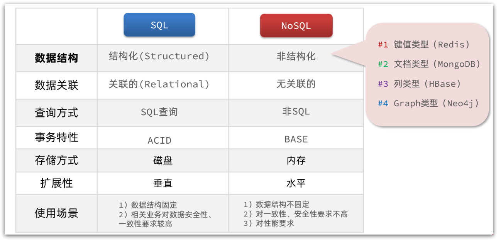
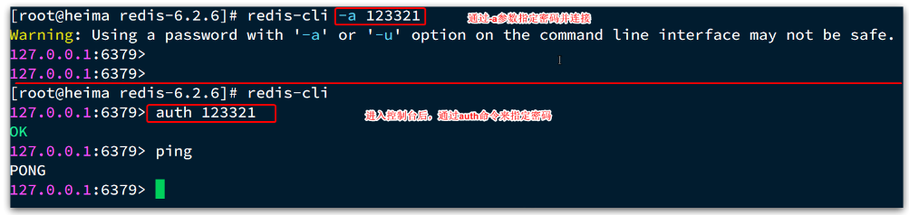
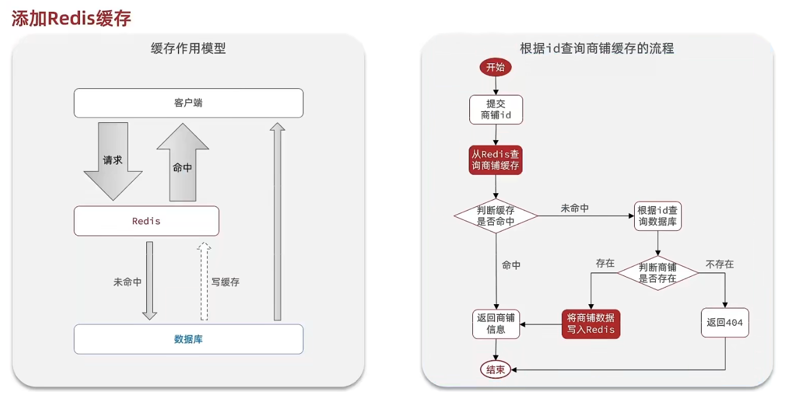

# 理论

### SQL与NoSQL



- 扩展性

  - 关系型数据库集群模式一般是主从，主从数据一致，起到数据备份的作用，称为垂直扩展。

  - 非关系型数据库可以将数据拆分，存储在不同机器上，可以保存海量数据，解决内存大小有限的问题，称为水平扩展。

  - 关系型数据库因为表之间存在关联关系，如果做水平扩展会给数据查询带来很多麻烦。

### Redis特征

- 键值（key-value）型，value支持多种不同数据结构，功能丰富

- 单线程，每个命令具备原子性

- 低延迟，速度快（基于内存、IO多路复用、良好的编码）

- 支持数据持久化

- 支持主从集群、分片集群

- 支持多语言客户端

### Redis应用场景

**Redis 适合的场景**

1. 缓存：减轻 MySQL 的查询压力，提升系统性能；
2. 排行榜：利用 Redis 的 SortSet（有序集合）实现；
3. 计数器/限速器：利用 Redis 中原子性的自增操作，我们可以统计类似用户点赞数、用户访问数等。这类操作如果用 MySQL，频繁的读写会带来相当大的压力；限速器比较典型的使用场景是限制某个用户访问某个 API 的频率，常用的有抢购时，防止用户疯狂点击带来不必要的压力；
4. 好友关系：利用集合的一些命令，比如求交集、并集、差集等。可以方便解决一些共同好友、共同爱好之类的功能；
5. 消息队列：除了 Redis 自身的发布/订阅模式，我们也可以利用 List 来实现一个队列机制，比如：到货通知、邮件发送之类的需求，不需要高可靠，但是会带来非常大的 DB 压力，完全可以用 List 来完成异步解耦；
6. Session 共享：Session 是保存在服务器的文件中，如果是集群服务，同一个用户过来可能落在不同机器上，这就会导致用户频繁登陆；采用 Redis 保存 Session 后，无论用户落在那台机器上都能够获取到对应的 Session 信息。

**Redis 不适合的场景**

数据量太大、数据访问频率非常低的业务都不适合使用 Redis，数据太大会增加成本，访问频率太低，保存在内存中纯属浪费资源。


# 原理

# 基础/语法

## Redis服务端

### 安装：

- 使用Ubuntu

- 安装c编译器

- 下载redis（https://redis.io/download/）

- 解压并进入redis目录

- 运行：make && make install（一般需要安装make指令）

- 安装完成：/usr/local/bin

### 默认启动/关闭

- 启动：redis-server

- 关闭：窗口叉掉 或者 CTRL + C

### 配置：redis.conf

- 允许访问的地址：bind 0.0.0.0

  - 默认是127.0.0.1，会导致只能在本地访问

  - 修改为0.0.0.0则可以在任意IP访问，生产环境不要设置为0.0.0.0

- 守护进程：daemonize yes
  - 修改为yes后即可后台运行

- 密码：requirepass 123456

- 监听的端口：port 6379

- 工作目录：dir .
  - 默认是当前目录，也就是运行redis-server时的命令，日志、持久化等文件会保存在这个目录

- 数据库数量：databases 1
  - 设置为1，代表只使用1个库，默认有16个库，编号0~15

- 设置redis能够使用的最大内存：maxmemory 512mb

- 日志文件：logfile "redis.log"
  - 默认为空，不记录日志，可以指定日志文件名

### 配置后台启动/关闭

- 修改配置：

  - 1 默认daemonize no              改为  daemonize yes

  - 2 默认protected-mode  yes    改为  protected-mode no

  - 3 默认bind 127.0.0.1             改为  直接注释掉(默认bind 127.0.0.1只能本机访问)或改成本机IP地址，否则影响远程IP连接

  - 4 添加redis密码                      改为 requirepass 你自己设置的密码

- 启动（在redis-7.2.4目录下）：redis-server /opt/redis-7.2.4/redis.conf

- 关闭：redis-cli -u 123321 shutdown

### 开机自启动：

- 配置：

  - 1、创建并添加：/etc/systemd/system/redis.service

    ```
    [Unit]
    Description=redis-server
    After=network.target
    [Service]
    Type=forking
    ExecStart=/usr/local/bin/redis-server /usr/local/src/redis-6.2.6/redis.conf
    PrivateTmp=true
    [Install]
    WantedBy=multi-user.target
    ```

  - 2、重载系统服务：systemctl daemon-reload

- 命令：

  - \# 启动：systemctl start redis

  - \# 停止：systemctl stop redis

  - \# 重启：systemctl restart redis

  - \# 查看状态：systemctl status redis

## Redis客户端

### 命令行客户端：

- 连接：redis-cli [options] [commonds]

  

  - options

    - -h 127.0.0.1：指定要连接的redis节点的IP地址，默认是127.0.0.1

    - -p 6379：指定要连接的redis节点的端口，默认是6379

    - -a 123321：指定redis的访问密码 

  - commonds
    - ping：与redis服务端做心跳测试，服务端正常会返回pong

- 关闭redis服务器：shutdown

## Redis常用命令

 https://redis.io/commands 

- KEYS  ...：查看符合模板的所有key

- DEL  ...：删除一个指定的key

- EXISTS  ...：判断key是否存在

- EXPIRE  ...：给一个key设置有效期，有效期到期时该key会被自动删除（单位：秒）

- TTL  ...：查看一个KEY的剩余有效期

- help ...：查看命令功能

## Redis数据结构

### String

- key：[项目名]:[业务名]:[类型]:[id]
  - 允许有多个单词形成层级结构，多个单词之间用':'隔开

- value：（底层都是字节数组形式存储，只不过是编码方式不同）

  - string：普通字符串

  - int：整数类型，可以做自增、自减操作

  - float：浮点类型，可以做自增、自减操作

- 命令：

  - SET：添加或者修改已经存在的一个String类型的键值对

  - GET：根据key获取String类型的value

  - MSET：批量添加多个String类型的键值对

  - MGET：根据多个key获取多个String类型的value

  - INCR：让一个整型的key自增1

  - INCRBY:让一个整型的key自增并指定步长，例如：incrby num 2 让num值自增2

  - INCRBYFLOAT：让一个浮点类型的数字自增并指定步长

  - SETNX：添加一个String类型的键值对，前提是这个key不存在，否则不执行（互斥锁）

  - SETEX：添加一个String类型的键值对，并且指定有效期

### List：

一个双向链表结构，支持正向检索和 反向检索

- key-values：

- 命令：

  - LPUSH key  element ... ：向列表左侧插入一个或多个元素

  - LPOP key：移除并返回列表左侧的第一个元素，没有则返回nil

  - RPUSH key  element ... ：向列表右侧插入一个或多个元素

  - RPOP key：移除并返回列表右侧的第一个元素

  - LRANGE key star end：返回一段角标范围内的所有元素

  - BLPOP和BRPOP：与LPOP和RPOP类似，只不过在没有元素时等待指定时间，而不是直接返回nil

### Set：

- 特点：

  - 无序

  - 元素不可重复

  - 查找快

  - 支持交集、并集、差集等功能

- 命令：

  - SADD key member ... ：向set中添加一个或多个元素

  - SREM key member ... : 移除set中的指定元素

  - SCARD key： 返回set中元素的个数

  - SISMEMBER key member：判断一个元素是否存在于set中

  - SMEMBERS：获取set中的所有元素

  - SINTER key1 key2 ... ：求key1与key2的交集

### SortedSet

SortedSet中的每一个元素都带有一个score属性，可以基于score属性对元素排序，底层的实现是一个跳表（SkipList）加 hash表

- 特性：

  - 可排序

  - 元素不重复

  - 查询速度快

- 命令：

  - ZADD key score member：添加一个或多个元素到sorted set ，如果已经存在则更新其score值

  - ZREM key member：删除sorted set中的一个指定元素

  - ZSCORE key member : 获取sorted set中的指定元素的score值

  - ZRANK key member：获取sorted set 中的指定元素的排名

  - ZCARD key：获取sorted set中的元素个数

  - ZCOUNT key min max：统计score值在给定范围内的所有元素的个数

  - ZINCRBY key increment member：让sorted set中的指定元素自增，步长为指定的increment值

  - ZRANGE key min max：按照score排序后，获取指定排名范围内的元素

  - ZRANGEBYSCORE key min max：按照score排序后，获取指定score范围内的元素

  - ZDIFF、ZINTER、ZUNION：求差集、交集、并集

  - 注意：所有的排名默认都是升序，如果要降序则在命令的Z后面添加REV即可

### HashSet：

- key-value结构：

- 命令：

  - HSET key field value：添加或者修改hash类型key的field的值

  - HGET key field：获取一个hash类型key的field的值

  - HMSET：批量添加多个hash类型key的field的值

  - HMGET：批量获取多个hash类型key的field的值

  - HGETALL：获取一个hash类型的key中的所有的field和value

  - HKEYS：获取一个hash类型的key中的所有的field

  - HVALS：获取一个hash类型的key中的所有的value

  - HINCRBY:让一个hash类型key的字段值自增并指定步长

  - HSETNX：添加一个hash类型的key的field值，前提是这个field不存在，否则不执行

## 客户端类型

## Jedis：

https://github.com/redis/jedis

### 基础步骤

- 1、引入依赖

  ```
  <!--jedis-->
  <dependency>
      <groupId>redis.clients</groupId>
      <artifactId>jedis</artifactId>
      <version>3.7.0</version>
  </dependency>
  <!--单元测试-->
  <dependency>
      <groupId>org.junit.jupiter</groupId>
      <artifactId>junit-jupiter</artifactId>
      <version>5.7.0</version>
      <scope>test</scope>
  </dependency>
  ```

- 2、创建连接、使用、关闭

  ```
  package com.example.jedis1;
  import org.junit.jupiter.api.AfterEach;
  import org.junit.jupiter.api.BeforeEach;
  import org.junit.jupiter.api.Test;
  import org.springframework.boot.test.context.SpringBootTest;
  import redis.clients.jedis.Jedis;
  import java.util.Map;
  @SpringBootTestclass
   Jedis1ApplicationTests {
  private Jedis jedis;
  @BeforeEach
      public void set(){
  // 1.建立连接         jedis = new Jedis("192.168.126.131", 6379);
  // 2.设置密码        jedis.auth("123456");
  // 3.选择库        jedis.select(0);
      }
  @Test
      void testString() {
  // 存入数据        String result = jedis.set("name", "虎哥");
          System.out.println("result = " + result);
  // 获取数据        String name = jedis.get("name");
          System.out.println("name = " + name);
      }
  @Test
      void testHash() {
  // 插入hash数据        jedis.hset("user:1", "name", "Jack");
  jedis.hset("user:1", "age", "21");
  // 获取        Map<String, String> map = jedis.hgetAll("user:1");
          System.out.println(map);
      }
  @AfterEach
  ​    void tearDown() {
  if (jedis != null) {
  jedis.close();
          }
      }
  }
  
  - 
  ```

  连接

  - 使用

  - 关闭

### 连接池步骤：

- 1、添加依赖

  ```
  <!--jedis-->
  <dependency>
      <groupId>redis.clients</groupId>
      <artifactId>jedis</artifactId>
      <version>3.7.0</version>
  </dependency>
  <!--单元测试-->
  <dependency>
      <groupId>org.junit.jupiter</groupId>
      <artifactId>junit-jupiter</artifactId>
      <version>5.7.0</version>
      <scope>test</scope>
  </dependency>
  ```

- 2、配置连接池类

  ```
  import redis.clients.jedis.*;
  public class JedisConnectionFactory {
  private static JedisPool jedisPool;
  static {
  // 配置连接池        JedisPoolConfig poolConfig = new JedisPoolConfig();
          poolConfig.setMaxTotal(8);
          poolConfig.setMaxIdle(8);
          poolConfig.setMinIdle(0);
          poolConfig.setMaxWaitMillis(1000);
  // 创建连接池对象，参数：连接池配置、服务端ip、服务端端口、超时时间、密码        jedisPool = new JedisPool(poolConfig, "192.168.126.131", 6379, 1000, "123456");
      }
  public static Jedis getJedis(){
  return jedisPool.getResource();
      }
  }
  ```

- 3、创建连接、使用、关闭

  ```
  import org.junit.jupiter.api.AfterEach;
  import org.junit.jupiter.api.BeforeEach;
  import org.junit.jupiter.api.Test;
  import org.springframework.boot.test.context.SpringBootTest;
  import redis.clients.jedis.Jedis;
  import java.util.Map;
  @SpringBootTestclass
   Jedis1ApplicationTests {
  private Jedis jedis;
  @BeforeEach
      public void set(){
  // 1.建立连接//         jedis = new Jedis("192.168.126.131", 6379);        jedis = JedisConnectionFactory.getJedis();
  // 2.设置密码        jedis.auth("123456");
  // 3.选择库        jedis.select(0);
      }
  @Test
      void testString() {
  // 存入数据        String result = jedis.set("name", "虎哥");
          System.out.println("result = " + result);
  // 获取数据        String name = jedis.get("name");
          System.out.println("name = " + name);
      }
  @Test 
     void testHash() {
  // 插入hash数据        jedis.hset("user:1", "name", "Jack");
  jedis.hset("user:1", "age", "21");
  // 获取        Map<String, String> map = jedis.hgetAll("user:1");
          System.out.println(map);
      }
  @AfterEach
  ​    void tearDown() {
  if (jedis != null) {
  jedis.close();
          }
      }
  }
  ```

## SpringDataRedis

https://spring.io/projects/spring-data-redis

### 特点：

- 提供了对不同Redis客户端的整合（Lettuce和Jedis）

- 提供了RedisTemplate统一API来操作Redis

- 支持Redis的发布订阅模型

- 支持Redis哨兵和Redis集群

- 支持基于Lettuce的响应式编程

- 支持基于JDK、JSON、字符串、Spring对象的数据序列化及反序列化

- 支持基于Redis的JDKCollection实现

### 基础步骤：

- 1、添加依赖

  ```
  <!--   redis     -->
  <dependency>
      <groupId>org.springframework.boot</groupId>
      <artifactId>spring-boot-starter-data-redis</artifactId>
  </dependency>
  <!--common-pool-->
  <dependency>
      <groupId>org.apache.commons</groupId>
      <artifactId>commons-pool2</artifactId>
  </dependency>
  <!--Jackson依赖-->
  <dependency>
      <groupId>com.fasterxml.jackson.core</groupId>
      <artifactId>jackson-databind</artifactId>
  </dependency>
  ```

  - spring-boot-starter-data-redis：这Spring Boot提供的Redis集成的起始器，自动配置Redis相关的bean，包括连接池、RedisTemplate等

  - commons-pool2：Apache Commons Pool 2库，提供了一个通用的对象池实现，用于管理与Redis服务器的连接，在Spring Boot中，被用作Redis连接池的实现，确保在多个线程之间共享和重复使用连接，提高性能和效率

  - jackson-databind：Jackson库的核心模块，用于处理Java对象和JSON之间的序列化和反序列化，在Spring Boot中，被用来将Java对象转换为JSON格式存储到Redis中，或者从Redis中读取JSON数据并转换为Java对象

- 2、全局配置

  ```
  spring.redis.host=192.168.126.131
  spring.redis.port=6379
  spring.redis.password=123456
  ```

- 自定义RedisTemplate

  ```
  @Configuration
  public class RedisConfig {
      @Bean
      public RedisTemplate redisTemplate(RedisConnectionFactory connectionFactory){
          // 创建RedisTemplate对象
          RedisTemplate template = new RedisTemplate<>();
          // 设置连接工厂
          template.setConnectionFactory(connectionFactory);
          // 创建JSON序列化工具
          GenericJackson2JsonRedisSerializer jsonRedisSerializer = new GenericJackson2JsonRedisSerializer();
          // 设置Key的序列化
          template.setKeySerializer(RedisSerializer.string());
          template.setHashKeySerializer(RedisSerializer.string());
          // 设置Value的序列化
          template.setValueSerializer(jsonRedisSerializer);
          template.setHashValueSerializer(jsonRedisSerializer);
          // 返回
          return template;
      }
  }
  ```

- 3、依赖注入RedisTemplate使用

  ```
  @Autowired
      private RedisTemplate edisTemplate;
      @Test
      void testString() {
          // 写入一条String数据
          redisTemplate.opsForValue().set("name", "虎哥");
          // 获取string数据
          Object name = stringRedisTemplate.opsForValue().get("name");
          System.out.println("name = " + name);
      }
  ```

### 全局配置

- springboot2.0

  - \# Redis数据库索引（默认为0）spring.redis.database=0

  - \# Redis服务器地址spring.redis.host=127.0.0.1

  - \# Redis服务器连接端口spring.redis.port=6379

  - \# Redis服务器连接密码（默认为空）spring.redis.password=

  - \# 连接池最大连接数（使用负值表示没有限制）spring.redis.jedis.pool.max-active=20

  - \# 连接池最大阻塞等待时间（使用负值表示没有限制）spring.redis.jedis.pool.max-wait=-1

  - \# 连接池中的最大空闲连接spring.redis.jedis.pool.max-idle=10

  - \# 连接池中的最小空闲连接spring.redis.jedis.pool.min-idle=0

  - \# 连接超时时间（毫秒）spring.redis.timeout=1000

- springboot3.0

  - \# Redis 数据库索引（默认为0）
    - spring.data.redis.database=0

  - \# Redis 服务的ip,我的是在虚拟机的服务器上。
    - spring.data.redis.host=192.168.45.129

  - \# Redis 端口
    - spring.data.redis.port=6379

  - \# Redis 密码，默认为空，可以修改 redis.conf配置文件
    - spring.data.redis.password=

  - \# 最大可用连接数
    - spring.redis.pool.max-active=200

  - \# 从连接池中获取连接最大等待时间
    - spring.redis.pool.max-wait=-1

  - \# 最大空闲连接数
    - spring.redis.pool.max-idle=10

  - \# 最小空闲连接数
    - spring.redis.pool.min-idle=0

  - \# redis连接超时时间（单位为毫秒）
    - spring.data.redis.timeout=1000

### RedisTemplate

#### 默认RedisTemplate

- 特点：使用RedisTemplate进行Redis数据缓存操作时，内部默认使用的是JdkSerializationRedisSerializer序列化方式，所以进行数据缓存的实体类必须实现JDK自带的序列化接口（例如Serializable）

- 授予步骤：

  - 1、定义实体类

  - 2、使用RedisTemplate

    ```
    @Autowiredprivate RedisTemplate redisTemplate;
    @Testvoid testString() {
    // 写入一条String数据
        redisTemplate.opsForValue().set("name", "虎哥");
    // 获取string数据
        Object name = redisTemplate.opsForValue().get("name");
        System.out.println("name = " + name);
    }
    ```

    

#### 自定义RedisTemplate（JSON自动序列化）

- 特点：能将Java对象自动的序列化为JSON字符串，并且查询时能自动把JSON反序列化为Java对象

- 使用步骤：

  - 1、定义RedisTemplate

    ```
    @Configuration
    public class RedisConfig {
        @Bean
        public RedisTemplate redisTemplate(RedisConnectionFactory connectionFactory){
            // 创建RedisTemplate对象
            RedisTemplate template = new RedisTemplate<>();
            // 设置连接工厂
            template.setConnectionFactory(connectionFactory);
            // 创建JSON序列化工具
            GenericJackson2JsonRedisSerializer jsonRedisSerializer = new GenericJackson2JsonRedisSerializer();
            // 设置Key的序列化
            template.setKeySerializer(RedisSerializer.string());
            template.setHashKeySerializer(RedisSerializer.string());
            // 设置Value的序列化
            template.setValueSerializer(jsonRedisSerializer);
            template.setHashValueSerializer(jsonRedisSerializer);
            // 返回
            return template;
        }
    }
    ```

  - 2、使用

    ```
    @Autowired
    private RedisTemplate redisTemplate;
    @Test
    void testString() {
    // 写入一条String数据
        User user=new User();
        user.setAge(11);
        user.setName("lee");
        redisTemplate.opsForValue().set("lyr", user);
        User user1=(User) redisTemplate.opsForValue().get("lyr");
    // 获取string数据
        System.out.println("name = " + user1);
    }
    ```

  - 3、查看实体类序列化

- 方法：https://blog.csdn.net/zzvar/article/details/118388897

### StringRedisTemplate

（String手动序列化）

- 特点：为了节省内存空间，不使用JSON序列化器来处理value，而是统一使用String序列化器，要求只能存储String类型的key和value

- 区别：

  - StringRedisTemplate 是 RedisTemplate 的子类，两个方法基本一致，不同之处在于 操作的数据类型不同：RedisTemplate 两个泛型都是 Object，意味着存储的 key 和 value 都可以是一个对象；StringRedisTemplate 两个泛型都是 String，意味着存储的 的 key 和 value 都只能是字符串。

  - 注：使用 RedisTemplate 默认是将对象序列化到 Redis 中，所以 放入的对象必须实现对象序列化接口。

  - 注：两者的 数据是不共通的；也就是说 StringRedisTemplate 只能管理 StringRedisTemplate 里面的数据，RedisTemplate 只能管理 RedisTemplate 中的数据。

- 使用步骤：

  ```
  @Autowired
  private
   StringRedisTemplate stringRedisTemplate;
  // JSON序列化工具
  private static final ObjectMapper mapper = new ObjectMapper();
  @Testvoid
   testSaveUser() throws JsonProcessingException {
  // 创建对象    User user = new User();
      user.setName("李艺儒");
      user.setAge(22);
  // 手动序列化
      String json = mapper.writeValueAsString(user);
  // 写入数据
      stringRedisTemplate.opsForValue().set("user:200", json);
  // 获取数据
      String jsonUser = stringRedisTemplate.opsForValue().get("user:200");
  // 手动反序列化
      User user1 = mapper.readValue(jsonUser, User.class);
      System.out.println("user1 = " + user1);
  }
  ```

## [Spring Boot 整合 Redis](https://blog.csdn.net/weixin_43749805/article/details/131399516)

### 基于注解

#### 步骤

- 1、添加依赖

  ```
  <dependency> 
     <groupId>org.springframework.boot</groupId>
      <artifactId>spring-boot-starter-data-redis</artifactId>
  </dependency>
  ```

- 2、全局配置

  ```
  spring.redis.host=127.0.0.1
  spring.redis.port=6379
  spring.redis.password=
  ```

- 3、启动类添加 @ EnableCaching

- 4、类实现序列化（字节流，便于存到缓存中，同时还能从缓存中反序列化）

- 5、在对应service配置cache相关注解

#### cache注解

##### 步骤：

- 1、启动类添加 @ EnableCaching

- 2、在相关service层添加注解

##### Cacheable注解（进行缓存）

- 作用：

  - 用于类或方法（通常用在数据查询方法上），用于对方法结果进行缓存存储

  - 先进行缓存查询，如果为空则进行方法查询，并将结果进行缓存；如果缓存中有数据，不进行方法查询，而是直接使用缓存数据

- 属性：@ Cacheable(属性="属性值", ...)

##### CachePut注解（更新缓存）

- 属性：

##### CacheEvict注解（删除缓存）

- 属性：

- 新属性

  - allEntries属性： allEntries属性表示是否清除指定缓存空间中的所有缓存数据，默认值为false（即默认只删除指定key对应的缓存数据）

  - beforeInvocation属性：beforeInvocation属性表示是否在方法执行之前进行缓存清除，默认值为false（即默认在执行方法后再进行缓存清除）

##### Caching注解（复杂的缓存管理）

- 意义：针对复杂规则的数据缓存管理，可以作用于类或方法，在Caching注解内部包含有Cacheable、put和evict三个属性，分别对应于@Cacheable、@CachePut和@ CacheEvict三个注解

- 举例：

##### CacheConfig注解（统筹管理）

- 作用：统筹管理类中所有使用@Cacheable、@CachePut和@ CacheEvict注解标注方法中的公共属性，这些公共属性包括有cacheNames、keyGenerator、cacheManager和cacheResolver。

- 举例

案例：[SpringBoot项目中使用缓存Cache](https://juejin.cn/post/7220292698854752313)

### 基于RedisTemplate

#### 默认RedisTemplate

- RedisTemplate类源码

  - 使用RedisTemplate进行Redis数据缓存操作时，内部默认使用的是JdkSerializationRedisSerializer序列化方式，所以进行数据缓存的实体类必须实现JDK自带的序列化接口（例如Serializable）

  - 使用RedisTemplate进行Redis数据缓存操作时，如果自定义了缓存序列化方式defaultSerializer，那么将使用自定义的序列化方式

#### 自定义RedisTemplate

- RedisAutoConfiguration（自定义依据）

  - (1) 在Redis自动配置类中，通过Redis连接工厂RedisConnectionFactory初始化了一个RedisTemplate；该类上方添加了@ConditionalOnMissingBean注解（顾名思义，当某个Bean不存在时生效），用来表明如果开发者自定义了一个名为redisTemplate的Bean，则该默认初始化的RedisTemplate会被覆盖。

  - (2) 如果想要使用自定义序列化方式的RedisTemplate进行数据缓存操作，可以参考上述核心代码创建一个名为redisTemplate的Bean组件，并在该组件中设置对应的序列化方式即可。

- 代码：在项目中创建创建一个Redis自定义配置类RedisConfig，通过@ Configuration注解定义了一个RedisConfig配置类，并使用@ Bean注解注入了一个默认名称为方法名的redisTemplate组件（注意，该Bean组件名称必须是redisTemplate）；在定义的Bean组件中，自定义了一个RedisTemplate，使用自定义的Jackson2JsonRedisSerializer数据序列化方式；在定制序列化方式中，定义了一个ObjectMapper用于进行数据转换设置。

  ```
  @Bean
      public RedisTemplate<Object, Object> redisTemplate(RedisConnectionFactory redisConnectionFactory) {
          RedisTemplate<Object, Object> template = new RedisTemplate();
          template.setConnectionFactory(redisConnectionFactory);
          // 使用JSON格式序列化对象，对缓存数据key和value进行转换
          Jackson2JsonRedisSerializer jacksonSeial = new Jackson2JsonRedisSerializer(Object.class);
          // 解决查询缓存转换异常的问题
          ObjectMapper om = new ObjectMapper();
          om.setVisibility(PropertyAccessor.ALL, JsonAutoDetect.Visibility.ANY);
          om.enableDefaultTyping(ObjectMapper.DefaultTyping.NON_FINAL);
          jacksonSeial.setObjectMapper(om);
          // 设置RedisTemplate模板API的序列化方式为JSON 
         template.setDefaultSerializer(jacksonSeial);
          return template;
      }
  ```

#### 自定义RedisCacheManager

原理：

- 1. Spring Boot整合Redis组件提供的缓存自动配置类RedisCacheConfiguration,其内部是通过Redis连接工厂RedisConnectionFactory定义了一个缓存管理器RedisCacheManager；同时定制RedisCacheManager时，也默认使用了JdkSerializationRedisSerializer序列化方式。

- 2. 如果想要使用自定义序列化方式的RedisCacheManager进行数据缓存操作，可以创建一个名为cacheManager的Bean组件，并在该组件中设置对应的序列化方式即可。

代码：

```
@Bean
      public RedisCacheManager cacheManager(RedisConnectionFactory redisConnectionFactory) {
          // 分别创建String和JSON格式序列化对象，对缓存数据key和value进行转换 
         RedisSerializer<String> strSerializer = new StringRedisSerializer();
          Jackson2JsonRedisSerializer jacksonSeial = new Jackson2JsonRedisSerializer(Object.class);
          // 解决查询缓存转换异常的问题
          ObjectMapper om = new ObjectMapper();
          om.setVisibility(PropertyAccessor.ALL, JsonAutoDetect.Visibility.ANY);
          om.enableDefaultTyping(ObjectMapper.DefaultTyping.NON_FINAL);
          jacksonSeial.setObjectMapper(om);
          // 定制缓存数据序列化方式及时效 
         RedisCacheConfiguration config = RedisCacheConfiguration.defaultCacheConfig()
                  .entryTtl(Duration.ofDays(1))
       		       .serializeKeysWith(RedisSerializationContext.SerializationPair.fromSerializer(strSerializer))
                  .serializeValuesWith(RedisSerializationContext.SerializationPair.fromSerializer(jacksonSeial))
                  .disableCachingNullValues();
          RedisCacheManager cacheManager = RedisCacheManager.builder(redisConnectionFactory).cacheDefaults(config).build();
          return cacheManager;
      }

```

基于Redission

# 应用

## 查询缓存

缓存类别

- 浏览器缓存：主要是存在于浏览器端的缓存

- 应用层缓存：可以分为tomcat本地缓存，比如之前提到的map，或者是使用redis作为缓存

- 数据库缓存：在数据库中有一片空间是 buffer pool，增改查数据都会先加载到mysql的缓存中

- CPU缓存：当代计算机最大的问题是 cpu性能提升了，但内存读写速度没有跟上，所以为了适应当下的情况，增加了cpu的L1，L2，L3级的缓存

缓存添加步骤：RedisTemplate



- 步骤

- 缓存更新策略：

  - 作用：节约内存、并解决数据不一致

  - 缓存更新方法：

    

    - 内存淘汰：redis自动进行，当redis内存达到咱们设定的max-memery的时候，会自动触发淘汰机制，淘汰掉一些不重要的数据(可以自己设置策略方式)

    - 超时剔除：当我们给redis设置了过期时间ttl之后，redis会将超时的数据进行删除，方便咱们继续使用缓存

    - 主动更新：我们可以手动调用方法把缓存删掉，通常用于解决缓存和数据库不一致问题

  - 数据库缓存不一致解决方案：缓存调用者在更新完数据库后再去更新缓存，也称之为双写方案

    - 删除缓存还是更新缓存：

      - 更新缓存：每次更新数据库都更新缓存，无效写操作较多

      - 删除缓存：更新数据库时让缓存失效，查询时再更新缓存

    - 如何保证缓存与数据库的操作的同时成功或失败：

      - 单体系统，将缓存与数据库操作放在一个事务

      - 分布式系统，利用TCC等分布式事务方案

    - 先操作缓存还是先操作数据库：

- 缓存更新步骤：
  - 在更新方法添加：

- 缓存穿透：数据库与redis都不存在数据

  - 问题出现：缓存穿透是指客户端请求的数据在缓存中和数据库中都不存在，这样缓存永远不会生效，这些请求都会打到数据库

  - 解决方案：

    - 缓存空对象

      - 思路：当我们客户端访问不存在的数据时，先请求redis，但是此时redis中没有数据，此时会访问到数据库，但是数据库中也没有数据，这个数据穿透了缓存，直击数据库，我们都知道数据库能够承载的并发不如redis这么高，如果大量的请求同时过来访问这种不存在的数据，这些请求就都会访问到数据库，简单的解决方案就是哪怕这个数据在数据库中也不存在，我们也把这个数据存入到redis中去，这样，下次用户过来访问这个不存在的数据，那么在redis中也能找到这个数据就不会进入到缓存了

      - 优点：实现简单，维护方便

      - 缺点：

        - 额外的内存消耗

        - 可能造成短期的不一致

    - 布隆过滤

      - 思路：布隆过滤器其实采用的是哈希思想来解决这个问题，通过一个庞大的二进制数组，走哈希思想去判断当前这个要查询的这个数据是否存在，如果布隆过滤器判断存在，则放行，这个请求会去访问redis，哪怕此时redis中的数据过期了，但是数据库中一定存在这个数据，在数据库中查询出来这个数据后，再将其放入到redis中，假设布隆过滤器判断这个数据不存在，则直接返回
        - 这种方式优点在于节约内存空间，存在误判，误判原因在于：布隆过滤器走的是哈希思想，只要哈希思想，就可能存在哈希冲突

      - 优点：内存占用较少，没有多余key

      - 缺点：

        - 实现复杂

        - 存在误判可能

  - 解决步骤：

    - 缓存空对象

      - 1、定义方法
        public <R,ID> R queryWithPassThrough(
                String keyPrefix, ID id, Class<R> type, Function<ID, R> dbFallback, Long time, TimeUnit unit){
            String key = keyPrefix + id;
        // 1.从redis查询商铺缓存    String json = stringRedisTemplate.opsForValue().get(key);
        // 2.判断是否存在    if (StrUtil.isNotBlank(json)) {
        // 3.存在，直接返回        return JSONUtil.toBean(json, type);
            }
        // 判断命中的是否是空值    if (json != null) {
        // 返回一个错误信息        return null;
            }
        // 4.不存在，根据id查询数据库    R r = dbFallback.apply(id);
        // 5.不存在，返回错误    if (r == null) {
        // 将空值写入redis        stringRedisTemplate.opsForValue().set(key, "", CACHE_NULL_TTL, TimeUnit.MINUTES);
        // 返回错误信息        return null;
            }
        // 6.存在，写入redis    this.set(key, r, time, unit);
        return r;
        }

      - 2、调用方法

  - 避免出现缓存穿透：

    - 增强id的复杂度，避免被猜测id规律

    - 做好数据的基础格式校验

    - 加强用户权限校验

    - 做好热点参数的限流

- 缓存雪崩：大量的缓存key同时失效

  - 问题出现：缓存雪崩是指在同一时段大量的缓存key同时失效或者Redis服务宕机，导致大量请求到达数据库，带来巨大压力

  - 解决方案：

    - 给不同的Key的TTL添加随机值

    - 利用Redis集群提高服务的可用性

    - 给缓存业务添加降级限流策略

    - 给业务添加多级缓存

- 缓存击穿：热点Key

  - 问题出现：缓存击穿问题也叫热点Key问题，就是一个被高并发访问并且缓存重建业务较复杂的key突然失效了，无数的请求访问会在瞬间给数据库带来巨大的冲击
    - 逻辑分析：假设线程1在查询缓存之后，本来应该去查询数据库，然后把这个数据重新加载到缓存的，此时只要线程1走完这个逻辑，其他线程就都能从缓存中加载这些数据了，但是假设在线程1没有走完的时候，后续的线程2，线程3，线程4同时过来访问当前这个方法， 那么这些线程都不能从缓存中查询到数据，那么他们就会同一时刻来访问查询缓存，都没查到，接着同一时间去访问数据库，同时的去执行数据库代码，对数据库访问压力过大

  - 解决方案：

    

    - 互斥锁

      

      - 因为锁能实现互斥性。假设线程过来，只能一个人一个人的来访问数据库，从而避免对于数据库访问压力过大，但这也会影响查询的性能，因为此时会让查询的性能从并行变成了串行，我们可以采用tryLock方法 + double check来解决这样的问题。

      - 假设现在线程1过来访问，他查询缓存没有命中，但是此时他获得到了锁的资源，那么线程1就会一个人去执行逻辑，假设现在线程2过来，线程2在执行过程中，并没有获得到锁，那么线程2就可以进行到休眠，直到线程1把锁释放后，线程2获得到锁，然后再来执行逻辑，此时就能够从缓存中拿到数据了。

    - 逻辑过期

      

      - 之所以会出现这个缓存击穿问题，主要原因是在于对key设置了过期时间，假设不设置过期时间，就不会有缓存击穿的问题，但是不设置过期时间，这样数据就一直占用内存，可以采用逻辑过期方案

      - 把过期时间设置在 redis的value中，注意：这个过期时间并不会直接作用于redis，而是后续通过逻辑去处理

      - 假设线程1去查询缓存，然后从value中判断出来当前的数据已经过期了，此时线程1去获得互斥锁，那么其他线程会进行阻塞，获得了锁的线程他会开启一个 线程去进行 以前的重构数据的逻辑，直到新开的线程完成这个逻辑后，才释放锁， 而线程1直接进行返回，假设现在线程3过来访问，由于线程线程2持有着锁，所以线程3无法获得锁，线程3也直接返回数据，只有等到新开的线程2把重建数据构建完后，其他线程才能走返回正确的数据。

      - 这种方案巧妙在于，异步的构建缓存，缺点在于在构建完缓存之前，返回的都是脏数据。

  - 解决步骤：

    - 互斥锁

      

      - 定义方法：
        public <R, ID> R queryWithMutex(
                String keyPrefix, ID id, Class<R> type, Function<ID, R> dbFallback, Long time, TimeUnit unit) {
            String key = keyPrefix + id;
        // 1.从redis查询商铺缓存    String shopJson = stringRedisTemplate.opsForValue().get(key);
        // 2.判断是否存在    if (StrUtil.isNotBlank(shopJson)) {
        // 3.存在，直接返回        return JSONUtil.toBean(shopJson, type);
            }
        // 判断命中的是否是空值    if (shopJson != null) {
        // 返回一个错误信息        return null;
            }
        // 4.实现缓存重建    // 4.1.获取互斥锁    String lockKey = LOCK_SHOP_KEY + id;
        R r = null;
        try {
        boolean isLock = tryLock(lockKey);
        // 4.2.判断是否获取成功        if (!isLock) {
        // 4.3.获取锁失败，休眠并重试            Thread.sleep(50);
        return queryWithMutex(keyPrefix, id, type, dbFallback, time, unit);
                }
        // 4.4.获取锁成功，根据id查询数据库        r = dbFallback.apply(id);
        // 5.不存在，返回错误        if (r == null) {
        // 将空值写入redis            stringRedisTemplate.opsForValue().set(key, "", CACHE_NULL_TTL, TimeUnit.MINUTES);
        // 返回错误信息            return null;
                }
        // 6.存在，写入redis        this.set(key, r, time, unit);
            } catch (InterruptedException e) {
        throw new RuntimeException(e);
            }finally {
        // 7.释放锁        unlock(lockKey);
            }
        // 8.返回    return r;
        }
        private boolean tryLock(String key) {
            Boolean flag = stringRedisTemplate.opsForValue().setIfAbsent(key, "1", 10, TimeUnit.SECONDS);
        return BooleanUtil.isTrue(flag);
        }
        private void unlock(String key) {
        stringRedisTemplate.delete(key);
        }

      - 调用方法：

    - 逻辑过期
      - 定义方法：
        public <R, ID> R queryWithLogicalExpire(
                String keyPrefix, ID id, Class<R> type, Function<ID, R> dbFallback, Long time, TimeUnit unit) {
            String key = keyPrefix + id;
        // 1.从redis查询商铺缓存
            String json = stringRedisTemplate.opsForValue().get(key);
        // 2.判断是否存在
            if (StrUtil.isBlank(json)) {
        // 3.存在，直接返回
                return null;
            }
        // 4.命中，需要先把json反序列化为对象
            RedisData redisData = JSONUtil.toBean(json, RedisData.class);
        R r = JSONUtil.toBean((JSONObject) redisData.getData(), type);
            LocalDateTime expireTime = redisData.getExpireTime();
        // 5.判断是否过期
            if(expireTime.isAfter(LocalDateTime.now())) {
        // 5.1.未过期，直接返回店铺信息
                return r;
            }
        // 5.2.已过期，需要缓存重建
            // 6.缓存重建
            // 6.1.获取互斥锁    String lockKey = LOCK_SHOP_KEY + id;
        boolean isLock = tryLock(lockKey);
        // 6.2.判断是否获取锁成功    if (isLock){
        // 6.3.成功，开启独立线程，实现缓存重建        CACHE_REBUILD_EXECUTOR.submit(() -> {
        try {
        // 查询数据库                R newR = dbFallback.apply(id);
        // 重建缓存                this.setWithLogicalExpire(key, newR, time, unit);
                    } catch (Exception e) {
        throw new RuntimeException(e);
                    }finally {
        // 释放锁                unlock(lockKey);
                    }
                });
            }
        // 6.4.返回过期的商铺信息    return r;
        }