## 基础知识

官网：[Docker: Accelerated Container Application Development](https://www.docker.com/)

笔记：https://www.runoob.com/docker/docker-tutorial.html

原理：https://zhuanlan.zhihu.com/p/187505981

### 定义

Docker 是一个用于开发，交付和运行应用程序的开放平台。Docker 使您能够将应用程序与基础架构分开，从而可以快速交付软件。借助 Docker，您可以与管理应用程序相同的方式来管理基础架构。通过利用 Docker 的方法来快速交付，测试和部署代码，您可以大大减少编写代码和在生产环境中运行代码之间的延迟。

### 镜像与容器

当我们利用Docker安装应用时，Docker会自动搜索并下载应用镜像（image）。镜像不仅包含应用本身，还包含应用运行所需要的环境、配置、系统函数库。Docker会在运行镜像时创建一个隔离环境，称为容器（container）。镜像仓库：存储和管理镜像的平台，Docker官方维护了一个公共仓库：Docker Hub。

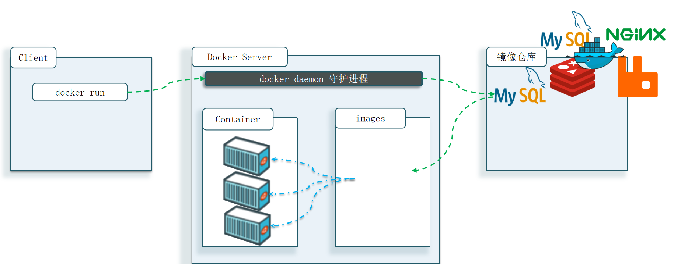


##### Docker：

Docker可以帮助我们下载应用镜像，创建并运行镜像的容器，从而快速部署应用

##### 镜像：

将应用所需的函数库、依赖、配置等与应用一起打包得到的就是镜像

##### 容器：

为每个镜像的应用进程创建的隔离运行环境就是容器

##### 镜像仓库：

存储和管理镜像的服务就是镜像仓库，DockerHub是目前最大的镜像仓库，其中包含各种常见的应用镜像

### 基本原理

在主机上运行的 Docker 容器实际上是基于 Docker 引擎的虚拟化技术创建和运行的。下面是 Docker 容器在主机上运行的基本过程：

1. **镜像拉取或构建**： 首先，你需要有一个 Docker 镜像。你可以从 Docker Hub 或其他镜像仓库拉取现有的镜像，也可以通过编写 Dockerfile 并使用 `docker build` 命令构建自定义镜像。
2. **创建容器**： 使用 `docker run` 命令来创建并运行容器。在创建容器时，Docker 引擎会在主机上分配一定资源（如 CPU、内存等），并在其中启动容器实例。
3. **命名空间和控制组**： Docker 利用 Linux 内核的命名空间和控制组（cgroups）技术来实现容器的隔离。每个容器都有自己独立的命名空间，包括文件系统、网络、进程、用户等，这使得容器内的进程看起来像在一个独立的操作系统环境中运行一样。
4. **启动应用程序**： 在容器内部，Docker 引擎会启动你在镜像中定义的应用程序或服务。这可能涉及到执行特定的命令、运行后台服务等。
5. **运行时监控**： Docker 引擎会监控容器的运行状态，包括资源使用情况、日志输出等。你可以使用 `docker logs` 命令查看容器的日志信息，使用 `docker stats` 命令查看容器的资源使用情况。
6. **与主机通信**： 容器内的应用程序可以与主机上的其他容器或主机系统进行通信。Docker 提供了多种网络模式和端口映射功能，使得容器可以与外部世界进行通信。
7. **持久化数据**： 如果需要，在容器内部可以挂载主机上的文件系统或数据卷，以便持久化存储应用程序的数据。
8. **停止和删除容器**： 当应用程序运行结束或者不再需要时，可以使用 `docker stop` 命令停止容器，并使用 `docker rm` 命令删除容器。这会释放主机资源，并清理容器相关的资源。

总的来说，Docker 容器在主机上运行的过程就是将应用程序与其依赖项打包到一个隔离的环境中，并在其中运行，使得应用程序的部署和管理变得更加简单和可靠。

## 基础应用

### 安装配置

安装配置docker：Centos7：[安装Docker](https://b11et3un53m.feishu.cn/wiki/Rfocw7ctXij2RBkShcucLZbrn2d)

### docker基础命令

官网文档：https://docs.docker.com

常用文档：[Docker常用命令大全](https://cloud.tencent.com/developer/article/2093710)

##### docker inspect 

用于获取有关 Docker 对象（如容器、镜像、网络等）的详细信息，可以通过该命令来查看 Docker 对象的配置、状态、挂载点等信息

##### docker 

### 基础操作指令

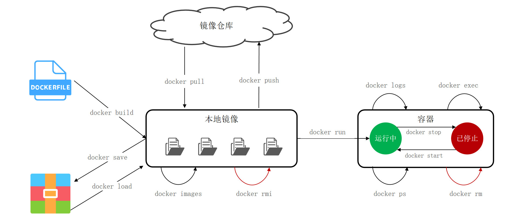

#### docker build

构建自己的镜像

#### docker save

保存为压缩文件

语法：docker save -o 文件名 镜像:版本

#### docker load

压缩文件部署容器

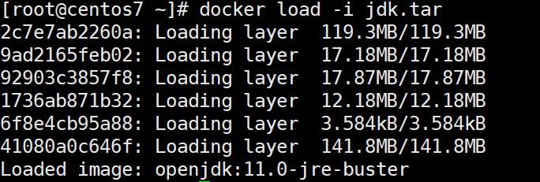

#### docker images

查看docker镜像

#### docker pull

拉取镜像

#### docker push

提交镜像

#### docker rmi

用于删除一个或多个本地镜像

语法如下：

```
docker rmi [OPTIONS] IMAGE [IMAGE...]
```

OPTIONS：可以使用一些选项来控制删除行为，例如 -f, --force 强制删除镜像

IMAGE：要删除的镜像的名称或 ID

#### docker run

启动镜像

实例：

```
docker run -d \
--name mysql \
-p 3306:3306 \
-e TZ=Asia/Shanghai \
-e MYSQL_ROOT_PASSWORD=123 \
mysql
```

docker run ：创建并运行一个容器，-d 是让容器在后台运行

--name mysql ：给容器起个名字，必须唯一

-p 3306:3306 ：设置端口映射

-e KEY=VALUE ：是设置环境变量

-d: 后台运行容器并返回容器ID，也即启动守护式容器(后台运行)；

-i：以交互模式运行容器，通常与 -t 同时使用；

-t：为容器重新分配一个伪输入终端，通常与 -i 同时使用；

也即启动交互式容器(前台有伪终端，等待交互)；

-P: 随机端口映射，大写P

mysql ：指定运行的镜像的名字，镜像名称一般分两部分组成：[repository]:[tag]，其中repository就是镜像名tag是镜像的版本，默认最新版

#### docker start

开始镜像

#### docker stop

停止镜像

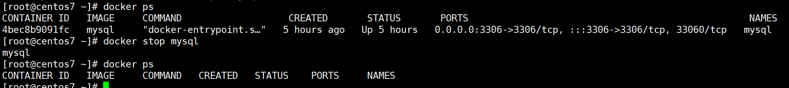

#### docker logs

查看运行日志

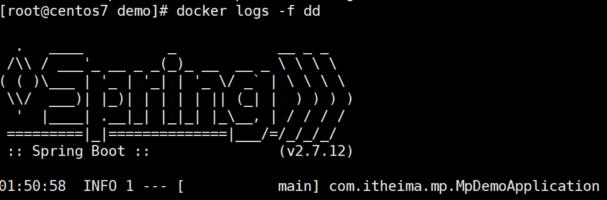

#### docker ps

列出 Docker 容器

##### 查看运行状态

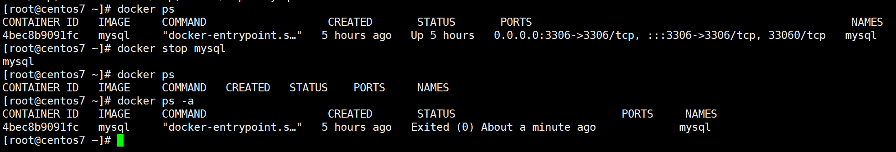

##### 查看停止状态

docker ps -a --filter "status=exited"

#### docker rm

用于删除一个或多个已经停止的容器

语法如下：

```
docker rm [OPTIONS] CONTAINER [CONTAINER...]
```

OPTIONS：可以使用一些选项来控制删除行为，例如 -f, --force 强制删除运行中的容器

CONTAINER：要删除的容器的名称或 ID

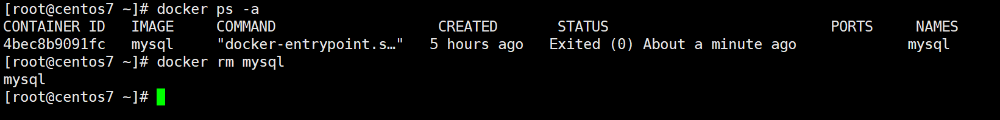

#### docker exec

用于在运行中的容器内部执行命令。它的基本语法为：

```
Copy Codedocker exec [OPTIONS] CONTAINER COMMAND [ARG...]
```

- `[OPTIONS]`：可选参数，用于指定执行命令的一些选项，例如 `-i`（交互式执行）、`-t`（分配一个伪终端）等
- `CONTAINER`：要在其中执行命令的容器的名称或 ID
- `COMMAND`：要在容器内执行的命令
- `[ARG...]`：可选参数，传递给要执行的命令的参数

开启内部命令：docker exec -it mysql bash

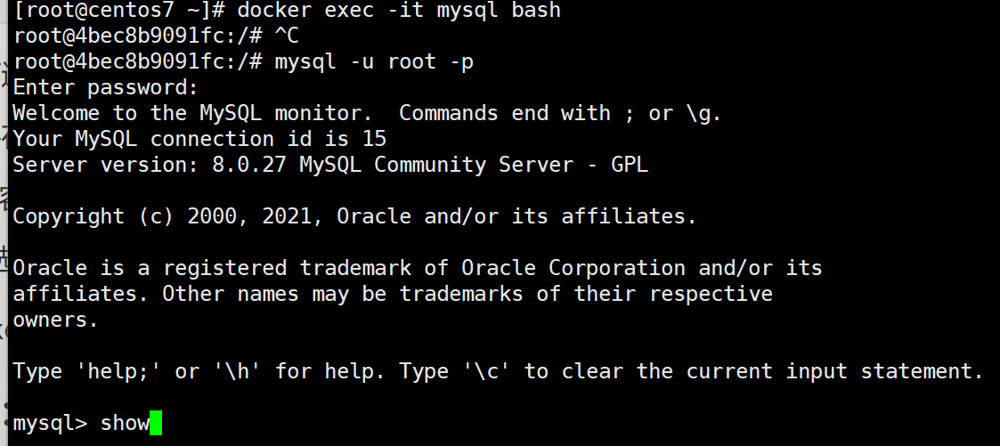

### 搜索docker容器应用

网站：https://hub.docker.com

### 数据卷挂载

数据卷（volume）是一个虚拟目录，是容器内目录与宿主机目录之间映射的桥梁

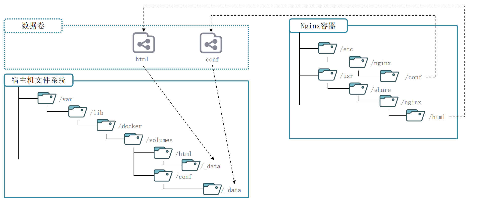

| **命令**              | **说明**             | **文档地址**          |
| --------------------- | -------------------- | --------------------- |
| docker volume create  | 创建数据卷           | docker volume create  |
| docker volume ls      | 查看所有数据卷       | docker volume ls      |
| docker volume rm      | 删除指定数据卷       | docker volume rm      |
| docker volume inspect | 查看某个数据卷的详情 | docker volume inspect |
| docker volume prune   | 清除数据卷           | docker volume prune   |

##### 挂载卷并查看卷内容

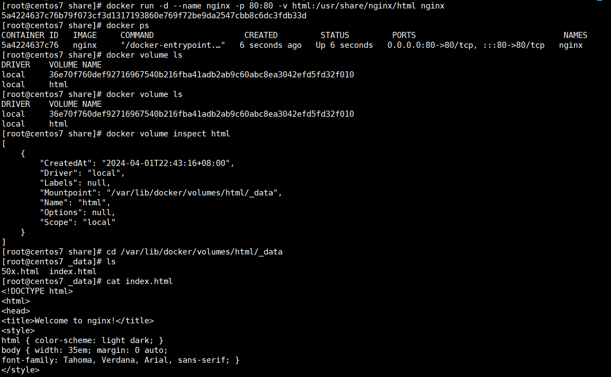

##### 修改卷内容（直接生效）

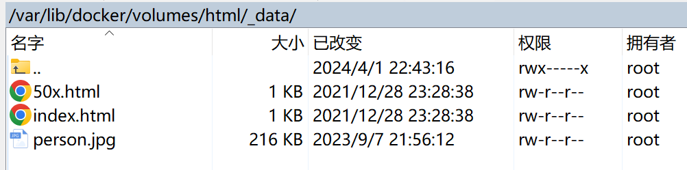

### 本地目录挂载

在执行docker run命令时，使用 -v 本地目录 : 容器内目录 可以完成本地目录挂载

本地目录必须以“/”或 "./" 开头，如果直接以名称开头，会被识别为数据卷而非本地目录：

​	-v mysql : /var/lib/mysql 会被识别为一个数据卷叫mysql	

​	-v ./mysql : /var/lib/mysql 会被识别为当前目录下的mysql目录

##### 案例（mysql）：

基于宿主机目录实现MySQL数据目录、配置文件、初始化脚本的挂载

挂载/root/mysql/data到容器内的/var/lib/mysql目录

挂载/root/mysql/init到容器内的/docker-entrypoint-initdb.d目录，携带课前资料准备的SQL脚本

挂载/root/mysql/conf到容器内的/etc/mysql/conf.d目录，携带课前资料准备的配置文件

```
docker run -d \  -v /root/mysql/data:/var/lib/mysql \  -v /root/mysql/init:/docker-entrypoint-initdb.d \  -v /root/mysql/conf:/etc/mysql/conf.d \  --name mysql_container \  -e MYSQL_ROOT_PASSWORD=my-secret-pw \  mysql:latest
```

### 自定义镜像

#### 镜像结构

镜像中包含了应用程序所需要的运行环境、函数库、配置、以及应用本身等各种文件，这些文件分层打包而成

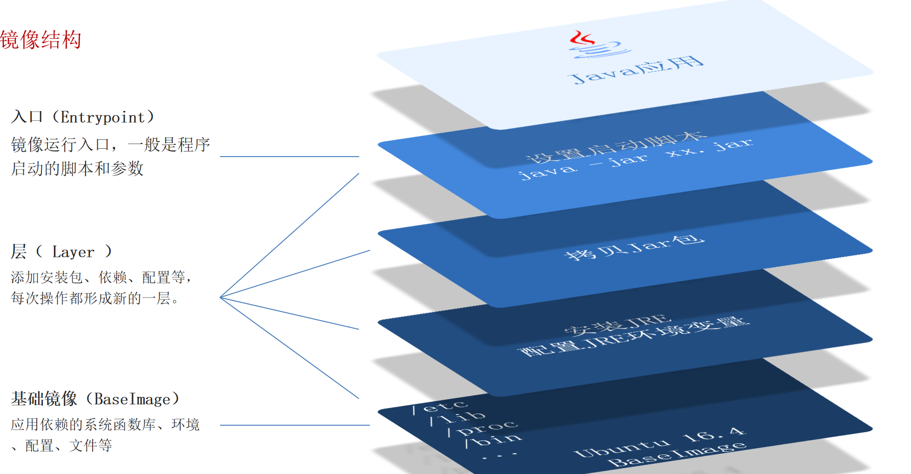

#### Dockerfile

就是一个文本文件，其中包含一个个的指令(Instruction)，用指令来说明要执行什么操作来构建镜像。将来Docker可以根据Dockerfile帮我们构建镜像。

常见指令如下：https://docs.docker.com/engine/reference/builder

| **指令**   | **说明**                                     | **示例**                                                     |
| ---------- | -------------------------------------------- | ------------------------------------------------------------ |
| FROM       | 指定基础镜像                                 | FROM centos:6                                                |
| ENV        | 设置环境变量，可在后面指令使用               | ENV key value                                                |
| COPY       | 拷贝本地文件到镜像的指定目录                 | COPY ./jre11.tar.gz /tmp                                     |
| RUN        | 执行Linux的shell命令，一般是安装过程的命令   | RUN tar -zxvf /tmp/jre11.tar.gz && EXPORTS path=/tmp/jre11:$path |
| EXPOSE     | 指定容器运行时监听的端口，是给镜像使用者看的 | EXPOSE 8080                                                  |
| ENTRYPOINT | 镜像中应用的启动命令，容器运行时调用         | ENTRYPOINT java -jar xx.jar                                  |

##### 构建命令：docker build -t 镜像名 Dockerfile目录

#### 自定义镜像基础步骤

1、创建项目

2、将文件压缩并发送到docker的主机

3、创建Dockerfile文件（尽量与项目文件同目录）

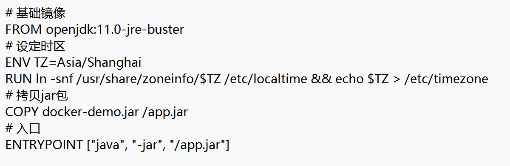


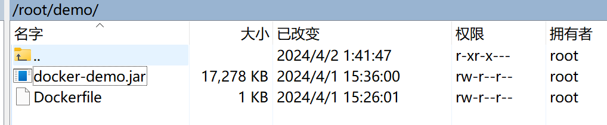

4、使用docker build加载为镜像

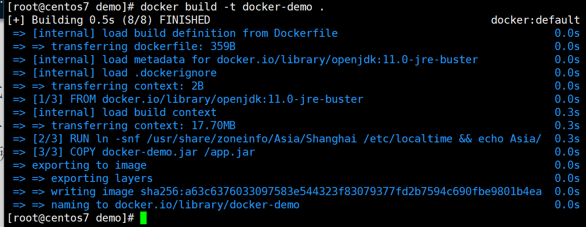

5、运行项目

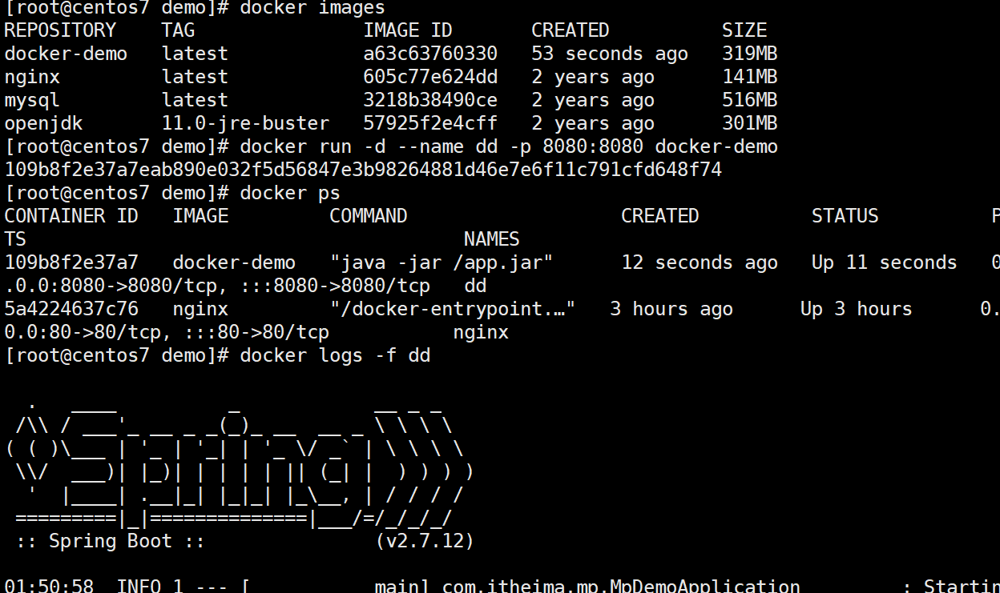

#### java应用镜像

1、配置

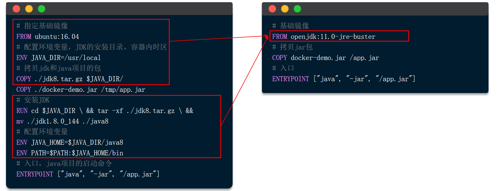

### 自定义网络

#### docker的网络连接

使用网桥，docker创建一个局域网，所有容器有自己的ip地址

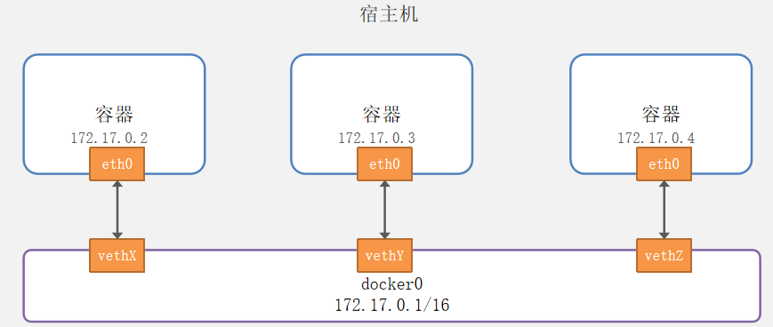

#### 命令

| **命令**                  | **说明**                 | **文档地址**              |
| ------------------------- | ------------------------ | ------------------------- |
| docker network create     | 创建一个网络             | docker network create     |
| docker network ls         | 查看所有网络             | docker network ls         |
| docker network rm         | 删除指定网络             | docker network rm         |
| docker network prune      | 清除未使用的网络         | docker network prune      |
| docker network connect    | 使指定容器连接加入某网络 | docker network connect    |
| docker network disconnect | 使指定容器连接离开某网络 | docker network disconnect |
| docker network inspect    | 查看网络详细信息         | docker network inspect    |

##### 创建一个网络

docker network create lyr(创建一个新的网段)

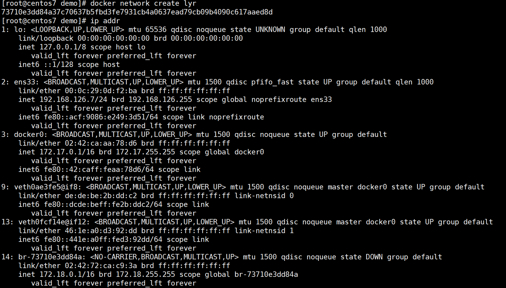

##### 容器连接到指定网络

运行后连接（不会覆盖旧的，直接添加新的）

docker network connect lyr 109b8f2e37a7

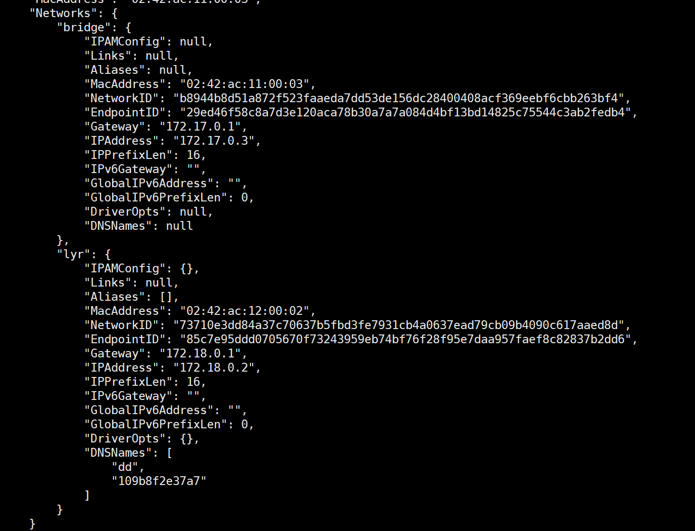

运行时连接

docker run -d --name dd -p 8080:8080 --network=lyr docker-demo

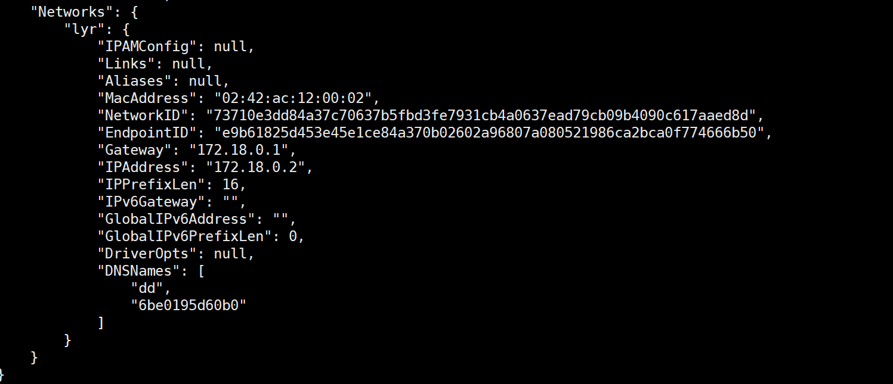

## 部署应用

### 部署java应用


### DockerCompase

Docker Compose通过一个单独的docker-compose.yml 模板文件（YAML 格式）来定义一组相关联的应用容器，帮助我们实现多个相互关联的Docker容器的快速部署。

#### dockerCompase与docker run区别

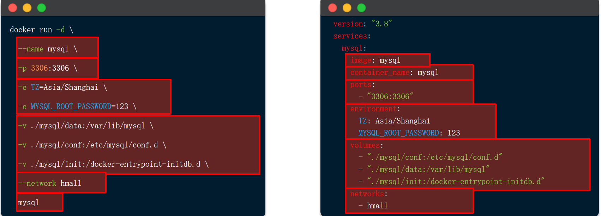

#### 示例：

```
version: "3.8"

services:
  mysql:
    image: mysql
    container_name: mysql
    ports:
      - "3306:3306"
    environment:
      TZ: Asia/Shanghai
      MYSQL_ROOT_PASSWORD: 123
    volumes:
      - "./mysql/conf:/etc/mysql/conf.d"
      - "./mysql/data:/var/lib/mysql"
      - "./mysql/init:/docker-entrypoint-initdb.d"
    networks:
      - new
  hmall:
    build:
       context: .
       dockerfile: Dockerfile
    container_name: hmall
    ports:
      - "8080:8080"
    networks:
      - new
    depends_on:
      - mysql
  nginx:
    image: nginx
    container_name: nginx
    ports:
      - "18080:18080"
      - "18081:18081"
    volumes:
      - "./nginx/nginx.conf:/etc/nginx/nginx.conf"
      - "./nginx/html:/etc/nginx/html"
    depends_on:
      - hmall
    networks:
      - new
networks:
  new:
    name: hmall

```

#### docker compose的命令格式

docker compose [OPTIONS] [COMMAND]

| **参数或指令** | **说明**                     |      |
| -------------- | ---------------------------- | ---- |
| options:       |                              |      |
| -f             | 指定compose文件的路径和名称  |      |
| -p             | 指定project名称              |      |
| command:       |                              |      |
| up             | 创建并启动所有service容器    |      |
| down           | 停止并移除所有容器、网络     |      |
| ps             | 列出所有启动的容器           |      |
| logs           | 查看指定容器的日志           |      |
| stop           | 停止容器                     |      |
| start          | 启动容器                     |      |
| restart        | 重启容器                     |      |
| top            | 查看运行的进程               |      |
| exec           | 在指定的运行中容器中执行命令 |      |

#### 步骤：

0、开发构建，创建

1、创建docker镜像

2、创建docker-compase.yml文件

3、docker compase命令
