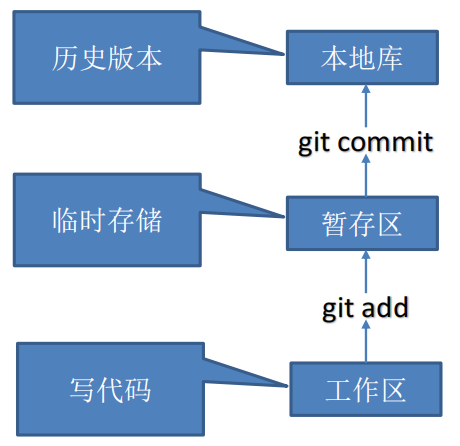

## Git基础

### 版本控制类型

意义：可以记录文件修改历史记录，从而让用户能够查看历史版本，方便版本切换

**集中式版本控制工具**：CVS、SVN(Subversion)、VSS

- 特点：有一个单一的集中管理的服务器，保存所有文件的修订版本，而协同工作的人们都通过客户端连到这台服务器，取出最新的文件或者提交更新

- 优点：每个人都可以在一定程度上看到项目中的其他人正在做些什么；而管理员也可以轻松掌控每个开发者的权限，并且管理一个集中化的版本控制系统，要远比在各个客户端上维护本地数据库来得轻松容易

- 缺点：如果服务器宕机一小时，那么在这一小时内，谁都无法提交更新，也就无法协同工作

**分布式版本控制工具**：Git、Mercurial、Bazaar、Darcs

- 客户端提取的不是最新版本的文件快照，而是把代码仓库完整地镜像下来（本地库）

- 这样任何一处协同工作用的文件发生故障，事后都可以用其他客户端的本地仓库进行恢复（因为每个客户端的每一次文件提取操作，实际上都是一次对整个文件仓库的完整备份）

- 解决了集中式版本控制系统的缺陷

  - 服务器断网的情况下也可以进行开发（因为版本控制是在本地进行的）

  - 每个客户端保存的也都是整个完整的项目（包含历史记录，更加安全）


## Git本地仓库语法

### Git安装

[Git 详细安装教程](https://blog.csdn.net/mukes/article/details/115693833)

[Git - 安装 Git (git-scm.com)](https://git-scm.com/book/zh/v2/起步-安装-Git)

### 细节/注意事项

1、盘路径：如c盘：/c/

2、仓库内可以使用任意linux命令

### 状态切换命令

#### 配置身份

- 配置用户名：git config --global [user.name](http://user.name/) 用户名

- 配置邮箱：git config --global user.email 邮箱地址

#### 代码状态



#### 初始化仓库（git init）

- 进入某个仓库：cd  仓库路径

  

- 初始化本地库：git init

- 删除仓库

  - 删除  .git 目录

- 查看本地库状态（git status）

  - git status

  - 红色为未添加到暂存区（增删改都会改变）

  - 绿色为已添加到暂存区

  - 提交仓库后信息（表示干净）

#### 暂存区

- 添加到暂存区（git add）

  - 一个文件：git add 文件名

  - 一个目录：git add 目录名

  - 所有文件：git add .

- 从暂存区删除（git rm --cached）
  - git rm --cached 文件名

#### 本地仓库

提交本地库（git commit -m）

- 提交所有文件：git commit -m "提交信息"
- 提交一个文件：git commit -m  "日志信息"   文件名

### 版本控制命令

##### 查看版本

- git reflog 查看版本信息

   

- git log 查看版本详细信息

##### 版本切换

- git reset --hard 版本号

  

### 分支操作命令

#### 概念：

- 在版本控制过程中，同时推进多个任务，为每个任务，我们就可以创建每个任务的单独分支

- 使用分支意味着程序员可以把自己的工作从开发主线上分离开来，开发自己分支的时候，不会影响主线分支的运行

- 对于初学者而言，分支可以简单理解为副本，一个分支就是一个单独的副本（分支底层其实也是指针的引用）

#### 作用：

- 同时并行推进多个功能开发，提高开发效率

- 各个分支在开发过程中，如果某一个分支开发失败，不会对其他分支有任何影响（失败的分支删除重新开始即可）

#### 图解


#### 基本分支命令

##### 操作

- 仓库开始位于master

- 创建完分支后就可以使用该分支了，且该分支状态是原来分支的状态（代码一样）

##### 创建分支：

```
git branch 分支名
```


##### 删除分支

已合并分支

```
git branch -d <branch_name>
```

强制删除一个尚未合并的分支

```
git branch -D <branch_name>
```


##### 查看分支：

git branch -v


##### 切换分支：

git checkout 分支名


#### 合并分支

git merge 分支名

##### 细节

- 如果不提交事务，则任一修改文件，所有文件都会变化

- 合并分支发生冲突解决后，只会改变合并那个分支，而不会改变其他分支

##### 普通

- 把指定的分支合并到当前分支上：git merge 分支名

  

##### MERGING

两个分支在同一个文件的同一个位置有两套完全不同的修改

**步骤**

1、出现冲突（进入冲突界面）

2、查看问题：git  status


3、解决问题

（1）把冲突代码修改


（2）提交事务（记住不要带文件名）


### Git归纳

#### 区域

**工作目录**（Working Directory）：也称为工作树，是你当前正在操作的项目文件所在的目录。在工作目录中，你可以添加、修改和删除文件，这些操作都会直接影响到你的项目。工作目录是你进行实际开发工作的地方。（切换版本跟分支会改变工作目录）

**暂存区**（Staging Area）：也称为索引（Index），是介于工作目录和版本库之间的缓冲区域。在暂存区，你可以暂存（Stage）将要提交的文件更改，以备下一步的提交。暂存区让你能够选择性地提交文件，只提交你想要的更改，而不是所有修改。（所有版本的暂存区都是一样的，也就是说，暂存区独立于仓库）

**版本库**（Repository）：也称为仓库，是Git用来存储项目的所有历史记录和元数据的地方。版本库包含项目的所有提交历史，每个提交都包含了项目的完整快照以及与之相关的元数据信息，如作者、提交时间等。版本库通常分为本地版本库和远程版本库，本地版本库位于你的计算机上，而远程版本库位于远程服务器上，用于协作和备份。（就是一个保存多个版本的仓库）

#### 版本切换

（1）未修改，切换版本，不影响代码

（2）已修改，且提交，切换版本，不影响代码

（3）已修改，未提交，切换版本

​	新建文件：会一起保存到工作目录和暂存区，切换时，新增文件会一起切换

​	修改文件：丢失修改，不影响切换版本

​	删除文件：丢失删除，不影响切换版本

#### 分支切换

（1）未修改，切换分支，不影响代码

（2）已修改，且提交，切换分支，不影响代码

（3）已修改，未提交，切换分支

​	新建文件：会一起保存到工作目录和暂存区，切换时，新增文件会一起切换

​	修改文件：丢失修改，不影响切换

​	删除文件：丢失删除，不影响切换

#### 分支合并

（1）分支合并的是合并最新版本

**！！！！  总之，在切换版本、分支时，要记住提交事务，把暂存区清空 ！！！！**


## Git远程仓库语法

### 命令


#### 远程信息

##### 查看远程仓库

- 查看所有远程仓库：`git remote -v`
- 查看特定远程仓库的详细信息（如 URL）：`git remote show <remote-name>`

##### 添加远程仓库

- 添加一个名为 `origin` 的远程仓库（通常用于首次克隆后的新仓库）：`git remote add origin <url>`
- 添加一个具有其他名称的远程仓库：`git remote add <remote-name> <url>`

##### 删除远程仓库

- 删除名为 `origin` 的远程仓库：`git remote remove origin`
- 删除名为 `<remote-name>` 的远程仓库：`git remote remove <remote-name>`

##### 设置远程仓库的 URL

- 更改名为 `origin` 的远程仓库的 URL：`git remote set-url origin <new-url>`
- 更改名为 `<remote-name>` 的远程仓库的 URL：`git remote set-url <remote-name> <new-url>`

##### 获取远程仓库的分支列表

- 获取 `origin` 的所有分支列表：`git branch -r`
- 获取 `<remote-name>` 的所有分支列表：`git branch -r -a | grep <remote-name>/`

##### 跟踪远程分支

- 使用 `--track` 选项在创建本地分支时自动跟踪远程分支：`git checkout --track origin/<branch-name>` 或 `git checkout -b <local-branch-name> origin/<branch-name>`
- 更改已存在的本地分支以跟踪远程分支：`git branch -u origin/<branch-name>`


#### 远程 》本地

##### 从远程仓库拉取代码

- 从 `origin` 的 `master` 分支拉取最新代码并合并到当前分支（如果当前分支与 `master` 分支相同，则直接拉取并更新）：`git pull origin master`
- 从 `<remote-name>` 的 `<branch-name>` 分支拉取最新代码并合并到当前分支：`git pull <remote-name> <branch-name>`

##### 克隆远程仓库

- 克隆一个远程仓库到本地：`git clone <url>`
- 克隆并指定一个不同的本地目录名：`git clone <url> <directory-name>`

##### 拉取并合并远程分支到当前分支

但通常建议使用 `git pull`

- `git fetch origin <branch-name>:<local-branch-name>`：拉取远程分支到本地，但不会自动合并。
- 接着，你可以使用 `git merge <local-branch-name>` 来合并这个分支。


#### 本地 》远程

##### 推送代码到远程仓库

- 将当前分支的最新更改推送到 `origin` 的 `master` 分支：`git push origin master`
- 将 `<branch-name>` 分支的最新更改推送到 `<remote-name>`：`git push <remote-name> <branch-name>`
- 如果远程分支尚不存在，可以使用 `-u` 或 `--set-upstream` 选项设置上游（upstream）分支，以便后续的 `git pull` 和 `git push` 命令可以省略远程仓库和分支名称：`git push -u origin <branch-name>`

### 注意事项

#### 推送分支

如果远程分支不存在，直接推送新分支不影响

如果分支存在了，应该先拉取分支，然后再本地分支修改合并，然后推送到远程仓库

#### 拉取分支

如果本地目录还没有仓库，可以拉取任意仓库分支

拉取分支时，最好只拉取一次，或者只有一个分支

如果拉取多个分支到一个本地仓库，那么这几个分支应该是由一个主分支分的（即每一个分支有关联）

拉取多个分支时，分支应该有共同祖先


## GitHub

### 创建远程仓库

1


2


### 创建远程仓库别名

- 1、复制远程库名字

- 2、在git中起别名（注意，需要在git仓库中）

### 推送本地分支到远程仓库


### 克隆远程仓库到本地

- 1、复制远程仓库地址

  

- 2、git获取

  

- 3、自动实现：拉取代码、初始化本地仓库、创建别名

  

  

### 拉取远程库内容到本地

- 1、直接拉取

  

​    

## IDEA


## GitLab

- IDEA集成GitLab