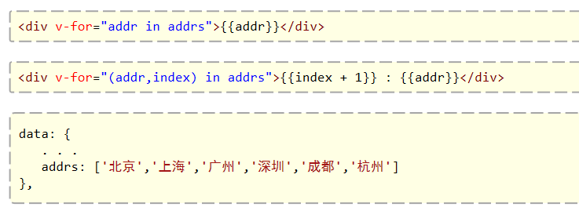
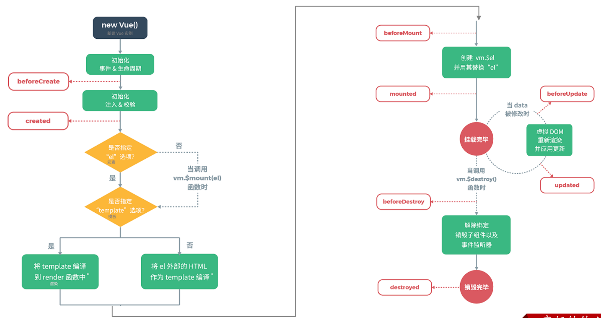
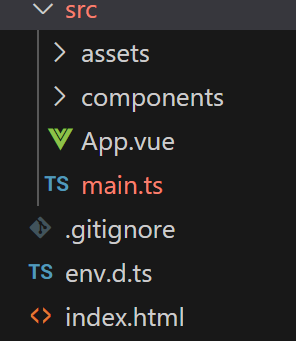

# 基础

Vue2官网：[介绍 — Vue.js (vuejs.org)](https://v2.cn.vuejs.org/v2/guide/)

Vue3笔记：[Vue3 教程 | 菜鸟教程 (runoob.com)](https://www.runoob.com/vue3/vue3-tutorial.html)

Vue3官网：[简介 | Vue.js (vuejs.org)](https://cn.vuejs.org/guide/introduction.html)

## 框架

### 普通VUE框架

#### 基本使用

```
<!DOCTYPE html>
<html lang="en">
<head>
    <meta charset="UTF-8">
    <meta name="viewport" content="width=device-width, initial-scale=1.0">
    <script src="js/vue.js"></script>
</head>
<body>
    <div id="app">
        <input type="text" v-model="message">
        {{message}}
    </div>
</body>
<script>
     //定义Vue对象
     new Vue({
        el: "#app", //vue接管区域
        data:{
            message: "Hello Vue"
        },
        methods: {
        	handle: function(){
           		alert("你点我了一下...");
        	}
		}
    })
</script>
</html>
```

1、引入包

<script src="js/vue.js"></script>

2、创建Vue对象

```
new Vue({
        el: "#app", //vue接管区域
        data:{
            message: "Hello Vue"
        },
        methods: {
        	handle: function(){
           		alert("你点我了一下...");
        	}
		}
    })
```

- el:  用来指定哪儿些标签受 Vue 管理。 该属性取值 `#app` 中的 `app` 需要是受管理的标签的id属性值
- data: 用来定义数据模型
- methods: 用来定义函数。这个我们在后面就会用到

3、创建Vue视图代码

```
<div id="app">
        <input type="text" v-model="message">
        {{message}}
</div>
```

#### VUE对象

##### vue绑定视图（el）

1、创建视图标签

```
<div id="app">...</div>
```

2、创建el绑定视图

```
new Vue({
        el: "#app", //vue接管区域
    })
```

##### 数据定义（data）


##### 方法定义（methods）

```
handle: function(){
           alert("你点我了一下...");
        }
```


#### VUE视图

##### 使用data数据

1、对象定义data

```
new Vue({
        el: "#app", //vue接管区域
        data:{
           url: "https://www.baidu.com"
        }
    })
```

2、视图使用

~~~html
<a v-bind:href="url">链接1</a>
~~~

##### 标签

| **指令**  | **作用**                                            |
| --------- | --------------------------------------------------- |
| v-bind    | 为HTML标签绑定属性值，如设置  href , css样式等      |
| v-model   | 在表单元素上创建双向数据绑定                        |
| v-on      | 为HTML标签绑定事件                                  |
| v-if      | 条件性的渲染某元素，判定为true时渲染,否则不渲染     |
| v-else    |                                                     |
| v-else-if |                                                     |
| v-show    | 根据条件展示某元素，区别在于切换的是display属性的值 |
| v-for     | 列表渲染，遍历容器的元素或者对象的属性              |

- v-bind（可以省略英文）：一般绑定非显示在前端的值,通常不通过前端改变

  

- v-model ：数据值会变化，同时在前端会同时显示变化

- v-on ：

- v-if

- v-for

### VUE工程框架

#### 目录结构

javascript，后缀名为js

typescript，后缀名为ts

```
mock					// 用于测试，模拟后端接口地址
node_modules            // 整个项目的依赖包
public					// 存储公共的静态资源：图片
	| favicon.ico       // 网页图标
src						// 源代码目录，非常重要
    | api				// 提供用于请求后端接口的js文件
    | assets			// 存储静态资源：图片、css
    | components		// 存储公共组件,可重用的一些组件
    | directive			// 存储自定义的一些指令
    | hooks				// 存储自定义的钩子函数
    | i18n				// 存储用于国际化的js文件
    | layout			// 存储首页布局组件
    | pinia				// 用于进行全局状态管理
    | router			// 存储用于进行路由的js文件
    | utils				// 存储工具类的js文件
    | views				// 基本视图组件，和路由绑定的组件
    | App.vue			// 根组件（入口组件）
    | default-settings.js // 默认设置的js文件
    | error-log.js		// 错误日志js文件
    | global-components.js // 全局组件的js文件
    | main.js			// 入口js文件(非常重要)
    | permission.js		// 权限相关的js文件(路由前置守卫、路由后置守卫)
env.d.js                // 使项目可以识别其他文件后缀名
index.html              // 默认网页
package.json            // 包管理。模块基本信息，版本信息
README.md               // 框架介绍
tsconfig.json			//
tsconfig.app.json
tsconfig.node.json
vite.config.js			// vite的配置文件，可以在该配置文件中配置前端工程的端口号

```

#### 创建工程方式

##### **基于 vue-cli 创建**

点击查看[官方文档](https://cli.vuejs.org/zh/guide/creating-a-project.html#vue-create)

> 备注：目前`vue-cli`已处于维护模式，官方推荐基于 `Vite` 创建项目。

```powershell
## 查看@vue/cli版本，确保@vue/cli版本在4.5.0以上
vue --version

## 安装或者升级你的@vue/cli 
npm install -g @vue/cli

## 执行创建命令
vue create vue_test

##  随后选择3.x
##  Choose a version of Vue.js that you want to start the project with (Use arrow keys)
##  > 3.x
##    2.x

## 启动
cd vue_test
npm run serve
```

---

##### **基于 vite 创建(推荐)**

`vite` 是新一代前端构建工具，官网地址：[https://vitejs.cn](https://vitejs.cn/)，`vite`的优势如下：

- 轻量快速的热重载（`HMR`），能实现极速的服务启动。
- 对 `TypeScript`、`JSX`、`CSS` 等支持开箱即用。
- 真正的按需编译，不再等待整个应用编译完成。
- `webpack`构建 与 `vite`构建对比图如下：

* 具体操作如下（点击查看[官方文档](https://cn.vuejs.org/guide/quick-start.html#creating-a-vue-application)）

```powershell
## 0.安装vite
npm install -g vite

## 1.创建命令
npm create vue@latest

## 2.具体配置
## 配置项目名称
√ Project name: vue3_test
## 是否添加TypeScript支持
√ Add TypeScript?  Yes
## 是否添加JSX支持
√ Add JSX Support?  No
## 是否添加路由环境
√ Add Vue Router for Single Page Application development?  No
## 是否添加pinia环境
√ Add Pinia for state management?  No
## 是否添加单元测试
√ Add Vitest for Unit Testing?  No
## 是否添加端到端测试方案
√ Add an End-to-End Testing Solution? » No
## 是否添加ESLint语法检查
√ Add ESLint for code quality?  Yes
## 是否添加Prettiert代码格式化
√ Add Prettier for code formatting?  No

## 3.添加依赖
npm i

## 4.运行
npm run dev
```


## 生命周期

### vue2的生命周期

指的是vue对象从创建到销毁的过程。vue的生命周期包含8个阶段：每触发一个生命周期事件，会自动执行一个生命周期方法，这些生命周期方法也被称为钩子方法。其完整的生命周期如下图所示：

| 状态          | 阶段周期 |
| ------------- | -------- |
| beforeCreate  | 创建前   |
| created       | 创建后   |
| beforeMount   | 挂载前   |
| mounted       | 挂载完成 |
| beforeUpdate  | 更新前   |
| updated       | 更新后   |
| beforeDestroy | 销毁前   |
| destroyed     | 销毁后   |

#### 创建

将vue加载到内存

#### 挂载

将vue挂载到页面

mounted：挂载完成，Vue初始化成功，HTML页面渲染成功，**以后我们一般用于页面初始化自动的ajax请求后台数据**

#### 更新

数据发生变化

#### 销毁

#### 各个阶段对应的钩子函数：




### vue3的生命周期

#### 创建阶段：`setup`

#### 挂载阶段：`onBeforeMount`、`onMounted`

#### 更新阶段：`onBeforeUpdate`、`onUpdated`

#### 卸载阶段：`onBeforeUnmount`、`onUnmounted`

## 项目启动与停止

### 启动

npm run dev

### 停止

ctr + c

## 工程入口（项目启动逻辑）

#### 基于vite创建的ts的vue工程



1、index.html

```
<!DOCTYPE html>
<html lang="en">
  <head>
    <meta charset="UTF-8">
    <link rel="icon" href="/favicon.ico">
    <meta name="viewport" content="width=device-width, initial-scale=1.0">
    <title>Vite App</title>
  </head>
  <body>
    <!-- 引用根组件（id为app，在main.ts文件引用） -->
    <div id="app"></div>
    <!-- 引入main.ts文件 -->
    <script type="module" src="/src/main.ts"></script>
  </body>
</html>

```

导入ts文件main.ts（普通工程的代码）

使用标签id为app的元素，显示App.vue页面

2、main.ts

```
//引入创建根组件函数
import { createApp } from 'vue'
//引入根组件
import App from './App.vue'
//将根组件挂载到id为app的标签
createApp(App).mount('#app')

```

由于index.htm只导入了ts代码，所有需要在main.ts导入其他文件

导入css样式

导入组件

挂载组件

3、App.vue

```
<script setup lang="ts">
import HelloWorld from './components/HelloWorld.vue'
import TheWelcome from './components/TheWelcome.vue'
</script>

<template>
  <header>
    

    <div class="wrapper">
      <HelloWorld msg="You did it!" />
    </div>
  </header>

  <main>
    <TheWelcome />
  </main>
</template>

<style scoped>
</style>
```


# VUE3工程语法

## vue文件

```
<script setup lang="ts">
vue对象
</script>
 export default {
      name:'Person',
      setup(){
      }
 }
<template>
html模板
</template>

<style>
css样式
</style>

```

### template

### style

就是普通的css样式定义

scoped（加上这个后，只会覆盖局部样式）

### script

#### export default { ... }（导出一个对象）

```
 export default {
      name:'Person',
      data(){//vue3不推荐
      },
      methods: {//vue3不推荐
      },
      setup(){
      }
 }
```

该函数是导出一个对象，里面包含方法与属性，用于模板调用

选项式api可以使用组合式api数据，但是不能反过来使用

##### 选项式API （data(){...}, methods:{...},）

- data: 用来定义数据模型
- methods: 用来定义函数。这个我们在后面就会用到

默认为响应式数据（双绑定）

##### 组合式API（setup）

`setup`是`Vue3`中一个新的配置项，值是一个函数，它是 `Composition API` **“表演的舞台**_**”**_，组件中所用到的：数据、方法、计算属性、监视......等等，均配置在`setup`中。

特点如下：

- `setup`函数返回的对象中的内容，可直接在模板中使用。
- `setup`中访问`this`是`undefined`。
- `setup`函数会在`beforeCreate`之前调用，它是“领先”所有钩子执行的。

###### 定义属性、方法

```
setup(){
        // 数据，原来写在data中（注意：此时的name、age、tel数据都不是响应式数据）
        let name = '张三'
        let age = 18
        let tel = '13888888888'
  
        // 方法，原来写在methods中
        function changeName(){
          name = 'zhang-san' //注意：此时这么修改name页面是不变化的
          console.log(name)
        }
  
        // 返回一个对象，对象中的内容，模板中可以直接使用
        return {name,age,tel,changeName}
      }
```

###### setup语法糖

```
<script lang="ts">//如果名字不同，才使用这个
  export default {
    name:'Person',
  }
</script>

<!-- 下面的写法是setup语法糖 -->
<script setup lang="ts">
  console.log(this) //undefined
  // 数据（注意：此时的name、age、tel都不是响应式数据）
  let name = '张三'
  let age = 18
  let tel = '13888888888'
  // 方法
  function changName(){
    name = '李四'//注意：此时这么修改name页面是不变化的
  }
</script>
```


### vue文件内三个模板相互合作

script与template：template使用script内的属性、方法

style与template：定义css样式，template使用

### 在一个vue文件导入另一个vue文件

#### vue2

1、准备好一个vue文件

2、import文件

3、注册组件

```
<script lang="ts">
  import Person from './components/Person.vue'

  export default {
    name:'App', //组件名
    components:{Person}
  }
</script>

```

4、使用组件

```
<template>
  <div class="app">
    <h1>你好啊!</h1>
    <Person/>
  </div>
</template>
```

#### vue3

直接在setup中引入

### vue文件传值给另一个vue文件

#### vue发送值

<template>
	<Person :list="persons"/>
</template>

#### vue接收值

```
<template>
<div class="person">
<ul>
  <li v-for="item in list" :key="item.id">
     {{item.name}}--{{item.age}}
   </li>
 </ul>
</div>
</template>

<script lang="ts" setup name="Person">
import {defineProps} from 'vue'
import {type PersonInter} from '@/types'

// 第一种写法：仅接收
// const props = defineProps(['list'])

// 第二种写法：接收+限制类型
// defineProps<{list:Persons}>()

// 第三种写法：接收+限制类型+指定默认值+限制必要性
let props = withDefaults(defineProps<{list?:Persons}>(),{
  list:()=>[{id:'asdasg01',name:'小猪佩奇',age:18}]
})
console.log(props)
</script>
```

### 响应式数据

在vue2中，所有在data内的数据都是响应式数据，所以不需要改变什么，但是在vue3中，setup中数据不是响应式数据

#### 基本类型的响应式数据（ref）

**语法：**`let xxx = ref(初始值)`。

**返回值：**一个`RefImpl`的实例对象，简称`ref对象`或`ref`，`ref`对象的`value`**属性是响应式的**。

**注意点：**

- `JS`中操作数据需要：`xxx.value`，但模板中不需要`.value`，直接使用即可。
- 对于`let name = ref('张三')`来说，`name`不是响应式的，`name.value`是响应式的。

##### 使用

1、定义数据

 let name = ref('张三')

 let age = ref(18)

2、模板使用

```
   <div class="person">
      <h2>姓名：{{name}}</h2>
      <h2>年龄：{{age}}</h2>
      <button @click="changeName">修改名字</button>
      <button @click="changeAge">年龄+1</button>
      <button @click="showTel">点我查看联系方式</button>
    </div>
```

3、方法改变

```
 function changeName(){
      // JS中操作ref对象时候需要.value
      name.value = '李四'
      console.log(name.value)
      // 注意：name不是响应式的，name.value是响应式的，所以如下代码并不会引起页面的更新。
      // name = ref('zhang-san')
    }
    function changeAge(){
      // JS中操作ref对象时候需要.value
      age.value += 1 
      console.log(age.value)
    }
```

4、完整代码

```
  <template>
    <div class="person">
      <h2>姓名：{{name}}</h2>
      <h2>年龄：{{age}}</h2>
      <button @click="changeName">修改名字</button>
      <button @click="changeAge">年龄+1</button>
      <button @click="showTel">点我查看联系方式</button>
    </div>
  </template>
  
  <script setup lang="ts" name="Person">
    import {ref} from 'vue'
    // name和age是一个RefImpl的实例对象，简称ref对象，它们的value属性是响应式的。
    let name = ref('张三')
    let age = ref(18)
    // tel就是一个普通的字符串，不是响应式的
    let tel = '13888888888'
  
    function changeName(){
      // JS中操作ref对象时候需要.value
      name.value = '李四'
      console.log(name.value)
  
      // 注意：name不是响应式的，name.value是响应式的，所以如下代码并不会引起页面的更新。
      // name = ref('zhang-san')
    }
    function changeAge(){
      // JS中操作ref对象时候需要.value
      age.value += 1 
      console.log(age.value)
    }
    function showTel(){
      alert(tel)
    }
  </script>
```

#### 对象类型的响应式数据（ref）

- 其实`ref`接收的数据可以是：**基本类型**、**对象类型**。
- 若`ref`接收的是对象类型，内部其实也是调用了`reactive`函数。

##### 使用

```
<template>
  <div class="person">
    <h2>汽车信息：一台{{ car.brand }}汽车，价值{{ car.price }}万</h2>
    <h2>游戏列表：</h2>
    <ul>
      <li v-for="g in games" :key="g.id">{{ g.name }}</li>
    </ul>
    <h2>测试：{{obj.a.b.c.d}}</h2>
    <button @click="changeCarPrice">修改汽车价格</button>
    <button @click="changeFirstGame">修改第一游戏</button>
    <button @click="test">测试</button>
  </div>
</template>

<script lang="ts" setup name="Person">
import { ref } from 'vue'

// 数据
let car = ref({ brand: '奔驰', price: 100 })
let games = ref([
  { id: 'ahsgdyfa01', name: '英雄联盟' },
  { id: 'ahsgdyfa02', name: '王者荣耀' },
  { id: 'ahsgdyfa03', name: '原神' }
])
let obj = ref({
  a:{
    b:{
      c:{
        d:666
      }
    }
  }
})

console.log(car)

function changeCarPrice() {
  car.value.price += 10
}
function changeFirstGame() {
  games.value[0].name = '流星蝴蝶剑'
}
function test(){
  obj.value.a.b.c.d = 999
}
</script>
```


#### 对象类型的响应式数据（reactive）

- **作用：**定义一个**响应式对象**（基本类型不要用它，要用`ref`，否则报错）
- **语法：**`let 响应式对象= reactive(源对象)`。
- **返回值：**一个`Proxy`的实例对象，简称：响应式对象。
- **注意点：**`reactive`定义的响应式数据是“深层次”的。

##### 使用

```
<template>
  <div class="person">
    <h2>汽车信息：一台{{ car.brand }}汽车，价值{{ car.price }}万</h2>
    <h2>游戏列表：</h2>
    <ul>
      <li v-for="g in games" :key="g.id">{{ g.name }}</li>
    </ul>
    <h2>测试：{{obj.a.b.c.d}}</h2>
    <button @click="changeCarPrice">修改汽车价格</button>
    <button @click="changeFirstGame">修改第一游戏</button>
    <button @click="test">测试</button>
  </div>
</template>

<script lang="ts" setup name="Person">
import { reactive } from 'vue'

// 数据
let car = reactive({ brand: '奔驰', price: 100 })
let games = reactive([
  { id: 'ahsgdyfa01', name: '英雄联盟' },
  { id: 'ahsgdyfa02', name: '王者荣耀' },
  { id: 'ahsgdyfa03', name: '原神' }
])
let obj = reactive({
  a:{
    b:{
      c:{
        d:666
      }
    }
  }
})

function changeCarPrice() {
  car.price += 10
}
function changeFirstGame() {
  games[0].name = '流星蝴蝶剑'
}
function test(){
  obj.a.b.c.d = 999
}
</script>
```

#### ref与reactive

宏观角度看：

> 1. `ref`用来定义：**基本类型数据**、**对象类型数据**；
>
> 2. `reactive`用来定义：**对象类型数据**。

- 区别：

> 1. `ref`创建的变量必须使用`.value`（可以使用`volar`插件自动添加`.value`）。
>
> 2. `reactive`重新分配一个新对象，会**失去**响应式（可以使用`Object.assign`去整体替换）。
>
>    Object.assign(reactive对象，新值对象)

- 使用原则：

> 1. 若需要一个基本类型的响应式数据，必须使用`ref`。
> 2. 若需要一个响应式对象，层级不深，`ref`、`reactive`都可以。
> 3. 若需要一个响应式对象，且层级较深，推荐使用`reactive`。

#### toRefs与toRef

- 作用：将一个响应式对象中的每一个属性，转换为`ref`对象。
- 备注：`toRefs`与`toRef`功能一致，但`toRefs`可以批量转换。

##### 使用

```
<template>
  <div class="person">
    <h2>姓名：{{person.name}}</h2>
    <h2>年龄：{{person.age}}</h2>
    <h2>性别：{{person.gender}}</h2>
    <button @click="changeName">修改名字</button>
    <button @click="changeAge">修改年龄</button>
    <button @click="changeGender">修改性别</button>
  </div>
</template>

<script lang="ts" setup name="Person">
  import {ref,reactive,toRefs,toRef} from 'vue'

  // 数据
  let person = reactive({name:'张三', age:18, gender:'男'})
	
  // 通过toRefs将person对象中的n个属性批量取出，且依然保持响应式的能力
  let {name,gender} =  toRefs(person)
	
  // 通过toRef将person对象中的gender属性取出，且依然保持响应式的能力
  let age = toRef(person,'age')

  // 方法
  function changeName(){
    name.value += '~'
  }
  function changeAge(){
    age.value += 1
  }
  function changeGender(){
    gender.value = '女'
  }
</script>
```

### computed

作用：根据已有数据计算出新数据（和`Vue2`中的`computed`作用一致）。

##### get

获取return值

##### set

设置属性时触发该函数

##### 使用

```
<template>
    <div class="person">
      姓：<input type="text" v-model="firstName"> <br>
      名：<input type="text" v-model="lastName"> <br>
      全名：<span>{{fullName}}</span> <br>
      <button @click="changeFullName">全名改为：li-si</button>
    </div>
</template>
  
<script setup lang="ts" name="App">
    import {ref,computed} from 'vue'
  
    let firstName = ref('zhang')
    let lastName = ref('san')
  
    // 计算属性——只读取，不修改
    /* let fullName = computed(()=>{
      return firstName.value + '-' + lastName.value
    }) */
  
  
    // 计算属性——既读取又修改
    let fullName = computed({
      // 读取
      get(){
        return firstName.value + '-' + lastName.value
      },
      // 修改
      set(val){
        console.log('有人修改了fullName',val)
        firstName.value = val.split('-')[0]
        lastName.value = val.split('-')[1]
      }
    })
  
    function changeFullName(){
      fullName.value = 'li-si'
    } 
</script>
```

### watch

- 作用：监视数据的变化（和`Vue2`中的`watch`作用一致）
- 特点：`Vue3`中的`watch`只能监视以下**四种数据**：

> 1. `ref`定义的数据。
> 2. `reactive`定义的数据。
> 3. 函数返回一个值（`getter`函数）。
> 4. 一个包含上述内容的数组。

####  情况一

监视`ref`定义的【基本类型】数据：直接写数据名即可，监视的是其`value`值的改变。

```vue
<template>
  <div class="person">
    <h1>情况一：监视【ref】定义的【基本类型】数据</h1>
    <h2>当前求和为：{{sum}}</h2>
    <button @click="changeSum">点我sum+1</button>
  </div>
</template>

<script lang="ts" setup name="Person">
  import {ref,watch} from 'vue'
  // 数据
  let sum = ref(0)
  // 方法
  function changeSum(){
    sum.value += 1
  }
  // 监视，情况一：监视【ref】定义的【基本类型】数据
  const stopWatch = watch(sum,(newValue,oldValue)=>{
    console.log('sum变化了',newValue,oldValue)
    if(newValue >= 10){
      stopWatch()
    }
  })
</script>
```

#### 情况二

监视`ref`定义的【对象类型】数据：直接写数据名，监视的是对象的【地址值】，若想监视对象内部的数据，要手动开启深度监视。

> 注意：
>
> * 若修改的是`ref`定义的对象中的属性，`newValue` 和 `oldValue` 都是新值，因为它们是同一个对象。
>
> * 若修改整个`ref`定义的对象，`newValue` 是新值， `oldValue` 是旧值，因为不是同一个对象了。

```vue
<template>
  <div class="person">
    <h1>情况二：监视【ref】定义的【对象类型】数据</h1>
    <h2>姓名：{{ person.name }}</h2>
    <h2>年龄：{{ person.age }}</h2>
    <button @click="changeName">修改名字</button>
    <button @click="changeAge">修改年龄</button>
    <button @click="changePerson">修改整个人</button>
  </div>
</template>

<script lang="ts" setup name="Person">
  import {ref,watch} from 'vue'
  // 数据
  let person = ref({
    name:'张三',
    age:18
  })
  // 方法
  function changeName(){
    person.value.name += '~'
  }
  function changeAge(){
    person.value.age += 1
  }
  function changePerson(){
    person.value = {name:'李四',age:90}
  }
  /* 
    监视，情况一：监视【ref】定义的【对象类型】数据，监视的是对象的地址值，若想监视对象内部属性的变化，需要手动开启深度监视
    watch的第一个参数是：被监视的数据
    watch的第二个参数是：监视的回调
    watch的第三个参数是：配置对象（deep、immediate等等.....） 
  */
  watch(person,(newValue,oldValue)=>{
    console.log('person变化了',newValue,oldValue)
  },{deep:true})
  
</script>
```

#### 情况三

监视`reactive`定义的【对象类型】数据，且默认开启了深度监视。

```vue
<template>
  <div class="person">
    <h1>情况三：监视【reactive】定义的【对象类型】数据</h1>
    <h2>姓名：{{ person.name }}</h2>
    <h2>年龄：{{ person.age }}</h2>
    <button @click="changeName">修改名字</button>
    <button @click="changeAge">修改年龄</button>
    <button @click="changePerson">修改整个人</button>
    <hr>
    <h2>测试：{{obj.a.b.c}}</h2>
    <button @click="test">修改obj.a.b.c</button>
  </div>
</template>

<script lang="ts" setup name="Person">
  import {reactive,watch} from 'vue'
  // 数据
  let person = reactive({
    name:'张三',
    age:18
  })
  let obj = reactive({
    a:{
      b:{
        c:666
      }
    }
  })
  // 方法
  function changeName(){
    person.name += '~'
  }
  function changeAge(){
    person.age += 1
  }
  function changePerson(){
    Object.assign(person,{name:'李四',age:80})
  }
  function test(){
    obj.a.b.c = 888
  }

  // 监视，情况三：监视【reactive】定义的【对象类型】数据，且默认是开启深度监视的
  watch(person,(newValue,oldValue)=>{
    console.log('person变化了',newValue,oldValue)
  })
  watch(obj,(newValue,oldValue)=>{
    console.log('Obj变化了',newValue,oldValue)
  })
</script>
```

#### 情况四

监视`ref`或`reactive`定义的【对象类型】数据中的**某个属性**，注意点如下：

1. 若该属性值**不是**【对象类型】，需要写成函数形式。
2. 若该属性值是**依然**是【对象类型】，可直接编，也可写成函数，建议写成函数。

结论：监视的要是对象里的属性，那么最好写函数式，注意点：若是对象监视的是地址值，需要关注对象内部，需要手动开启深度监视。

```vue
<template>
  <div class="person">
    <h1>情况四：监视【ref】或【reactive】定义的【对象类型】数据中的某个属性</h1>
    <h2>姓名：{{ person.name }}</h2>
    <h2>年龄：{{ person.age }}</h2>
    <h2>汽车：{{ person.car.c1 }}、{{ person.car.c2 }}</h2>
    <button @click="changeName">修改名字</button>
    <button @click="changeAge">修改年龄</button>
    <button @click="changeC1">修改第一台车</button>
    <button @click="changeC2">修改第二台车</button>
    <button @click="changeCar">修改整个车</button>
  </div>
</template>

<script lang="ts" setup name="Person">
  import {reactive,watch} from 'vue'

  // 数据
  let person = reactive({
    name:'张三',
    age:18,
    car:{
      c1:'奔驰',
      c2:'宝马'
    }
  })
  // 方法
  function changeName(){
    person.name += '~'
  }
  function changeAge(){
    person.age += 1
  }
  function changeC1(){
    person.car.c1 = '奥迪'
  }
  function changeC2(){
    person.car.c2 = '大众'
  }
  function changeCar(){
    person.car = {c1:'雅迪',c2:'爱玛'}
  }

  // 监视，情况四：监视响应式对象中的某个属性，且该属性是基本类型的，要写成函数式
  /* watch(()=> person.name,(newValue,oldValue)=>{
    console.log('person.name变化了',newValue,oldValue)
  }) */

  // 监视，情况四：监视响应式对象中的某个属性，且该属性是对象类型的，可以直接写，也能写函数，更推荐写函数
  watch(()=>person.car,(newValue,oldValue)=>{
    console.log('person.car变化了',newValue,oldValue)
  },{deep:true})
</script>
```

#### 情况五

监视上述的多个数据

### watchEffect

立即运行一个函数，同时响应式地追踪其依赖，并在依赖更改时重新执行该函数

`watch`对比`watchEffect`

> 1. 都能监听响应式数据的变化，不同的是监听数据变化的方式不同
>
> 2. `watch`：要明确指出监视的数据
>
> 3. `watchEffect`：不用明确指出监视的数据（函数中用到哪些属性，那就监视哪些属性）。

##### 示例：

```vue
<template>
  <div class="person">
    <h1>需求：水温达到50℃，或水位达到20cm，则联系服务器</h1>
    <h2 id="demo">水温：{{temp}}</h2>
    <h2>水位：{{height}}</h2>
    <button @click="changePrice">水温+1</button>
    <button @click="changeSum">水位+10</button>
  </div>
</template>

<script lang="ts" setup name="Person">
  import {ref,watch,watchEffect} from 'vue'
  // 数据
  let temp = ref(0)
  let height = ref(0)

  // 方法
  function changePrice(){
    temp.value += 10
  }
  function changeSum(){
    height.value += 1
  }

  // 用watch实现，需要明确的指出要监视：temp、height
  watch([temp,height],(value)=>{
    // 从value中获取最新的temp值、height值
    const [newTemp,newHeight] = value
    // 室温达到50℃，或水位达到20cm，立刻联系服务器
    if(newTemp >= 50 || newHeight >= 20){
      console.log('联系服务器')
    }
  })

  // 用watchEffect实现，不用
  const stopWtach = watchEffect(()=>{
    // 室温达到50℃，或水位达到20cm，立刻联系服务器
    if(temp.value >= 50 || height.value >= 20){
      console.log(document.getElementById('demo')?.innerText)
      console.log('联系服务器')
    }
    // 水温达到100，或水位达到50，取消监视
    if(temp.value === 100 || height.value === 50){
      console.log('清理了')
      stopWtach()
    }
  })
</script>
```

### ref

#### 响应式数据（在上面）

#### 标记标签

作用：用于注册模板引用。

> * 用在普通`DOM`标签上，获取的是`DOM`节点。
>
> * 用在组件标签上，获取的是组件实例对象。

##### 用在普通`DOM`标签上：

```vue
<template>
  <div class="person">
    <h1 ref="title1">尚硅谷</h1>
    <h2 ref="title2">前端</h2>
    <h3 ref="title3">Vue</h3>
    <input type="text" ref="inpt"> <br><br>
    <button @click="showLog">点我打印内容</button>
  </div>
</template>

<script lang="ts" setup name="Person">
  import {ref} from 'vue'
	
  let title1 = ref()
  let title2 = ref()
  let title3 = ref()

  function showLog(){
    // 通过id获取元素
    const t1 = document.getElementById('title1')
    // 打印内容
    console.log((t1 as HTMLElement).innerText)
    console.log((<HTMLElement>t1).innerText)
    console.log(t1?.innerText)
    
		/************************************/
		
    // 通过ref获取元素
    console.log(title1.value)
    console.log(title2.value)
    console.log(title3.value)
  }
</script>
```

##### 用在组件标签上：

子组件：defineExpose，该方法将东西交给外部

父组件：获取暴露的数据

```vue
<!-- 父组件App.vue -->
<template>
  <Person ref="ren"/>
  <button @click="test">测试</button>
</template>

<script lang="ts" setup name="App">
  import Person from './components/Person.vue'
  import {ref} from 'vue'

  let ren = ref()

  function test(){
    console.log(ren.value.name)
    console.log(ren.value.age)
  }
</script>


<!-- 子组件Person.vue中要使用defineExpose暴露内容 -->
<script lang="ts" setup name="Person">
  import {ref,defineExpose} from 'vue'
	// 数据
  let name = ref('张三')
  let age = ref(18)
  /****************************/
  /****************************/
  // 使用defineExpose将组件中的数据交给外部
  defineExpose({name,age})
</script>
```

### props（接收父vue数据）

#### ts文件创建接口

> ```js
> // 定义一个接口，限制每个Person对象的格式
> export interface PersonInter {
> id:string,
> name:string,
>  age:number
> }
> 
> // 定义一个自定义类型Persons
> export type Persons = Array<PersonInter>
> ```

#### vue父组件使用接口

> ```vue
> <template>
> 	<Person :list="persons"/>
> </template>
> 
> <script lang="ts" setup name="App">
> import Person from './components/Person.vue'
> import {reactive} from 'vue'
> import {type Persons} from './types'
> 
>  let persons = reactive<Persons>([
>   {id:'e98219e12',name:'张三',age:18},
>    {id:'e98219e13',name:'李四',age:19},
>     {id:'e98219e14',name:'王五',age:20}
>   ])
> </script>
> 
> ```

#### vue子组件使用接口

> ```Vue
> <template>
> <div class="person">
> <ul>
>   <li v-for="item in list" :key="item.id">
>      {{item.name}}--{{item.age}}
>    </li>
>  </ul>
> </div>
> </template>
> 
> <script lang="ts" setup name="Person">
> import {defineProps} from 'vue'
> import {type PersonInter} from '@/types'
> 
> // 第一种写法：仅接收
> // const props = defineProps(['list'])
> 
> // 第二种写法：接收+限制类型
> // defineProps<{list:Persons}>()
> 
> // 第三种写法：接收+限制类型+指定默认值+限制必要性
> let props = withDefaults(defineProps<{list?:Persons}>(),{
>   list:()=>[{id:'asdasg01',name:'小猪佩奇',age:18}]
> })
> console.log(props)
> </script>
> ```


## ts文件

### 接口

#### ts文件创建接口

> ```js
> // 定义一个接口，限制每个Person对象的格式
> export interface PersonInter {
> id:string,
> name:string,
>  age:number
> }
> 
> // 定义一个自定义类型Persons
> export type Persons = Array<PersonInter>
> ```
>

#### vue父组件使用接口

> ```vue
> <template>
> 	<Person :list="persons"/>
> </template>
> 
> <script lang="ts" setup name="App">
> import Person from './components/Person.vue'
> import {reactive} from 'vue'
> import {type Persons} from './types'
> 
>  let persons = reactive<Persons>([
>   {id:'e98219e12',name:'张三',age:18},
>    {id:'e98219e13',name:'李四',age:19},
>     {id:'e98219e14',name:'王五',age:20}
>   ])
> </script>
> 
> ```
>

### 自定义hook（自定义方法）

自定义`hook`的优势：复用代码, 让`setup`中的逻辑更清楚易懂。

##### 示例代码：

- `useSum.ts`中内容如下：

  ```js
  import {ref,onMounted} from 'vue'
  
  export default function(){
    let sum = ref(0)
  
    const increment = ()=>{
      sum.value += 1
    }
    const decrement = ()=>{
      sum.value -= 1
    }
    onMounted(()=>{
      increment()
    })
  
    //向外部暴露数据
    return {sum,increment,decrement}
  }		
  ```

- `useDog.ts`中内容如下：

  ```js
  import {reactive,onMounted} from 'vue'
  import axios,{AxiosError} from 'axios'
  
  export default function(){
    let dogList = reactive<string[]>([])
  
    // 方法
    async function getDog(){
      try {
        // 发请求
        let {data} = await axios.get('https://dog.ceo/api/breed/pembroke/images/random')
        // 维护数据
        dogList.push(data.message)
      } catch (error) {
        // 处理错误
        const err = <AxiosError>error
        console.log(err.message)
      }
    }
  
    // 挂载钩子
    onMounted(()=>{
      getDog()
    })
  	
    //向外部暴露数据
    return {dogList,getDog}
  }
  ```

- 组件中具体使用：

  ```vue
  <template>
    <h2>当前求和为：{{sum}}</h2>
    <button @click="increment">点我+1</button>
    <button @click="decrement">点我-1</button>
    <hr>
     
    <span v-show="dogList.isLoading">加载中......</span><br>
    <button @click="getDog">再来一只狗</button>
  </template>
  
  <script lang="ts">
    import {defineComponent} from 'vue'
  
    export default defineComponent({
      name:'App',
    })
  </script>
  
  <script setup lang="ts">
    import useSum from './hooks/useSum'
    import useDog from './hooks/useDog'
  	
    let {sum,increment,decrement} = useSum()
    let {dogList,getDog} = useDog()
  </script>
  ```

    

## 路由

### 基本步骤（局部跳转）

页内路由，不改变网页整体布局

1、创建路由文件(src/router/index.ts)

```
import {createRouter,createWebHistory} from 'vue-router'
import Home from '@/pages/Home.vue'
import News from '@/pages/News.vue'
import About from '@/pages/About.vue'

const router = createRouter({
	history:createWebHistory(),//路由模式
	routes:[
		{
			path:'/home',
			component:Home
		},
		{
			path:'/about',
			component:About
		}
	]
})
export default router
```

2、main.ts调用文件

```
//引入创建根组件函数
import { createApp } from 'vue'
//引入根组件
import App from './App.vue'
//引入路由文件
import router from './router/index'


//创建根组件
const app=createApp(App)
//使用路由文件
app.use(router)
//挂载到id为app的标签
app.mount('#app')

```

3、vue使用路由

```
<template>
  <div class="app">
    <h2 class="title">Vue路由测试</h2>
    <!-- 导航区 -->
    <div class="navigate">
      <RouterLink to="/home" active-class="active">首页</RouterLink>
      <RouterLink to="/news" active-class="active">新闻</RouterLink>
      <RouterLink to="/about" active-class="active">关于</RouterLink>
    </div>
    <!-- 展示区 -->
    <div class="main-content">
      <RouterView></RouterView>
    </div>
  </div>
</template>

<script lang="ts" setup name="App">
  import {RouterLink,RouterView} from 'vue-router'
</script>
```

### 注意

1. 路由组件通常存放在`pages` 或 `views`文件夹，一般组件通常存放在`components`文件夹。

2. 通过点击导航，视觉效果上“消失” 了的路由组件，默认是被**卸载**掉的，需要的时候再去**挂载**。

### 路由器工作模式

1. `history`模式

   > 优点：`URL`更加美观，不带有`#`，更接近传统的网站`URL`。
   >
   > http://localhost:5173/about
   >
   > 缺点：后期项目上线，需要服务端配合处理路径问题，否则刷新会有`404`错误。
   >
   > ```js
   > const router = createRouter({
   > 	history:createWebHistory(), //history模式
   > 	/******/
   > })
   > ```

2. `hash`模式

   > 优点：兼容性更好，因为不需要服务器端处理路径。
   >
   > http://localhost:5173/#/about
   >
   > 缺点：`URL`带有`#`不太美观，且在`SEO`优化方面相对较差。
   >
   > ```js
   > const router = createRouter({
   > 	history:createWebHashHistory(), //hash模式
   > 	/******/
   > })
   > ```

### to的两种写法

```
<!-- 第一种：to的字符串写法 -->
<router-link active-class="active" to="/home">主页</router-link>

<!-- 第二种：to的对象写法 -->
<router-link active-class="active" :to="{path:'/home'}">Home</router-link>
```

### 命名路由

作用：可以简化路由跳转及传参（后面就讲）。

给路由规则命名：

```js
routes:[
  {
    name:'zhuye',
    path:'/home',
    component:Home
  },
  {
    name:'xinwen',
    path:'/news',
    component:News,
  },
  {
    name:'guanyu',
    path:'/about',
    component:About
  }
]
```

跳转路由：

```vue
<!--简化前：需要写完整的路径（to的字符串写法） -->
<router-link to="/news/detail">跳转</router-link>

<!--简化后：直接通过名字跳转（to的对象写法配合name属性） -->
<router-link :to="{name:'guanyu'}">跳转</router-link>
```

### 嵌套路由

1. 编写`News`的子路由：`Detail.vue`

2. 配置路由规则，使用`children`配置项：

   ```ts
   const router = createRouter({
     history:createWebHistory(),
   	routes:[
   		{
   			name:'zhuye',
   			path:'/home',
   			component:Home
   		},
   		{
   			name:'xinwen',
   			path:'/news',
   			component:News,
   			children:[
   				{
   					name:'xiang',
   					path:'detail',
   					component:Detail
   				}
   			]
   		},
   		{
   			name:'guanyu',
   			path:'/about',
   			component:About
   		}
   	]
   })
   export default router
   ```

3. 跳转路由（记得要加完整路径）：

   ```vue
   <router-link to="/news/detail">xxxx</router-link>
   <!-- 或 -->
   <router-link :to="{path:'/news/detail'}">xxxx</router-link>
   ```

4. 记得去`Home`组件中预留一个`<router-view>`

   ```vue
   <template>
     <div class="news">
       <nav class="news-list">
         <RouterLink v-for="news in newsList" :key="news.id" :to="{path:'/news/detail'}">
           {{news.name}}
         </RouterLink>
       </nav>
       <div class="news-detail">
         <RouterView/>
       </div>
     </div>
   </template>
   ```


### 路由传参

#### query参数

   1. 传递参数

      ```vue
      <!-- 跳转并携带query参数（to的字符串写法） -->
      <router-link to="/news/detail?a=1&b=2&content=欢迎你">
      	跳转
      </router-link>
      				
      <!-- 跳转并携带query参数（to的对象写法） -->
      <RouterLink 
        :to="{
          //name:'xiang', //用name也可以跳转
          path:'/news/detail',
          query:{
            id:news.id,
            title:news.title,
            content:news.content
          }
        }"
      >
        {{news.title}}
      </RouterLink>
      ```

   2. 接收参数：

      ```js
      import {useRoute} from 'vue-router'
      const route = useRoute()
      // 打印query参数
      console.log(route.query)
      ```


#### params参数

   1. 传递参数

      ```vue
      <!-- 跳转并携带params参数（to的字符串写法） -->
      <RouterLink :to="`/news/detail/001/新闻001/内容001`">{{news.title}}</RouterLink>
      				
      <!-- 跳转并携带params参数（to的对象写法） -->
      <RouterLink 
        :to="{
          name:'xiang', //用name跳转
          params:{
            id:news.id,
            title:news.title,
            content:news.title
          }
        }"
      >
        {{news.title}}
      </RouterLink>
      ```

   2. 接收参数：

      ```js
      import {useRoute} from 'vue-router'
      const route = useRoute()
      // 打印params参数
      console.log(route.params)
      ```

> 备注1：传递`params`参数时，若使用`to`的对象写法，必须使用`name`配置项，不能用`path`。
>
> 备注2：传递`params`参数时，需要提前在规则中占位。

### 路由的props配置

作用：让路由组件更方便的收到参数（可以将路由参数作为`props`传给组件）

##### index.ts

```js
{
	name:'xiang',
	path:'detail/:id/:title/:content',
	component:Detail,

  // props的对象写法，作用：把对象中的每一组key-value作为props传给Detail组件
  // props:{a:1,b:2,c:3}, 

  // props的布尔值写法，作用：把收到了每一组params参数，作为props传给Detail组件
  // props:true
  
  // props的函数写法，作用：把返回的对象中每一组key-value作为props传给Detail组件
  props(route){
    return route.query
  }
}
```

### replace、push（浏览记录）

  1. 作用：控制路由跳转时操作浏览器历史记录的模式。

  2. 浏览器的历史记录有两种写入方式：分别为```push```和```replace```：

     - ```push```是追加历史记录（默认值）。
     - `replace`是替换当前记录。

  3. 开启`replace`模式：

     ```vue
     <RouterLink replace .......>News</RouterLink>
     ```

### 编程式导航

路由组件的两个重要的属性：`$route`和`$router`变成了两个`hooks`

[编程式导航 | Vue Router (vuejs.org)](https://router.vuejs.org/zh/guide/essentials/navigation.html)

ts代码中使用

```js
import {useRoute,useRouter} from 'vue-router'

const route = useRoute()
const router = useRouter()

console.log(route.query)
console.log(route.parmas)
console.log(router.push)
console.log(router.replace)
```

### 重定向（某路径转到其他路径）

1. 作用：将特定的路径，重新定向到已有路由。

2. 具体编码：访问/转为访问/about

   ```js
   {
       path:'/',
       redirect:'/about'
   }
   ```

# VUE3工具/使用

## axios

笔记：https://www.runoob.com/vue3/vue3-ajax-axios.html

## pinia

官网：https://pinia.vuejs.org/zh/
